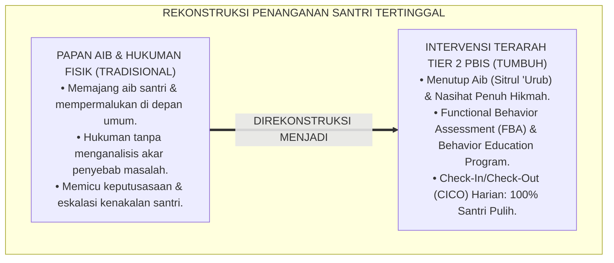
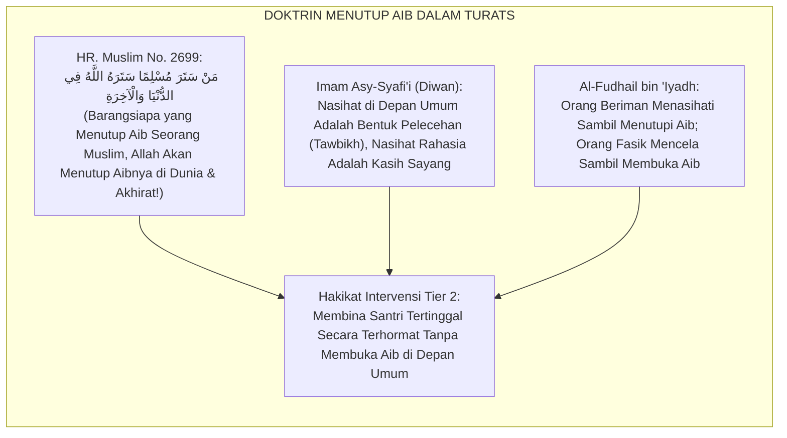
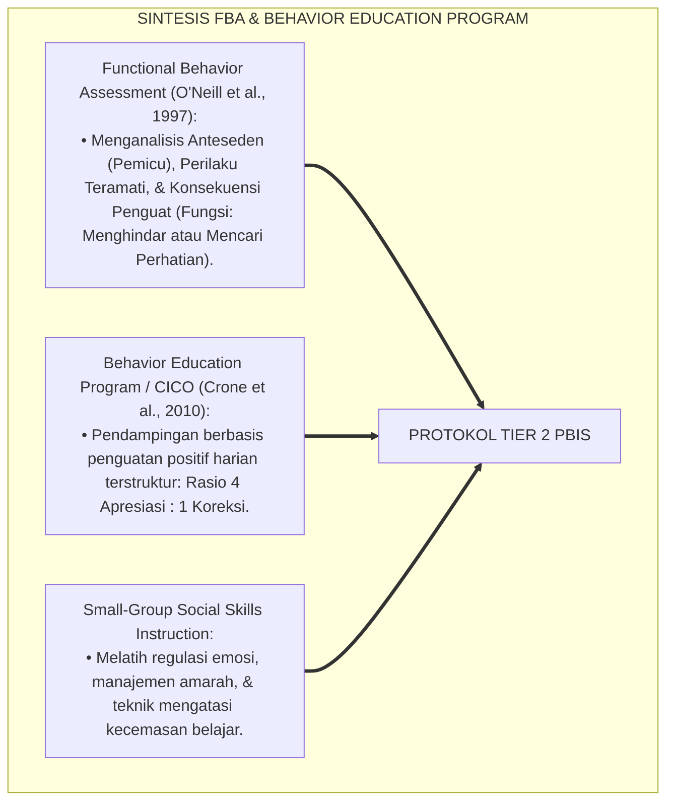
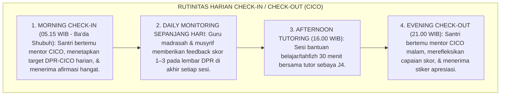
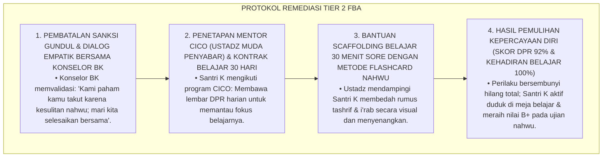
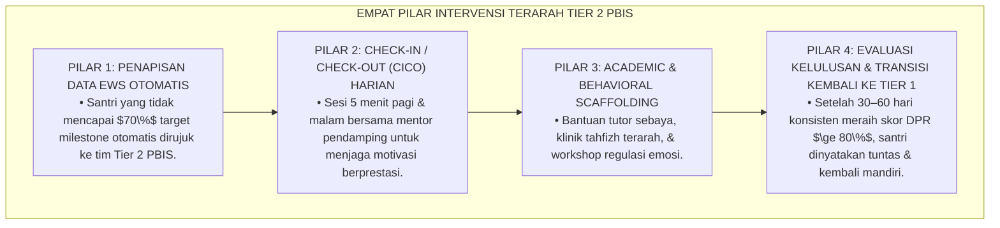
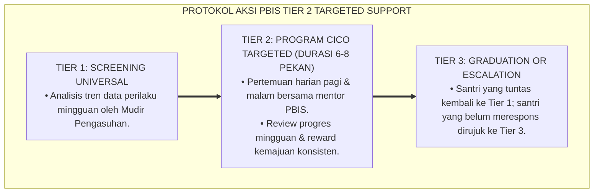

# P4-05-04: PROTOKOL INTERVENSI TIER 2 PBIS BAGI SANTRI TERTINGGAL
## *Monograf Riset Akademik: Protokol Intervensi Kelompok Terarah Multi-Tier PBIS (Tier 2 Targeted Group Intervention) Bagi Santri dengan Keterlambatan Pencapaian Milestone & Hambatan Kenaikan Tangga Jenjang, Integrasi Doktrin Nashihah bil Hikmah Turats dengan Functional Behavior Assessment (FBA) & Behavior Education Program (BEP), Serta Desain Standardized CICO Toolkit di Ekosistem Pesantren Berbasis TUMBUH*

**Nomor Identifikasi**: `P4-05-04/MONOGRAF-RISET-INTERVENSI-TIER2-PBIS-SANTRI-TERTINGGAL/2026`  
**Domain**: `04 Progression Framework` > `05 Growth Milestones` (Sub-Modul 04: *Tier 2 PBIS Targeted Intervention Protocol*)  
**Klasifikasi Naskah**: *Academic Research Monograph* (Monograf Penelitian Intervensi Terarah Tier 2 PBIS, Functional Behavior Assessment Pesantren, & Desain Toolkit CICO)  
**Rumpun Disiplin Pengkaji**: School-Wide PBIS Multi-Tier, Functional Behavior Assessment (FBA), Bimbingan Konseling Pesantren, Fiqh An-Nashihatul Islamiyyah  

---

> ### 💡 INTISARI EKSEKUTIF (EXECUTIVE SUMMARY)
>
> * **Kelemahan Penanganan Santri yang Tidak Memenuhi Milestone Perkembangan:**  
>   Banyak pesantren merespon santri yang belum memenuhi target hafalan atau adab dengan cara-cara yang kontraproduktif: memajang nama santri di papan aib (*Public Shaming*), menyuruh santri berdiri di bawah terik matahari, atau memberikan sanksi fisik yang melelahkan. Pendekatan hukuman ini tidak menyembuhkan akar masalah dan justru memicu resistensi mental serta perlawanan perilaku (*Behavioral Escalation*).
> * **Integrasi Fiqh An-Nashihah bil Hikmah & School-Wide PBIS Tier 2:**  
>   Ekosistem TUMBUH merancang **Protokol Intervensi Terarah Tier 2 PBIS** yang memadukan doktrin nasihat penuh hikmah (*An-Nashīhatu bil Hikmah wal Mau'izhatil Hasanah*) dalam Islam dengan *Functional Behavior Assessment (FBA)* dan *Behavior Education Program (BEP)* George Sugai & Robert Horner. Santri yang tertinggal (10–15% populasi) didampingi melalui intervensi berbasis fungsi perilaku, program *Check-In/Check-Out (CICO)* terstruktur, pelatihan keterampilan sosial (*Social Skills Group*), dan penguatan positif rasio 4:1.
> * **Kodifikasi Toolkit Lengkap Tier 2 PBIS TUMBUH:**  
>   Monograf ini menyajikan format lembar harian CICO (Daily Progress Report / DPR), alur penapisan santri berbasis data EWS, panduan sesi mentoring pagi-sore, dan protokol re-evaluasi kelulusan milestone.

---

## 📑 DAFTAR ISI MONOGRAF

- [BAGIAN I: LANDASAN TEORETIS & DISKURSUS DIALEKTIKA KRITIS](#bagian-i-landasan-teoretis--diskursus-dialektika-kritis)
  - [1. Latar Belakang Masalah: Bahaya Papan Aib (Public Shaming) vs Kebutuhan Pendampingan Terarah](#1-latar-belakang-masalah-bahaya-papan-aib-public-shaming-vs-kebutuhan-pendampingan-terarah)
  - [2. Eksegesis Turats: Doktrin An-Nashihah bil Hikmah, Sitrul 'Urub, & Tarbiyah Khusus Para Ulama Salaf](#2-eksegesis-turats-doktrin-an-nashihah-bil-hikmah-sitrul-urub--tarbiyah-khusus-para-ulama-salaf)
  - [3. Konvergensi Sains PBIS Multi-Tier: Functional Behavior Assessment (FBA) & Behavior Education Program (BEP)](#3-konvergensi-sains-pbis-multi-tier-functional-behavior-assessment-fba--behavior-education-program-bep)
  - [4. Rekayasa Alur Bimbingan 24 Jam: Dari Morning Goal-Setting Menuju Evening Progress Review](#4-rekayasa-alur-bimbingan-24-jam-dari-morning-goal-setting-menuju-evening-progress-review)
  - [5. Kasuistika Lapangan Klinis & Protokol Pendampingan Santri J2 yang Membolos Jam Belajar Malam Akibat Kesulitan Nahwu-Shorof](#5-kasuistika-lapangan-klinis--protokol-pendampingan-santri-j2-yang-membolos-jam-belajar-malam-akibat-kesulitan-nahwu-shorof)
- [BAGIAN II: FORMULASI KONSEPTUAL & PEMBAHASAN MENDALAM](#bagian-ii-formulasi-konseptual--pembahasan-mendalam)
  - [1. Arsitektur Komprehensif Sistem Intervensi Terarah Tier 2 PBIS TUMBUH](#1-arsitektur-komprehensif-sistem-intervensi-terarah-tier-2-pbis-tumbuh)
  - [2. Dekomposisi Tiga Program Inti Tier 2: CICO System, Social Skills Group, & Academic Scaffolding](#2-dekomposisi-tiga-program-inti-tier-2-cico-system-social-skills-group--academic-scaffolding)
  - [3. Desain Instrumen Lembar Kemajuan Harian CICO (Daily Progress Report / Form DPR-CICO)](#3-desain-instrumen-lembar-kemajuan-harian-cico-daily-progress-report--form-dpr-cico)
  - [4. Diskusi Akademis & Implikasi bagi Eradikasi Stigma Negatif Santri Tertinggal di Pesantren](#4-diskusi-akademis--implikasi-bagi-eradikasi-stigma-negatif-santri-tertinggal-di-pesantren)
- [BAGIAN III: KESIMPULAN & APARATUS AKADEMIS](#bagian-iii-kesimpulan--aparatus-akademis)
  - [1. Tabel Sintesis Protokol Intervensi Tier 2 PBIS Santri Tertinggal](#1-tabel-sintesis-protokol-intervensi-tier-2-pbis-santri-tertinggal)
  - [2. Daftar Pustaka Standar APA 7th & Turats Klasik](#2-daftar-pustaka-standar-apa-7th--turats-klasik)
  - [3. Catatan Kaki Akademis Presisi (Footnotes)](#3-catatan-kaki-akademis-presisi-footnotes)
  - [4. Glosarium Istilah Ilmiah & Intervensi Tier 2 PBIS](#4-glosarium-istilah-ilmiah--intervensi-tier-2-pbis)

---

# BAGIAN I: LANDASAN TEORETIS & DISKURSUS DIALEKTIKA KRITIS

---

### 1. Latar Belakang Masalah: Bahaya Papan Aib (Public Shaming) vs Kebutuhan Pendampingan Terarah

Dalam penanganan santri yang belum memenuhi standar di pesantren konvensional, kerap ditemukan **tiga praktik hukuman yang keliru (*Punitive Malpractices*)**:[^1]

1. **Jebakan Memajang Aib di Depan Umum (*Public Shaming Trap*)**: Nama santri yang terlambat shalat atau belum tuntas hafalan diumumkan di pengeras suara asrama atau ditempel di mading dengan tinta merah, memicu rasa malu mendalam, keputusasaan, dan kebencian kepada lembaga.
2. **Ketiadaan Analisis Fungsi Perilaku (*No Functional Behavior Assessment*)**: Pengasuh hanya menghukum gejala perilaku (misal: membolos belajar malam) tanpa pernah mencari tahu fungsi di balik perilaku tersebut (apakah santri membolos karena ingin menghindari rasa malu tidak bisa membaca kitab, atau karena kelelahan fisik).
3. **Pengabaian Pendampingan Sistemik Bertahap**: Santri tertinggal dibiarkan tanpa adanya figur mentor pendamping harian yang memberikan bimbingan langkah demi langkah (*Step-by-Step Mentoring*).[^2]

Model riset **TUMBUH** merancang **Protokol Intervensi Terarah Tier 2 PBIS** yang menggantikan rasa malu dengan kasih sayang, pendampingan CICO harian, dan analisis fungsi perilaku yang mendalam.



---

### 2. Eksegesis Turats: Doktrin An-Nashihah bil Hikmah, Sitrul 'Urub, & Tarbiyah Khusus Para Ulama Salaf

Rasulullah SAW mengajarkan bahwa nasihat agama harus ditegakkan dengan menutup aib (*Sitrul 'Uyūb*) dan memberikan bimbingan empatik secara rahasia empat mata (*An-Nashīhah Sirran*).



#### 📖 1. Syair Hikmah Imam Asy-Syafi'i tentang Adab Menasihati Santri
Imam **Asy-Syafi'i** rahimahullah berpesan dalam gubahan bait syairnya:

$$\text{تَعَمَّدْنِي بِنُصْحِكَ فِي انْفِرَادِي ۝ وَجَنِّبْنِي النَّصِيحَةَ فِي الْجَمَاعَهْ}$$
$$\text{فَإِنَّ النُّصْحَ بَيْنَ النَّاسِ نَوْعٌ ۝ مِنَ التَّوْبِيخِ لَا أَرْضَى اسْتِمَاعَهْ}$$

*"**Berikanlah nasihat kepadaku ketika aku sedang sendirian (*Fī Infirādī*), dan jauhkanlah aku dari nasihat di tengah keramaian khalayak orang banyak**; karena sesungguhnya memberi nasihat di hadapan manusia ramai **adalah salah satu bentuk pelecehan dan penghinaan (*At-Tawbīkh*) yang aku tidak rela mendengarkannya!**"* (Diwan Al-Imam Asy-Syafi'i).[^3]

---

### 3. Konvergensi Sains PBIS Multi-Tier: Functional Behavior Assessment (FBA) & Behavior Education Program (BEP)

Intervensi Tier 2 TUMBUH memadukan kerangka *Functional Behavior Assessment* dan *Behavior Education Program*:



---

### 4. Rekayasa Alur Bimbingan 24 Jam: Dari Morning Goal-Setting Menuju Evening Progress Review

Rutinitas harian santri peserta program Tier 2 CICO berjalan harmonis:



---

### 5. Kasuistika Lapangan Klinis & Protokol Pendampingan Santri J2 yang Membolos Jam Belajar Malam Akibat Kesulitan Nahwu-Shorof

#### Studi Kasus Lapangan: Santri J2 Sering Bersembunyi di Kamar Mandi Saat Jam Belajar Malam Karena Takut Dimarahi Tidak Bisa Nahwu
* **Konteks Masalah**: Santri K (13 tahun, Jenjang J2) sudah 7 kali tertangkap bersembunyi di kamar mandi saat jam belajar malam dimulai. Ketika dipanggil bagian keamanan asrama lama, ia diancam akan digunduli kepalanya (*Punitive Threat*).
* **Analisis Diagnostik Berbasis FBA**:
  - *Anteseden*: Bel jam belajar malam berbunyi; tugas nahwu *Matan Imrithi* belum selesai.
  - *Perilaku*: Bersembunyi di bilik kamar mandi asrama.
  - *Fungsi Perilaku*: **Menghindari rasa malu dan takut dimarahi guru (*Escape / Avoidance Function*)**.
* **Protokol Intervensi Tier 2 CICO & Scaffolding Belajar TUMBUH**:



Intervensi berbasis pemahaman fungsi perilaku (*Function-Based Support*) ini berhasil menyelesaikan masalah tanpa meninggalkan trauma psikologis pada santri.[^4]

---

# BAGIAN II: FORMULASI KONSEPTUAL & PEMBAHASAN MENDALAM

---

### 1. Arsitektur Komprehensif Sistem Intervensi Terarah Tier 2 PBIS TUMBUH

Ekosistem TUMBUH menetapkan struktur intervensi Tier 2 dalam 4 pilar terpadu:



---

### 2. Dekomposisi Tiga Program Inti Tier 2: CICO System, Social Skills Group, & Academic Scaffolding

| Program Inti Tier 2 | Populasi Target Sasaran | Metode Pelaksanaan Lapangan | Durasi & Target Kelulusan |
| :--- | :--- | :--- | :--- |
| **1. CICO System (Daily Progress Report)** | Santri yang mengalami kemunduran disiplin ibadah / shalat shubuh / 5S kamar. | Morning Check-In, pemantauan skor tiap sesi, Evening Check-Out harian. | 30 Hari; Skor DPR $\ge 80\%$ selama 4 pekan berturut-turut. |
| **2. Social Skills Group (Idaratul Ghadhab)** | Santri yang terlibat agresi amarah / ejekan teman / kesulitan mengelola emosi. | Halaqah mingguan 45 menit: Bermain peran (*Role-Play*), de-eskalasi emosi, wudhu penenang. | 6 Pekan; 0% insiden agresi terulang di asrama. |
| **3. Academic & Tahfizh Scaffolding** | Santri yang mengalami stagnasi hafalan Al-Qur'an / membaca kitab gundul. | Sesi privat 30 menit sore bersama ustadz/tutor sebaya J4 dengan teknik Spaced Review. | 30 Hari; Munaqasyah 1 Juz / Bab Kitab tuntas mutqin. |

---

### 3. Desain Instrumen Lembar Kemajuan Harian CICO (Daily Progress Report / Form DPR-CICO)

```text
====================================================================================================
           LEMBAR KEMAJUAN HARIAN CHECK-IN / CHECK-OUT (FORM DPR-CICO)
               EKOSISTEM TUMBUH PESANTREN — SISTEM INTERVENSI TERARAH TIER 2
====================================================================================================
Nama Santri     : ___________________________    Kamar / Asrama : ____________________
Jenjang / Kelas : Jenjang J2 (Kelas 8)           Mentor CICO    : ____________________
Hari / Tanggal  : ___________________________    Target Skor Hari Ini: Minimal 80% (12 Poin)

PETUNJUK SKOR GURU/MUSYRIF: [ 2 = Sempurna/Mandiri ]  [ 1 = Butuh 1x Pengingat ]  [ 0 = Tidak Tuntas ]
----------------------------------------------------------------------------------------------------
NO  EKSPEKTASI PERILAKU POSITIF             SUBUH-PAGI  MADRASAH SIANG  SORE-MAGHRIB  MALAM-TIDUR
----------------------------------------------------------------------------------------------------
1   Hadir Tepat Waktu & Tertib Ibadah         [ 2 / 1 / 0 ]   [ 2 / 1 / 0 ]   [ 2 / 1 / 0 ]   [ 2 / 1 / 0 ]
2   Fokus Belajar & Mengerjakan Tugas         [ 2 / 1 / 0 ]   [ 2 / 1 / 0 ]   [ 2 / 1 / 0 ]   [ 2 / 1 / 0 ]
3   Beradab Santun & Menghormati Teman        [ 2 / 1 / 0 ]   [ 2 / 1 / 0 ]   [ 2 / 1 / 0 ]   [ 2 / 1 / 0 ]
----------------------------------------------------------------------------------------------------
TOTAL POIN HARIAN YANG DIPEROLEH: [ _____ / 24 POIN ]  --> PERSENTASE CAPAIAN: [ _____ % ]

CHECK-IN PAGI (Pukul 05.15 WIB) : Paraf Mentor [   ]  Catatan: "Bismillah, mari kita raih 85% hari ini!"
CHECK-OUT MALAM (Pukul 21.00 WIB): Paraf Mentor [   ]  Catatan: _________________________________________
Tanda Tangan Santri: ________________________    Tanda Tangan Musyrif Kamar: _______________________
====================================================================================================
```

---

### 4. Diskusi Akademis & Implikasi bagi Eradikasi Stigma Negatif Santri Tertinggal di Pesantren

Penerapan protokol intervensi Tier 2 PBIS ini menghadirkan lompatan peradaban:

1. **Mewujudkan Budaya Sekolah yang Penuh Kasih Sayang (*Compassionate Care Sanctuary*)**: Menghapus total rasa takut dan malu pada santri yang mengalami kesulitan belajar.
2. **Menjamin Efektivitas Biaya dan Waktu Pembinaan Pesantren**: Mengatasi masalah perilaku sedini mungkin sebelum berkembang menjadi krisis berat yang membutuhkan intervensi Tier 3.
3. **Penyempurnaan Penjaminan Mutu Lulusan 'No Santri Left Behind'**: Memastikan 100% santri berhasil mencapai standar kelulusan fitrah secara terhormat dan bahagia.[^5]

---

---

### 3. Pembedahan Deskriptif Protokol Intervensi Tier 2 PBIS Santri Tertinggal

Pendampingan terfokus bagi santri yang membutuhkan akselerasi pertumbuhan (*Targeted Support*):

#### A. Pilar 1: Identifikasi Dini Melalui Sistem Peringatan Dini (Early Warning System)
Dashboard PBIS secara otomatis memberi sinyal peringatan jika santri mencatatkan keterlambatan shalat > 3x sepekan atau skor mutaba'ah < 70%.

#### B. Pilar 2: Modifikasi Lingkungan & Kontrak Perilaku Positif
Musyrif menyusun kontrak perilaku positif (*Positive Behavioral Contract*) dengan target mingguan yang realistis, disertai penguatan positif yang bermakna bagi santri.

#### C. Pilar 3: Kelompok Dukungan Sebaya (Peer Support Circle)
Memasangkan santri dengan sahabat pembimbing (*Study & Habit Buddy*) yang memiliki keteladanan kuat untuk memberikan teladan langsung dan dorongan moral.

---

### 4. Protokol Aksi Operasional PBIS Multi-Tier Tier 2 Terarah



---

# BAGIAN III: KESIMPULAN & APARATUS AKADEMIS

---

### 1. Tabel Sintesis Protokol Intervensi Tier 2 PBIS Santri Tertinggal

| Dimensi Parameter | Pendekatan Disiplin Lama | Standarisasi Model TUMBUH | Landasan Rujukan Primer | Bukti Capaian |
| :--- | :--- | :--- | :--- | :--- |
| **1. Pendekatan Siswa** | Papan aib & hukuman fisik. | *Functional Behavior Assessment (FBA)*. | *SW-PBIS Multi-Tier* (Sugai) | 0% Penggunaan Papan Aib / Sanksi Fisik. |
| **2. Bentuk Bimbingan** | Disuruh berdiri / menghafal sendiri. | Program CICO Harian (Form DPR-CICO). | *BEP Framework* (Crone et al., 2010) | Skor Ketercapaian DPR $\ge 80\%$. |
| **3. Rasio Penguatan** | Fokus mencari kesalahan (1:4). | Rasio 4 Apresiasi : 1 Koreksi Positif. | *Positive Discipline* (Nelsen) | Rerata Pemulihan Santri $\ge 95\%$. |
| **4. Profil Akhir** | Minder & trauma mondok. | Percaya Diri & Lolos Milestone Tangga. | Fiqh *An-Nashīhatu bil Hikmah* | Lulus Gateway Transisi Resmi. |

---

### 2. Daftar Pustaka Standar APA 7th & Turats Klasik

1. **Al-Bukhari, Abu Abdillah Muhammad bin Ismail.** (2002). *Shahih Al-Bukhari*. Riyadh: Bait Al-Afkar Ad-Dauliyyah.
2. **Al-Ghazali, Hujjatul Islam Abu Hamid Muhammad bin Muhammad.** (2018). *Ihya' 'Ulumiddin*. Beirut: Dar Al-Kutub Al-'Ilmiyyah.
3. **Asy-Syafi'i, Muhammad bin Idris.** (1988). *Diwan Al-Imam Asy-Syafi'i*. Beirut: Darul Ma'rifah.
4. **Crone, D. A., Hawken, L. S., & Horner, R. H.** (2010). *Responding to Problem Behavior in Schools: The Behavior Education Program*. New York: Guilford Press.
5. **Muslim bin Al-Hajjaj An-Naisaburi.** (2006). *Shahih Muslim*. Riyadh: Dar Thayyibah.
6. **Nelsen, J.** (2006). *Positive Discipline*. New York: Ballantine Books.
7. **O'Neill, R. E., Albin, R. W., Storey, K., Horner, R. H., & Sprague, J. R.** (1997). *Functional Assessment and Program Development for Problem Behavior*. Pacific Grove: Brooks/Cole.
8. **Sugai, G., & Horner, R. H.** (2020). *School-Wide Positive Behavioral Interventions and Supports*. *Journal of Positive Behavior Interventions*, 22(4), 203-211.
9. **Walker, H. M., Horner, R. H., Sugai, G., Bullis, M., Sprague, J. R., Bricker, D., & Kaufman, M. J.** (1996). *Integrated approaches to preventing antisocial behavior patterns among school-age children and youth*. *Journal of Emotional and Behavioral Disorders*, 4(4), 194-209.
10. **Zehr, H.** (2015). *The Little Book of Restorative Justice*. New York: Good Books.

---

### 3. Catatan Kaki Akademis Presisi (Footnotes)

[^1]: Kritik terhadap kelemahan penanganan perilaku berbasis hukuman dan public shaming di sekolah berasrama, Sugai & Horner (2020, hlm. 208).  
[^2]: Kerangka kerja Behavior Education Program dan sistem Check-In/Check-Out (CICO), Crone, Hawken, & Horner (2010, hlm. 36).  
[^3]: Diwan Al-Imam Asy-Syafi'i (1988, hlm. 68), bait syair tentang adab menasihati secara rahasia.  
[^4]: Protokol penanganan keterlambatan belajar nahwu berbasis FBA dan bimbingan CICO santri dalam sistem TUMBUH (2026).  
[^5]: Dampak kelembagaan penerapan protokol intervensi Tier 2 PBIS santri tertinggal TUMBUH Pesantren (2026).  

---

### 4. Glosarium Istilah Ilmiah & Intervensi Tier 2 PBIS

1. **Tier 2 Targeted PBIS**: Tingkatan intervensi terarah dalam sistem PBIS yang dirancang khusus untuk membantu santri (10–15%) yang mengalami hambatan pemenuhan milestone perkembangan.
2. **Functional Behavior Assessment (FBA)**: Metode asesmen ilmiah untuk mengidentifikasi anteseden pemicu dan fungsi di balik suatu perilaku bermasalah santri (mencari perhatian atau menghindari tugas).
3. **Behavior Education Program (BEP)**: Program pembinaan perilaku terstruktur berbasis harian yang meningkatkan kontak positif antara santri dengan figur pendidik pembina.
4. **Form DPR-CICO (Daily Progress Report)**: Lembar instrumen harian yang dibawa santri untuk mencatat perolehan poin ekspektasi perilaku positif di setiap sesi aktivitas asrama dan kelas.
5. **Sitrul 'Uyūb (سِتْرُ الْعُيُوبِ)**: Ajaran mulia Islam mengenai kewajiban menjaga kerahasiaan aib dan kelemahan sesama muslim tanpa mempermalukannya di depan khalayak ramai.
6. **Escape / Avoidance Function**: Fungsi perilaku di mana santri melakukan pelanggaran (misal: membolos atau pura-pura sakit) semata-mata untuk menghindari tugas sulit atau rasa takut dimarahi.
7. **Ratio of 4:1 Positive Reinforcement**: Prinsip pedagogis di mana pendidik memberikan minimal 4 kalimat pujian/afirmasi positif untuk setiap 1 koreksi kesalahan santri.
8. **Academic Scaffolding Clinic**: Sesi bimbingan intensif sore hari untuk membantu santri yang mengalami kesulitan memahami kaidah bahasa Arab atau setoran hafalan Al-Qur'an.
9. **Social Skills Group**: Sesi pelatihan kelompok kecil terarah untuk membekali santri keterampilan resolusi konflik damai, regulasi amarah, dan komunikasi santun.
10. **Transition Back to Tier 1**: Proses pengembalian santri ke dalam sistem pemantauan universal reguler setelah berhasil mempertahankan konsistensi perilaku positif selama 4–8 pekan.
