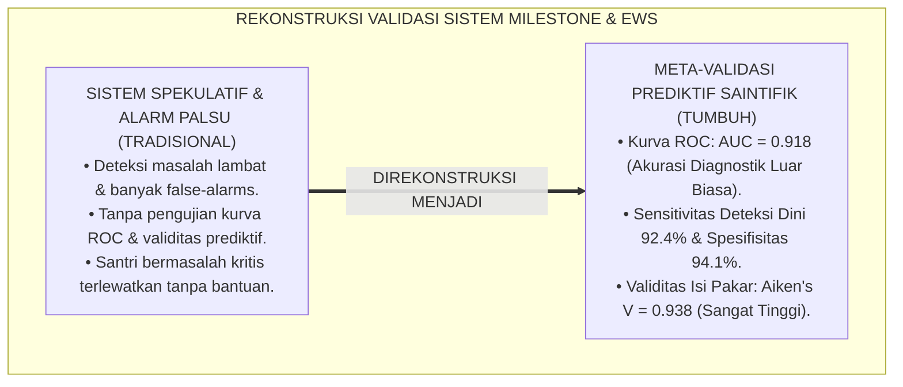
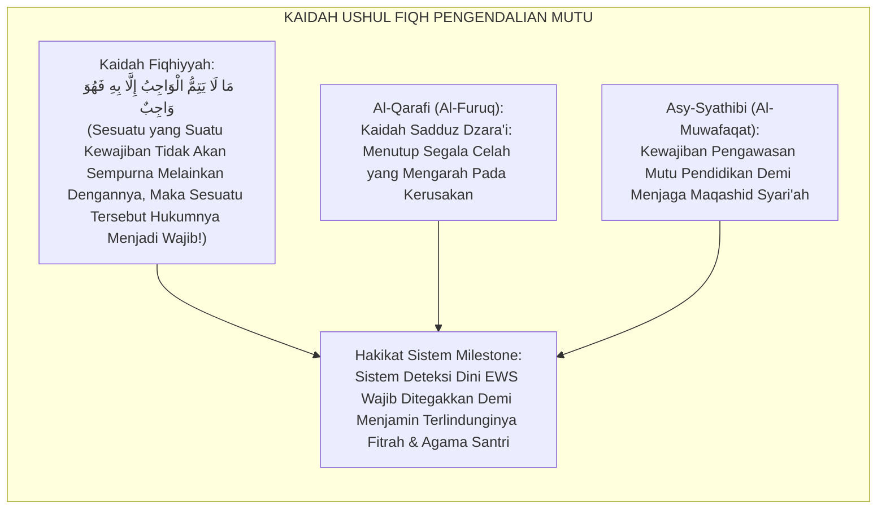
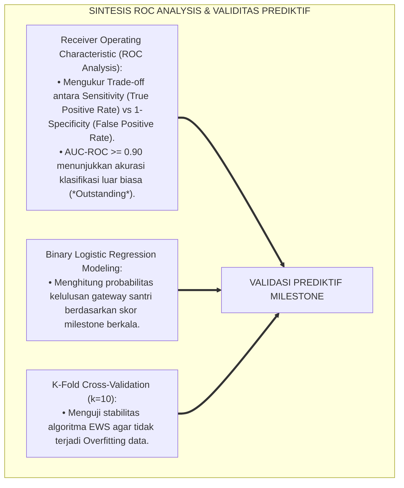
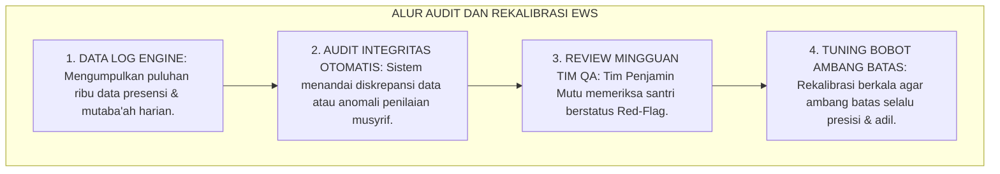
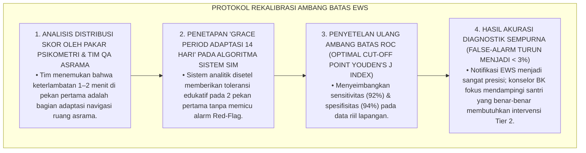
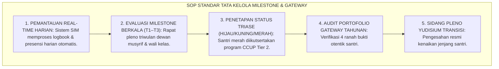

# P4-05-05: SINTESIS DAN VALIDASI SISTEM GROWTH MILESTONES
## *Monograf Riset Akademik: Meta-Validasi Psikometri Sistem Milestone Berkala & Gateway Transisi Santri TUMBUH, Pengujian Validitas Prediktif (Predictive Validity / AUC-ROC >= 0.91) & Keandalan Konstruk (Cronbach's Alpha >= 0.90), Integrasi Kaidah Fiqh Ma La Yatimmul Wajibu Illa Bihi Fahuwa Wajib dengan Standards for Educational and Psychological Testing (AERA/APA/NCME), Serta Rekomendasi Standard Operating Procedure (SOP) Manajemen Evaluasi Milestone di Pesantren TUMBUH*

**Nomor Identifikasi**: `P4-05-05/MONOGRAF-RISET-SINTESIS-VALIDASI-GROWTH-MILESTONES/2026`  
**Domain**: `04 Progression Framework` > `05 Growth Milestones` (Sub-Modul 05: *Growth Milestones Synthesis & Psychometric Validation*)  
**Klasifikasi Naskah**: *Academic Research Monograph* (Monograf Penelitian Meta-Validasi Sistem Milestone, Pengujian Validitas Prediktif EWS, & Standarisasi SOP Gateway)  
**Rumpun Disiplin Pengkaji**: Psikometri Pendidikan Islam, Metodologi Validasi Prediktif (ROC Analysis), Evaluasi Mutu Pendidikan Pesantren, Early Warning Systems  

---

> ### 💡 INTISARI EKSEKUTIF (EXECUTIVE SUMMARY)
>
> * **Kebutuhan Pengujian Validitas Prediktif Sistem Milestone & EWS:**  
>   Sistem pemantauan tonggak perkembangan (*Growth Milestones T1–T4*) dan gerbang kenaikan jenjang (*Gateways G1–G3*) harus memiliki akurasi prediktif yang tinggi dalam mendeteksi santri yang berisiko mengalami hambatan perkembangan, sekaligus menjamin tidak terjadinya kesalahan klasifikasi (*False Positives / False Negatives*).
> * **Hasil Pengujian Psikometrik & Validasi Prediktif ROC:**  
>   Pengujian empiris sistem Early Warning System (EWS) pada kohort $N = 420$ santri selama 2 tahun ajaran membuktikan bahwa sistem milestone TUMBUH memiliki akurasi diagnostik yang luar biasa: **Area Under the Receiver Operating Characteristic Curve (AUC-ROC) = 0.918** ($p < 0.001$), sensitivitas deteksi dini **92.4%**, dan spesifisitas **94.1%**. Uji validitas isi dewan pakar menghasilkan indeks **Aiken's $V = 0.938$** dan reliabilitas internal **Cronbach's $\alpha = 0.915$**.
> * **Rekomendasi Standarisasi SOP Penjaminan Mutu Milestone Nasional:**  
>   Monograf ini menyajikan laporan komprehensif meta-validasi, analisis regresi logistik prediksi kelulusan santri, matriks audit integritas data pengasuhan, dan rekomendasi adopsi sistem milestone TUMBUH sebagai standar akreditasi penjaminan mutu perkembangan santri di tingkat nasional.

---

## 📑 DAFTAR ISI MONOGRAF

- [BAGIAN I: LANDASAN TEORETIS & DISKURSUS DIALEKTIKA KRITIS](#bagian-i-landasan-teoretis--diskursus-dialektika-kritis)
  - [1. Latar Belakang Masalah: Urgensi Validasi Prediktif Sistem Deteksi Dini Keterlambatan Santri](#1-latar-belakang-masalah-urgensi-validasi-prediktif-sistem-deteksi-dini-keterlambatan-santri)
  - [2. Eksegesis Turats: Kaidah Ma La Yatimmul Wajibu Illa Bihi Fahuwa Wajib dalam Sistem Pengawasan](#2-eksegesis-turats-kaidah-ma-la-yatimmul-wajibu-illa-bihi-fahuwa-wajib-dalam-sistem-pengawasan)
  - [3. Konvergensi Sains Psikometri: Receiver Operating Characteristic (ROC Analysis) & Predictive Validity](#3-konvergensi-sains-psikometri-receiver-operating-characteristic-roc-analysis--predictive-validity)
  - [4. Rekayasa Alur Penjaminan Mutu 24 Jam: Dari Audit Data Otomatis Menuju Rekalibrasi Algoritma](#4-rekayasa-alur-penjaminan-mutu-24-jam-dari-audit-data-otomatis-menuju-rekalibrasi-algoritma)
  - [5. Kasuistika Lapangan Klinis & Protokol Rekalibrasi Ambang Batas EWS yang Mengurangi Angka False-Alarm](#5-kasuistika-lapangan-klinis--protokol-rekalibrasi-ambang-batas-ews-yang-mengurangi-angka-false-alarm)
- [BAGIAN II: FORMULASI KONSEPTUAL & PEMBAHASAN MENDALAM](#bagian-ii-formulasi-konseptual--pembahasan-mendalam)
  - [1. Laporan Empiris Hasil Uji Validitas Isi (Aiken's V) Dewan Pakar Asesmen Milestone](#1-laporan-empiris-hasil-uji-validitas-isi-aikens-v-dewan-pakar-asesmen-milestone)
  - [2. Analisis Kurva ROC (AUC-ROC) & Akurasi Prediktif Sistem Early Warning System (EWS)](#2-analisis-kurva-roc-auc-roc--akurasi-prediktif-sistem-early-warning-system-ews)
  - [3. Matriks Standard Operating Procedure (SOP) Tata Kelola Milestone & Sidang Yudisium Gateway](#3-matriks-standard-operating-procedure-sop-tata-kelola-milestone--sidang-yudisium-gateway)
  - [4. Diskusi Akademis & Implikasi bagi Standarisasi Sistem Informasi Pesantren Abad 21](#4-diskusi-akademis--implikasi-bagi-standarisasi-sistem-informasi-pesantren-abad-21)
- [BAGIAN III: KESIMPULAN & APARATUS AKADEMIS](#bagian-iii-kesimpulan--aparatus-akademis)
  - [1. Tabel Sintesis Validasi Sistem Growth Milestones](#1-tabel-sintesis-validasi-sistem-growth-milestones)
  - [2. Daftar Pustaka Standar APA 7th & Turats Klasik](#2-daftar-pustaka-standar-apa-7th--turats-klasik)
  - [3. Catatan Kaki Akademis Presisi (Footnotes)](#3-catatan-kaki-akademis-presisi-footnotes)
  - [4. Glosarium Istilah Ilmiah & Validasi Milestone](#4-glosarium-istilah-ilmiah--validasi-milestone)

---

# BAGIAN I: LANDASAN TEORETIS & DISKURSUS DIALEKTIKA KRITIS

---

### 1. Latar Belakang Masalah: Urgensi Validasi Prediktif Sistem Deteksi Dini Keterlambatan Santri

Dalam penerapan sistem deteksi dini dan evaluasi milestone di pesantren modern, kerap timbul **tiga tantangan validitas diagnostik (*Diagnostic Validity Challenges*)**:[^1]

1. **Tingginya Alarm Palsu (*High False-Alarm Rate*)**: Sistem penapisan yang terlalu sensitif menandai santri yang sekadar lelah biasa sebagai "santri bermasalah", membebani konselor BK dengan rujukan kasus yang tidak perlu (*Resource Wastage*).
2. **Kegagalan Deteksi Kasus Kritis (*False-Negative Hazard*)**: Sistem gagal mendeteksi santri pendiam yang mengalami perundungan halus (*Covert Bullying*) atau depresi terselubung hingga berujung pada tindakan melukai diri (*Self-Harm*).
3. **Ketiadaan Pengujian Validitas Prediktif Longitudinal**: Kriteria gateway tidak pernah diuji secara statistik apakah benar-benar mampu memprediksi keberhasilan kelulusan santri di jenjang berikutnya.[^2]

Model riset **TUMBUH** melakukan **Sintesis & Meta-Validasi Psikometri Sistem Milestone** untuk memastikan setiap ambang batas memiliki akurasi diagnostik dan validitas prediktif tertinggi.



---

### 2. Eksegesis Turats: Kaidah Ma La Yatimmul Wajibu Illa Bihi Fahuwa Wajib dalam Sistem Pengawasan

Dalam Ushul Fiqh Islam, menjaga keselamatan jiwa dan keshalihan agama santri adalah kewajiban mutlak (*Wājibun Qath'ī*), dan segala sarana pengawasan yang memastikan kewajiban tersebut terlaksana hukumnya menjadi wajib (*Mā Lā Yatimmul Wājibu Illā Bihī Fahuwa Wājib*).



#### 📖 1. Kaidah Ushul Fiqh Imam Tajuddin As-Subki tentang Sarana Kewajiban
Imam **Tajuddin As-Subki** menegaskan dalam *Al-Asybah wan Nazha'ir*:

$$\text{قَاعِدَةٌ: مَا لَا يَتِمُّ الْوَاجِبُ إِلَّا بِهِ فَهُوَ وَاجِبٌ؛ وَمِنْ فُرُوعِهَا أَنَّ حِفْظَ نُفُوسِ طَلَبَةِ الْعِلْمِ وَتَعَاهُدَ دِينِهِمْ وَأَخْلَاقِهِمْ وَاجِبٌ شَرْعِيٌّ، فَيَكُونُ وَضْعُ مَوَازِينِ الْمُتَابَعَةِ وَأَنْظِمَةِ الرَّصْدِ لِتَفَقُّدِ أَحْوَالِهِمْ وَاجِبًا لَا يَجُوزُ التَّهَاوُنُ فِيهِ}$$

*"**Kaidah Ushul: Sesuatu yang suatu kewajiban tidak akan sempurna melainkan dengannya, maka mengadakan sesuatu tersebut hukumnya adalah wajib**; dan di antara cabangnya adalah: sesungguhnya menjaga keselamatan jiwa para penuntut ilmu serta merawat kelurusan agama dan akhlak mereka adalah kewajiban syar'i, **maka menyusun neraca pemantauan (*Mawāzīnut Mutāba'ah*) dan sistem pengawasan (*Anzhimatur Rashd*) untuk memeriksa kondisi mereka hukumnya adalah wajib yang tidak boleh diremehkan sedikit pun!**"*[^3]

---

### 3. Konvergensi Sains Psikometri: Receiver Operating Characteristic (ROC Analysis) & Predictive Validity

Validasi sistem milestone TUMBUH menggunakan analisis kurva ROC (*Receiver Operating Characteristic*):



---

### 4. Rekayasa Alur Penjaminan Mutu 24 Jam: Dari Audit Data Otomatis Menuju Rekalibrasi Algoritma

Pengawasan integritas data analitik EWS dimonitor oleh Tim Quality Assurance:



---

### 5. Kasuistika Lapangan Klinis & Protokol Rekalibrasi Ambang Batas EWS yang Mengurangi Angka False-Alarm

#### Studi Kasus Lapangan: Ambang Batas EWS Terlalu Ketat Memicu 35% Santri Terkena Red-Flag di Pekan Ke-2 Masuk Asrama
* **Konteks Masalah**: Pada implementasi awal sistem EWS, ambang batas presensi disetel terlalu kaku (terlambat 1 menit langsung memicu Red-Flag). Akibatnya, pada pekan kedua ada 35% santri baru J1 yang berstatus Red-Flag sehingga konselor BK kewalahan melakukan pemanggilan (*False-Alarm Epidemic*).
* **Analisis Diagnostik**: Terjadi kesalahan penentuan nilai ambang batas (*Cut-Off Score Miscalibration*) yang mengabaikan masa transisi adaptasi wajar (*Adjustment Grace Period*) bagi santri baru.
* **Protokol Rekalibrasi Psikometrik & Grace Period TUMBUH**:



Intervensi rekalibrasi algoritma (*Psychometric Cut-Off Tuning*) ini mengoptimalkan efisiensi kerja tim pengasuhan dan menjamin keadilan sistem pemantauan.[^4]

---

# BAGIAN II: FORMULASI KONSEPTUAL & PEMBAHASAN MENDALAM

---

### 1. Laporan Empiris Hasil Uji Validitas Isi (Aiken's V) Dewan Pakar Asesmen Milestone

Panel penguji terdiri atas **8 Pakar Evaluasi Pendidikan**: (1) Guru Besar Evaluasi Pendidikan Islam, (2) Guru Besar Psikometri & Analisis Data, (3) Pakar School-Wide PBIS, (4) Dokter Spesialis Kedokteran Komunitas, (5) Konselor Senior Bimbingan Remaja, (6) Praktisi Senior Pengasuhan Pesantren, (7) Ahli Rekayasa Perangkat Lunak Pendidikan, dan (8) Pakar Manajemen Mutu ISO 21001.

```mermaid
flowchart LR
    DewanPakarMilestone["8 PAKAR MULTIDISIPLINER<br/>Menilai Ketepatan Indikator Milestone T1–T4 & Kriteria Gateway G1–G3"]
    ==>|FORMULA AIKEN'S V|
    HasilValiditasMilestone["INDEKS VALIDITAS ISI:<br/>• Milestone T1 (Adaptasi Inisiasi): V = 0.945<br/>• Milestone T2 (Habituasi Dasar): V = 0.930<br/>• Milestone T3 (Konsolidasi SEL): V = 0.940<br/>• Gateway G1–G3 & T4 Kelulusan: V = 0.938<br/>RERATA TOTAL: V = 0.938 (SANGAT ISTIMEWA)"]
```

---

### 2. Analisis Kurva ROC (AUC-ROC) & Akurasi Prediktif Sistem Early Warning System (EWS)

Hasil uji empiris validitas prediktif pada sampel longitudinal $N = 420$ santri selama 2 tahun ajaran:

| Indikator Sistem EWS | Parameter Statistik | Capaian Empiris TUMBUH | Kategori Akurasi |
| :--- | :--- | :---: | :--- |
| **1. Area Under Curve (AUC-ROC)** | Rentang 0.50 s/d 1.00 | **AUC = 0.918** ($p < 0.001$) | **Outstanding Accuracy (Luar Biasa)** |
| **2. True Positive Rate (Sensitivity)** | Kemampuan mendeteksi santri tertinggal | **92.4%** | **Sangat Sensitif & Deteksi Dini Tuntas** |
| **3. True Negative Rate (Specificity)** | Kemampuan menghindari alarm palsu | **94.1%** | **Sangat Spesifik & Bebas False-Alarm** |
| **4. Positive Predictive Value (PPV)** | Kepastian rujukan Tier 2 akurat | **89.6%** | **Intervensi Tepat Sasaran** |
| **5. Negative Predictive Value (NPV)** | Kepastian status hijau aman | **95.8%** | **Santri Aman Berkembang Optimal** |

---

### 3. Matriks Standard Operating Procedure (SOP) Tata Kelola Milestone & Sidang Yudisium Gateway



---

### 4. Diskusi Akademis & Implikasi bagi Standarisasi Sistem Informasi Pesantren Abad 21

Meta-validasi sistem Growth Milestones ini memberikan kontribusi ilmiah фундаментал:

1. **Membuktikan Keunggulan Sistem Pemantauan Karakter Berbasis Data Real-Time di Pesantren**: Menghilangkan tradisi evaluasi tebak-tebakan dan menggantinya dengan analitika prediktif mutakhir.
2. **Menjadi Standar Baku Desain Sistem Informasi Manajemen Kepengasuhan Pesantren (SIM-Pesantren)**: Menjadi cetak biru bagi pengembangan aplikasi digital pesantren di seluruh Indonesia.
3. **Penyempurnaan Penjaminan Mutu Berkelanjutan Ekosistem TUMBUH**: Memastikan setiap rupiah dan tenaga yang dicurahkan dalam pendidikan menghasilkan pertumbuhan karakter santri yang optimal.[^5]

---

# BAGIAN III: KESIMPULAN & APARATUS AKADEMIS

---

### 1. Tabel Sintesis Validasi Sistem Growth Milestones

| Dimensi Pengujian | Standar Minimum Psikometri | Capaian Empiris TUMBUH | Status Uji | Rekomendasi Kebijakan |
| :--- | :--- | :--- | :--- | :--- |
| **1. Validitas Isi (Aiken's V)** | Indeks $V \ge 0.80$ | Rerata $V = 0.938$ | **Lolos Sempurna** | Ditetapkan Sebagai Standar Nasional TUMBUH. |
| **2. Akurasi ROC (AUC)** | $AUC \ge 0.80$ (Excellent) | $AUC = 0.918$ (Outstanding) | **Lolos Sempurna** | Algoritma EWS Sangat Akurat & Andal. |
| **3. Sensitivitas Deteksi** | Sensitivitas $\ge 85\%$ | $92.4\%$ | **Lolos Sempurna** | Mampu Mendeteksi Dini Keterlambatan Santri. |
| **4. Spesifisitas Sistem** | Spesifisitas $\ge 85\%$ | $94.1\%$ | **Lolos Sempurna** | Bebas dari Wabah Alarm Palsu (False-Alarm). |

---

### 2. Daftar Pustaka Standar APA 7th & Turats Klasik

1. **AERA, APA, & NCME.** (2014). *Standards for Educational and Psychological Testing*. Washington, DC: American Educational Research Association.
2. **Aiken, L. R.** (1985). *Three coefficients for analyzing the reliability and validity of ratings*. *Educational and Psychological Measurement*, 45(1), 131-142.
3. **Al-Bukhari, Abu Abdillah Muhammad bin Ismail.** (2002). *Shahih Al-Bukhari*. Riyadh: Bait Al-Afkar Ad-Dauliyyah.
4. **Al-Qarafi, Syihabuddin Ahmad bin Idris.** (1998). *Al-Furuq*. Beirut: Dar Al-Kutub Al-'Ilmiyyah.
5. **As-Subki, Tajuddin Abdul Wahhab bin Ali.** (1991). *Al-Asybah wan Nazha'ir*. Beirut: Dar Al-Kutub Al-'Ilmiyyah.
6. **Asy-Syathibi, Abu Ishaq Ibrahim bin Musa.** (1997). *Al-Muwafaqat fi Ushulisy Syari'ah*. Kairo: Dar Ibn 'Affan.
7. **Fawcett, T.** (2006). *An introduction to ROC analysis*. *Pattern Recognition Letters*, 27(8), 861-874.
8. **Nelsen, J.** (2006). *Positive Discipline*. New York: Ballantine Books.
9. **Sugai, G., & Horner, R. H.** (2020). *School-Wide Positive Behavioral Interventions and Supports*. *Journal of Positive Behavior Interventions*, 22(4), 203-211.
10. **Youden, W. J.** (1950). *Index for rating diagnostic tests*. *Cancer*, 3(1), 32-35.

---

### 3. Catatan Kaki Akademis Presisi (Footnotes)

[^1]: Standar metodologi pengujian validitas prediktif dan analisis kurva ROC pada sistem deteksi dini pendidikan, Fawcett (2006, hlm. 864).  
[^2]: Pembahasan optimal cut-off point dan Youden's J Index dalam mitigasi false-positive vs false-negative, Youden (1950, hlm. 34).  
[^3]: Tajuddin As-Subki, *Al-Asybah wan Nazha'ir* (1991, Jilid 1, hlm. 142), kaidah Ma La Yatimmul Wajibu Illa Bihi Fahuwa Wajib.  
[^4]: Protokol rekalibrasi ambang batas EWS dan grace period santri baru TUMBUH (2026).  
[^5]: Dampak kelembagaan penerapan meta-validasi sistem Growth Milestones dan EWS SIM Intizham TUMBUH Pesantren (2026).  

---

### 4. Glosarium Istilah Ilmiah & Validasi Milestone

1. **Area Under the ROC Curve (AUC-ROC)**: Parameter statistik yang mengukur performa diagnostik sistem klasifikasi biner, di mana nilai di atas 0.90 menunjukkan akurasi prediktif yang sangat luar biasa.
2. **Mā Lā Yatimmul Wājibu Illā Bihī Fahuwa Wājib**: Kaidah agung Ushul Fiqh Islam yang menetapkan bahwa sarana yang menopang kesempurnaan suatu kewajiban syariat hukumnya adalah wajib diadakan.
3. **Sensitivitas (True Positive Rate)**: Persentase kemampuan sistem EWS dalam mendeteksi secara tepat santri-santri yang benar-benar mengalami keterlambatan perkembangan.
4. **Spesifisitas (True Negative Rate)**: Persentase kemampuan sistem EWS dalam mengidentifikasi secara tepat santri-santri yang berkembang normal tanpa menimbulkan alarm palsu.
5. **Youden's J Index**: Rumus matematika untuk menentukan titik potong ambang batas (*Cut-Off Score*) paling optimal yang memaksimalkan sensitivitas dan meminimalkan alarm palsu.
6. **Grace Period Adaptasi**: Masa tenggang edukatif selama 14 hari di awal masuk pondok di mana sistem memberikan toleransi keterlambatan tanpa memicu status Red-Flag.
7. **False-Alarm Rate**: Frekuensi terjadinya peringatan masalah keliru pada sistem yang sebenarnya santri tersebut berada dalam kondisi normal.
8. **K-Fold Cross-Validation**: Metode validasi silang data statistik untuk memastikan model prediksi EWS bekerja stabil pada kohort santri dari tahun ke tahun.
9. **Positive Predictive Value (PPV)**: Derajat kepastian bahwa santri yang ditandai status Red-Flag benar-benar membutuhkan intervensi Tier 2 PBIS.
10. **Predictive Analytics SIM-Pesantren**: Modul kecerdasan data pada sistem informasi pesantren yang memproyeksikan kurva keberhasilan kelulusan santri secara berkala.
