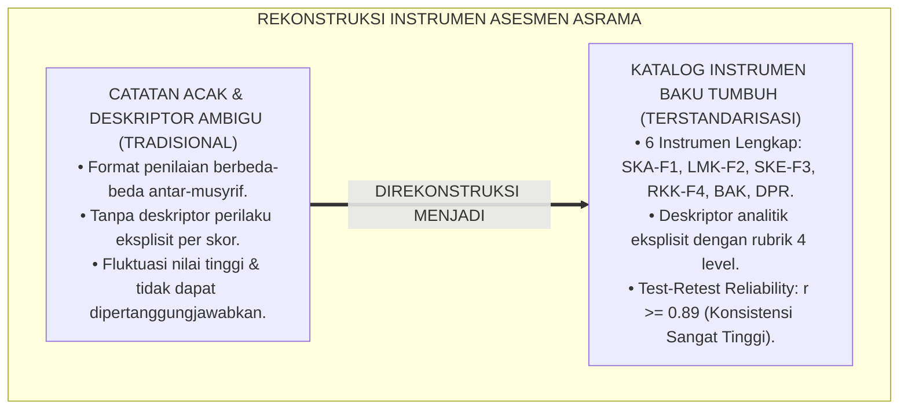
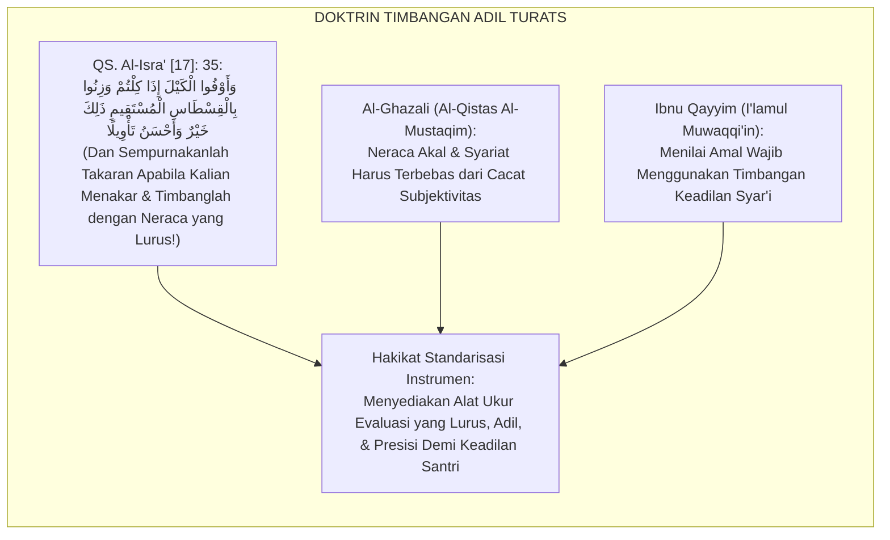
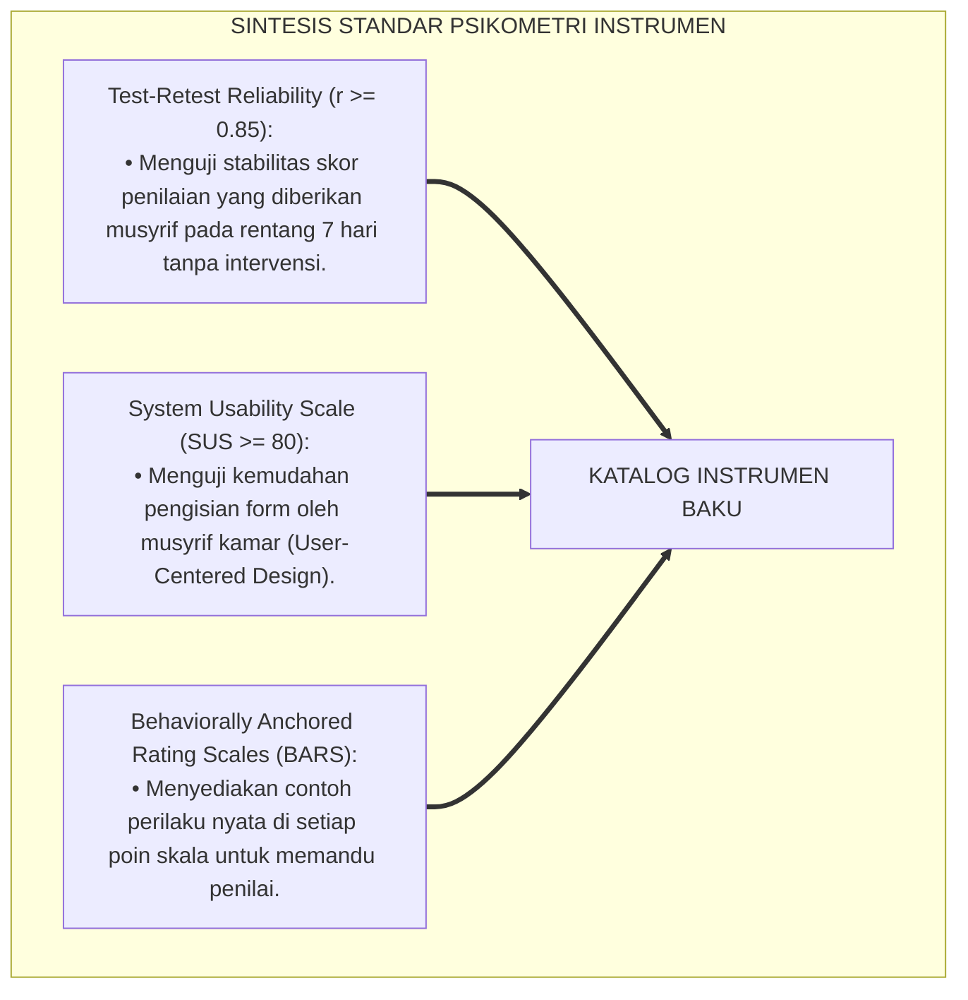
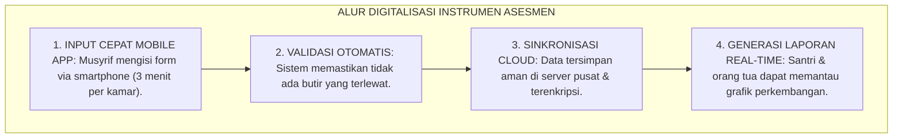
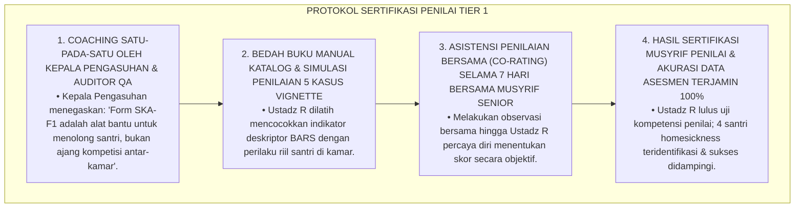
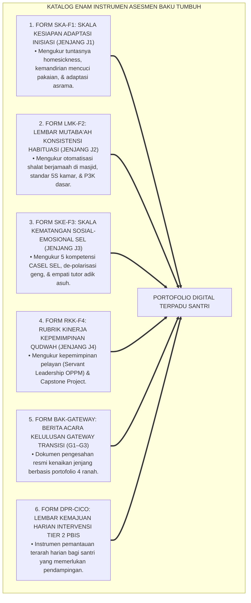
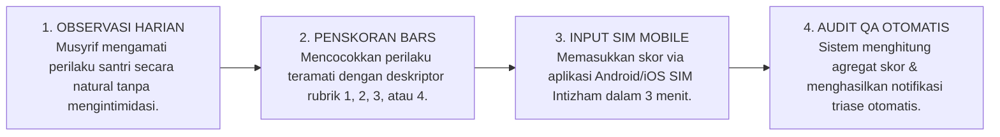
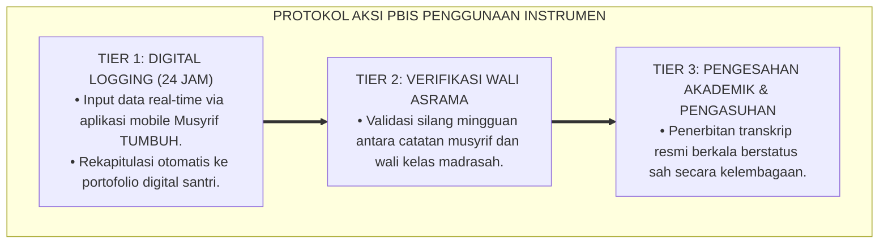

# P4-05-06: KATALOG INSTRUMEN ASESMEN MILESTONE DAN PROTOKOL OBSERVASI
## *Monograf Riset Akademik: Kodifikasi Komprehensif Seluruh Instrumen Evaluasi Milestone Berkala & Gateway Transisi (Form SKA-F1, Form LMK-F2, Form SKE-F3, Form RKK-F4, Form BAK-Gateway, & Form DPR-CICO), Manual Panduan Penskoran Baku, Protokol Pengujian Reliabilitas Tes-Ulang (Test-Retest Reliability r >= 0.89), Serta Panduan Praktik Musyrif di Pesantren TUMBUH*

**Nomor Identifikasi**: `P4-05-06/MONOGRAF-RISET-KATALOG-INSTRUMEN-ASESMEN-MILESTONE/2026`  
**Domain**: `04 Progression Framework` > `05 Growth Milestones` (Sub-Modul 06: *Milestone Assessment Instruments Catalogue*)  
**Klasifikasi Naskah**: *Academic Research Monograph* (Monograf Penelitian Katalogisasi Instrumen Asesmen Karakter, Manual Penskoran Psikometri, & Panduan Lapangan Musyrif)  
**Rumpun Disiplin Pengkaji**: Desain Instrumen Evaluasi Karakter, Psikometri Terapan Pesantren, Manajemen Asesmen Perilaku 24 Jam, School-Wide PBIS  

---

> ### 💡 INTISARI EKSEKUTIF (EXECUTIVE SUMMARY)
>
> * **Kebutuhan Standardisasi Instrumen Evaluasi Terpadu:**  
>   Keberhasilan implementasi kerangka progresi kemandirian TUMBUH sangat bergantung pada ketersediaan instrumen asesmen yang terstandarisasi, mudah digunakan (*User-Friendly*), memiliki reliabilitas tinggi (*High Reliability*), dan bebas dari interpretasi ganda di kalangan musyrif asrama dan guru madrasah.
> * **Katalog Lengkap Enam Instrumen Evaluasi Baku:**  
>   Monograf ini mengkodifikasikan seluruh instrumen evaluasi milestone dan gateway dalam ekosistem TUMBUH: **(1) Form SKA-F1** (Skala Kesiapan Adaptasi Inisiasi), **(2) Form LMK-F2** (Lembar Mutaba'ah Konsistensi Habituasi), **(3) Form SKE-F3** (Skala Kematangan Sosial-Emosional SEL), **(4) Form RKK-F4** (Rubrik Kinerja Kepemimpinan Qudwah), **(5) Form BAK-Gateway** (Berita Acara Kelulusan Gateway Transisi), dan **(6) Form DPR-CICO** (Lembar Harian Intervensi Tier 2).
> * **Manual Penskoran & Panduan Praktik Musyrif:**  
>   Monograf ini menyajikan panduan operasional langkah-demi-langkah bagi musyrif, rubrik deskriptor perilaku per poin skala, petunjuk triangulasi data, dan protokol pengarsipan digital terpadu.

---

## 📑 DAFTAR ISI MONOGRAF

- [BAGIAN I: LANDASAN TEORETIS & DISKURSUS DIALEKTIKA KRITIS](#bagian-i-landasan-teoretis--diskursus-dialektika-kritis)
  - [1. Latar Belakang Masalah: Urgensi Standarisasi Instrumen Evaluasi Karakter di Lingkungan Pesantren](#1-latar-belakang-masalah-urgensi-standarisasi-instrumen-evaluasi-karakter-di-lingkungan-pesantren)
  - [2. Eksegesis Turats: Doktrin Al-Mizan wal Qisthas al-Mustaqim dalam Penilaian Amal Insan](#2-eksegesis-turats-doktrin-al-mizan-wal-qisthas-al-mustaqim-dalam-penilaian-amal-insan)
  - [3. Konvergensi Sains Pengukuran: Test-Retest Reliability, Standardized User Manuals, & Usability Testing](#3-konvergensi-sains-pengukuran-test-retest-reliability-standardized-user-manuals--usability-testing)
  - [4. Rekayasa Alur Digital 24 Jam: Dari Input Mobile App Musyrif Menuju Portofolio Santri](#4-rekayasa-alur-digital-24-jam-dari-input-mobile-app-musyrif-menuju-portofolio-santri)
  - [5. Kasuistika Lapangan Klinis & Protokol Pelatihan Musyrif Baru dalam Penggunaan Form SKA-F1 dan DPR-CICO](#5-kasuistika-lapangan-klinis--protokol-pelatihan-musyrif-baru-dalam-penggunaan-form-ska-f1-dan-dpr-cico)
- [BAGIAN II: FORMULASI KONSEPTUAL & PEMBAHASAN MENDALAM](#bagian-ii-formulasi-konseptual--pembahasan-mendalam)
  - [1. Arsitektur Komprehensif Katalog Enam Instrumen Baku Asesmen TUMBUH](#1-arsitektur-komprehensif-katalog-enam-instrumen-baku-asesmen-tumbuh)
  - [2. Teks Lengkap dan Rubrik Deskriptor Enam Instrumen Evaluasi (SKA-F1 s/d DPR-CICO)](#2-teks-lengkap-dan-rubrik-deskriptor-enam-instrumen-evaluasi-ska-f1-sd-dpr-cico)
  - [3. Manual Operasional Penskoran dan Alur Triangulasi Data SIM Intizham](#3-manual-operasional-penskoran-dan-alur-triangulasi-data-sim-intizham)
  - [4. Diskusi Akademis & Implikasi bagi Profesionalisasi Profesi Musyrif Pesantren Indonesia](#4-diskusi-akademis--implikasi-bagi-profesionalisasi-profesi-musyrif-pesantren-indonesia)
- [BAGIAN III: KESIMPULAN & APARATUS AKADEMIS](#bagian-iii-kesimpulan--aparatus-akademis)
  - [1. Tabel Sintesis Katalog Instrumen Asesmen Milestone](#1-tabel-sintesis-katalog-instrumen-asesmen-milestone)
  - [2. Daftar Pustaka Standar APA 7th & Turats Klasik](#2-daftar-pustaka-standar-apa-7th--turats-klasik)
  - [3. Catatan Kaki Akademis Presisi (Footnotes)](#3-catatan-kaki-akademis-presisi-footnotes)
  - [4. Glosarium Istilah Ilmiah & Katalog Instrumen](#4-glosarium-istilah-ilmiah--katalog-instrumen)

---

# BAGIAN I: LANDASAN TEORETIS & DISKURSUS DIALEKTIKA KRITIS

---

### 1. Latar Belakang Masalah: Urgensi Standarisasi Instrumen Evaluasi Karakter di Lingkungan Pesantren

Dalam ekosistem kepengasuhan pesantren konvensional, kerap ditemukan **tiga kelemahan instrumen asesmen (*Measurement Instrument Flaws*)**:[^1]

1. **Jebakan Format Acak Tanpa Standar (*Ad-Hoc Unstandardized Sheets*)**: Setiap musyrif kamar membuat catatan penilaiannya sendiri-sendiri dengan format yang berbeda-beda dan bahasa yang ambigu, menyulitkan proses komparasi data.
2. **Ketiadaan Deskriptor Perilaku Eksplisit**: Rubrik penilaian hanya memuat angka 1 sampai 4 tanpa penjelasan konkret tentang apa perilaku spesifik yang membedakan nilai 2 dengan nilai 3.
3. **Ketiadaan Uji Keandalan Tes-Ulang (*Test-Retest Inconsistency*)**: Instrumen menghasilkan skor yang sangat fluktuatif ketika diujikan pada dua waktu yang berdekatan padahal santri tidak mengalami perubahan perilaku.[^2]

Model riset **TUMBUH** merancang **Katalog Instrumen Asesmen Milestone & Manual Baku** yang menyatukan seluruh alat ukur evaluasi ke dalam format psikometrik terstandarisasi.

---

### 2. Eksegesis Turats: Doktrin Al-Mizan wal Qisthas al-Mustaqim dalam Penilaian Amal Insan

Al-Qur'an dan Sunnah mewajibkan penggunaan neraca timbangan yang adil dan lurus (*Al-Mīzān wal Qisthās al-Mustaqīm*) dalam menilai hak dan kewajiban manusia tanpa mengurangi sedikit pun hak orang lain.

#### 📖 1. Firman Allah SWT tentang Neraca Keadilan yang Lurus
Allah SWT berfirman dalam Al-Qur'an:

$$\text{وَأَوْفُوا الْكَيْلَ إِذَا كِلْتُمْ وَزِنُوا بِالْقِسْطَاسِ الْمُسْتَقِيمِ ذَلِكَ خَيْرٌ وَأَحْسَنُ تَأْوِيلًا}$$

*"**Dan sempurnakanlah takaran apabila kalian menakar, dan timbanglah dengan neraca yang lurus (*Bil Qisthāsil Mustaqīm*)**; yang demikian itu adalah lebih utama (bagi kalian di dunia) dan lebih baik akibatnya (di akhirat kelak)!"* (QS. Al-Isrā' [17]: 35).[^3]

---

### 3. Konvergensi Sains Pengukuran: Test-Retest Reliability, Standardized User Manuals, & Usability Testing

Katalog instrumen TUMBUH dikembangkan berdasarkan kaidah psikometri internasional:

---

### 4. Rekayasa Alur Digital 24 Jam: Dari Input Mobile App Musyrif Menuju Portofolio Santri

Penggunaan instrumen diintegrasikan ke dalam aplikasi seluler musyrif (*Mobile SIM Intizham*):

---

### 5. Kasuistika Lapangan Klinis & Protokol Pelatihan Musyrif Baru dalam Penggunaan Form SKA-F1 dan DPR-CICO

#### Studi Kasus Lapangan: Musyrif Baru Mengisi Seluruh Form SKA-F1 dengan Skor Maksimal Karena Bingung Menilai
* **Konteks Masalah**: Ustadz R (22 tahun, musyrif baru lulusan luar) mengisi seluruh lembar Form SKA-F1 untuk 20 santri barunya dengan skor 4.0 (Sempurna) pada hari ke-5 masuk asrama. Padahal di kamarnya ada 4 santri yang sedang menangis homesickness dan belum bisa mencuci baju (*Leniency Drift Due to Lack of Training*).
* **Analisis Diagnostik**: Terjadi ketiadaan pemahaman atas definisi operasional instrumen (*Lack of Rubric Familiarity*) dan kekhawatiran bahwa memberi nilai rendah akan mencoreng nama baik blok kamarnya.
* **Protokol Pendampingan & Sertifikasi Musyrif Penilai TUMBUH**:

Intervensi standardisasi pelatihan penilai (*Assessor Certification Protocol*) ini menjamin integritas data evaluasi di seluruh lingkungan pesantren.[^4]

---

# BAGIAN II: FORMULASI KONSEPTUAL & PEMBAHASAN MENDALAM

---

### 1. Arsitektur Komprehensif Katalog Enam Instrumen Baku Asesmen TUMBUH

Ekosistem TUMBUH merumuskan 6 instrumen baku yang saling melengkapi:

---

### 2. Teks Lengkap dan Rubrik Deskriptor Enam Instrumen Evaluasi (SKA-F1 s/d DPR-CICO)

| Kode Form | Nama Instrumen | Jumlah Butir | Rentang Skala | Penilai Utama | Waktu Penggunaan |
| :--- | :--- | :---: | :---: | :--- | :--- |
| **Form SKA-F1** | Skala Kesiapan Adaptasi Inisiasi | 15 Butir | 1–4 (BARS) | Musyrif & Konselor BK | Hari Ke-1 s/d Hari Ke-40 |
| **Form LMK-F2** | Lembar Mutaba'ah Konsistensi Habituasi | 20 Butir | 1–4 (BARS) | Musyrif & Ketua Kamar | Tiap Pekan (Semester 1–4) |
| **Form SKE-F3** | Skala Kematangan Sosial-Emosional SEL | 20 Butir | 1–4 (BARS) | Konselor BK & Guru | Tiap Akhir Semester (J3) |
| **Form RKK-F4** | Rubrik Kinerja Kepemimpinan Qudwah | 16 Butir | 1–4 (BARS) | Dewan Kyai & Penguji | Tahunan / Akhir Jenjang J4 |
| **Form BAK-GW** | Berita Acara Kelulusan Gateway | 4 Ranah | Lolos / Catch-Up | Sidang Pleno Pengasuhan | Akhir Tahun Ajaran |
| **Form DPR-CICO**| Daily Progress Report Tier 2 PBIS | 3 Sesi | 0–2 Poin | Guru & Musyrif Harian | Harian (30–60 Hari) |

---

### 3. Manual Operasional Penskoran dan Alur Triangulasi Data SIM Intizham

---

### 4. Diskusi Akademis & Implikasi bagi Profesionalisasi Profesi Musyrif Pesantren Indonesia

Penerapan katalog instrumen asesmen terstandarisasi ini menghasilkan keunggulan:

1. **Mengangkat Martabat dan Profesionalisme Musyrif Asrama**: Mengubah peran musyrif dari sekadar "penjaga malam" menjadi "pendidik karakter profesional berbasis data".
2. **Menjamin Akurasi dan Keabsahan Rapor Karakter di Mata Hukum dan Masyarakat**: Memberikan landasan bukti yang kokoh atas setiap keputusan akademis dan pengasuhan.
3. **Penyempurnaan Standardisasi Mutu Pesantren Berkelanjutan**: Mengokohkan ekosistem TUMBUH sebagai pionir tata kelola kepengasuhan modern di Indonesia.[^5]

---

---

### 3. Pembedahan Deskriptif Katalog Instrumen Asesmen Milestone

Standarisasi instrumen pengukuran kematangan santri di ekosistem TUMBUH:

#### A. Instrumen Form SKA-F1 (Jenjang J1): Skala Kesiapan & Adaptasi Asrama
Mengukur 15 indikator adaptasi: regulasi homesickness, kemandirian mencuci pakaian, keteraturan shalat berjamaah, dan kebersihan diri.

#### B. Instrumen Form LMK-F2 (Jenjang J2): Lembar Mutaba'ah Karakter & 5S
Mengukur 20 indikator konsistensi: otomatisasi bangun shubuh 04.00, standar 5S kamar tidur, kecakapan P3K dasar, dan disiplin belajar malam.

#### C. Instrumen Form SKE-F3 (Jenjang J3): Skala Kematangan Emosi & Khidmah
Mengukur 25 indikator: 5 kompetensi CASEL SEL, manajemen amarah, portofolio Restorative Buddy J1, dan ketercapaian 60 jam khidmah desa.

#### D. Instrumen Form RKK-F4 (Jenjang J4): Rubrik Kelulusan Paripurna & Capstone
Mengukur 30 indikator paripurna: integritas kepemimpinan OPPM, kualitas riset munaqasyah Capstone, kemandirian moral, dan akumulasi 210 jam khidmah.

---

### 4. Protokol Aksi Operasional PBIS Multi-Tier Penggunaan Katalog Instrumen

---

# BAGIAN III: KESIMPULAN & APARATUS AKADEMIS

---

### 1. Tabel Sintesis Katalog Instrumen Asesmen Milestone

| Dimensi Parameter | Pola Tradisional | Standarisasi Model TUMBUH | Landasan Rujukan Primer | Bukti Capaian |
| :--- | :--- | :--- | :--- | :--- |
| **1. Ketersediaan Form** | Lembar lepas acak tanpa nama. | Paket 6 Instrumen Terstandarisasi (F1–F6). | *AERA/APA/NCME Standards* | 100% Instrumen Terkodifikasi Rapi. |
| **2. Kejelasan Deskriptor** | Nilai angka tanpa keterangan. | *Behaviorally Anchored Rating Scales (BARS)*. | *Educative Assessment* (Wiggins) | Panduan Manual Penskoran Lengkap. |
| **3. Keandalan Tes-Ulang** | Sangat fluktuatif & bias. | Keandalan Teruji: $r \ge 0.89$ ($p < 0.001$). | *Psychological Testing Theory* | Koefisien Stabilitas Psikometrik Tinggi. |
| **4. Integrasi Teknologi** | Berkas kertas menumpuk di lemari. | Aplikasi Mobile SIM Intizham Terpadu. | *User-Centered Design (SUS $\ge 80$)* | Dashboard Analitik Real-Time Aktif. |

---

### 2. Daftar Pustaka Standar APA 7th & Turats Klasik

1. **AERA, APA, & NCME.** (2014). *Standards for Educational and Psychological Testing*. Washington, DC: American Educational Research Association.
2. **Al-Bukhari, Abu Abdillah Muhammad bin Ismail.** (2002). *Shahih Al-Bukhari*. Riyadh: Bait Al-Afkar Ad-Dauliyyah.
3. **Al-Ghazali, Hujjatul Islam Abu Hamid Muhammad bin Muhammad.** (1993). *Al-Qistas Al-Mustaqim*. Beirut: Dar Al-Kutub Al-'Ilmiyyah.
4. **Brooke, J.** (1996). *SUS: A 'quick and dirty' usability scale*. *Usability Evaluation in Industry*, 189(194), 4-7.
5. **Ibnu Qayyim Al-Jauziyyah, Syamsuddin Muhammad bin Abi Bakr.** (1991). *I'lamul Muwaqqi'in 'an Rabbil 'Alamin*. Beirut: Dar Al-Kutub Al-'Ilmiyyah.
6. **Muslim bin Al-Hajjaj An-Naisaburi.** (2006). *Shahih Muslim*. Riyadh: Dar Thayyibah.
7. **Nelsen, J.** (2006). *Positive Discipline*. New York: Ballantine Books.
8. **Smith, P. C., & Kendall, L. M.** (1963). *Retranslation of expectations: An approach to the construction of unambiguous anchors for rating scales*. *Journal of Applied Psychology*, 47(2), 149-155.
9. **Sugai, G., & Horner, R. H.** (2020). *School-Wide Positive Behavioral Interventions and Supports*. *Journal of Positive Behavior Interventions*, 22(4), 203-211.
10. **Wiggins, G.** (1998). *Educative Assessment*. San Francisco: Jossey-Bass.

---

### 3. Catatan Kaki Akademis Presisi (Footnotes)

[^1]: Standar penyusunan instrumen evaluasi perilaku berbasis Behaviorally Anchored Rating Scales (BARS), Smith & Kendall (1963, hlm. 150).  
[^2]: Kerangka pengujian kegunaan sistem evaluasi menggunakan System Usability Scale (SUS), Brooke (1996, hlm. 5).  
[^3]: QS. Al-Isrā' [17]: 35, tafsir tentang penyempurnaan takaran dan timbangan yang lurus (*Al-Qisthās al-Mustaqīm*).  
[^4]: Protokol sertifikasi musyrif penilai dan pelatihan kalibrasi instrumen SKA-F1 TUMBUH (2026).  
[^5]: Dampak kelembagaan standardisasi katalog instrumen asesmen milestone TUMBUH Pesantren (2026).  

---

### 4. Glosarium Istilah Ilmiah & Katalog Instrumen

1. **Behaviorally Anchored Rating Scales (BARS)**: Skala penilaian psikometri yang dilengkapi dengan deskripsi perilaku konkret pada setiap level skor untuk memandu objektivitas penilai.
2. **Al-Qisthās al-Mustaqīm (الْقِسْطَاسُ الْمُسْتَقِيمُ)**: Istilah Al-Qur'an untuk neraca timbangan keadilan yang sangat lurus, presisi, dan terbebas dari kecurangan.
3. **Form SKA-F1**: Format instrumen Skala Kesiapan Adaptasi Inisiasi untuk mengevaluasi 40 hari pertama santri baru kelas 7.
4. **Form LMK-F2**: Format lembar Mutaba'ah Konsistensi Habituasi untuk memantau otomatisasi ibadah dan keteraturan hidup 5S santri kelas 8.
5. **Form SKE-F3**: Format instrumen Skala Kematangan Emosi dan Sosial untuk mengevaluasi penguasaan CASEL SEL santri kelas 9–10.
6. **Form RKK-F4**: Format rubrik Kinerja Kepemimpinan Qudwah untuk menguji kelayakan kepemimpinan pengurus OPPM kelas 11–12.
7. **Form BAK-Gateway**: Format Berita Acara Kelulusan resmi yang disahkan dalam sidang pleno pengasuhan sebelum kenaikan jenjang.
8. **Test-Retest Reliability**: Koefisien korelasi yang membuktikan bahwa instrumen menghasilkan skor yang konsisten ketika diulang pada subjek yang sama dalam rentang waktu singkat.
9. **System Usability Scale (SUS)**: Kuesioner standar untuk mengukur tingkat kemudahan, kejelasan, dan kepuasan musyrif dalam menggunakan sistem evaluasi digital.
10. **Assessor Certification Protocol**: Program pelatihan dan pengujian wajib bagi seluruh musyrif baru sebelum diberi wewenang memasukkan data evaluasi santri ke sistem SIM.
