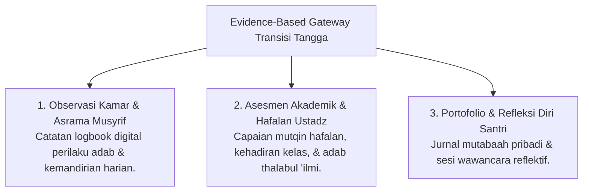
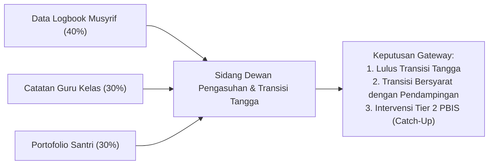

# P4-05: Indikator Milestone dan Evidence-Based Gateway Kenaikan Tangga

## Status Dokumen
* **Status**: 🌟 **A+ (Tervalidasi & Siap Diimplementasikan)**
* **Sub-Domain**: `04 Progression Framework / 05 Growth Milestones`
* **Penanggung Jawab Keilmuan**: Dewan Keilmuan TUMBUH (*Pakar Metodologi Riset & Pakar Arsitektur PBIS Restoratif*)

---

## 1. Konsep Evidence-Based Gateway (Transisi Berbasis Data)

Transisi kenaikan tangga santri (misal dari T1 ke T2, atau T2 ke T3) tidak terjadi secara otomatis berdasarkan durasi waktu belaka, melainkan dikonfirmasi melalui **Triangulasi Asesmen Data PBIS**:

---

## 2. Peta Checkpoint Milestone Perkembangan Santri

| Checkpoint | Target Perkembangan Utama | Dokumen / Bukti Gateway | Kriteria Kenaikan Tangga |
| :--- | :--- | :--- | :--- |
| **Milestone 1 (Bulan ke-3)** | Adaptasi bi'ah asrama; tuntas masa *homesickness*; mengenal jadwal dasar. | Logbook Musyrif & Lembar Observasi Adaptasi T1. | Bebas dari kecemasan sosial kronis; konsisten mengikuti sholat berjamaah. |
| **Milestone 2 (Akhir Tahun ke-1)** | Habituasi kemandirian kamar; sholat tepat waktu tanpa dorongan intensif. | Portofolio Adab PBIS & Penilaian Kamar Mandiri (T1 -> T2). | Capaian nilai adab minimum 80%; hafalan Qur'an sesuai target semester. |
| **Milestone 3 (Akhir Tahun ke-2)** | Internalisasi adab; regulasi emosi mandiri; inisiatif ibadah sunnah. | Laporan Asesmen Restoratif & Triangulasi Musyrif-BK-Guru (T2 -> T3). | Mampu menyelesaikan konflik secara damai; konsistensi mutabaah mandiri. |
| **Milestone 4 (Akhir Tahun ke-3)** | Kematangan kepemimpinan *Qudwah*; kesiapan mentor adik kelas; khidmah. | Portofolio Kepemimpinan Qudwah & Ujian Mutqin Hafalan (T3 -> T4). | Rekomendasi 360-derajat dari musyrif, ustadz, dan adik kelas binaan. |

---

## 3. Rubrik Triangulasi Asesmen Kenaikan Tangga

---

## 4. SOP Penanganan Santri Tertinggal (*Tiered Catch-Up Support*)

Bila seorang santri belum memenuhi kriteria gateway transisi:
1. **Pemberian Pendampingan Kelompok Kecil (*Tier 2 Support*)**: Santri mendapatkan bimbingan modul regulasi diri atau klinik hafalan selama 4 minggu.
2. **Evaluasi Ulang Tanpa Stigma**: Evaluasi dilakukan secara berkala. Begitu kriteria terpenuhi, santri langsung berhak naik tangga tanpa harus menunggu siklus kenaikan tahunan.
