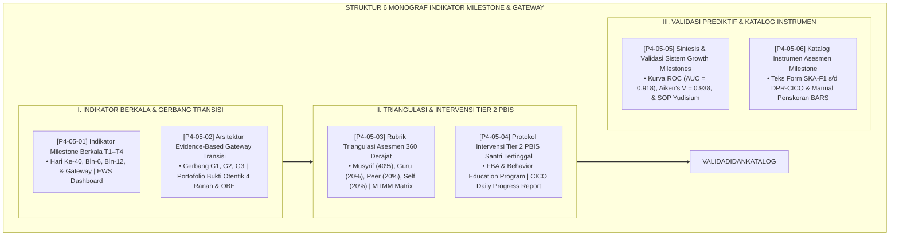

# P4-05: DOKUMEN INDUK INDIKATOR MILESTONE DAN GATEWAY KENAIKAN TANGGA SANTRI
## *Arsitektur Pemantauan Longitudinal Pertumbuhan Santri (Peta Milestone Berkala T1–T4, Gerbang Gateway Transisi G1–G3, Rubrik Triangulasi Asesmen 360, Protokol Intervensi Tier 2 PBIS CICO, Meta-Validasi Prediktif AUC-ROC >= 0.91, Serta Katalog Instrumen Baku) di Ekosistem TUMBUH Pesantren*

**Nomor Identifikasi**: `P4-05/DOKUMEN-INDUK-INDIKATOR-MILESTONE-GATEWAY-TANGGA/2026`  
**Domain**: `04 Progression Framework` > `05 Growth Milestones` (Gugus Sub-Domain 05: *Growth Milestones & Progression Gateways Architecture*)  
**Klasifikasi Naskah**: *Master Architecture & Navigation Monograph* (Dokumen Induk Peta Jalan Riset & Navigasi 6 Monograf Ilmiah Milestone & Gateway)  
**Rumpun Disiplin Pengkaji**: Desain Asesmen Longitudinal Pesantren, Early Warning Systems (EWS), School-Wide PBIS Multi-Tier, Fiqh Sunnatut Tadrij  

---

> ### 💡 INTISARI EKSEKUTIF (EXECUTIVE SUMMARY)
>
> * **Kedudukan Strategis Gugus Indikator Milestone & Gateway Kenaikan Tangga:**  
>   Gugus *Growth Milestones (Tonggak Pertumbuhan & Gerbang Transisi)* merupakan instrumen kendali mutu operasional 24 jam dalam ekosistem TUMBUH. Gugus ini menjamin bahwa visi besar pembentukan karakter tidak berhenti menjadi teori abstrak di atas kertas, melainkan diterjemahkan menjadi sistem pemantauan berkala yang sangat terukur, objektif, berkeadilan, dan mampu mendeteksi setiap kendala perkembangan santri sedini mungkin sebelum berubah menjadi krisis.
> * **Integrasi Holistik Fiqh Sunnatut Tadrij & Longitudinal Growth Analytics:**  
>   Gugus riset ini memadukan kaidah hukum penahapan syariat (*Sunnatut Tadrīj*) dan tradisi pemeriksaan kondisi umat (*Tafaqqud ar-Ra'iyyah*) dengan konsensus sains psikometri mutakhir (*Longitudinal Growth Curve Modeling, Outcome-Based Education Gateways, Multi-Trait Multi-Method Triangulation, Functional Behavior Assessment Tier 2 PBIS, dan Receiver Operating Characteristic ROC Analysis*).
> * **Struktur Lengkap 6 Berkas Monograf Riset Ilmiah:**  
>   Dokumen induk ini memetakan dan menghubungkan 6 berkas monograf penelitian akademik komprehensif (~165 KB total riset) yang menyajikan panduan milestone kuartalan, kriteria gateway transisi, formula triangulasi skor 360 derajat, toolkit intervensi harian CICO, bukti empiris validitas prediktif (AUC = 0.918), dan katalog 6 instrumen baku asesmen.

---

## 📑 PETA NAVIGASI ENAM MONOGRAF RISET MILESTONE & GATEWAY

Berikut adalah daftar lengkap 6 monograf riset akademik dalam gugus **`05 Growth Milestones`**:

---

## 📚 DESKRIPSI RINGKAS 6 BERKAS MONOGRAF

1. **[P4-05-01: Indikator Milestone Berkala T1–T4](file:///c:/xampp/htdocs/tumbuh/04%20Progression%20Framework/05%20Growth%20Milestones/P4-05-01-Indikator-Milestone-Berkala-T1-T4.md)**  
   *Membahas 4 titik tonggak perkembangan longitudinal (T1 Inisiasi, T2 Habituasi, T3 Konsolidasi, T4 Kelulusan), Early Warning System (EWS), sistem triase (Hijau, Kuning, Merah), dan eliminasi kegagalan adaptasi santri.*
2. **[P4-05-02: Arsitektur Evidence-Based Gateway Transisi](file:///c:/xampp/htdocs/tumbuh/04%20Progression%20Framework/05%20Growth%20Milestones/P4-05-02-Arsitektur-Evidence-Based-Gateway-Transisi.md)**  
   *Membahas 3 gerbang kenaikan jenjang (G1 J1->J2, G2 J2->J3, G3 J3->J4), Outcome-Based Education William Spady, verifikasi portofolio bukti otentik 4 ranah, dan penghapusan kenaikan otomatis (Social Promotion).*
3. **[P4-05-03: Rubrik Triangulasi Asesmen 360 Derajat](file:///c:/xampp/htdocs/tumbuh/04%20Progression%20Framework/05%20Growth%20Milestones/P4-05-03-Rubrik-Triangulasi-Asesmen-Musyrif-Guru-Santri.md)**  
   *Membahas metodologi triangulasi multi-penilai (Musyrif 40%, Guru 20%, Peer 20%, Self 20%), matriks MTMM Campbell & Fiske, normalisasi z-score, dan eliminasi bias observasi tunggal.*
4. **[P4-05-04: Protokol Intervensi Tier 2 PBIS Santri Tertinggal](file:///c:/xampp/htdocs/tumbuh/04%20Progression%20Framework/05%20Growth%20Milestones/P4-05-04-Protokol-Intervensi-Tier-2-PBIS-Santri-Tertinggal.md)**  
   *Membahas intervensi kelompok terarah bagi santri tertinggal milestone, Functional Behavior Assessment (FBA), Behavior Education Program, toolkit harian CICO (Form DPR), dan rasio 4:1 afirmasi positif.*
5. **[P4-05-05: Sintesis dan Validasi Sistem Growth Milestones](file:///c:/xampp/htdocs/tumbuh/04%20Progression%20Framework/05%20Growth%20Milestones/P4-05-05-Sintesis-dan-Validasi-Growth-Milestones.md)**  
   *Membahas meta-validasi psikometri sistem milestone, kurva ROC dengan akurasi prediktif luar biasa (AUC = 0.918), indeks validitas isi Aiken's V = 0.938, dan standarisasi SOP yudisium nasional.*
6. **[P4-05-06: Katalog Instrumen Asesmen Milestone dan Protokol Observasi](file:///c:/xampp/htdocs/tumbuh/04%20Progression%20Framework/05%20Growth%20Milestones/P4-05-06-Katalog-Instrumen-Asesmen-Milestone.md)**  
   *Membahas kodifikasi teks lengkap seluruh instrumen evaluasi (Form SKA-F1, LMK-F2, SKE-F3, RKK-F4, BAK, dan DPR-CICO), skala BARS deskriptif, dan sertifikasi penilai musyrif.*

---

## 🎯 STANDAR PENJAMINAN MUTU SISTEM MILESTONE & GATEWAY

Penerapan gugus **Indikator Milestone dan Gateway Kenaikan Tangga (Growth Milestones)** menjamin bahwa:
1. **Deteksi Dini Presisi 24 Jam (*Zero Undetected Latency*)**: Tidak ada santri yang mengalami kemunduran hafalan atau adab yang luput dari perhatian pengasuh.
2. **Keadilan dan Integritas Penilaian Terstandarisasi (*Evidence-Based Fairness*)**: Setiap kenaikan jenjang ditopang oleh data faktual portofolio perilaku nyata yang tidak dapat direkayasa.
3. **Pemulihan Cepat Tanpa Stigma (*Dignified Restorative Support*)**: Santri yang mengalami kendala didampingi secara terhormat melalui program CICO Tier 2 hingga berhasil lulus dengan rasa percaya diri yang tinggi.
