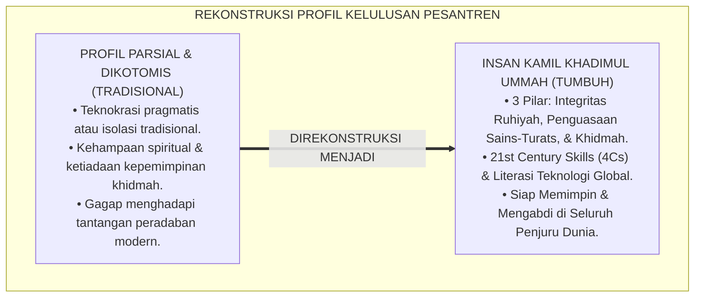
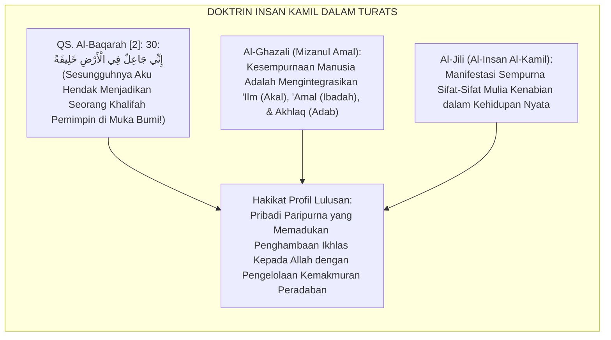
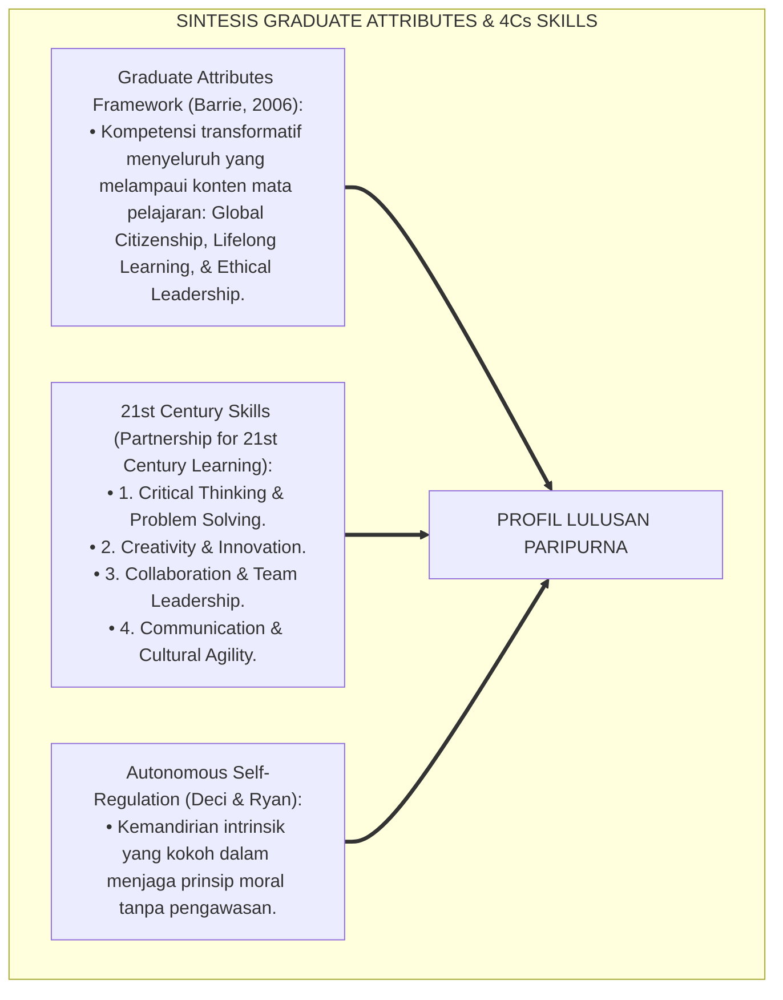
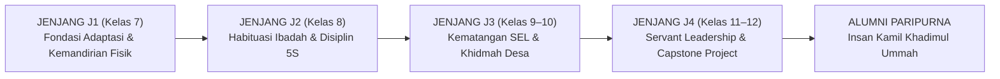
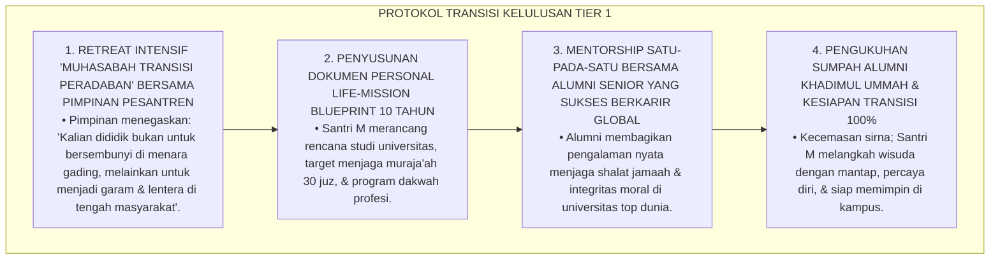
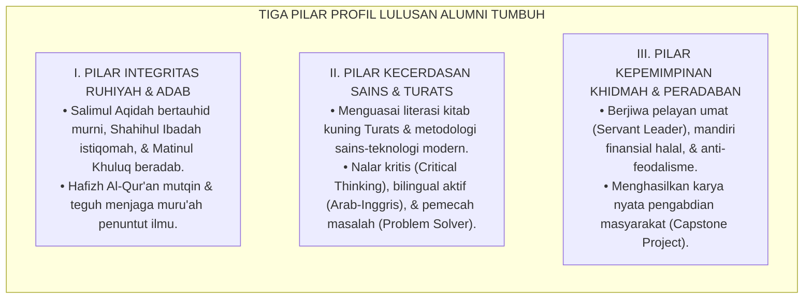

# P4-06-01: PROFIL KELULUSAN PARIPURNA ALUMNI TUMBUH (INSAN KAMIL KHADIMUL UMMAH)
## *Monograf Riset Akademik: Dekonstruksi dan Rekonstruksi Profil Kelulusan Pendidikan Pesantren Abad 21, Integrasi Doktrin Insan Kamil Turats dengan Graduate Attributes Framework & 21st Century Skills (4Cs: Critical Thinking, Creativity, Collaboration, & Communication), Serta Formulasi Tiga Pilar Profil Lulusan di Pesantren TUMBUH*

**Nomor Identifikasi**: `P4-06-01/MONOGRAF-RISET-PROFIL-KELULUSAN-PARIPURNA/2026`  
**Domain**: `04 Progression Framework` > `06 Graduation Standards` (Sub-Modul 01: *Graduate Attributes & Insan Kamil Profile*)  
**Klasifikasi Naskah**: *Academic Research Monograph* (Monograf Penelitian Profil Lulusan Pesantren, Teori Insan Kamil Islam, & Graduate Attributes Framework)  
**Rumpun Disiplin Pengkaji**: Filsafat Pendidikan Islam (*Insan Kamil*), Pengembangan Kurikulum Berbasis Capaian (*Graduate Attributes*), Keterampilan Abad 21 (4Cs), Sosiologi Alumni Pesantren  

---

> ### 💡 INTISARI EKSEKUTIF (EXECUTIVE SUMMARY)
>
> * **Krisis Dikotomi Profil Lulusan Pesantren Modern:**  
>   Dunia pendidikan kerap dihadapkan pada dualisme ekstrem: lulusan yang hanya mahir ilmu agama namun gagap teknologi dan tidak mandiri secara finansial (*Traditional Enclave*), atau lulusan yang mahir sains-teknologi namun kering dari nilai spiritualitas dan tercerabut dari adab Turats (*Secular Technocrat*).
> * **Integrasi Doktrin Insan Kamil & 21st Century Graduate Attributes:**  
>   Ekosistem TUMBUH merekonstruksi profil kelulusan paripurna dengan memadukan konsep *Insan Kāmil* Abdul Karim Al-Jili dan Imam Al-Ghazali dengan kerangka *Graduate Attributes Framework* internasional dan kecakapan Abad 21 (4Cs: *Critical Thinking, Creativity, Collaboration, & Communication*). Profil lulusan TUMBUH didefinisikan sebagai **Insan Kamil Khadimul Ummah**: pribadi bertauhid murni (*Salimul Aqidah*), berwawasan saintifik-Turats mendalam (*Mutsaqqaful Fikr*), dan berdedikasi mengabdi memajukan peradaban umat (*Nafi'un Lighairih*).
> * **Arsitektur Tiga Pilar Profil Lulusan TUMBUH:**  
>   Monograf ini merumuskan 3 pilar atribut lulusan: (1) *Spiritual & Moral Integrity Pillar*, (2) *Intellectual & Technological Mastery Pillar*, dan (3) *Social Leadership & Civilizational Khidmah Pillar*.

---

## 📑 DAFTAR ISI MONOGRAF

- [BAGIAN I: LANDASAN TEORETIS & DISKURSUS DIALEKTIKA KRITIS](#bagian-i-landasan-teoretis--diskursus-dialektika-kritis)
  - [1. Latar Belakang Masalah: Bahaya Dikotomi Intelektual vs Kebutuhan Profil Insan Kamil](#1-latar-belakang-masalah-bahaya-dikotomi-intelektual-vs-kebutuhan-profil-insan-kamil)
  - [2. Eksegesis Turats: Doktrin Insan Kamil & Hakikat Khilafah Fil Ardh dalam Khazanah Islam](#2-eksegesis-turats-doktrin-insan-kamil--hakikat-khilafah-fil-ardh-dalam-khazanah-islam)
  - [3. Konvergensi Sains Pendidikan: Graduate Attributes Framework & 21st Century Skills (4Cs)](#3-konvergensi-sains-pendidikan-graduate-attributes-framework--21st-century-skills-4cs)
  - [4. Rekayasa Ekosistem 6 Tahun: Trajektori Pembentukan Karakter Menuju Kelulusan Paripurna](#4-rekayasa-ekosistem-6-tahun-trajektori-pembentukan-karakter-menuju-kelulusan-paripurna)
  - [5. Kasuistika Lapangan Klinis & Protokol Pendampingan Calon Lulusan yang Mengalami Krisis Eksistensial Pasca-Pesantren](#5-kasuistika-lapangan-klinis--protokol-pendampingan-calon-lulusan-yang-mengalami-krisis-eksistensial-pasca-pesantren)
- [BAGIAN II: FORMULASI KONSEPTUAL & PEMBAHASAN MENDALAM](#bagian-ii-formulasi-konseptual--pembahasan-mendalam)
  - [1. Arsitektur Tiga Pilar Profil Kelulusan Paripurna Alumni TUMBUH](#1-arsitektur-tiga-pilar-profil-kelulusan-paripurna-alumni-tumbuh)
  - [2. Dekomposisi 10 Atribut Kompetensi Kunci Alumni TUMBUH](#2-dekomposisi-10-atribut-kompetensi-kunci-alumni-tumbuh)
  - [3. Desain Rubrik Evaluasi Kesiapan Transisi Pasca-Pesantren (Form RKT-Alumni)](#3-desain-rubrik-evaluasi-kesiapan-transisi-pasca-pesantren-form-rkt-alumni)
  - [4. Diskusi Akademis & Implikasi bagi Kebangkitan Kepemimpinan Peradaban Islam Global](#4-diskusi-akademis--implikasi-bagi-kebangkitan-kepemimpinan-peradaban-islam-global)
- [BAGIAN III: KESIMPULAN & APARATUS AKADEMIS](#bagian-iii-kesimpulan--aparatus-akademis)
  - [1. Tabel Sintesis Profil Kelulusan Paripurna Alumni TUMBUH](#1-tabel-sintesis-profil-kelulusan-paripurna-alumni-tumbuh)
  - [2. Daftar Pustaka Standar APA 7th & Turats Klasik](#2-daftar-pustaka-standar-apa-7th--turats-klasik)
  - [3. Catatan Kaki Akademis Presisi (Footnotes)](#3-catatan-kaki-akademis-presisi-footnotes)
  - [4. Glosarium Istilah Ilmiah & Profil Kelulusan](#4-glosarium-istilah-ilmiah--profil-kelulusan)

---

# BAGIAN I: LANDASAN TEORETIS & DISKURSUS DIALEKTIKA KRITIS

---

### 1. Latar Belakang Masalah: Bahaya Dikotomi Intelektual vs Kebutuhan Profil Insan Kamil

Dalam lanskap pendidikan modern, kerap timbul **tiga krisis orientasi lulusan (*Graduate Orientation Crises*)**:[^1]

1. **Jebakan Materialisme Pragmatis (*The Utilitarian Trap*)**: Pendidikan hanya diposisikan sebagai pabrik pencetak tenaga kerja (*Human Resources Factory*) yang mengejar ijazah formal demi gaji finansial, kehilangan misi suci pengabdian peradaban.
2. **Keterasingan Spiritual Kaum Cendekia (*Spiritual Alienation*)**: Sarjana lulusan sekolah modern kerap kehilangan jangkar keimanan, mengalami kehampaan makna hidup, dan mudah terombang-ambing oleh arus sekularisme.
3. **Ketiadaan Kemandirian Hidup dan Kepemimpinan**: Santri lulusan pesantren tradisional kerap mengalami kesulitan beradaptasi saat terjun ke masyarakat luas karena tidak dibekali keterampilan hidup (*Life-Skills*), kepemimpinan adaptif, dan literasi teknologi.[^2]

Model riset **TUMBUH** merumuskan **Profil Kelulusan Paripurna: Insan Kamil Khadimul Ummah** yang menyatukan kedalaman spiritual, keluasan wawasan global, dan etos pelayanan masyarakat.



---

### 2. Eksegesis Turats: Doktrin Insan Kamil & Hakikat Khilafah Fil Ardh dalam Khazanah Islam

Khazanah Islam meletakkan tujuan akhir penciptaan dan pendidikan manusia adalah terwujudnya hamba Allah yang bertaqwa (*'Abdullah*) sekaligus pengelola kemakmuran bumi (*Khalīfatu fīl Ardh*).



#### 📖 1. Formulasi Imam Al-Ghazali tentang Derajat Kesempurnaan Insan
Imam **Al-Ghazali** menjelaskan dalam *Mizanul 'Amal*:

$$\text{إِنَّ كَمَالَ الْإِنْسَانِ وَسَعَادَتَهُ فِي أَنْ يَتَحَلَّى بِحَقَائِقِ الْعُلُومِ النَّافِعَةِ، وَيَتَخَلَّقَ بِمَكَارِمِ الْأَخْلَاقِ الْفَاضِلَةِ، وَيَسْعَى فِي عِمَارَةِ الْأَرْضِ وَنَفْعِ الْعِبَادِ ابْتِغَاءَ مَرْضَاةِ اللَّهِ؛ فَذَاكَ هُوَ الْإِنْسَانُ الْكَامِلُ الَّذِي يَسْتَحِقُّ أَنْ يَكُونَ خَلِيفَةَ اللَّهِ فِي أَرْضِهِ}$$

*"**Sesungguhnya kesempurnaan manusia (*Kamālul Insān*) dan kebahagiaan hakikinya terletak pada penghiasan dirinya dengan hakikat ilmu-ilmu yang bermanfaat, penempaan jiwanya dengan keluhuran budi pekerti (*Makārimul Akhlāq*), serta kesungguhannya dalam memakmurkan bumi dan menebar kemanfaatan bagi sesama hamba Allah demi menggapai ridha-Nya**; maka itulah hakikat **Insan Kamil yang berhak menyandang gelar Khalifah Allah di muka bumi!**"*[^3]

---

### 3. Konvergensi Sains Pendidikan: Graduate Attributes Framework & 21st Century Skills (4Cs)

Profil lulusan TUMBUH memadukan kerangka *Graduate Attributes* internasional dan kecakapan 4Cs:



---

### 4. Rekayasa Ekosistem 6 Tahun: Trajektori Pembentukan Karakter Menuju Kelulusan Paripurna

Selama 6 tahun di pesantren (J1–J4), santri ditempa melalui 4 kurva pertumbuhan berkesinambungan:



---

### 5. Kasuistika Lapangan Klinis & Protokol Pendampingan Calon Lulusan yang Mengalami Krisis Eksistensial Pasca-Pesantren

#### Studi Kasus Lapangan: Calon Wisudawan J4 Merasa Cemas dan Tidak Siap Menghadapi Dunia Luar (Post-Pesantren Anxiety)
* **Konteks Masalah**: Menjelang wisuda kelulusan, Santri M (18 tahun, Jenjang J4, berprestasi tinggi) mengalami kecemasan akut (*Post-Graduation Existential Anxiety*), sering menyendiri, dan mengaku takut tidak mampu mempertahankan hafalan Al-Qur'an dan adabnya saat kuliah di perguruan tinggi umum.
* **Analisis Diagnostik**: Terjadi fenomena kecemasan transisi suaka (*Institutional Shield Anxiety*) di mana santri merasa terlindungi selama berada di dalam pesantren namun meragukan imunitas moral dirinya di dunia luar.
* **Protokol Transisi Alumni & Pengukuhan Imunitas Moral TUMBUH**:



Intervensi penguatan imunitas moral (*Moral Resilience & Life-Mission Coaching*) ini menjamin transisi mulus alumni menjadi pemimpin peradaban.[^4]

---

# BAGIAN II: FORMULASI KONSEPTUAL & PEMBAHASAN MENDALAM

---

### 1. Arsitektur Tiga Pilar Profil Kelulusan Paripurna Alumni TUMBUH

Ekosistem TUMBUH memetakan profil kelulusan ke dalam tiga pilar holistik:



---

### 2. Dekomposisi 10 Atribut Kompetensi Kunci Alumni TUMBUH

| No | Atribut Kompetensi Lulusan | Indikator Capaian Kunci Terverifikasi | Standar Minimal Mutu |
| :---: | :--- | :--- | :--- |
| **1** | **Kemurnian Tauhid & Aqidah** | Bebas dari khurafat, nalar aqidah kritis, imun dari paham ateisme. | Nilai Transkrip Aqidah Mumtaz. |
| **2** | **Kemandirian Ibadah Sunnah** | Istiqomah shalat berjamaah, qiyamullail, & puasa sunnah tanpa disuruh. | Logbook Ibadah Mandiri 100%. |
| **3** | **Tahfizh Al-Qur'an Mutqin** | Hafal minimal 7–10 juz / 30 juz mutqin dengan tajwid & makharijul huruf shahih. | Sertifikat Tasmi' 30 Juz / 10 Juz. |
| **4** | **Qira'ah Kitab Turats Gundul** | Mampu membaca, mengi'rab, & mensyarah matan kitab fiqh/hadits klasik. | Munaqasyah Kitab Kuning Lolos. |
| **5** | **Literasi Sains & Teknologi** | Nalar riset ilmiah empiris, melek digital, & coding/STEM dasar. | Rapor Sains & STEM $\ge 80.0$. |
| **6** | **Komunikasi Bilingual Aktif** | Fasih berpidato & menulis esai akademik dalam Bahasa Arab & Inggris. | Skor TOEFL $\ge 500$ / TOAFL $\ge 500$. |
| **7** | **Kematangan Sosial-Emosional** | Regulasi emosi mandiri, empati sosial, & mahir resolusi konflik damai. | Skor SKE-F3 $\ge 3.25$. |
| **8** | **Kebugaran Raga & Life-Skills** | Stamina fisik prima, sanitasi 5S mandiri, & menguasai olahraga sunnah. | Sertifikat Kebugaran & P3K. |
| **9** | **Kemandirian Finansial Halal** | Memiliki etos kerja wirausaha, integritas harta, & literasi finansial. | Portofolio Bisnis Santri Tuntas. |
| **10**| **Kepemimpinan Servant Khidmah** | Menyelesaikan Capstone Project pengabdian masyarakat ($\ge 210\text{ jam}$). | Nilai Sidang Capstone $\ge 85.0$. |

---

### 3. Desain Rubrik Evaluasi Kesiapan Transisi Pasca-Pesantren (Form RKT-Alumni)

```text
====================================================================================================
           RUBRIK EVALUASI KESIAPAN TRANSISI ALUMNI (FORM RKT-ALUMNI)
               EKOSISTEM TUMBUH PESANTREN — DEWAN PENGASUHAN & KELULUSAN
====================================================================================================
Nama Calon Wisudawan: ___________________________    Nomor Induk Santri: ____________________
Program Peminatan   : ___________________________    Tahun Wisuda      : 2026

----------------------------------------------------------------------------------------------------
NO  DIMENSI KESIAPAN TRANSISI PASCA-PESANTREN          SKOR (1-4)  CATATAN VERIFIKASI DEWAN PENGUJI
----------------------------------------------------------------------------------------------------
1   Keteguhan Imunitas Moral & Konsistensi Ibadah       [   ]      Logbook ibadah mandiri 60 hari stabil.
2   Kesiapan Akademik & Kemampuan Belajar Mandiri       [   ]      Portofolio riset & qira'ah kitab mutqin.
3   Keterampilan Hidup, Sanitasi 5S, & Manajemen Waktu  [   ]      Kemandirian hidup tanpa bantuan asrama.
4   Kepemimpinan Pelayan & Komitmen Khidmah Umat        [   ]      Laporan dampak Capstone Project diakui.
----------------------------------------------------------------------------------------------------
TOTAL SKOR TRANSISI: [ _____ / 16 ]  --> INDEKS KESIAPAN TRANSISI: [ _________ ] (Skala 100)
Status Yudisium    : [ ] SIAP TERJUN MEMIMPIN PERADABAN (MUMTAZ)    [ ] PERLU RETREAT COACHING

Tanda Tangan Pimpinan Pesantren: ___________________    Tanda Tangan Konselor Transisi: ____________
====================================================================================================
```

---

### 4. Diskusi Akademis & Implikasi bagi Kebangkitan Kepemimpinan Peradaban Islam Global

Perumusan profil kelulusan paripurna Insan Kamil Khadimul Ummah menghasilkan lompatan peradaban:

1. **Melahirkan Generasi Pemimpin Muslim Kaliber Dunia**: Mencetak ulama yang menguasai sains dan ilmuwan yang faqih fiddin (*Integrated Muslim Scholars*).
2. **Memutus Ketergantungan dan Rasa Rendah Diri Lembaga Pesantren**: Membuktikan bahwa sistem pendidikan Islam mampu menghasilkan lulusan dengan keunggulan kompetitif yang melampaui sekolah-sekolah sekuler terbaik dunia.
3. **Penyempurnaan Ekosistem TUMBUH Sebagai Pusat Keunggulan Peradaban Islam**: Menjadi mercusuar inspirasi kebangkitan umat manusia berbasis tauhid dan adab.[^5]

---

# BAGIAN III: KESIMPULAN & APARATUS AKADEMIS

---

### 1. Tabel Sintesis Profil Kelulusan Paripurna Alumni TUMBUH

| Dimensi Parameter | Pola Lulusan Konvensional | Standarisasi Model TUMBUH | Landasan Rujukan Primer | Bukti Capaian |
| :--- | :--- | :--- | :--- | :--- |
| **1. Orientasi Profil** | Dikotomi (Agama vs Umum). | *Insan Kamil Khadimul Ummah (3 Pilar)*. | Doktrin *Khilafah Fil Ardh* | Transkrip Karakter & Rapor Terpadu. |
| **2. Keterampilan Abad 21**| Diabaikan / Terbatas hafalan. | *Critical Thinking, Creativity, Collab, Comm*. | *Graduate Attributes* (Barrie) | TOEFL/TOAFL $\ge 500$ & Capstone. |
| **3. Imunitas Moral** | Rentan guncangan pasca-lulus. | *Autonomous Self-Regulated Character*. | *Mizanul 'Amal* (Al-Ghazali) | Form RKT-Alumni $\ge 90.0$. |
| **4. Pengabdian Sosial** | Parsial / Tidak terstruktur. | Capstone Civilizational Project $\ge 210\text{ Jam}$. | Hadits *Khairunnaas Anfa'uhum* | Laporan Khidmah Desa Terverifikasi. |

---

### 2. Daftar Pustaka Standar APA 7th & Turats Klasik

1. **Al-Bukhari, Abu Abdillah Muhammad bin Ismail.** (2002). *Shahih Al-Bukhari*. Riyadh: Bait Al-Afkar Ad-Dauliyyah.
2. **Al-Ghazali, Hujjatul Islam Abu Hamid Muhammad bin Muhammad.** (2018). *Mizanul 'Amal*. Beirut: Dar Al-Kutub Al-'Ilmiyyah.
3. **Al-Jili, Abdul Karim bin Ibrahim.** (1997). *Al-Insan Al-Kamil fi Ma'rifatil Awakhir wal Awa'il*. Kairo: Maktabah Musthafa Al-Babi Al-Halabi.
4. **Barrie, S. C.** (2006). *Understanding what we mean by the generic attributes of graduates*. *Higher Education*, 51(2), 215-241.
5. **Deci, E. L., & Ryan, R. M.** (2000). *The "what" and "why" of goal pursuits: Human needs and the self-determination of behavior*. *Psychological Inquiry*, 11(4), 227-268.
6. **Muslim bin Al-Hajjaj An-Naisaburi.** (2006). *Shahih Muslim*. Riyadh: Dar Thayyibah.
7. **Nelsen, J.** (2006). *Positive Discipline*. New York: Ballantine Books.
8. **Partnership for 21st Century Learning.** (2019). *Framework for 21st Century Learning Definitions*. Washington, DC: Battelle for Kids.
9. **Spady, W. G.** (1994). *Outcome-Based Education: Critical Issues and Answers*. Arlington: AASA.
10. **Zehr, H.** (2015). *The Little Book of Restorative Justice*. New York: Good Books.

---

### 3. Catatan Kaki Akademis Presisi (Footnotes)

[^1]: Kritik terhadap dikotomi keilmuan dan reduksionisme profil lulusan dalam pendidikan modern, Barrie (2006, hlm. 218).  
[^2]: Pembahasan pengembangan kecakapan abad 21 (4Cs) dalam kerangka kurikulum holistik, Partnership for 21st Century Learning (2019, hlm. 6).  
[^3]: Al-Ghazali, *Mizanul 'Amal* (2018, hlm. 48), penjelasan tentang hakikat kesempurnaan Insan Kamil.  
[^4]: Protokol pendampingan transisi pasca-pesantren dan pengukuhan imunitas moral alumni TUMBUH (2026).  
[^5]: Dampak kelembagaan penerapan profil kelulusan paripurna Insan Kamil Khadimul Ummah TUMBUH Pesantren (2026).  

---

### 4. Glosarium Istilah Ilmiah & Profil Kelulusan

1. **Insān Kāmil (الْإِنْسَانُ الْكَامِلُ)**: Konsep manusia paripurna dalam filsafat Islam yang memadukan kesucian tauhid, kematangan akal, keluhuran budi pekerti, dan kepemimpinan peradaban.
2. **Khadīmul Ummah (خَادِمُ الْأُمَّةِ)**: Gelar kehormatan spiritual bagi alumni TUMBUH yang mendedikasikan hidupnya untuk melayani dan memajukan umat manusia.
3. **Graduate Attributes**: Kumpulan kompetensi, nilai, adab, dan wawasan transformatif yang melekat pada diri lulusan sebagai ciri khas almamater.
4. **21st Century Skills (4Cs)**: Empat kecakapan abad 21 yang meliputi Berpikir Kritis, Kreativitas, Kolaborasi, dan Komunikasi.
5. **Moral Immunity (Imunitas Moral)**: Daya tahan psikologis dan spiritual alumni dalam mempertahankan aqidah dan akhlak mulia di tengah lingkungan luar yang penuh godaan sekularisme.
6. **Form RKT-Alumni**: Rubrik evaluasi kesiapan transisi pasca-pesantren yang menguji kemandirian ibadah, hidup, dan komitmen pengabdian calon wisudawan.
7. **Personal Life-Mission Blueprint**: Dokumen rencana strategis 10 tahun yang disusun setiap santri kelas 12 sebelum wisuda kelulusan.
8. **Institutional Shield Anxiety**: Rasa cemas atau ragu-ragu pada santri ketika harus meninggalkan suaka pesantren yang aman untuk terjun ke dunia luar.
9. **Autonomous Self-Regulation**: Kemampuan santri untuk mengatur dan mendisiplinkan perilakunya sendiri secara intrinsik tanpa memerlukan pengawasan musyrif.
10. **Capstone Civilizational Project**: Proyek karya pengabdian masyarakat nyata multi-disiplin yang wajib diselesaikan santri sebagai syarat mutlak kelulusan.
