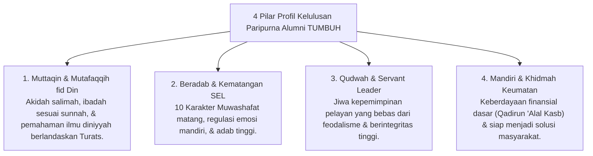

# P4-06-01: Profil Kelulusan Paripurna Alumni Pesantren TUMBUH

## Status Dokumen
* **Status**: 🌟 **A+ (Tervalidasi & Siap Diimplementasikan)**
* **Sub-Domain**: `04 Progression Framework / 06 Graduation Standards`
* **Penanggung Jawab Keilmuan**: Dewan Keilmuan TUMBUH (*Pakar Desain Kurikulum Adab & Pakar Filosofi TUMBUH*)

---

## 1. Konseptualisasi Graduate Profile Output

Profil Kelulusan Paripurna alumni pesantren ekosistem **TUMBUH** memetakan profil utuh lulusan yang mengintegrasikan aspek spiritualitas, kecerdasan intelektual, kematangan emosional, kemandirian hidup, serta komitmen pengabdian kepada keumatan.

---

## 2. Peta Capaian Alumni Melintasi Dimensi Triad Pertumbuhan

1. **Dimensi Santri (Individu)**: Menguasai regulasi diri utuh (*Mujahadatun Linafsih*), hafalan Qur'an teruji mutqin, dan wawasan sains/tsaqafah yang kritis.
2. **Dimensi Pendidik & Musyrif (Keteladanan)**: Alumni mampu menjadi teladan (*Qudwah*) di lingkungan baru, mengajar ilmu Al-Qur'an, dan memfasilitasi kebaikan.
3. **Dimensi Keumatan & Lembaga (Sistem)**: Alumni berperan sebagai agen perubahan sosial (*Social Change Agent*) yang membawa kemanfaatan luas (*Nafi'un Lighairih*).

---

## 3. Komitmen Alumni (Ikrar Alumni TUMBUH)

Sebelum dinyatakan lulus secara paripurna, setiap alumni merumuskan **Rencana Khidmah Mandiri (Post-Pesantren Action Plan)** yang berisi komitmen kontribusi positif bagi masyarakat dan negara selama 5 tahun ke depan.
