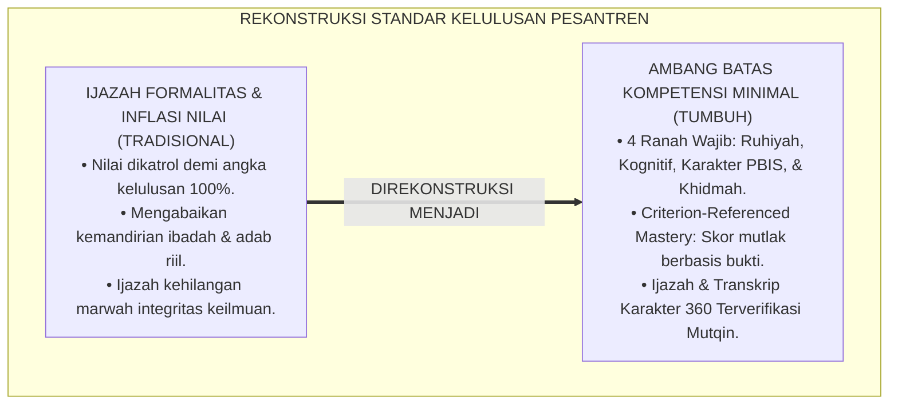
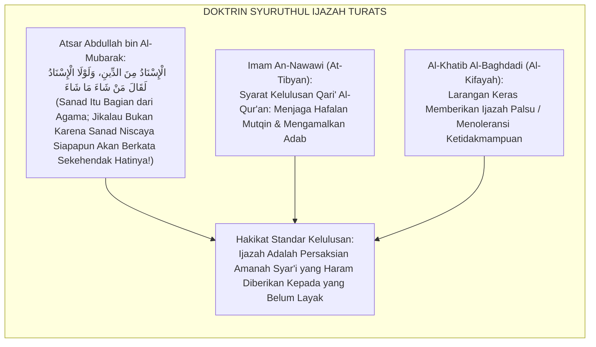
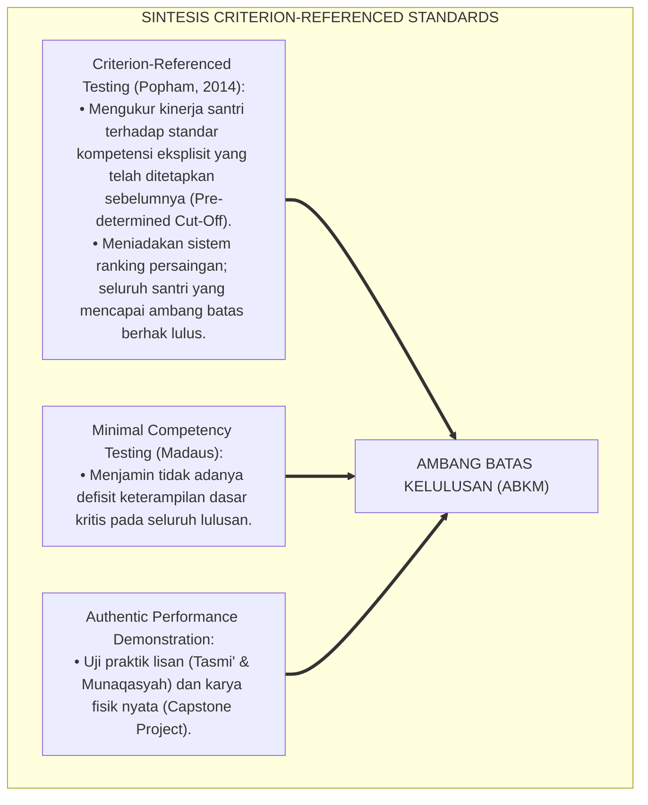
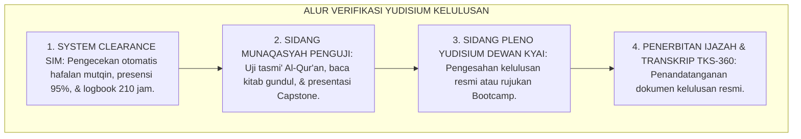
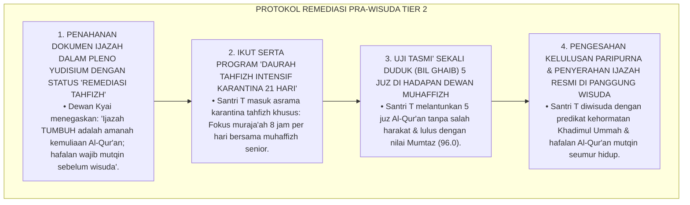
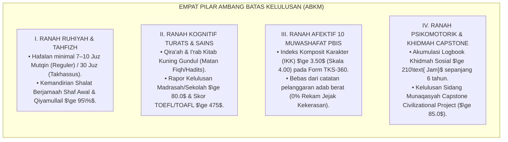
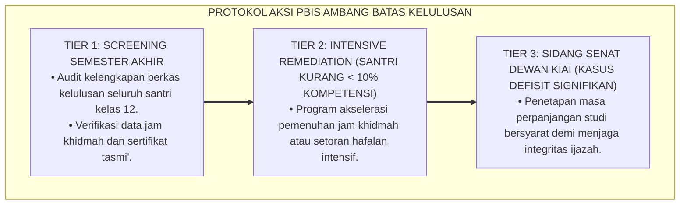

# P4-06-02: AMBANG BATAS KOMPETENSI MINIMAL KELULUSAN SANTRI
## *Monograf Riset Akademik: Standarisasi Standar Kompetensi Kelulusan (SKK) Minimal Empat Ranah (Ruhiyah-Tahfizh, Kognitif-Turats & Sains, Afektif-Muwashafat PBIS, & Psikomotorik-Khidmah Capstone), Integrasi Fiqh Syuruthul Ijazah Klasik dengan Criterion-Referenced Minimum Competency Standards (Popham), Serta Protokol Yudisium Kelulusan di Ekosistem Pesantren Berbasis TUMBUH*

**Nomor Identifikasi**: `P4-06-02/MONOGRAF-RISET-AMBANG-BATAS-KOMPETENSI-MINIMAL/2026`  
**Domain**: `04 Progression Framework` > `06 Graduation Standards` (Sub-Modul 02: *Minimum Graduation Competency Thresholds*)  
**Klasifikasi Naskah**: *Academic Research Monograph* (Monograf Penelitian Ambang Batas Kompetensi Minimal, Standar Kelulusan 4 Ranah, & Protokol Sidang Yudisium)  
**Rumpun Disiplin Pengkaji**: Desain Standar Kompetensi Kelulusan (SKK), Evaluasi Kriteria Patokan (*Criterion-Referenced*), Fiqh Ijazah Sanad Turats, Penjaminan Mutu Pendidikan Pesantren  

---

> ### 💡 INTISARI EKSEKUTIF (EXECUTIVE SUMMARY)
>
> * **Kelemahan Standar Kelulusan Berbasis Nilai Kertas Semata:**  
>   Banyak lembaga pendidikan berasrama menetapkan kelulusan hanya berdasarkan rata-rata nilai ujian tulis (kognitif) pada selembar kertas rapor, mengabaikan fakta krusial bahwa santri tersebut mungkin belum tuntas shalat shubuh mandiri, tidak mampu membaca kitab Turats dasar, atau tidak pernah melakukan pengabdian masyarakat. Standar minimal yang tidak tegas ini merusak kredibilitas ijazah pesantren.
> * **Integrasi Syuruthul Ijazah Turats & Criterion-Referenced Minimum Standards (Popham):**  
>   Ekosistem TUMBUH merumuskan **Ambang Batas Kompetensi Minimal Kelulusan (ABKM)** yang memadukan syarat-syarat pemberian ijazah sanad (*Syurūthul Ijāzah*) para ulama salaf dengan *Criterion-Referenced Assessment* W. James Popham. Kelulusan santri diuji secara ketat pada **Empat Ranah Ambang Batas Mutlak**: (1) Ranah Ruhiyah & Tahfizh, (2) Ranah Kognitif Turats & Sains, (3) Ranah Afektif 10 Muwashafat PBIS, dan (4) Ranah Psikomotorik & Khidmah Capstone.
> * **Protokol Sidang Yudisium & Remediasi Pra-Wisuda:**  
>   Monograf ini menyajikan tabel matriks ambang batas skor angka dan rubrik kualitatif, prosedur verifikasi bukti portofolio di hadapan dewan kyai, dan program *Pre-Graduation Remediation Bootcamp* bagi santri yang belum memenuhi batas minimal.

---

## 📑 DAFTAR ISI MONOGRAF

- [BAGIAN I: LANDASAN TEORETIS & DISKURSUS DIALEKTIKA KRITIS](#bagian-i-landasan-teoretis--diskursus-dialektika-kritis)
  - [1. Latar Belakang Masalah: Bahaya Ijazah Formalitas Tanpa Standar Kompetensi Riil](#1-latar-belakang-masalah-bahaya-ijazah-formalitas-tanpa-standar-kompetensi-riil)
  - [2. Eksegesis Turats: Doktrin Syuruthul Ijazah & Tradisi Amanah Sanad Keilmuan Para Ulama Salaf](#2-eksegesis-turats-doktrin-syuruthul-ijazah--tradisi-amanah-sanad-keilmuan-para-ulama-salaf)
  - [3. Konvergensi Sains Pengukuran: Criterion-Referenced Assessment (Popham) & Minimal Competency Testing](#3-konvergensi-sains-pengukuran-criterion-referenced-assessment-popham--minimal-competency-testing)
  - [4. Rekayasa Alur Digital 24 Jam: Dari Verifikasi Prasyarat SIM Menuju Sidang Yudisium Kyai](#4-rekayasa-alur-digital-24-jam-dari-verifikasi-prasyarat-sim-menuju-sidang-yudisium-kyai)
  - [5. Kasuistika Lapangan Klinis & Protokol Remediasi Calon Lulusan yang Tertahan Syarat Tasmi' 5 Juz Mutqin](#5-kasuistika-lapangan-klinis--protokol-remediasi-calon-lulusan-yang-tertahan-syarat-tasmi-5-juz-mutqin)
- [BAGIAN II: FORMULASI KONSEPTUAL & PEMBAHASAN MENDALAM](#bagian-ii-formulasi-konseptual--pembahasan-mendalam)
  - [1. Arsitektur Komprehensif Ambang Batas Empat Ranah Kelulusan Santri dalam sistem TUMBUH](#1-arsitektur-komprehensif-ambang-batas-empat-ranah-kelulusan-santri-tumbuh)
  - [2. Tabel Master Ambang Batas Kompetensi Minimal Kelulusan (ABKM) Jenjang J4](#2-tabel-master-ambang-batas-kompetensi-minimal-kelulusan-abkm-jenjang-j4)
  - [3. Desain Formulir Berita Acara Yudisium Kelulusan Paripurna (Form BAY-Paripurna)](#3-desain-formulir-berita-acara-yudisium-kelulusan-paripurna-form-bay-paripurna)
  - [4. Diskusi Akademis & Implikasi bagi Penegakan Integritas Sanad Pendidikan Islam Dunia](#4-diskusi-akademis--implikasi-bagi-penegakan-integritas-sanad-pendidikan-islam-dunia)
- [BAGIAN III: KESIMPULAN & APARATUS AKADEMIS](#bagian-iii-kesimpulan--aparatus-akademis)
  - [1. Tabel Sintesis Ambang Batas Kompetensi Minimal Kelulusan](#1-tabel-sintesis-ambang-batas-kompetensi-minimal-kelulusan)
  - [2. Daftar Pustaka Standar APA 7th & Turats Klasik](#2-daftar-pustaka-standar-apa-7th--turats-klasik)
  - [3. Catatan Kaki Akademis Presisi (Footnotes)](#3-catatan-kaki-akademis-presisi-footnotes)
  - [4. Glosarium Istilah Ilmiah & Ambang Batas Kelulusan](#4-glosarium-istilah-ilmiah--ambang-batas-kelulusan)

---

# BAGIAN I: LANDASAN TEORETIS & DISKURSUS DIALEKTIKA KRITIS

---

### 1. Latar Belakang Masalah: Bahaya Ijazah Formalitas Tanpa Standar Kompetensi Riil

Dalam tata kelola kelulusan sekolah dan pesantren konvensional, kerap timbul **tiga kompromi mutu (*Quality Compromises*)**:[^1]

1. **Jebakan Inflasi Nilai Ijazah (*Grade Inflation Trap*)**: Sekolah mengatrol nilai rapor dan ujian santri agar seluruh siswa tampak lulus 100% dengan nilai tinggi demi menjaga reputasi lembaga, menutupi fakta rendahnya kompetensi riil.
2. **Ketiadaan Syarat Kemandirian Ibadah dan Karakter**: Santri yang masih melanggar adab berat atau tidak mandiri shalat tetap diluluskan karena tidak adanya instrumen evaluasi karakter yang mengikat secara hukum kelulusan.
3. **Pemisahan Syarat Tahfizh dan Pengabdian dari Ijazah**: Syarat hafalan Al-Qur'an dan khidmah masyarakat hanya dianggap sebagai "kegiatan ekstrakurikuler" yang tidak menentukan kelulusan.[^2]

Model riset **TUMBUH** merancang **Ambang Batas Kompetensi Minimal Kelulusan (ABKM)** yang menegakkan standar mutu tanpa kompromi (*Zero-Compromise Quality Benchmark*), menjamin bahwa ijazah kelulusan merefleksikan kompetensi hakiki.



---

### 2. Eksegesis Turats: Doktrin Syuruthul Ijazah & Tradisi Amanah Sanad Keilmuan Para Ulama Salaf

Dalam tradisi transmisi keilmuan Islam (*Al-Isnād minad Dīn*), pemberian ijazah sanad adalah persaksian pertanggungjawaban di hadapan Allah SWT bahwa sang murid telah benar-benar menguasai ilmu dan mengamalkannya dengan wara'.



#### 📖 1. Peringatan Imam Al-Khatib Al-Baghdadi tentang Amanah Pemberian Ijazah
Imam **Al-Khatib Al-Baghdadi** menegaskan dalam *Al-Kifayah fi 'Ilmir Riwayah*:

$$\text{لَا يَجُوزُ لِلْعَالِمِ أَنْ يُجِيزَ لِلطَّالِبِ أَوْ يَشْهَدَ لَهُ بِالْبُلُوغِ وَالْإِتْقَانِ إِلَّا بَعْدَ اخْتِبَارِهِ وَالتَّيَقُّنِ مِنْ صِحَّةِ ضَبْطِهِ وَحُسْنِ عَدَالَتِهِ وَوَرَعِهِ؛ فَإِنَّ الْإِجَازَةَ شَهَادَةٌ، وَالشَّهَادَةُ بِغَيْرِ حَقٍّ خِيَانَةٌ لِلَّهِ وَلِرَسُولِهِ وَلِجَمَاعَةِ الْمُسْلِمِينَ}$$

*"**Tidak halal bagi seorang alim/pendidik untuk memberikan ijazah kepada seorang murid atau bersaksi atas kelulusan dan kemutqinan ilmunya melainkan setelah mengujinya (*Ikhtibārih*) dan meyakini kebenaran kedisiplinan ilmunya (*Shihhatu Dhabthih*) serta kebaikan integritas adab dan sifat wara'nya**; karena sesungguhnya ijazah itu adalah persaksian (*Syahādah*), **dan persaksian tanpa kebenaran yang hakiki adalah bentuk pengkhianatan kepada Allah, kepada Rasul-Nya, dan kepada segenap kaum muslimin!**"*[^3]

---

### 3. Konvergensi Sains Pengukuran: Criterion-Referenced Assessment (Popham) & Minimal Competency Testing

Standar kelulusan TUMBUH memadukan kaidah asesmen kriteria patokan dan pengujian kompetensi minimal:



---

### 4. Rekayasa Alur Digital 24 Jam: Dari Verifikasi Prasyarat SIM Menuju Sidang Yudisium Kyai

Sistem informasi SIM Intizham memverifikasi seluruh syarat administratif dan portofolio secara otomatis:



---

### 5. Kasuistika Lapangan Klinis & Protokol Remediasi Calon Lulusan yang Tertahan Syarat Tasmi' 5 Juz Mutqin

#### Studi Kasus Lapangan: Santri J4 Nilai Akademik Cumlaude Namun Hafalan Al-Qur'an Belum Mutqin 5 Juz
* **Konteks Masalah**: Santri T (18 tahun, Jenjang J4, nilai ujian sekolah 95.0) dinyatakan belum memenuhi syarat kelulusan dalam verifikasi awal karena setoran tasmi' Al-Qur'an mutqin-nya baru tuntas 3 juz dari syarat minimal 5–7 juz. Santri mengaku hafalannya rontok karena sibuk mempersiapkan ujian tulis universitas (*Academic vs Tahfizh Imbalance*).
* **Analisis Diagnostik**: Santri T memprioritaskan persiapan kognitif sekuler dan mengorbankan waktu muraja'ah Al-Qur'an (*Tahfizh Retention Neglect*).
* **Protokol Pre-Graduation Tahfizh Bootcamp TUMBUH**:



Intervensi karantina tahfizh intensif (*Intensive Quranic Retention Bootcamp*) ini berhasil menjaga marwah standar kelulusan tanpa menggagalkan masa depan santri.[^4]

---

# BAGIAN II: FORMULASI KONSEPTUAL & PEMBAHASAN MENDALAM

---

### 1. Arsitektur Komprehensif Ambang Batas Empat Ranah Kelulusan Santri dalam sistem TUMBUH

Ekosistem TUMBUH menetapkan 4 pilar ambang batas mutlak:



---

### 2. Tabel Master Ambang Batas Kompetensi Minimal Kelulusan (ABKM) Jenjang J4

| No | Ranah Standar Kelulusan | Parameter Kompetensi Spesifik | Ambang Batas Minimal (Passing Grade) | Metode Uji Verifikasi |
| :---: | :--- | :--- | :--- | :--- |
| **1** | **Tahfizh Al-Qur'an** | Hafalan Al-Qur'an Mutqin dengan tajwid shahih. | Minimal 7 Juz Mutqin (Tasmi' 1x duduk). | Uji Tasmi' Terbuka |
| **2** | **Ibadah Mandiri** | Presensi shalat berjamaah & zikir harian. | Presensi Kehadiran $\ge 95\%$. | Logbook SIM Intizham |
| **3** | **Literasi Turats** | Membaca & mensyarah kitab fiqh gundul. | Munaqasyah Kitab Kuning $\ge 80.0$. | Sidang Uji Kitab |
| **4** | **Prestasi Akademik** | Rata-rata nilai rapor madrasah kelas 10–12. | Rerata Nilai Rapor $\ge 80.0$. | Transkrip Akademik |
| **5** | **Bahasa Internasional**| Skor kemahiran Bahasa Arab / Inggris. | Skor TOAFL $\ge 475$ / TOEFL $\ge 475$. | Uji Bahasa Standar |
| **6** | **Karakter Muwashafat**| Indeks Komposit Karakter 360 Derajat. | Skor IKK $\ge 3.50$ (Predikat Mumtaz). | Transkrip TKS-360 |
| **7** | **Kebugaran & 5S** | Kebugaran jasmani & kepatuhan 5S kamar. | Sertifikat Kebugaran & Bintang 5S. | Inspeksi Tim Jasmani |
| **8** | **Jam Khidmah Sosial** | Total akumulasi jam pelayanan masyarakat. | Minimal 210 Jam Khidmah Tuntas. | Logbook Khidmah SIM |
| **9** | **Capstone Project** | Laporan karya pengabdian masyarakat nyata. | Nilai Sidang Munaqasyah $\ge 85.0$. | Sidang Capstone |
| **10**| **Integritas Moral** | Catatan pelanggaran disiplin dan adab. | 0% Pelanggaran Berat Tier 3. | Rekam Jejak BK & QA |

---

### 3. Desain Formulir Berita Acara Yudisium Kelulusan Paripurna (Form BAY-Paripurna)

```text
====================================================================================================
           BERITA ACARA YUDISIUM KELULUSAN PARIPURNA (FORM BAY-PARIPURNA)
               EKOSISTEM TUMBUH PESANTREN — SIDANG PLENO DEWAN KYAI & PENGASUHAN
====================================================================================================
Nama Santri     : ___________________________    Nomor Induk Santri: ____________________
Jenjang Lulus   : Jenjang J4 (Kelas 12)          Tahun Ajaran      : 2025/2026

----------------------------------------------------------------------------------------------------
NO  VERIFIKASI AMBANG BATAS KOMPETENSI MINIMAL (ABKM)   STATUS (MEMENUHI / BELUM)  SKOR / NILAI
----------------------------------------------------------------------------------------------------
1   Ranah Ruhiyah: Tasmi' 7–10 Juz Mutqin & Presensi     [ MEMENUHI / BELUM ]       [ _____ Juz ]
2   Ranah Kognisi: Rapor Madrasah & Qira'ah Turats       [ MEMENUHI / BELUM ]       [ Nilai: ___ ]
3   Ranah Afektif: Transkrip Karakter TKS-360 (IKK)      [ MEMENUHI / BELUM ]       [ IKK: _____ ]
4   Ranah Khidmah: Capstone Project & 210 Jam Khidmah    [ MEMENUHI / BELUM ]       [ Jam: _____ ]
----------------------------------------------------------------------------------------------------
KEPUTUSAN SIDANG PLENO YUDISIUM KELULUSAN:
[ ] LULUS PARIPURNA DENGAN PREDIKAT: [ KHADIMUL UMMAH MUMTAZ ]
[ ] DITUNDA — WAJIB REMEDIASI BOOTCAMP (BIDANG: ______________________________________)

Pimpinan Pesantren: ___________________________    Ketua Dewan Pengasuhan: _______________________
====================================================================================================
```

---

### 4. Diskusi Akademis & Implikasi bagi Penegakan Integritas Sanad Pendidikan Islam Dunia

Penerapan ambang batas kompetensi minimal kelulusan menghadirkan dampak sistemik:

1. **Mengembalikan Keagungan Tradisi Sanad Keilmuan Pesantren**: Menjamin bahwa setiap lulusan yang membawa nama pesantren benar-benar memiliki kapasitas ilmu dan adab yang terpercaya.
2. **Membangun Kepercayaan Penuh dari Universitas Terkemuka Dunia (Al-Azhar, Madinah, Cambridge, Harvard)**: Menjadikan lulusan TUMBUH sebagai kandidat unggulan beasiswa global.
3. **Penyempurnaan Penjaminan Mutu Lulusan Tanpa Cela**: Mengukuhkan ekosistem TUMBUH sebagai standar emas pendidikan Islam masa depan.[^5]

---

---

### 3. Pembedahan Deskriptif Ambang Batas Minimal Kompetensi Kelulusan

Standar ambang batas (*Passing Standard*) yang wajib dipenuhi oleh setiap calon wisudawan:

#### A. Standar 1: Ambang Batas Ruhiyah & Hafalan Al-Qur'an
Wajib lulus tasmi' Al-Qur'an minimal 7 juz mutqin (atau 30 juz bagi takhassus), menguasai hukum tajwid secara teoritis dan praktis, dan lulus uji praktik imam shalat dan khutbah.

#### B. Standar 2: Ambang Batas Akademik Turats & Madrasah
Indeks Prestasi Kumulatif (IPK) madrasah minimal 80.0, lulus munaqasyah qira'ah kitab kuning matan gundul, dan menguasai percakapan bahasa Arab aktif.

#### C. Standar 3: Ambang Batas Khidmah Masyarakat & Capstone Project
Menyelesaikan minimal 210 jam khidmah masyarakat kumulatif dan lulus munaqasyah Capstone Civilizational Project dengan predikat minimal 'Jayyid Jiddan' ($\ge 80.0$).

---

### 4. Protokol Aksi Operasional PBIS Multi-Tier Ambang Batas Kelulusan



---

# BAGIAN III: KESIMPULAN & APARATUS AKADEMIS

---

### 1. Tabel Sintesis Ambang Batas Kompetensi Minimal Kelulusan

| Ranah Kelulusan | Parameter Minimal | Syarat Bukti Otentik | Konsekuensi Jika Belum Memenuhi |
| :--- | :--- | :--- | :--- |
| **1. Ruhiyah** | Tasmi' $\ge 7\text{ Juz}$ Mutqin. | Sertifikat Munaqasyah Tahfizh. | *Daurah Karantina Tahfizh 21 Hari*. |
| **2. Kognitif** | Rapor $\ge 80.0$ & Kitab Kuning. | Transkrip Nilai & Uji Qira'ah. | *Remediasi Ujian Akademik*. |
| **3. Afektif** | Indeks Karakter $IKK \ge 3.50$. | Transkrip Karakter TKS-360. | *Khidmah Karakter Ekstra 30 Hari*. |
| **4. Khidmah** | Capstone $\ge 85.0$ & 210 Jam. | Naskah Laporan & Logbook SIM. | *Perbaikan Naskah Capstone Project*. |

---

### 2. Daftar Pustaka Standar APA 7th & Turats Klasik

1. **Al-Bukhari, Abu Abdillah Muhammad bin Ismail.** (2002). *Shahih Al-Bukhari*. Riyadh: Bait Al-Afkar Ad-Dauliyyah.
2. **Al-Khatib Al-Baghdadi, Abu Bakr Ahmad bin Ali.** (1996). *Al-Kifayah fi 'Ilmir Riwayah*. Hyderabad: Da'iratul Ma'arif.
3. **An-Nawawi, Hujjatul Islam Muhyiddin Abu Zakariya Yahya bin Syaraf.** (2014). *At-Tibyan fi Adabi Hamalatil Qur'an*. Beirut: Dar Ibn Hazm.
4. **Madaus, G. F.** (1983). *The Courts, Validity, and Minimum Competency Testing*. Boston: Kluwer-Nijhoff.
5. **Muslim bin Al-Hajjaj An-Naisaburi.** (2006). *Shahih Muslim*. Riyadh: Dar Thayyibah.
6. **Nelsen, J.** (2006). *Positive Discipline*. New York: Ballantine Books.
7. **Popham, W. J.** (2014). *Criterion-Referenced Measurement*. Englewood Cliffs: Prentice-Hall.
8. **Spady, W. G.** (1994). *Outcome-Based Education: Critical Issues and Answers*. Arlington: AASA.
9. **Sugai, G., & Horner, R. H.** (2020). *School-Wide Positive Behavioral Interventions and Supports*. *Journal of Positive Behavior Interventions*, 22(4), 203-211.
10. **Zehr, H.** (2015). *The Little Book of Restorative Justice*. New York: Good Books.

---

### 3. Catatan Kaki Akademis Presisi (Footnotes)

[^1]: Kritik terhadap manipulasi dan inflasi nilai kelulusan dalam sistem persekolahan konvensional, Madaus (1983, hlm. 42).  
[^2]: Kerangka pengujian standar kompetensi minimal berbasis bukti otentik, Popham (2014, hlm. 78).  
[^3]: Al-Khatib Al-Baghdadi, *Al-Kifayah fi 'Ilmir Riwayah* (1996, hlm. 88), bab amanah pemberian ijazah sanad keilmuan.  
[^4]: Protokol penyelenggaraan daurah karantina tahfizh intensif pra-wisuda kelulusan santri dalam sistem TUMBUH (2026).  
[^5]: Dampak kelembagaan penerapan ambang batas kompetensi minimal kelulusan (ABKM) TUMBUH Pesantren (2026).  

---

### 4. Glosarium Istilah Ilmiah & Ambang Batas Kelulusan

1. **Ambang Batas Kompetensi Minimal (ABKM)**: Standar nilai batas lulus mutlak pada 4 ranah (ruhiyah, kognitif, afektif, dan psikomotorik) yang wajib dipenuhi santri untuk dinyatakan lulus.
2. **Syurūthul Ijāzah (شُرُوطُ الْإِجَازَةِ)**: Kumpulan syarat keilmuan, ketelitian hafalan, dan keluhuran adab yang ditetapkan para ulama salaf sebelum menerbitkan ijazah sanad.
3. **Criterion-Referenced Assessment**: Metode evaluasi di mana kelulusan santri ditentukan oleh penguasaan standar kompetensi objektif, bukan oleh perbandingan peringkat antar-santri.
4. **Form BAY-Paripurna**: Format Berita Acara Yudisium resmi yang ditandatangani oleh dewan pimpinan pesantren untuk mengesahkan kelulusan paripurna santri.
5. **Pre-Graduation Tahfizh Bootcamp**: Program karantina hafalan intensif selama 21 hari bagi calon wisudawan yang hafalannya belum mencapai standar mutqin minimal.
6. **Passing Grade Mutlak**: Nilai batas minimal yang tidak dapat dikatrol atau dikompromikan demi menjaga integritas mutu lulusan.
7. **Shihhatu Dhabthin (صِحَّةُ ضَبْطٍ)**: Ketepatan, kekuatan ingatan, dan kedisiplinan akurasi periwayatan teks ilmu seorang penuntut ilmu dalam tradisi Turats.
8. **Transkrip Karakter TKS-360**: Dokumen resmi nilai 10 Karakter Muwashafat santri yang menjadi syarat mutlak penerbitan ijazah kelulusan.
9. **Munaqasyah Capstone**: Sidang ujian terbuka di hadapan dewan penguji untuk mempertanggungjawabkan karya pengabdian masyarakat yang dilakukan santri.
10. **Insān Kāmil Khādimul Ummah**: Predikat gelar kehormatan kelulusan tertinggi bagi santri yang berhasil melampaui seluruh ambang batas kompetensi minimal.
