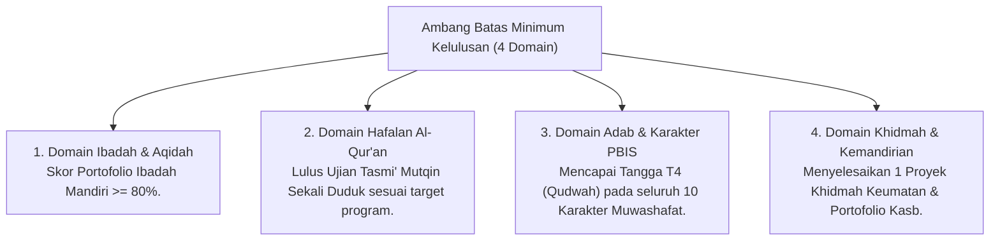

# P4-06-02: Ambang Batas Kompetensi Minimal Kelulusan Santri

## Status Dokumen
* **Status**: 🌟 **A+ (Tervalidasi & Siap Diimplementasikan)**
* **Sub-Domain**: `04 Progression Framework / 06 Graduation Standards`
* **Penanggung Jawab Keilmuan**: Dewan Keilmuan TUMBUH (*Pakar Metodologi Riset & Pakar Desain Kurikulum Adab*)

---

## 1. Konseptualisasi Ambang Batas Minimum (Minimum Competency Threshold)

Ambang Batas Minimum Kelulusan menetapkan kriteria mutlak yang harus dipenuhi oleh setiap santri sebelum dinyatakan **Lulus Paripurna** dari lembaga pendidikan pesantren ekosistem **TUMBUH**.

---

## 2. Matriks Detail Syarat Kelulusan Santri

| Domain Kompetensi | Standar Minimum Kelulusan | Metode & Instrumen Pengujian |
| :--- | :--- | :--- |
| **Aqidah & Fiqih Ibadah** | Menguasai fiqih ibadah harian (*Safinatun Naja / Taqrib*) & aqidah salimah bebas syirik. | Ujian Komprehensif Praktik Ibadah & Lisan. |
| **Hafalan Al-Qur'an & Tajwid** | Lulus tasmi' mutqin sesuai target jenjang (5/10/30 Juz) dengan kesalahan $< 2$ per juz. | Majlis Tasmi' Al-Qur'an Sekali Duduk di Hadapan Penguji. |
| **Karakter & Tangga TUMBUH** | Terverifikasi berada pada Tangga T4 (Kemandirian & Keteladanan Qudwah). | Sidang Triangulasi Logbook PBIS Musyrif, BK, & Peer. |
| **Khidmah Keumatan** | Mengeksekusi & mempresentasikan proyek khidmah masyarakat (min. 40 jam pelayanan). | Laporan & Presentasi Proyek Pengabdian Masyarakat. |
| **Kemandirian Finansial (*Kasb*)** | Menyusun perencanaan keuangan pribadi & portofolio proyek wirausaha sederhana. | Penilaian Portofolio *Qadirun 'Alal Kasb*. |

---

## 3. SOP Penanganan Santri Belum Memenuhi Ambang Batas

Santri yang belum memenuhi salah satu indikator ambang batas minimum mendapatkan **Masa Pemantapan Khidmah (1–3 Bulan)**:
- Diberikan pembimbingan khusus dalam aspek yang belum tuntas tanpa menahan hak akademik sekolah umum.
- Setelah memenuhi target pemantapan, santri secara resmi diberikan Ijazah Paripurna TUMBUH.
