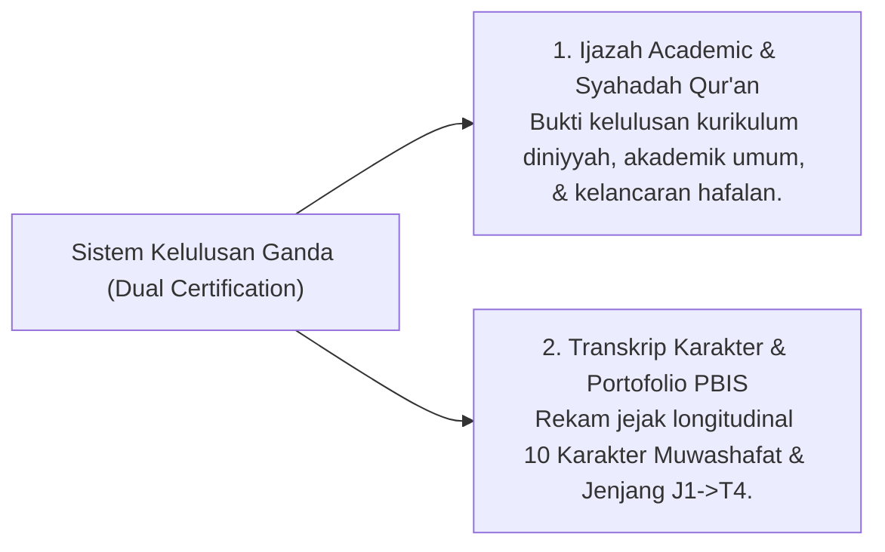

# P4-06-03: Sistem Sertifikasi dan Transkrip Karakter PBIS Santri

## Status Dokumen
* **Status**: 🌟 **A+ (Tervalidasi & Siap Diimplementasikan)**
* **Sub-Domain**: `04 Progression Framework / 06 Graduation Standards`
* **Penanggung Jawab Keilmuan**: Dewan Keilmuan TUMBUH (*Pakar Arsitektur Digital Pesantren & Pakar Metodologi Riset*)

---

## 1. Konseptualisasi Dual Certification System

Lembaga pendidikan ekosistem **TUMBUH** memelopori **Dual Certification System**, di mana setiap kelulusan santri dibekali dua jenis dokumen resmi:

---

## 2. Struktur Isi Transkrip Karakter PBIS

Transkrip Karakter PBIS diterbitkan berbasis data logbook digital longitudinal yang memuat:

1. **Indeks Capaian 10 Karakter Muwashafat**: Nilai kualitatif kinerjanya pada tiap karakter (*Salimul Aqidah, Shahihul Ibadah, Matinul Khuluq, dll.*).
2. **Rekam Tangga Perkembangan**: Catatan riwayat transisi santri dari T1 (Adaptasi), T2 (Habituasi), T3 (Internalisasi), hingga T4 (Qudwah).
3. **Catatan Portofolio Kepemimpinan & Khidmah**: Ringkasan proyek pengabdian masyarakat, peran organisasi santri, dan keahlian *Qadirun 'Alal Kasb*.

---

## 3. Spesifikasi Validasi Digital & QR-Code Verification

- **Keamanan Data & Anti-Pemalsuan**: Transkrip Karakter PBIS dilengkapi dengan **QR-Code Verification** yang terhubung ke database terenkripsi pesantren.
- **Kemanfaatan Post-Pesantren**: Transkrip Karakter ini berguna sebagai surat rekomendasi adab untuk melamar beasiswa perguruan tinggi, mendaftar perguruan tinggi luar negeri, maupun dunia kerja.
