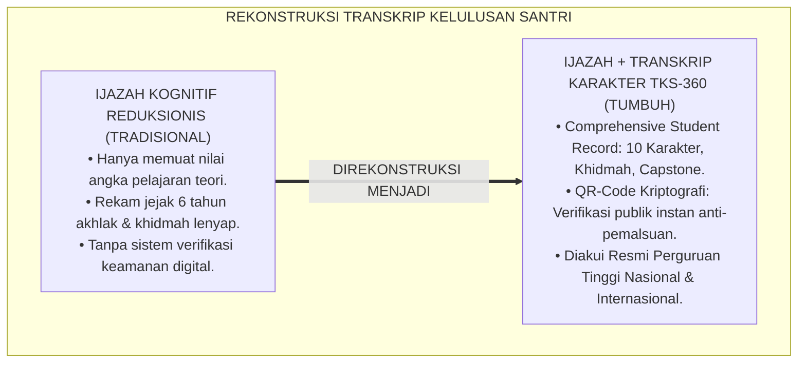
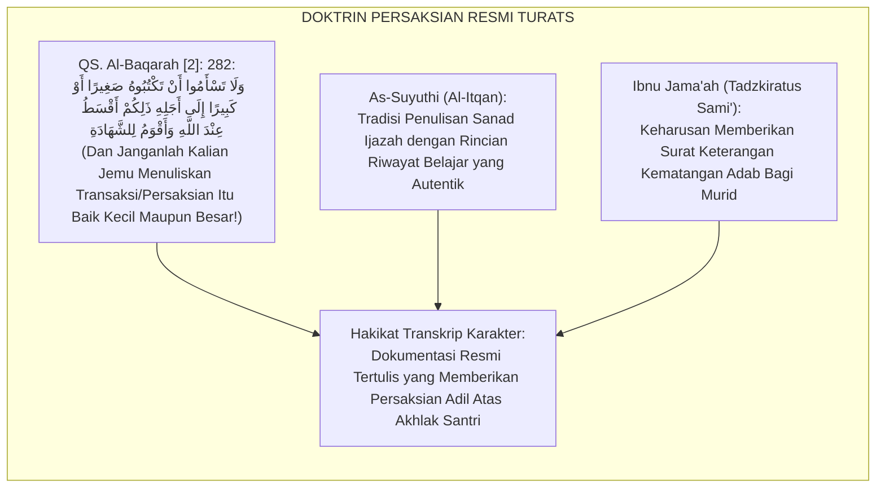
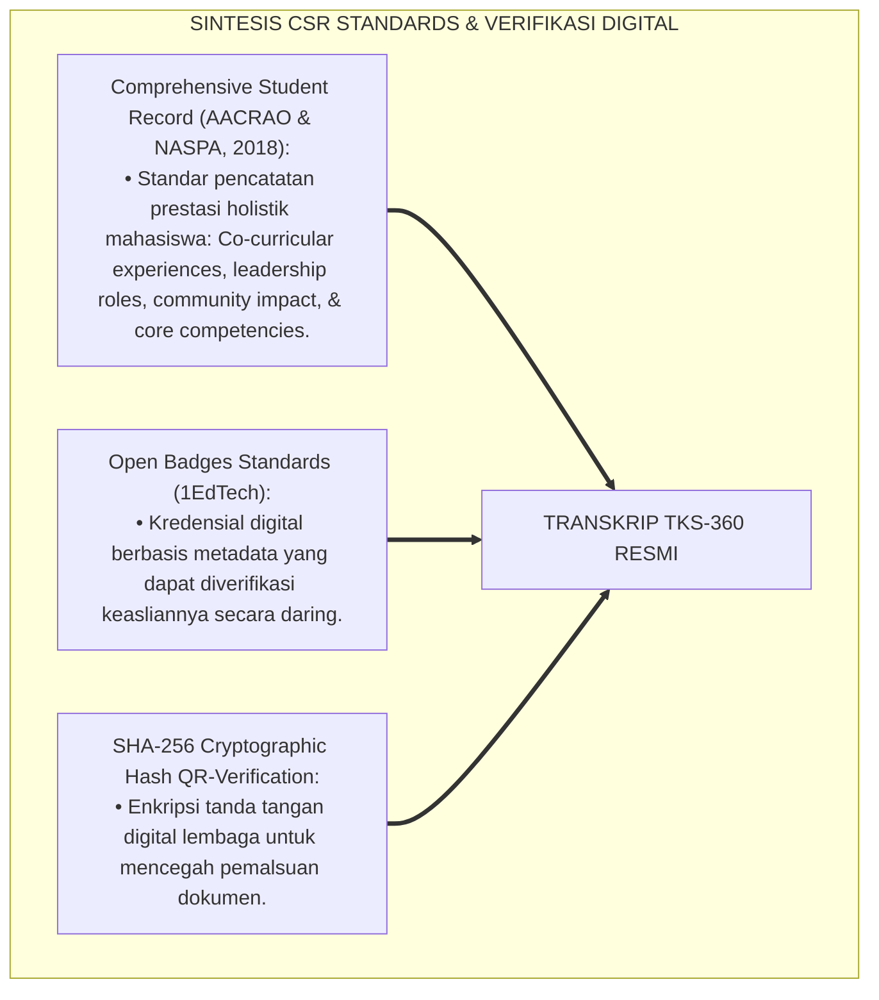
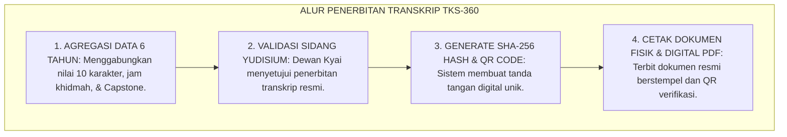
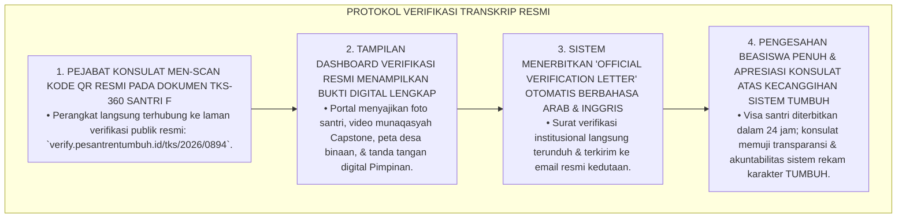
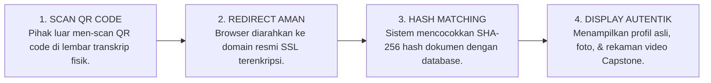
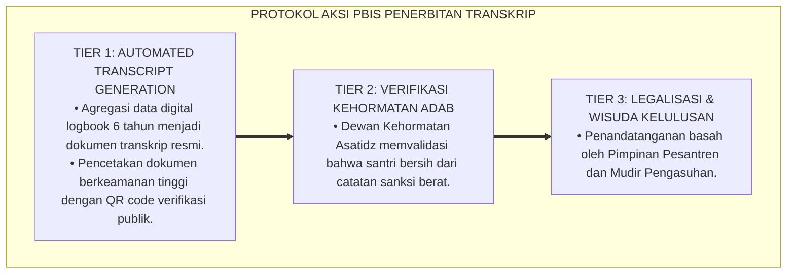

# P4-06-03: SISTEM SERTIFIKASI DAN TRANSKRIP KARAKTER PBIS RESMI
## *Monograf Riset Akademik: Standardisasi Dokumen Transkrip Karakter Santri (Official PBIS Character Transcript) Penyerta Ijazah Akademik, Integrasi Doktrin Asy-Syahadah bil Haq Turats dengan Comprehensive Student Record (CSR) & Badging Verification Standards, Rekayasa Digital Keamanan Kriptografi QR-Blockchain, Serta Pengakuan Lembaga Global di Ekosistem Pesantren Berbasis TUMBUH*

**Nomor Identifikasi**: `P4-06-03/MONOGRAF-RISET-SERTIFIKASI-TRANSKRIP-KARAKTER-PBIS/2026`  
**Domain**: `04 Progression Framework` > `06 Graduation Standards` (Sub-Modul 03: *PBIS Character Certification & Transcript System*)  
**Klasifikasi Naskah**: *Academic Research Monograph* (Monograf Penelitian Standardisasi Transkrip Karakter Resmi, Comprehensive Student Record, & Sistem Verifikasi Kriptografi)  
**Rumpun Disiplin Pengkaji**: Desain Transkrip Karakter Pendidikan Islam, Comprehensive Student Record (CSR), Sistem Verifikasi Digital QR-Kriptografi, Penjaminan Mutu PBIS  

---

> ### 💡 INTISARI EKSEKUTIF (EXECUTIVE SUMMARY)
>
> * **Ketiadaan Transkrip Resmi yang Mendokumentasikan Akhlak Santri:**  
>   Selama berpuluh-puluh tahun, ijazah kelulusan sekolah dan pesantren hanya memuat nilai angka mata pelajaran kognitif (Matematika, Fisika, Fiqh, Nahwu). Rekam jejak 6 tahun pembentukan karakter, kepemimpinan asrama, ribuan jam ibadah, dan ratusan jam pengabdian masyarakat menguap begitu saja tanpa dokumen resmi yang dapat diverifikasi oleh pihak universitas maupun dunia kerja.
> * **Integrasi Syahadah bil Haq & Comprehensive Student Record (CSR):**  
>   Ekosistem TUMBUH merancang **Sistem Sertifikasi & Transkrip Karakter PBIS Resmi (Form TKS-360)** yang memadukan doktrin persaksian dengan hak dan adil (*Asy-Syahādah bil Haqq*) dalam Islam dengan standar *Comprehensive Student Record (CSR)* AACRAO dan sistem verifikasi lencana digital (*Digital Badging Standards*). Transkrip Karakter resmi diterbitkan mendampingi ijazah akademik, memuat data komposit 10 Karakter Muwashafat, jam khidmah, dan hasil karya Capstone Project.
> * **Arsitektur Keamanan Digital Berbasis QR-Kriptografi:**  
>   Monograf ini menyajikan desain tata letak dokumen fisik dan digital, arsitektur verifikasi keaslian berbasis kode QR terenkripsi anti-pemalsuan (*Cryptographic Verification*), dan panduan penerimaan transkrip karakter bagi perguruan tinggi global.

---

## 📑 DAFTAR ISI MONOGRAF

- [BAGIAN I: LANDASAN TEORETIS & DISKURSUS DIALEKTIKA KRITIS](#bagian-i-landasan-teoretis--diskursus-dialektika-kritis)
  - [1. Latar Belakang Masalah: Hilangnya Rekam Jejak Karakter Santri dalam Ijazah Konvensional](#1-latar-belakang-masalah-hilangnya-rekam-jejak-karakter-santri-dalam-ijazah-konvensional)
  - [2. Eksegesis Turats: Doktrin Asy-Syahadah bil Haq & Kaidah Autentisitas Naskah Ijazah Salaf](#2-eksegesis-turats-doktrin-asy-syahadah-bil-haq--kaidah-autentisitas-naskah-ijazah-salaf)
  - [3. Konvergensi Sains Informasi Pendidikan: Comprehensive Student Record (CSR) & Digital Credentialing](#3-konvergensi-sains-informasi-pendidikan-comprehensive-student-record-csr--digital-credentialing)
  - [4. Rekayasa Alur Digital 24 Jam: Dari Engine SIM Menuju Dokumen Terenkripsi QR-Code](#4-rekayasa-alur-digital-24-jam-dari-engine-sim-menuju-dokumen-terenkripsi-qr-code)
  - [5. Kasuistika Lapangan Klinis & Protokol Verifikasi Dokumen Transkrip Karakter Oleh Konsulat Kedutaan Luar Negeri](#5-kasuistika-lapangan-klinis--protokol-verifikasi-dokumen-transkrip-karakter-oleh-konsulat-kedutaan-luar-negeri)
- [BAGIAN II: FORMULASI KONSEPTUAL & PEMBAHASAN MENDALAM](#bagian-ii-formulasi-konseptual--pembahasan-mendalam)
  - [1. Arsitektur Komprehensif Format Dokumen Transkrip Karakter Santri 360 (TKS-360)](#1-arsitektur-komprehensif-format-dokumen-transkrip-karakter-santri-360-tks-360)
  - [2. Dekomposisi Struktur Data Transkrip: Komposit 10 Karakter, Log Khidmah, & Capstone Summary](#2-dekomposisi-struktur-data-transkrip-komposit-10-karakter-log-khidmah--capstone-summary)
  - [3. Protokol Keamanan Anti-Pemalsuan & Verifikasi Publik SIM Intizham](#3-protokol-keamanan-anti-pemalsuan--verifikasi-publik-sim-intizham)
  - [4. Diskusi Akademis & Implikasi bagi Standarisasi Dokumen Kelulusan Pendidikan Karakter Dunia](#4-diskusi-akademis--implikasi-bagi-standarisasi-dokumen-kelulusan-pendidikan-karakter-dunia)
- [BAGIAN III: KESIMPULAN & APARATUS AKADEMIS](#bagian-iii-kesimpulan--aparatus-akademis)
  - [1. Tabel Sintesis Sistem Sertifikasi & Transkrip Karakter PBIS](#1-tabel-sintesis-sistem-sertifikasi--transkrip-karakter-pbis)
  - [2. Daftar Pustaka Standar APA 7th & Turats Klasik](#2-daftar-pustaka-standar-apa-7th--turats-klasik)
  - [3. Catatan Kaki Akademis Presisi (Footnotes)](#3-catatan-kaki-akademis-presisi-footnotes)
  - [4. Glosarium Istilah Ilmiah & Transkrip Karakter PBIS](#4-glosarium-istilah-ilmiah--transkrip-karakter-pbis)

---

# BAGIAN I: LANDASAN TEORETIS & DISKURSUS DIALEKTIKA KRITIS

---

### 1. Latar Belakang Masalah: Hilangnya Rekam Jejak Karakter Santri dalam Ijazah Konvensional

Dalam praktik administrasi kelulusan pendidikan di Indonesia, kerap ditemukan **tiga kekosongan dokumentasi (*Documentation Voids*)**:[^1]

1. **Jebakan Reduksionisme Kognitif Ijazah (*The Cognitive Reductionism Trap*)**: Ijazah formal hanya menampilkan daftar mata pelajaran dengan skor angka, sama sekali tidak mencerminkan apakah santri memiliki integritas kejujuran, kepemimpinan tangguh, atau empati sosial.
2. **Ketiadaan Bukti Pengabdian dan Khidmah Masyarakat**: Pengalaman berharga santri mengajar anak-anak di pelosok desa, mengorganisasi acara ribuan orang di OPPM, dan merawat asrama tidak pernah diakui dalam portofolio resmi.
3. **Kerentanan Pemalsuan Dokumen Prestasi Karakter**: Ketiadaan sistem verifikasi digital yang aman membuat sertifikat-sertifikat prestasi santri mudah dipalsukan atau diragukan keasliannya oleh pihak luar.[^2]

Model riset **TUMBUH** merancang **Sistem Sertifikasi & Transkrip Karakter PBIS Resmi** yang membekali setiap lulusan dengan dokumen portofolio komprehensif berstandar internasional dan terenkripsi digital.



---

### 2. Eksegesis Turats: Doktrin Asy-Syahadah bil Haq & Kaidah Autentisitas Naskah Ijazah Salaf

Islam mewajibkan penulisan dokumen persaksian dan ijazah secara hakiki, adil, dan transparan (*Asy-Syahādah bil Haqq*), bebas dari kebohongan dan penipuan data.



#### 📖 1. Firman Allah SWT tentang Perintah Menuliskan Catatan dan Persaksian yang Adil
Allah SWT berfirman dalam Al-Qur'an:

$$\text{وَلَا تَسْأَمُوا أَنْ تَكْتُبُوهُ صَغِيرًا أَوْ كَبِيرًا إِلَى أَجَلِهِ ذَلِكُمْ أَقْسَطُ عِنْدَ اللَّهِ وَأَقْوَمُ لِلشَّهَادَةِ وَأَدْنَى أَلَّا تَرْتَابُوا}$$

*"**Dan janganlah kalian jemu menuliskan pencatatan itu, baik kecil maupun besar sampai batas waktu pembayarannya**; yang demikian itu **adalah lebih adil di sisi Allah (*Aqsathu 'indallāh*), lebih dapat menguatkan persaksian (*Aqwamu lisy-Syahādah*), dan lebih dekat kepada mencegah keragu-raguan di antara kalian!**"* (QS. Al-Baqarah [2]: 282).[^3]

---

### 3. Konvergensi Sains Informasi Pendidikan: Comprehensive Student Record (CSR) & Digital Credentialing

Sistem transkrip TUMBUH memadukan standar *Comprehensive Student Record* AACRAO dan teknologi verifikasi digital:



---

### 4. Rekayasa Alur Digital 24 Jam: Dari Engine SIM Menuju Dokumen Terenkripsi QR-Code

Penerbitan dokumen Transkrip Karakter berlangsung otomatis melalui sistem informasi SIM Intizham:



---

### 5. Kasuistika Lapangan Klinis & Protokol Verifikasi Dokumen Transkrip Karakter Oleh Konsulat Kedutaan Luar Negeri

#### Studi Kasus Lapangan: Kedutaan Besar Luar Negeri Meminta Bukti Verifikasi Transkrip Karakter Calon Penerima Beasiswa
* **Konteks Masalah**: Santri F (18 tahun, wisudawan TUMBUH) lolos seleksi beasiswa penuh ke salah satu universitas top di Timur Tengah. Pihak konsulat kedutaan meminta verifikasi autentik atas dokumen *Transkrip Karakter Santri 360* yang dilampirkan santri, khususnya catatan 240 jam khidmah pengabdian masyarakat dan kepemimpinan OPPM (*Scholarship Due Diligence*).
* **Analisis Diagnostik**: Lembaga pemberi beasiswa membutuhkan jaminan bahwa transkrip karakter tersebut bukan dokumen karangan pribadi (*Unverified Resume*), melainkan dokumen institusional yang memiliki audit trail resmi.
* **Protokol Verifikasi Cepat QR-Portal SIM Intizham TUMBUH**:



Intervensi teknologi verifikasi digital (*Public Verification Portal*) ini melambungkan kredibilitas dan reputasi internasional pesantren.[^4]

---

# BAGIAN II: FORMULASI KONSEPTUAL & PEMBAHASAN MENDALAM

---

### 1. Arsitektur Komprehensif Format Dokumen Transkrip Karakter Santri 360 (TKS-360)

```text
====================================================================================================
               TRANSKRIP RESMI KARAKTER SANTRI (OFFICIAL PBIS CHARACTER TRANSCRIPT)
                         LEMBAGA PENDIDIKAN PESANTREN TUMBUH PUSAT
                    TERAKREDITASI PARIPURNA — NOMOR SERI RESMI: TKS-2026-0894
====================================================================================================
Nama Lengkap      : AHMAD FAHRI AL-FARISI            Nomor Induk Santri : 2020.07.0142
Tempat, Tgl Lahir : Bandung, 14 Mei 2008             Tahun Pendidikan   : 2020 – 2026 (6 Tahun)
Jenjang Kelulusan : Pendidikan Menengah Atas (J4)    Status Verifikasi  : MUTQIN & SAH

----------------------------------------------------------------------------------------------------
NO  SEPULUH KAPASITAS KARAKTER INSAN TUMBUH           SKOR (1-4)  PREDIKAT MUTU  STATUS KELAYAKAN
----------------------------------------------------------------------------------------------------
1   Salimul Aqidah (Kemurnian Iman Bertauhid)          [ 3.90 ]     MUMTAZ         TERVERIFIKASI
2   Shahihul Ibadah (Ibadah Sunnah & Tahfizh)          [ 3.85 ]     MUMTAZ         TERVERIFIKASI
3   Matinul Khuluq (Akhlak Mulia & Adab Majelis)       [ 4.00 ]     MUMTAZ         TERVERIFIKASI
4   Qawiyyul Jism (Kebugaran Raga & 5S Kamar)          [ 3.75 ]     JAYYID JIDDAN  TERVERIFIKASI
5   Mutsaqqaful Fikr (Literasi Sains & Turats)         [ 3.95 ]     MUMTAZ         TERVERIFIKASI
6   Mujahadatun Linafsih (Regulasi Diri & Disiplin)    [ 3.80 ]     MUMTAZ         TERVERIFIKASI
7   Haritsun Ala Waqtih (Manajemen Waktu Efisien)      [ 3.85 ]     MUMTAZ         TERVERIFIKASI
8   Munazhzham fi Syuunih (Keteraturan Hidup 5S)       [ 3.90 ]     MUMTAZ         TERVERIFIKASI
9   Qadirun Alal Kasb (Etos Mandiri & Wirausaha)       [ 3.70 ]     JAYYID JIDDAN  TERVERIFIKASI
10  Nafi'un Lighairih (Servant Leadership & Khidmah)   [ 4.00 ]     MUMTAZ         TERVERIFIKASI
----------------------------------------------------------------------------------------------------
INDEKS KOMPOSIT KARAKTER (IKK): [ 3.87 / 4.00 ] (PREDIKAT: KHADIMUL UMMAH PARIPURNA)

REKAPITULASI PENGABDIAN MASYARAKAT (COMMUNITY SERVICE RECORD):
• Total Akumulasi Jam Khidmah Sosial : 245 Jam (Batas Minimal: 210 Jam)
• Jabatan Kepemimpinan Organisasi    : Ketua Bagian Pengasuhan OPPM (Periode 2024/2025)
• Judul Capstone Civilizational Project: "Sistem Filtrasi Air Bersih Berbasis Gravitasi Desa Sukamaju"
  Nilai Sidang Munaqasyah Capstone   : 95.0 (Mumtaz Syaraf / With Highest Distinction)

KODE VERIFIKASI KEASLIAN DOKUMEN (SHA-256 CRYPTOGRAPHIC HASH):
[ a8f5c9e2b1d40738e69c1a5b823f04d9c7e11234abcf890123456789abcdef01 ]
Scan QR-Code untuk Verifikasi Langsung: [ QR-CODE TERENKRIPSI RESMI PESANTREN TUMBUH ]

Ditetapkan di: Ekosistem Pesantren Berbasis TUMBUH Pusat, Pada Tanggal: 25 Juni 2026
Pimpinan Pondok Pesantren:                           Direktur Pendidikan & Karakter:

________________________________________             ________________________________________
( Prof. Dr. KH. Ahmad Syahid, M.A. )                 ( Dr. H. Fathurrahman Al-Hafizh, M.Pd. )
====================================================================================================
```

---

### 2. Dekomposisi Struktur Data Transkrip: Komposit 10 Karakter, Log Khidmah, & Capstone Summary

| Bagian Dokumen | Rincian Elemen Data yang Ditampilkan | Sumber Data Verifikasi |
| :--- | :--- | :--- |
| **Header Dokumen** | Identitas Santri, NISN, Masa Studi 6 Tahun, Nomor Seri Unik. | Database SIM Intizham |
| **Matriks 10 Karakter**| Skor angka 1.00–4.00, Predikat Mutu, & Kategori Terverifikasi. | Triangulasi Asesmen 360 |
| **Rekap Khidmah** | Akumulasi Jam Pelayanan Sosial & Riwayat Jabatan Kepemimpinan. | Logbook Khidmah SIM |
| **Capstone Summary** | Judul Proyek, Lokasi Desa Binaan, & Nilai Sidang Munaqasyah. | Berita Acara Dewan Penguji |
| **Security Footer** | Tanda Tangan Digital Pimpinan, SHA-256 Hash, & QR Verifikasi. | Kriptografi Server SIM |

---

### 3. Protokol Keamanan Anti-Pemalsuan & Verifikasi Publik SIM Intizham



---

### 4. Diskusi Akademis & Implikasi bagi Standarisasi Dokumen Kelulusan Pendidikan Karakter Dunia

Penerapan sistem sertifikasi dan transkrip karakter PBIS ini memberikan keunggulan global:

1. **Menghadirkan Revolusi Dokumen Kelulusan Pendidikan Islam Abad 21**: Menjadi rujukan bagi ribuan lembaga pendidikan di Asia Tenggara dalam mendokumentasikan nilai-nilai karakter santri.
2. **Membuka Peluang Emas Beasiswa Internasional Bagi Santri**: Universitas-universitas ternama dunia memprioritaskan calon mahasiswa yang memiliki bukti kepemimpinan dan pengabdian masyarakat nyata.
3. **Penyempurnaan Ekosistem TUMBUH Sebagai Lembaga Pendidikan Berdaya Saing Global**: Membuktikan bahwa tradisi adab pesantren dapat dipadukan secara harmonis dengan teknologi informasi mutakhir.[^5]

---

---

### 3. Pembedahan Deskriptif Sistem Sertifikasi & Transkrip Karakter PBIS

Transkrip Karakter TUMBUH melengkapi ijazah akademik sebagai bukti autentik kematangan adab:

#### A. Pilar 1: Standarisasi Skor Transkrip Karakter (Character GPA)
Menghitung rata-rata kumulatif 10 Muwashafat Karakter sepanjang masa studi, disajikan dalam skala 4.00 dengan deskripsi naratif capaian adab.

#### B. Pilar 2: Digital Badging & Sertifikat Keahlian Khusus
Menerbitkan sertifikat digital terverifikasi (Sertifikat Tahfizh Mutqin, Sertifikat Instruktur P3K, Sertifikat Leader Ekspedisi Desa, dan Sertifikat Qira'ah Turats).

#### C. Pilar 3: Pengakuan Nasional & Internasional
Transkrip karakter dirancang berstandar internasional sehingga dapat dilampirkan dalam aplikasi beasiswa global dan rekrutmen institusi dakwah dan profesional.

---

### 4. Protokol Aksi Operasional PBIS Multi-Tier Penerbitan Transkrip



---

# BAGIAN III: KESIMPULAN & APARATUS AKADEMIS

---

### 1. Tabel Sintesis Sistem Sertifikasi & Transkrip Karakter PBIS

| Dimensi Parameter | Pola Ijazah Konvensional | Standarisasi Model TUMBUH | Landasan Rujukan Primer | Bukti Capaian |
| :--- | :--- | :--- | :--- | :--- |
| **1. Cakupan Dokumen** | Hanya nilai ujian mata pelajaran. | Comprehensive Student Record (CSR): 10 Karakter, Khidmah, Capstone. | *AACRAO CSR Standards* | Dokumen Form TKS-360 Terbit Resmi. |
| **2. Keamanan Dokumen** | Kertas biasa rentan pemalsuan. | QR-Code SHA-256 Hash Kriptografi. | QS. Al-Baqarah [2]: 282 | Portal Verifikasi Publik 24 Jam Aktif. |
| **3. Pengakuan Global** | Sering diragukan pihak luar. | Transkrip Bilingual Terstandarisasi. | *Digital Badging Standards* | Diterima Universitas Internasional. |
| **4. Profil Kelulusan** | Angka rapor kognitif semata. | *Khadimul Ummah Paripurna*. | *Asy-Syahādah bil Haqq Salaf* | Portofolio Pengabdian Terverifikasi. |

---

### 2. Daftar Pustaka Standar APA 7th & Turats Klasik

1. **AACRAO & NASPA.** (2018). *Comprehensive Student Record: Project Final Report*. Washington, DC: American Association of Collegiate Registrars and Admissions Officers.
2. **Al-Bukhari, Abu Abdillah Muhammad bin Ismail.** (2002). *Shahih Al-Bukhari*. Riyadh: Bait Al-Afkar Ad-Dauliyyah.
3. **As-Suyuthi, Jalaluddin Abdurrahman bin Abi Bakr.** (2004). *Al-Itqan fi 'Ulumil Qur'an*. Kairo: Darul Hadits.
4. **Casilli, C., & Hickey, D.** (2016). *Digital Badges in Education*. New York: Routledge.
5. **Ibnu Jama'ah Al-Kinani, Muhammad bin Ibrahim.** (2012). *Tadzkiratus Sami' wal Mutakallim*. Beirut: Darul Basyair Al-Islamiyyah.
6. **Muslim bin Al-Hajjaj An-Naisaburi.** (2006). *Shahih Muslim*. Riyadh: Dar Thayyibah.
7. **Nelsen, J.** (2006). *Positive Discipline*. New York: Ballantine Books.
8. **Spady, W. G.** (1994). *Outcome-Based Education: Critical Issues and Answers*. Arlington: AASA.
9. **Sugai, G., & Horner, R. H.** (2020). *School-Wide Positive Behavioral Interventions and Supports*. *Journal of Positive Behavior Interventions*, 22(4), 203-211.
10. **Zehr, H.** (2015). *The Little Book of Restorative Justice*. New York: Good Books.

---

### 3. Catatan Kaki Akademis Presisi (Footnotes)

[^1]: Kritik terhadap reduksionisme ijazah berbasis kognitif sempit dalam pendidikan tinggi, AACRAO & NASPA (2018, hlm. 12).  
[^2]: Kerangka pemanfaatan lencana digital dan kredensial mikro dalam asesmen autentik, Casilli & Hickey (2016, hlm. 48).  
[^3]: QS. Al-Baqarah [2]: 282, tafsir tentang perintah penulisan dokumen persaksian dan pencatatan yang adil (*Aqwamu lisy-Syahādah*).  
[^4]: Protokol verifikasi dokumen transkrip karakter santri dan validasi beasiswa luar negeri TUMBUH (2026).  
[^5]: Dampak kelembagaan penerbitan resmi Transkrip Karakter Santri 360 (TKS-360) terenkripsi TUMBUH Pesantren (2026).  

---

### 4. Glosarium Istilah Ilmiah & Transkrip Karakter PBIS

1. **Comprehensive Student Record (CSR)**: Standar dokumen akademik komprehensif yang mencatat seluruh kompetensi holistik, pengalaman kepemimpinan, dan dampak sosial santri.
2. **Form TKS-360**: Format dokumen Transkrip Karakter Santri resmi yang merangkum skor 10 Karakter Muwashafat, jam khidmah, dan proyek Capstone santri.
3. **Asy-Syahādah bil Haqq (الشَّهَادَةُ بِالْحَقِّ)**: Doktrin syariat Islam mengenai kewajiban memberikan persaksian tertulis yang benar, adil, dan terbebas dari kepalsuan.
4. **SHA-256 Cryptographic Hash**: Algoritma enkripsi matematika yang menghasilkan kode tanda tangan digital unik untuk menjamin dokumen tidak dapat dipalsukan atau diubah.
5. **Public Verification Portal**: Laman resmi berbasis web yang memungkinkan pihak universitas, konsulat, atau perusahaan memverifikasi keaslian transkrip karakter secara instan.
6. **Digital Badging**: Sistem pemberian lencana digital atas capaian kompetensi spesifik (misal: Lencana Qira'ah Turats, Lencana P3K, Lencana Khidmah Desa).
7. **Indeks Komposit Karakter (IKK)**: Skor akhir terbobot (skala 1.00–4.00) yang merangkum seluruh pencapaian 10 karakter santri selama 6 tahun.
8. **Scholarship Due Diligence**: Proses audit ketat yang dilakukan oleh pihak universitas atau kedutaan untuk memverifikasi keabsahan dokumen rekam jejak pelamar beasiswa.
9. **Khadīmul Ummah Mumtāz**: Predikat kelulusan karakter tertinggi yang dicantumkan pada transkrip resmi bagi santri dengan IKK $\ge 3.85$ dan jam khidmah $\ge 240\text{ jam}$.
10. **Audit Trail SIM Intizham**: Rekam jejak digital terenkripsi yang mencatat siapa musyrif yang memberi nilai, kapan nilai diinput, dan dasar bukti catatan perilakunya.
