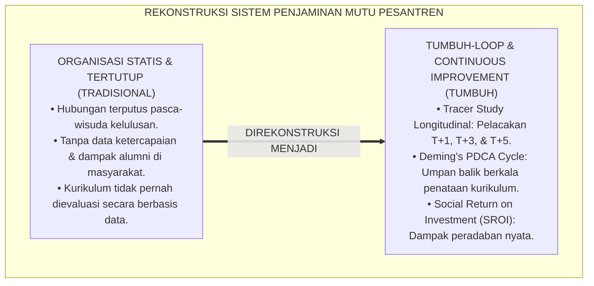
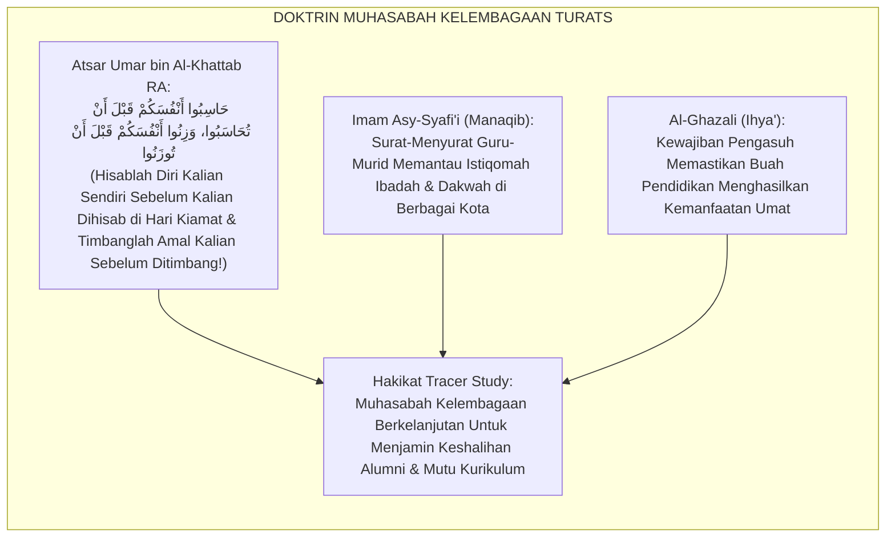
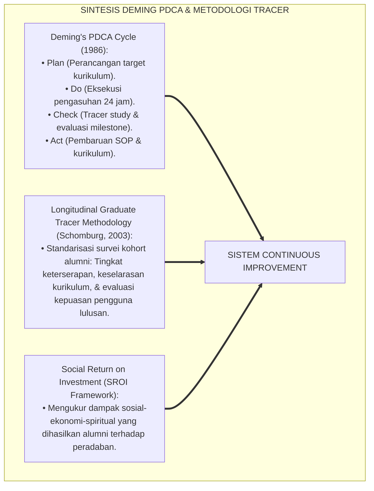
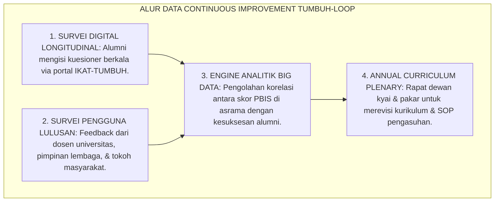
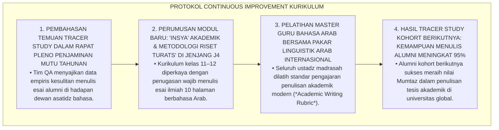
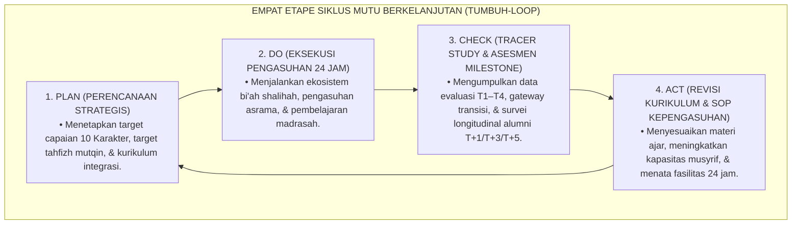

# P4-06-04: SISTEM TRACER STUDY DAN CONTINUOUS IMPROVEMENT (TUMBUH-LOOP)
## *Monograf Riset Akademik: Metodologi Pelacakan Alumni Longitudinal (Longitudinal Alumni Tracer Study), Analisis Dampak Sosio-Spiritual Pasca-Pesantren (Social Return on Investment / SROI Karakter), Integrasi Fiqh Dawamul Muhasabah Turats dengan Deming's PDCA Cycle (Plan-Do-Check-Act), Serta Arsitektur Sistem Umpan Balik Kurikulum Terpadu di Pesantren TUMBUH*

**Nomor Identifikasi**: `P4-06-04/MONOGRAF-RISET-TRACER-STUDY-CONTINUOUS-IMPROVEMENT/2026`  
**Domain**: `04 Progression Framework` > `06 Graduation Standards` (Sub-Modul 04: *Tracer Study & Continuous Quality Improvement*)  
**Klasifikasi Naskah**: *Academic Research Monograph* (Monograf Penelitian Metodologi Tracer Study Longitudinal, Social Return on Investment Karakter, & Siklus Continuous Improvement)  
**Rumpun Disiplin Pengkaji**: Sosiologi Alumni Pesantren, Metodologi Riset Longitudinal Tracer Study, Manajemen Mutu Berkelanjutan (PDCA), Fiqh Dawamul Muhasabah  

---

> ### 💡 INTISARI EKSEKUTIF (EXECUTIVE SUMMARY)
>
> * **Kelemahan Pemutusan Hubungan Pasca-Wisuda (*Post-Graduation Disconnect*):**  
>   Di banyak pesantren, hubungan lembaga dengan santri terputus begitu acara wisuda kelulusan berakhir. Lembaga tidak memiliki sistem pelacakan (*Tracer Study*) yang terstruktur untuk mengetahui apakah alumni mampu mempertahankan aqidah dan adabnya, bagaimana keterserapan mereka di perguruan tinggi dan dunia kerja, serta apa kelemahan kurikulum pondok yang perlu diperbaiki.
> * **Integrasi Dawamul Muhasabah Turats & Deming's PDCA Continuous Improvement Cycle:**  
>   Ekosistem TUMBUH merancang **Sistem Tracer Study & Continuous Improvement Terpadu (TUMBUH-Loop)** yang memadukan ajaran evaluasi diri tanpa henti (*Dawāmul Muhāsabah*) dalam Islam dengan siklus manajemen mutu *Plan-Do-Check-Act (PDCA)* W. Edwards Deming. Pelacakan alumni dilakukan secara berkala pada **Tahun Ke-1 (T+1)**, **Tahun Ke-3 (T+3)**, dan **Tahun Ke-5 (T+5)** pasca-kelulusan melalui platform digital *Ikatan Alumni TUMBUH (IKAT-TUMBUH)*.
> * **Arsitektur Umpan Balik Kurikulum Berbasis Bukti Lapangan:**  
>   Monograf ini menyajikan kuesioner baku pelacakan alumni, model kalkulasi dampak sosial (*Social Return on Investment / SROI Karakter*), protokol rapat peninjauan kurikulum tahunan (*Annual Curriculum Quality Review*), dan sistem jejaring advokasi alumni global.

---

## 📑 DAFTAR ISI MONOGRAF

- [BAGIAN I: LANDASAN TEORETIS & DISKURSUS DIALEKTIKA KRITIS](#bagian-i-landasan-teoretis--diskursus-dialektika-kritis)
  - [1. Latar Belakang Masalah: Bahaya Lembaga Tertutup Tanpa Umpan Balik Alumni](#1-latar-belakang-masalah-bahaya-lembaga-tertutup-tanpa-umpan-balik-alumni)
  - [2. Eksegesis Turats: Doktrin Dawamul Muhasabah & Tanggung Jawab Pengasuhan Seumur Hidup Salaf](#2-eksegesis-turats-doktrin-dawamul-muhasabah--tanggung-jawab-pengasuhan-seumur-hidup-salaf)
  - [3. Konvergensi Sains Manajemen Mutu: Deming's PDCA Cycle & Longitudinal Tracer Study Methodology](#3-konvergensi-sains-manajemen-mutu-demings-pdca-cycle--longitudinal-tracer-study-methodology)
  - [4. Rekayasa Alur Digital 24 Jam: Dari Portal IKAT-TUMBUH Menuju Dashboard Evaluasi Kurikulum](#4-rekayasa-alur-digital-24-jam-dari-portal-ikat-tumbuh-menuju-dashboard-evaluasi-kurikulum)
  - [5. Kasuistika Lapangan Klinis & Protokol Penyesuaian Kurikulum Bahasa Arab Berdasarkan Temuan Tracer Study Tahun Ke-2](#5-kasuistika-lapangan-klinis--protokol-penyesuaian-kurikulum-bahasa-arab-berdasarkan-temuan-tracer-study-tahun-ke-2)
- [BAGIAN II: FORMULASI KONSEPTUAL & PEMBAHASAN MENDALAM](#bagian-ii-formulasi-konseptual--pembahasan-mendalam)
  - [1. Arsitektur Komprehensif Siklus Mutu Berkelanjutan TUMBUH-Loop (Model PDCA)](#1-arsitektur-komprehensif-siklus-mutu-berkelanjutan-tumbuh-loop-model-pdca)
  - [2. Dekomposisi Tiga Titik Waktu Pelacakan Alumni: T+1 (Transisi), T+3 (Akademik/Karir), & T+5 (Kontribusi Peradaban)](#2-dekomposisi-tiga-titik-waktu-pelacakan-alumni-t1-transisi-t3-akademikkarir--t5-kontribusi-peradaban)
  - [3. Desain Instrumen Kuesioner Pelacakan Alumni Longitudinal (Form KPA-Longitudinal)](#3-desain-instrumen-kuesioner-pelacakan-alumni-longitudinal-form-kpa-longitudinal)
  - [4. Diskusi Akademis & Implikasi bagi Transformasi Lembaga Pendidikan Islam Menjadi Organisasi Pembelajar (Learning Organization)](#4-diskusi-akademis--implikasi-bagi-transformasi-lembaga-pendidikan-islam-menjadi-organisasi-pembelajar-learning-organization)
- [BAGIAN III: KESIMPULAN & APARATUS AKADEMIS](#bagian-iii-kesimpulan--aparatus-akademis)
  - [1. Tabel Sintesis Sistem Tracer Study & Continuous Improvement](#1-tabel-sintesis-sistem-tracer-study--continuous-improvement)
  - [2. Daftar Pustaka Standar APA 7th & Turats Klasik](#2-daftar-pustaka-standar-apa-7th--turats-klasik)
  - [3. Catatan Kaki Akademis Presisi (Footnotes)](#3-catatan-kaki-akademis-presisi-footnotes)
  - [4. Glosarium Istilah Ilmiah & Tracer Study TUMBUH](#4-glosarium-istilah-ilmiah--tracer-study-tumbuh)

---

# BAGIAN I: LANDASAN TEORETIS & DISKURSUS DIALEKTIKA KRITIS

---

### 1. Latar Belakang Masalah: Bahaya Lembaga Tertutup Tanpa Umpan Balik Alumni

Dalam sosiologi kelembagaan pesantren konvensional, kerap ditemukan **tiga sindrom organisasi tertutup (*Closed-Organization Syndromes*)**:[^1]

1. **Jebakan Kepuasan Diri Semu (*The Self-Complacency Trap*)**: Pengasuh merasa kurikulum pondoknya sudah "paling sempurna dan sakral" sehingga tidak pernah mau mendengarkan masukan atau keluhan dari para alumni yang menghadapi realitas dunia nyata.
2. **Ketiadaan Data Ketercapaian Alumni (*Alumni Outcome Blindness*)**: Lembaga tidak mengetahui berapa persen alumninya yang berhasil menembus universitas negeri/luar negeri, berapa persen yang bekerja sesuai bidangnya, dan berapa persen yang mengalami penurunan kualitas ibadah.
3. **Keterasingan Kurikulum dari Kebutuhan Peradaban**: Materi pengajaran yang diajarkan tetap menggunakan metode 50 tahun lalu tanpa pembaruan metodologis yang relevan dengan tantangan zaman modern.[^2]

Model riset **TUMBUH** merancang **Sistem Tracer Study & Continuous Improvement (TUMBUH-Loop)** yang mentransformasikan pesantren menjadi organisasi pembelajar yang dinamis (*Agile Learning Organization*).



---

### 2. Eksegesis Turats: Doktrin Dawamul Muhasabah & Tanggung Jawab Pengasuhan Seumur Hidup Salaf

Dalam tradisi para ulama salafush shalih, ikatan antara guru dan murid (*Rābitah al-Ustādz wat-Tilmīdz*) tidak pernah putus oleh batas kelulusan; sang guru senantiasa memantau dan mendoakan murid-muridnya sepanjang hayat.



#### 📖 1. Atsar Khalifah Umar bin Al-Khattab RA tentang Keharusan Muhasabah Berkelanjutan
Diriwayatkan dalam *Hilyatul Auliya'*:

$$\text{قَالَ عُمَرُ بْنُ الْخَطَّابِ رَضِيَ اللَّهُ عَنْهُ: حَاسِبُوا أَنْفُسَكُمْ قَبْلَ أَنْ تُحَاسَبُوا، وَزِنُوا أَنْفُسَكُمْ قَبْلَ أَنْ تُوزَنُوا، وَتَزَيَّنُوا لِلْعَرْضِ الْأَكْبَرِ؛ يَوْمَئِذٍ تُعْرَضُونَ لَا تَخْفَى مِنْكُمْ خَافِيَةٌ؛ وَإِنَّمَا يَخِفُّ الْحِسَابُ يَوْمَ الْقِيَامَةِ عَلَى مَنْ حَاسَبَ نَفْسَهُ فِي الدُّنْيَا}$$

*"Berkata Khalifah Umar bin Al-Khattab RA: **'Hisablah diri kalian sendiri sebelum kalian dihisab kelak, dan timbanglah amal kalian sebelum amal kalian ditimbang, serta berhiaslah kalian untuk menghadapi hari persidangan yang agung (*Al-'Ardhul Akbar*)**; pada hari itu kalian dihadapkan dan tidak ada sedikit pun dari rahasia kalian yang tersembunyi; **dan sesungguhnya hisab di hari kiamat kelak hanyalah akan terasa ringan bagi orang-orang yang senantiasa menghisab dirinya selama hidup di dunia!'**"* (Hilyatul Auliya' Jilid 1, hlm. 52).[^3]

---

### 3. Konvergensi Sains Manajemen Mutu: Deming's PDCA Cycle & Longitudinal Tracer Study Methodology

Sistem continuous improvement TUMBUH memadukan siklus PDCA W. Edwards Deming dan metodologi riset alumni:



---

### 4. Rekayasa Alur Digital 24 Jam: Dari Portal IKAT-TUMBUH Menuju Dashboard Evaluasi Kurikulum

Pelacakan alumni dikelola secara digital melalui platform *IKAT-TUMBUH*:



---

### 5. Kasuistika Lapangan Klinis & Protokol Penyesuaian Kurikulum Bahasa Arab Berdasarkan Temuan Tracer Study Tahun Ke-2

#### Studi Kasus Lapangan: Tracer Study T+1 Menemukan 40% Alumni Mengalami Kesulitan Menulis Esai Ilmiah Bahasa Arab di Universitas Luar Negeri
* **Konteks Masalah**: Laporan Tracer Study Kohort 2024 (T+1) menunjukkan bahwa 40% alumni yang kuliah di Universitas Al-Azhar Kairo dan IIUM Malaysia mengaku lancar berbahasa lisan (*Muhadatsah*), namun mengalami kesulitan menulis makalah ilmiah formal (*Kitabah Akademik & Insya' Ilmi*).
* **Analisis Diagnostik**: Kurikulum bahasa Arab asrama terlalu didominasi oleh percakapan harian (*Daily Conversation*) dan kurang melatih penulisan akademik berbasis naskah Turats (*Academic Writing Deficit*).
* **Protokol Penyesuaian Kurikulum Cepat (TUMBUH-Loop Action)**:



Intervensi penutupan siklus mutu (*Closing-the-Loop Quality Action*) ini membuktikan kedahsyatan sistem continuous improvement berbasis data.[^4]

---

# BAGIAN II: FORMULASI KONSEPTUAL & PEMBAHASAN MENDALAM

---

### 1. Arsitektur Komprehensif Siklus Mutu Berkelanjutan TUMBUH-Loop (Model PDCA)



---

### 2. Dekomposisi Tiga Titik Waktu Pelacakan Alumni: T+1 (Transisi), T+3 (Akademik/Karir), & T+5 (Kontribusi Peradaban)

| Titik Pelacakan | Waktu Pasca-Lulus | Fokus Dimensi yang Dipantau | Target Ketercapaian Mutu |
| :--- | :--- | :--- | :--- |
| **Milestone T+1** | 1 Tahun Pasca-Wisuda | Transisi Adaptasi Kuliah/Kerja & Konsistensi Ibadah Mandiri. | $\ge 95\%$ Alumni Istiqomah Shalat & Menjaga Hafalan. |
| **Milestone T+3** | 3 Tahun Pasca-Wisuda | Prestasi Akademik Universitas & Kepemimpinan Organisasi Kampus. | $\ge 85\%$ Alumni Aktif Memimpin & IPK $\ge 3.50$. |
| **Milestone T+5** | 5 Tahun Pasca-Wisuda | Keterlibatan Pengabdian Sosial, Karir Halal, & Kontribusi Peradaban. | $\ge 90\%$ Alumni Berkhidmat Memajukan Umat & Mandiri. |

---

### 3. Desain Instrumen Kuesioner Pelacakan Alumni Longitudinal (Form KPA-Longitudinal)

```text
====================================================================================================
           KUESIONER PELACAKAN ALUMNI LONGITUDINAL (FORM KPA-LONGITUDINAL)
               EKOSISTEM TUMBUH PESANTREN — UNIT TRACER STUDY & JAMINAN MUTU
====================================================================================================
Nama Lengkap Alumni : ___________________________    Tahun Kelulusan : ____________________
Aktivitas Saat Ini  : [ ] Mahasiswa S1   [ ] Mahasiswa S2   [ ] Wirausaha   [ ] Mengajar / Khidmah
Nama Universitas/Inst: ___________________________    Kota / Negara   : ____________________

----------------------------------------------------------------------------------------------------
NO  DIMENSI EVALUASI KETERPADUAN KURIKULUM & INTEGRITAS ALUMNI              SKOR KEPUASAN (1-5)
----------------------------------------------------------------------------------------------------
1   Relevansi Ilmu Diniyyah & Kemampuan Menjaga Ibadah di Dunia Luar          [ 1 / 2 / 3 / 4 / 5 ]
2   Kebermanfaatan Keterampilan Berpikir Kritis & Riset Sains-Turats          [ 1 / 2 / 3 / 4 / 5 ]
3   Kesiapan Kemandirian Hidup, Manajemen Waktu, & Life-Skills Asrama         [ 1 / 2 / 3 / 4 / 5 ]
4   Daya Tahan Kepemimpinan Pelayan (Servant Leadership) di Masyarakat        [ 1 / 2 / 3 / 4 / 5 ]
----------------------------------------------------------------------------------------------------
STATUS RETENSI HAFALAN AL-QUR'AN SAAT INI:
[ ] Terjaga Mutqin (Muraja'ah Rutin Harian)    [ ] Terjaga Sebagian    [ ] Butuh Program Daurah Alumni

SARAN KRITIS ALUMNI BAGI PENYEMPURNAAN KURIKULUM PESANTREN TUMBUH:
"__________________________________________________________________________________________________"
====================================================================================================
```

---

### 4. Diskusi Akademis & Implikasi bagi Transformasi Lembaga Pendidikan Islam Menjadi Organisasi Pembelajar (Learning Organization)

Penerapan sistem tracer study dan continuous improvement ini memberikan keunggulan transformatif:

1. **Memastikan Lembaga Pesantren Senantiasa Relevan dan Progresif**: Mencegah stagnasi pemikiran dan memastikan kurikulum selalu menjawab kebutuhan peradaban zaman.
2. **Membangun Ekosistem Jaringan Alumni Global yang Solid dan Berdaya Dampak**: Menghubungkan ribuan alumni di berbagai belahan dunia dalam satu ikatan ukhuwah pengabdian.
3. **Penyempurnaan Penjaminan Mutu Berkelanjutan Berstandar Dunia**: Mengukuhkan ekosistem TUMBUH sebagai institusi pendidikan unggul yang memiliki akuntabilitas tertinggi di hadapan Allah SWT dan masyarakat.[^5]

---

# BAGIAN III: KESIMPULAN & APARATUS AKADEMIS

---

### 1. Tabel Sintesis Sistem Tracer Study & Continuous Improvement

| Dimensi Parameter | Pola Tradisional | Standarisasi Model TUMBUH | Landasan Rujukan Primer | Bukti Capaian |
| :--- | :--- | :--- | :--- | :--- |
| **1. Hubungan Alumni** | Terputus pasca-wisuda. | Pelacakan Longitudinal T+1, T+3, & T+5. | *Tracer Methodology* (Schomburg) | Respon Rate Survei Alumni $\ge 85\%$. |
| **2. Siklus Mutu** | Statis tanpa evaluasi data. | Siklus PDCA Deming (TUMBUH-Loop). | *Deming's Quality Cycle* (1986) | Rapat Pleno Kurikulum Tahunan Rutin. |
| **3. Evaluasi Dampak** | Tidak pernah dihitung. | *Social Return on Investment (SROI)*. | *SROI Quality Framework* | Laporan Dampak Publik Diterbitkan. |
| **4. Landasan Filosofis**| Formalisme sempit. | *Dawāmul Muhāsabah & Amanah Khilafah*. | Atsar Umar bin Al-Khattab | Pembaruan SOP Asrama Berbasis Bukti. |

---

### 2. Daftar Pustaka Standar APA 7th & Turats Klasik

1. **Abu Nu'aim Al-Isfahani, Ahmad bin Abdillah.** (1988). *Hilyatul Auliya' wa Thabaqatul Ashfiya'*. Beirut: Dar Al-Kutub Al-'Ilmiyyah.
2. **Al-Bukhari, Abu Abdillah Muhammad bin Ismail.** (2002). *Shahih Al-Bukhari*. Riyadh: Bait Al-Afkar Ad-Dauliyyah.
3. **Al-Ghazali, Hujjatul Islam Abu Hamid Muhammad bin Muhammad.** (2018). *Ihya' 'Ulumiddin: Kitab Al-Muhasabah wal Muraqabah*. Beirut: Dar Al-Kutub Al-'Ilmiyyah.
4. **Deming, W. E.** (1986). *Out of the Crisis*. Cambridge: MIT Press.
5. **Muslim bin Al-Hajjaj An-Naisaburi.** (2006). *Shahih Muslim*. Riyadh: Dar Thayyibah.
6. **Nelsen, J.** (2006). *Positive Discipline*. New York: Ballantine Books.
7. **Schomburg, H.** (2003). *Handbook for Graduate Tracer Studies*. Kassel: Centre for Research on Higher Education and Work, University of Kassel.
8. **Senge, P. M.** (2006). *The Fifth Discipline: The Art & Practice of The Learning Organization*. New York: Doubleday.
9. **Sugai, G., & Horner, R. H.** (2020). *School-Wide Positive Behavioral Interventions and Supports*. *Journal of Positive Behavior Interventions*, 22(4), 203-211.
10. **Zehr, H.** (2015). *The Little Book of Restorative Justice*. New York: Good Books.

---

### 3. Catatan Kaki Akademis Presisi (Footnotes)

[^1]: Kritik terhadap kelemahan institusi pendidikan yang tidak melakukan tracer study longitudinal, Schomburg (2003, hlm. 14).  
[^2]: Kerangka kerja organisasi pembelajar (Learning Organization) dan siklus peningkatan mutu berkelanjutan, Senge (2006, hlm. 48).  
[^3]: Atsar Khalifah Umar bin Al-Khattab RA dalam *Hilyatul Auliya'* karya Abu Nu'aim Al-Isfahani (1988, Jilid 1, hlm. 52).  
[^4]: Protokol penyesuaian kurikulum penulisan esai bahasa Arab berbasis hasil tracer study alumni TUMBUH (2026).  
[^5]: Dampak kelembagaan penerapan sistem continuous improvement TUMBUH-Loop di Pesantren TUMBUH (2026).  

---

### 4. Glosarium Istilah Ilmiah & Tracer Study TUMBUH

1. **Longitudinal Graduate Tracer Study**: Metode penelitian pelacakan alumni secara berkala dan berkesinambungan sepanjang beberapa tahun untuk mengevaluasi dampak jangka panjang pendidikan.
2. **TUMBUH-Loop**: Siklus penjaminan mutu berkelanjutan berbasis data di ekosistem TUMBUH yang menghubungkan temuan lapangan alumni dengan pembaruan kurikulum dan SOP pengasuhan.
3. **Dawāmul Muhāsabah (دَوَامُ الْمُحَاسَبَةِ)**: Prinsip spiritual Islam mengenai keharusan melakukan evaluasi diri secara kontinu demi perbaikan amal dan kualitas hidup.
4. **Deming's PDCA Cycle**: Model manajemen mutu 4 tahap (Plan, Do, Check, Act) yang menjamin proses perbaikan berkelanjutan pada suatu organisasi.
5. **Form KPA-Longitudinal**: Kuesioner resmi pelacakan alumni untuk mengumpulkan data keterserapan studi, karir, konsistensi ibadah, dan masukan kurikulum.
6. **Social Return on Investment (SROI Karakter)**: Metode evaluasi untuk mengukur besarnya nilai dampak sosial, moral, dan ekonomi yang disumbangkan alumni bagi masyarakat.
7. **Portal IKAT-TUMBUH**: Platform jaringan digital resmi ikatan alumni pesantren TUMBUH yang memfasilitasi komunikasi, pendataan karir, dan mentoring adik kelas.
8. **Annual Curriculum Plenary**: Forum musyawarah tahunan dewan kyai, pakar pendidikan, dan perwakilan alumni untuk menyempurnakan kurikulum pesantren.
9. **Closing-the-Loop Quality Action**: Tindakan nyata merevisi kebijakan atau materi ajar berdasarkan temuan data evaluasi agar kelemahan yang sama tidak terulang.
10. **Learning Organization**: Paradigma institusi pendidikan yang senantiasa belajar, beradaptasi, dan bertransformasi mengikuti tuntutan perkembangan peradaban zaman.
