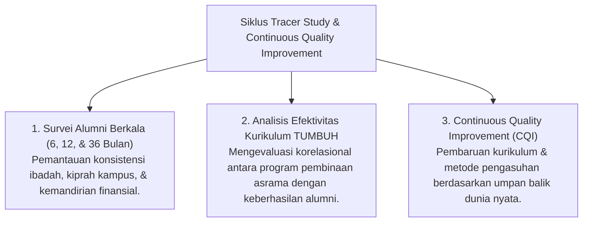

# P4-06-04: Sistem Tracer Study dan Continuous Quality Improvement

## Status Dokumen
* **Status**: 🌟 **A+ (Tervalidasi & Siap Diimplementasikan)**
* **Sub-Domain**: `04 Progression Framework / 06 Graduation Standards`
* **Penanggung Jawab Keilmuan**: Dewan Keilmuan TUMBUH (*Pakar Metodologi Riset & Pakar Arsitektur Digital Pesantren*)

---

## 1. Konseptualisasi Tracer Study Alumni

Sistem Tracer Study di ekosistem **TUMBUH** adalah mekanisme riset evaluasi membujur (*Longitudinal Alumni Monitoring*) untuk memantau keberlanjutan adab, konsistensi ibadah, dan kiprah alumni di perguruan tinggi maupun masyarakat pasca-kelulusan.

---

## 2. Parameter Pemantauan Alumni (Post-Pesantren Tracking)

| Periode Tracking | Parameter Utama Pemantauan | Media Survey & Pengumpulan Data |
| :--- | :--- | :--- |
| **6 Bulan Post-Lulus** | Adaptasi lingkungan perguruan tinggi / masyarakat; konsistensi sholat berjamaah & hafalan. | *Aplikasi Portal Alumni TUMBUH* & Temu Alumni Online. |
| **12 Bulan Post-Lulus** | Keterlibatan dalam organisasi keislaman kampus / proyek kemasyarakatan. | *Survei Evaluasi Kiprah Ukhuwah Alumni*. |
| **36 Bulan Post-Lulus** | Kemandirian karier/finansial (*Qadirun 'Alal Kasb*) & keteladanan *Qudwah* di masyarakat. | *Studi Pelacakan Dampak Alumni (Alumni Impact Study)*. |

---

## 3. Feedback Loop untuk Penyempurnaan Sistem Pesantren

Data dari *Tracer Study* dimasukkan kembali ke dalam siklus **Continuous Quality Improvement (CQI)**:
- Bila alumni melaporkan tantangan kejutan budaya (*Culture Shock*) di kampus, kurikulum pembekalan Fase 4 disempurnakan dengan materi benteng fikrah yang lebih relevan.
- Lembaga pendidikan terus tumbuh (*Sistem Lembaga Tumbuh*) sebagai organisasi pembelajar yang dinamis dan adatif terhadap perkembangan zaman.
