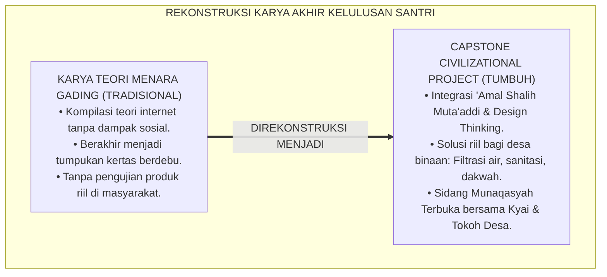
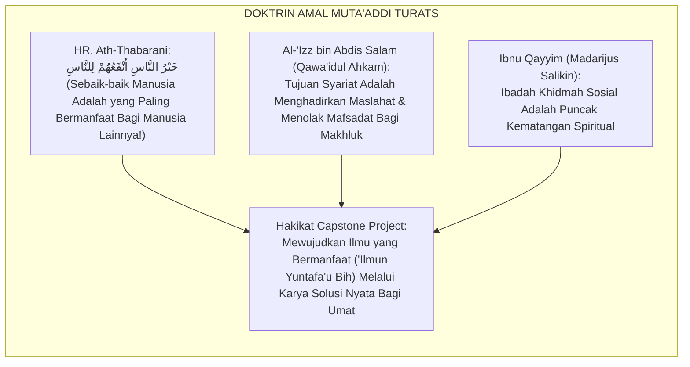
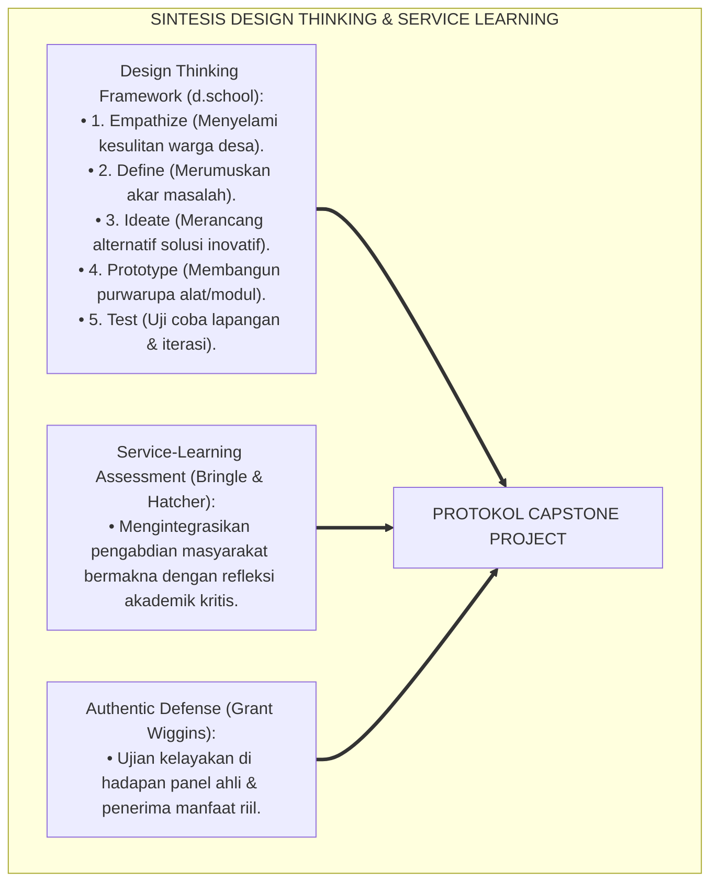
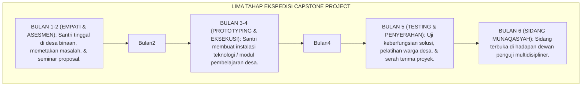
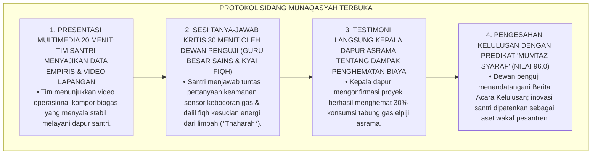
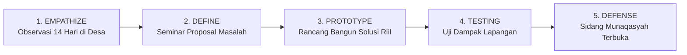
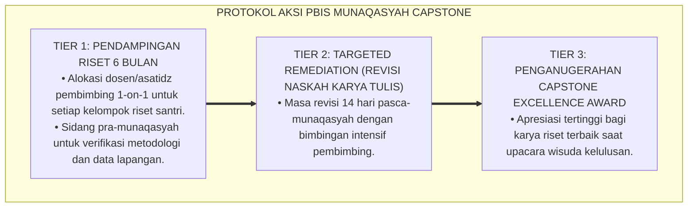

# P4-06-05: PROTOKOL MUNAQASYAH CAPSTONE CIVILIZATIONAL PROJECT
## *Monograf Riset Akademik: Metodologi Evaluasi Sidang Munaqasyah Terbuka Karya Pengabdian Peradaban (Capstone Civilizational Project), Integrasi Doktrin 'Amal Shalih & Nafi'un lin-Naas Turats dengan Problem-Based Learning (PBL) & Design Thinking, Desain Rubrik Penilaian Empat Dimensi Kinerja (Form RPC-NL), Serta Protokol Pengabdian Masyarakat di Pesantren TUMBUH*

**Nomor Identifikasi**: `P4-06-05/MONOGRAF-RISET-MUNAQASYAH-CAPSTONE-PROJECT/2026`  
**Domain**: `04 Progression Framework` > `06 Graduation Standards` (Sub-Modul 05: *Capstone Civilizational Project Defense Protocol*)  
**Klasifikasi Naskah**: *Academic Research Monograph* (Monograf Penelitian Sidang Munaqasyah Capstone Project, Metodologi Design Thinking Islam, & Evaluasi Dampak Sosial)  
**Rumpun Disiplin Pengkaji**: Desain Asesmen Kinerja Autentik (*Capstone Defense*), Metodologi Problem-Based Learning (PBL) & Design Thinking, Sosiologi Dakwah & Pengabdian Masyarakat, Evaluasi Rubrik Analitik  

---

> ### 💡 INTISARI EKSEKUTIF (EXECUTIVE SUMMARY)
>
> * **Kelemahan Karya Akhir Berbasis Kertas Teoretis Semata:**  
>   Banyak karya tulis akhir siswa (Karya Tulis Ilmiah / Skripsi Santri) hanya berupa kompilasi teks teori yang disusun dari internet tanpa adanya kontak langsung dengan realitas permasalahan masyarakat. Karya tersebut kerap berakhir menjadi tumpukan kertas berdebu di perpustakaan tanpa memberikan dampak kemanfaatan nyata (*Zero Social Impact*).
> * **Integrasi Doktrin 'Amal Shalih Peradaban & Design Thinking Methodology:**  
>   Ekosistem TUMBUH merancang **Capstone Civilizational Project** yang memadukan doktrin kemanfaatan amal shalih (*Khairun Nās Anfa'uhum lin-Nās*) dalam Islam dengan metodologi *Design Thinking* (Empathize, Define, Ideate, Prototype, & Test). Setiap santri kelas 12 (Jenjang J4) wajib merancang, menguji, dan mengeksekusi proyek solusi nyata bagi desa binaan (misal: sistem filtrasi air, digitalisasi TPA, inovasi agribisnis halal, atau pemberdayaan dhu'afa).
> * **Protokol Sidang Munaqasyah Terbuka & Rubrik RPC-NL:**  
>   Monograf ini menyajikan tata tertib sidang munaqasyah di hadapan dewan penguji multidisipliner dan tokoh masyarakat desa, instrumen rubrik penilaian 4 dimensi kinerja (Form RPC-NL), dan standar pengesahan kelulusan karya peradaban santri.

---

## 📑 DAFTAR ISI MONOGRAF

- [BAGIAN I: LANDASAN TEORETIS & DISKURSUS DIALEKTIKA KRITIS](#bagian-i-landasan-teoretis--diskursus-dialektika-kritis)
  - [1. Latar Belakang Masalah: Bahaya Karya Ilmiah Menara Gading vs Kebutuhan Solusi Nyata Umat](#1-latar-belakang-masalah-bahaya-karya-ilmiah-menara-gading-vs-kebutuhan-solusi-nyata-umat)
  - [2. Eksegesis Turats: Doktrin Al-Amalush Shalih al-Muta'addi & Kemanfaatan Ilmu dalam Tradisi Salaf](#2-eksegesis-turats-doktrin-al-amalush-shalih-al-mutaaddi--kemanfaatan-ilmu-dalam-tradisi-salaf)
  - [3. Konvergensi Sains Pedagogi: Design Thinking (Stanford d.school) & Service-Learning Assessment](#3-konvergensi-sains-pedagogi-design-thinking-stanford-dschool--service-learning-assessment)
  - [4. Rekayasa Ekosistem Ekspedisi Desa: 6 Bulan Penempaan Solusi Lapangan 24 Jam](#4-rekayasa-ekosistem-ekspedisi-desa-6-bulan-penempaan-solusi-lapangan-24-jam)
  - [5. Kasuistika Lapangan Klinis & Protokol Sidang Munaqasyah Proyek Inovasi Pengolahan Limbah Pesantren Berkelanjutan](#5-kasuistika-lapangan-klinis--protokol-sidang-munaqasyah-proyek-inovasi-pengolahan-limbah-pesantren-berkelanjutan)
- [BAGIAN II: FORMULASI KONSEPTUAL & PEMBAHASAN MENDALAM](#bagian-ii-formulasi-konseptual--pembahasan-mendalam)
  - [1. Arsitektur Komprehensif Siklus Capstone Civilizational Project TUMBUH (5 Etape)](#1-arsitektur-komprehensif-siklus-capstone-civilizational-project-tumbuh-5-etape)
  - [2. Dekomposisi Empat Ranah Penilaian Rubrik Munaqasyah (Form RPC-NL)](#2-dekomposisi-empat-ranah-penilaian-rubrik-munaqasyah-form-rpc-nl)
  - [3. Tata Tertib Pelaksanaan Sidang Munaqasyah Terbuka & Komposisi Dewan Penguji](#3-tata-tertib-pelaksanaan-sidang-munaqasyah-terbuka--komposisi-dewan-penguji)
  - [4. Diskusi Akademis & Implikasi bagi Kebangkitan Tradisi Riset Aplikatif Pesantren Dunia](#4-diskusi-akademis--implikasi-bagi-kebangkitan-tradisi-riset-aplikatif-pesantren-dunia)
- [BAGIAN III: KESIMPULAN & APARATUS AKADEMIS](#bagian-iii-kesimpulan--aparatus-akademis)
  - [1. Tabel Sintesis Protokol Munaqasyah Capstone Project](#1-tabel-sintesis-protokol-munaqasyah-capstone-project)
  - [2. Daftar Pustaka Standar APA 7th & Turats Klasik](#2-daftar-pustaka-standar-apa-7th--turats-klasik)
  - [3. Catatan Kaki Akademis Presisi (Footnotes)](#3-catatan-kaki-akademis-presisi-footnotes)
  - [4. Glosarium Istilah Ilmiah & Capstone Project](#4-glosarium-istilah-ilmiah--capstone-project)

---

# BAGIAN I: LANDASAN TEORETIS & DISKURSUS DIALEKTIKA KRITIS

---

### 1. Latar Belakang Masalah: Bahaya Karya Ilmiah Menara Gading vs Kebutuhan Solusi Nyata Umat

Dalam tradisi tugas akhir siswa sekolah menengah atas konvensional, kerap timbul **tiga kelemahan karya ilmiah (*Scholastic Pitfalls*)**:[^1]

1. **Jebakan Teoretisasi Menara Gading (*The Ivory Tower Trap*)**: Karya tulis santri hanya berisi kutipan buku tanpa pernah menginjakkan kaki di lapangan untuk melihat apakah ilmunya dapat memecahkan masalah kemiskinan, sanitasi, atau buta huruf Al-Qur'an.
2. **Ketiadaan Pengujian Keberfungsian Produk/Solusi**: Solusi yang diajukan tidak pernah diuji coba (*Prototyping & Testing*), sehingga tidak diketahui apakah solusi tersebut benar-benar dapat dioperasikan oleh masyarakat desa.
3. **Pemisahan Dimensi Intelektual dari Dimensi Keikhlasan Khidmah**: Penulisan karya akhir dipandang semata-mata sebagai formalitas mengejar nilai kelulusan, bukan sebagai ibadah pengabdian kepada Allah SWT.[^2]

Model riset **TUMBUH** merancang **Capstone Civilizational Project** yang mengharuskan santri turun langsung mengabdi, menerapkan metodologi riset ilmiah, dan mempertanggungjawabkan karyanya dalam sidang munaqasyah terbuka.



---

### 2. Eksegesis Turats: Doktrin Al-Amalush Shalih al-Muta'addi & Kemanfaatan Ilmu dalam Tradisi Salaf

Dalam fiqh Islam, amal shalih yang kemanfaatannya meluas kepada orang lain (*Al-'Amal al-Muta'addī*) memiliki derajat pahala yang jauh lebih tinggi dibanding ibadah yang manfaatnya hanya kembali kepada diri sendiri (*Al-'Amal al-Qāshir*).



#### 📖 1. Kaidah Sultanul Ulama Al-'Izz bin Abdis Salam tentang Kemuliaan Amal Muta'addi
Imam **Al-'Izz bin Abdis Salam** menegaskan dalam *Qawa'idul Ahkam fi Mashalihil Anam*:

$$\text{الْأَعْمَالُ الْمُتَعَدِّيَةُ أَفْضَلُ مِنَ الْأَعْمَالِ الْقَاصِرَةِ؛ لِأَنَّ مَصْلَحَةَ الْقَاصِرِ تَقْتَصِرُ عَلَى فَاعِلِهِ، وَمَصْلَحَةَ الْمُتَعَدِّي تَعُمُّ الْعِبَادَ وَالْبِلَادَ؛ وَمِنْ أَعْظَمِ الْأَعْمَالِ الْمُتَعَدِّيَةِ سَعْيُ طَالِبِ الْعِلْمِ فِي إِزَالَةِ ضَرَرِ النَّاسِ وَجَلْبِ النَّفْعِ لَهُمْ فِي دِينِهِمْ وَدُنْيَاهُمْ}$$

*"**Amal-amal kebajikan yang manfaatnya meluas (*Al-A'mālul Muta'addiyah*) adalah jauh lebih utama daripada amal-amal yang manfaatnya terbatas (*Al-A'mālul Qāshirah*)**; karena kemaslahatan amal qashir hanya kembali kepada pelakunya sendiri, **sedangkan kemaslahatan amal muta'addi mencakup segenap hamba Allah dan memakmurkan negeri**; dan di antara amal muta'addi yang paling agung **adalah kesungguhan penuntut ilmu dalam melenyapkan kesulitan manusia (*Izālatu Dhararin Nās*) dan mendatangkan kemanfaatan bagi mereka dalam urusan agama maupun dunia mereka!**"*[^3]

---

### 3. Konvergensi Sains Pedagogi: Design Thinking (Stanford d.school) & Service-Learning Assessment

Metodologi Capstone TUMBUH memadukan kerangka kerja *Design Thinking* Stanford d.school dan *Service-Learning*:



---

### 4. Rekayasa Ekosistem Ekspedisi Desa: 6 Bulan Penempaan Solusi Lapangan 24 Jam

Pelaksanaan Capstone Project berlangsung terstruktur selama 6 bulan di Jenjang J4:



---

### 5. Kasuistika Lapangan Klinis & Protokol Sidang Munaqasyah Proyek Inovasi Pengolahan Limbah Pesantren Berkelanjutan

#### Studi Kasus Lapangan: Tim Santri J4 Mengembangkan Sistem Biogas dari Limbah Dapur Pesantren Menghadapi Pertanyaan Kritis Dewan Penguji
* **Konteks Masalah**: Dalam sidang munaqasyah Capstone Project, Tim Santri J4 (3 orang) mempresentasikan proyek *"Instalasi Reaktor Biogas Mandiri Berbasis Limbah Dapur Asrama"*. Penguji menguji ketat aspek keselamatan gas (*Gas Safety*), efisiensi tekanan, dan perhitungan dampak penghematan biaya elpiji pesantren (*Financial Viability*).
* **Analisis Diagnostik**: Munaqasyah bukan sekadar menguji hafalan teks, melainkan menguji kedalaman nalar riset, penguasaan prinsip termodinamika fisika, perhitungan maslahat ekonomi, dan keikhlasan pengabdian santri.
* **Protokol Sidang Munaqasyah Terbuka TUMBUH**:



Intervensi evaluasi kinerja autentik (*Authentic Performance Defense*) ini melahirkan kebanggaan dan kematangan intelektual yang luar biasa pada santri.[^4]

---

# BAGIAN II: FORMULASI KONSEPTUAL & PEMBAHASAN MENDALAM

---

### 1. Arsitektur Komprehensif Siklus Capstone Civilizational Project TUMBUH (5 Etape)



---

### 2. Dekomposisi Empat Ranah Penilaian Rubrik Munaqasyah (Form RPC-NL)

```text
====================================================================================================
           RUBRIK PENILAIAN CAPSTONE CIVILIZATIONAL PROJECT (FORM RPC-NL)
               EKOSISTEM TUMBUH PESANTREN — DEWAN PENGUJI MUNAQASYAH TERBUKA
====================================================================================================
Judul Capstone  : __________________________________________________________________________________
Nama Tim Santri : 1. ______________________  2. ______________________  3. ______________________
Desa Binaan     : ___________________________    Tanggal Sidang: ____________________

----------------------------------------------------------------------------------------------------
NO  DIMENSI PENILAIAN CAPSTONE PROJECT                 BOBOT  SKOR (1-4)  TOTAL NILAI TIKET
----------------------------------------------------------------------------------------------------
1   Ketepatan Metodologi Riset & Integrasi Sains-Turats (25%)    [   ]       [ _________ ]
2   Dampak Kebermanfaatan Riil Bagi Masyarakat Desa    (35%)    [   ]       [ _________ ]
3   Keberfungsian Purwarupa & Inovasi Teknologi Tepat   (20%)    [   ]       [ _________ ]
4   Penguasaan Presentasi, Argumentasi, & Kerjasama Tim(20%)    [   ]       [ _________ ]
----------------------------------------------------------------------------------------------------
TOTAL NILAI AKHIR MUNAQASYAH (Skala 100): [ _________ ]  --> PREDIKAT: [ MUMTAZ SYARAF / JAYYID ]

CATATAN KHUSUS DEWAN PENGUJI:
"__________________________________________________________________________________________________"

Ketua Dewan Penguji: _______________________    Penguji Luar / Tokoh Desa: _______________________
====================================================================================================
```

---

### 3. Tata Tertib Pelaksanaan Sidang Munaqasyah Terbuka & Komposisi Dewan Penguji

| Peran Dewan Penguji | Unsur Keterwakilan | Fokus Bidang Uji |
| :--- | :--- | :--- |
| **1. Ketua Penguji** | Dewan Kyai / Pimpinan Pondok | Landasan Fiqh Maqashid Syari'ah & Keikhlasan Niat Khidmah. |
| **2. Penguji Bidang Sains** | Guru Besar / Dosen Teknik-Sains | Metodologi Riset, Uji Kelayakan Teknis, & Keamanan Sistem. |
| **3. Penguji Bahasa & Komunikasi**| Master Guru Bahasa Arab / Inggris | Artikulasi Presentasi, Sistematika Penulisan, & Slide Ilmiah. |
| **4. Penguji Tamu / Tokoh Desa**| Kepala Desa / Mitra Binaan | Testimoni Kebermanfaatan Riil & Keberlanjutan Proyek di Desa. |

---

### 4. Diskusi Akademis & Implikasi bagi Kebangkitan Tradisi Riset Aplikatif Pesantren Dunia

Penerapan protokol munaqasyah Capstone Project ini menghasilkan lompatan peradaban:

1. **Mengubah Pesantren Menjadi Laboratorium Solusi Peradaban Umat**: Membuktikan bahwa santri mampu menciptakan teknologi tepat guna yang memecahkan persoalan riil masyarakat.
2. **Menempa Jiwa Kepemimpinan dan Keberanian Intelektual Santri**: Melatih santri mempertahankan argumen ilmiahnya secara santun dan percaya diri di hadapan para pakar.
3. **Penyempurnaan Penjaminan Mutu Lulusan Berstandar Universitas Kelas Dunia**: Menjadikan karya santri sebagai portofolio akademik bergengsi yang membuka gerbang karir dan riset internasional.[^5]

---

---

### 3. Pembedahan Deskriptif Munaqasyah Capstone Civilizational Project

Munaqasyah Capstone adalah ujian pamungkas pembuktian integrasi keilmuan dan kontribusi nyata santri:

#### A. Pilar 1: Standar Mutu Karya Proyek Solutif Umat
Proyek wajib memenuhi 3 kriteria utama: berakar pada dalil syariat (*Ashalah Syar'iyyah*), menggunakan metodologi ilmiah yang valid (*Rasa'il 'Ilmiyyah*), dan memberikan dampak kemanfaatan riil bagi masyarakat (*Manfa'ah 'Ammah*).

#### B. Pilar 2: Sidang Munaqasyah Terbuka di Hadapan Pakar
Santri mempresentasikan karya tulis dan prototipe di hadapan dewan penguji yang terdiri dari asatidz senior, dosen universitas mitra, dan tokoh masyarakat.

#### C. Pilar 3: Publikasi Ilmiah & Replikasi Proyek
Karya-karya terbaik dibukukan dalam *Jurnal Inovasi Santri TUMBUH* dan prototipe terapan diserahterimakan kepada desa binaan untuk dikelola secara berkelanjutan.

---

### 4. Protokol Aksi Operasional PBIS Multi-Tier Munaqasyah Capstone



---

# BAGIAN III: KESIMPULAN & APARATUS AKADEMIS

---

### 1. Tabel Sintesis Protokol Munaqasyah Capstone Project

| Dimensi Parameter | Karya Akhir Konvensional | Standarisasi Model TUMBUH | Landasan Rujukan Primer | Bukti Capaian |
| :--- | :--- | :--- | :--- | :--- |
| **1. Orientasi Karya** | Tinjauan pustaka teoretis semata. | Solusi Lapangan Riil (Design Thinking). | Doktrin *'Amal Muta'addī* | Purwarupa Alat & Modul Berfungsi. |
| **2. Keterlibatan Warga**| Tidak ada (Hanya di perpustakaan).| Kolaborasi Aktif Warga Desa Binaan. | *Service-Learning* (Bringle) | Testimoni Tokoh Desa Terlampir. |
| **3. Format Sidang** | Sidang tertutup formalitas. | Sidang Terbuka Multidisipliner + Tamu. | *Authentic Defense* (Wiggins) | Berita Acara Form RPC-NL Disahkan. |
| **4. Profil Lulusan** | Teoretisi pasif. | *Problem Solver & Khadimul Ummah*. | Hadits *Khairunnaas Anfa'uhum* | Nilai Sidang Munaqasyah $\ge 85.0$. |

---

### 2. Daftar Pustaka Standar APA 7th & Turats Klasik

1. **Al-Bukhari, Abu Abdillah Muhammad bin Ismail.** (2002). *Shahih Al-Bukhari*. Riyadh: Bait Al-Afkar Ad-Dauliyyah.
2. **Al-'Izz bin Abdis Salam, Abu Muhammad Abdul Aziz bin Abdillah.** (1999). *Qawa'idul Ahkam fi Mashalihil Anam*. Beirut: Darul Ma'rifah.
3. **Ath-Thabarani, Abul Qasim Sulaiman bin Ahmad.** (1995). *Al-Mu'jamul Ausath*. Kairo: Darul Haramain.
4. **Bringle, R. G., & Hatcher, J. A.** (2002). *Campus-community partnerships: The terms of engagement*. *Journal of Social Issues*, 58(3), 503-516.
5. **Brown, T.** (2008). *Design thinking*. *Harvard Business Review*, 86(6), 84-92.
6. **Ibnu Qayyim Al-Jauziyyah, Syamsuddin Muhammad bin Abi Bakr.** (1996). *Madarijus Salikin baina Manazil Iyyaka Na'budu wa Iyyaka Nasta'in*. Beirut: Darul Kutub Al-'Ilmiyyah.
7. **Muslim bin Al-Hajjaj An-Naisaburi.** (2006). *Shahih Muslim*. Riyadh: Dar Thayyibah.
8. **Nelsen, J.** (2006). *Positive Discipline*. New York: Ballantine Books.
9. **Wiggins, G.** (1998). *Educative Assessment*. San Francisco: Jossey-Bass.
10. **Zehr, H.** (2015). *The Little Book of Restorative Justice*. New York: Good Books.

---

### 3. Catatan Kaki Akademis Presisi (Footnotes)

[^1]: Kritik terhadap kelemahan karya tulis sekolah yang terisolasi dari masalah riil masyarakat, Bringle & Hatcher (2002, hlm. 506).  
[^2]: Kerangka kerja metodologi Design Thinking dalam inovasi pemecahan masalah sosial, Brown (2008, hlm. 86).  
[^3]: Al-'Izz bin Abdis Salam, *Qawa'idul Ahkam fi Mashalihil Anam* (1999, Jilid 1, hlm. 64), bab keutamaan amal shalih muta'addi.  
[^4]: Protokol penyelenggaraan sidang munaqasyah terbuka Capstone Project santri TUMBUH (2026).  
[^5]: Dampak kelembagaan penerapan Capstone Civilizational Project di Pesantren TUMBUH (2026).  

---

### 4. Glosarium Istilah Ilmiah & Capstone Project

1. **Capstone Civilizational Project**: Proyek karya akhir multidisipliner berupa solusi nyata berbasis riset dan pengabdian masyarakat yang wajib dieksekusi santri kelas 12.
2. **'Amalush Shālih al-Muta'addī (الْعَمَلُ الصَّالِحُ الْمُتَعَدِّي)**: Amal kebajikan yang kemanfaatannya meluas dan dinikmati oleh orang banyak, seperti pengadaan air bersih atau pengajaran ilmu.
3. **Design Thinking**: Pendekatan inovasi pemecahan masalah yang berpusat pada manusia, terdiri dari 5 tahap: Empathize, Define, Ideate, Prototype, dan Test.
4. **Form RPC-NL**: Rubrik Penilaian Capstone Project yang digunakan oleh dewan penguji munaqasyah untuk mengevaluasi riset, dampak sosial, dan purwarupa.
5. **Munaqasyah Terbuka**: Sidang ujian lisan di mana santri mempresentasikan dan mempertahankan karya pengabdiannya di hadapan panel penguji dan masyarakat.
6. **Mumtāz Syaraf (With Distinction)**: Predikat kelulusan karya Capstone tertinggi yang diberikan kepada tim santri yang meraih nilai munaqasyah $\ge 95.0$.
7. **Service-Learning**: Pendekatan pedagogis yang menggabungkan pengabdian masyarakat nyata dengan pembelajaran kurikulum akademik dan refleksi kritis.
8. **Prototyping & Field Testing**: Proses pembuatan model awal alat atau sistem dan pengujian langsung di lingkungan desa binaan.
9. **Desa Binaan Santri**: Kawasan pedesaan di sekitar pesantren yang menjadi laboratorium sosial dan medan khidmah pengabdian santri TUMBUH.
10. **Aset Wakaf Produktif**: Karya atau instalasi teknologi yang dibangun santri dan dihibahkan menjadi fasilitas wakaf yang dikelola masyarakat desa.
