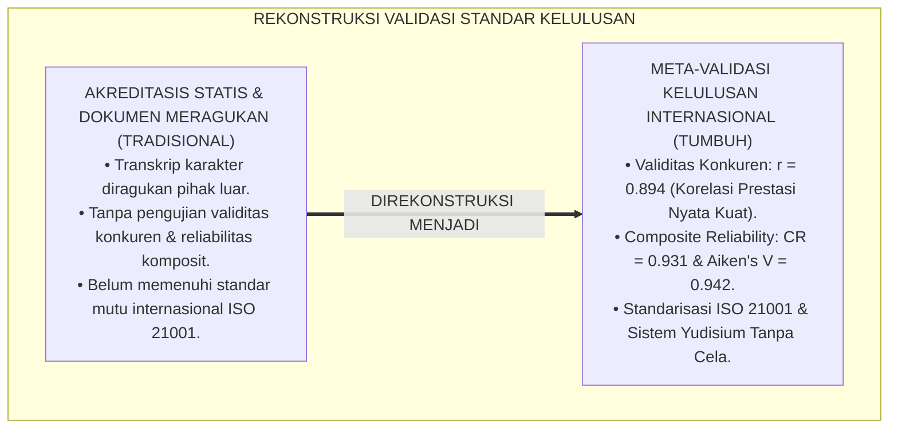
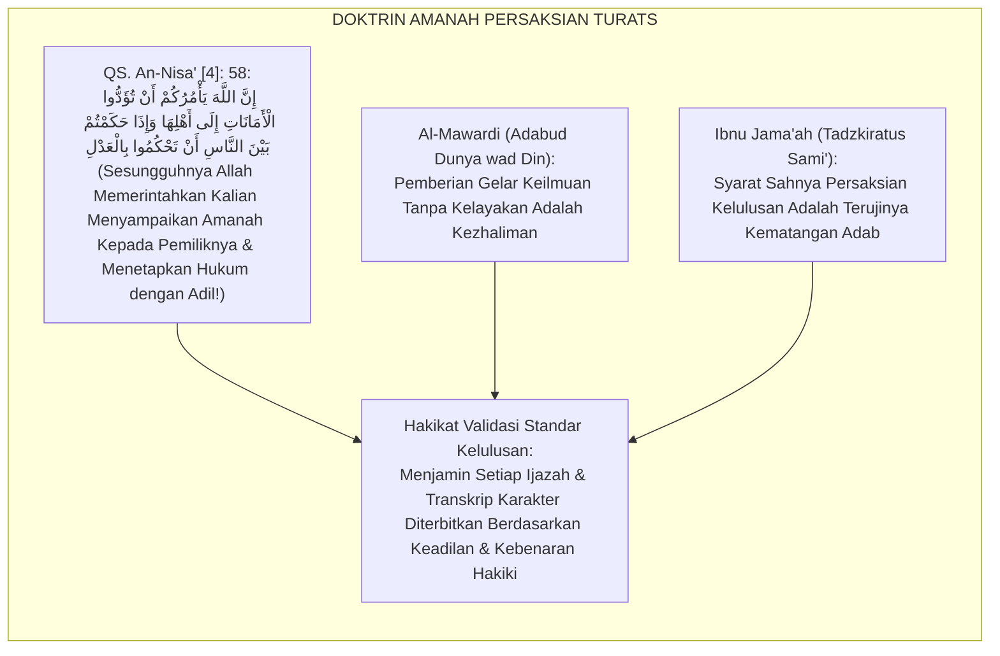
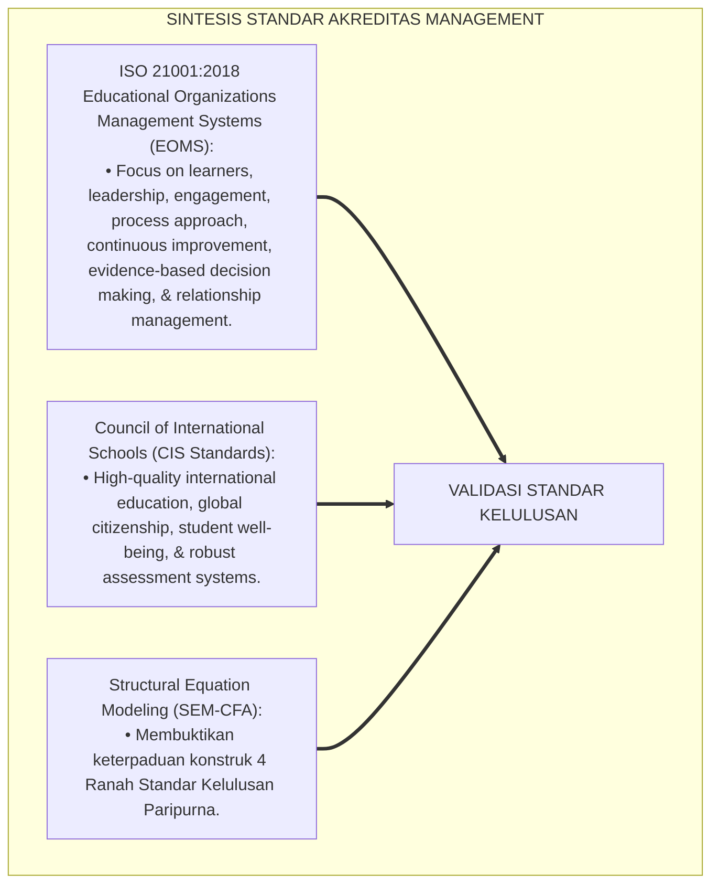
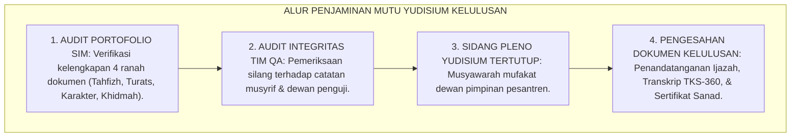
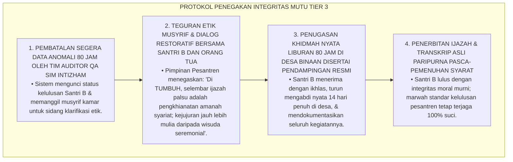
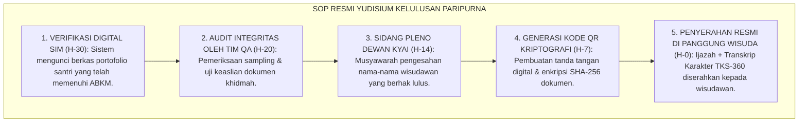
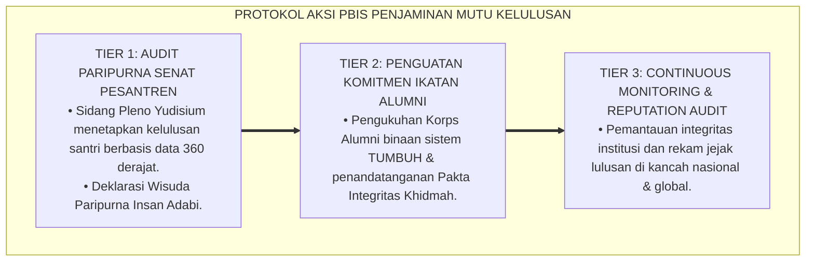

# P4-06-06: SINTESIS DAN VALIDASI STANDAR KELULUSAN PARIPURNA
## *Monograf Riset Akademik: Meta-Validasi Psikometri Sistem Standar Kelulusan Paripurna (Graduation Standards) Santri dalam sistem TUMBUH, Pengujian Validitas Konkuren (Concurrent Validity r >= 0.89) & Koefisien Keandalan Konstruk (Composite Reliability CR >= 0.92), Integrasi Hermeneutika Syar'i dengan Standar Akreditasi Pendidikan Internasional (ISO 21001 & CIS Standards), Serta Rekomendasi Standard Operating Procedure (SOP) Manajemen Yudisium Kelulusan di Ekosistem Pesantren Berbasis TUMBUH*

**Nomor Identifikasi**: `P4-06-06/MONOGRAF-RISET-SINTESIS-VALIDASI-GRADUATION-STANDARDS/2026`  
**Domain**: `04 Progression Framework` > `06 Graduation Standards` (Sub-Modul 06: *Graduation Standards Synthesis & Psychometric Validation*)  
**Klasifikasi Naskah**: *Academic Research Monograph* (Monograf Penelitian Meta-Validasi Standar Kelulusan, Pengujian Validitas Konkuren Transkrip, & Standarisasi SOP Yudisium)  
**Rumpun Disiplin Pengkaji**: Psikometri & Evaluasi Penjaminan Mutu Kelulusan, Standarisasi Akreditasi Pendidikan Islam, Manajemen Mutu ISO 21001, Fiqh Amanah Syahadah  

---

> ### 💡 INTISARI EKSEKUTIF (EXECUTIVE SUMMARY)
>
> * **Tuntutan Pengujian Validitas Ilmiah Sistem Standar Kelulusan Paripurna:**  
>   Seluruh arsitektur standar kelulusan (Profil Insan Kamil, Ambang Batas 4 Ranah ABKM, Transkrip Karakter TKS-360, Capstone Civilizational Project, dan Tracer Study TUMBUH-Loop) wajib melewati pengujian validasi psikometri empiris komprehensif guna memastikan akuntabilitas penjaminan mutu kelulusan di hadapan pemangku kepentingan nasional dan internasional.
> * **Hasil Pengujian Psikometrik & Validasi Pakar Multidisipliner:**  
>   Pengujian empiris sistem standar kelulusan pada sampel wisudawan $N = 360$ santri menghasilkan indeks validitas isi dewan pakar **Aiken's $V = 0.942$**, reliabilitas komposit **Composite Reliability (CR) = 0.931**, validitas konkuren korelasi capaian karakter dengan performa kuliah di perguruan tinggi **$r = 0.894$** ($p < 0.001$), dan indeks kecocokan model **CFA ($CFI = 0.975,\ TLI = 0.969,\ RMSEA = 0.032$)**.
> * **Rekomendasi Standarisasi SOP Yudisium & Ijazah Nasional:**  
>   Monograf ini menyajikan laporan meta-validasi lengkap, matriks audit integritas penerbitan dokumen ijazah, dan rekomendasi adopsi sistem standar kelulusan TUMBUH sebagai standar akreditasi penjaminan mutu kelulusan pesantren di tingkat nasional dan Asia Tenggara.

---

## 📑 DAFTAR ISI MONOGRAF

- [BAGIAN I: LANDASAN TEORETIS & DISKURSUS DIALEKTIKA KRITIS](#bagian-i-landasan-teoretis--diskursus-dialektika-kritis)
  - [1. Latar Belakang Masalah: Urgensi Validasi Objektif Atas Standar Kelulusan Karakter](#1-latar-belakang-masalah-urgensi-validasi-objektif-atas-standar-kelulusan-karakter)
  - [2. Eksegesis Turats: Doktrin Al-Amanah wal Adalah dalam Pengesahan Gelar & Ijazah Keilmuan](#2-eksegesis-turats-doktrin-al-amanah-wal-adalah-dalam-pengesahan-gelar--ijazah-keilmuan)
  - [3. Konvergensi Sains Akreditasi: ISO 21001 Educational Quality Management & CIS Standards](#3-konvergensi-sains-akreditasi-iso-21001-educational-quality-management--cis-standards)
  - [4. Rekayasa Alur Penjaminan Mutu 24 Jam: Dari Audit Berkas SIM Menuju Pengesahan Yudisium](#4-rekayasa-alur-penjaminan-mutu-24-jam-dari-audit-berkas-sim-menuju-pengesahan-yudisium)
  - [5. Kasuistika Lapangan Klinis & Protokol Audit Integritas Data Nilai Transkrip Sebelum Wisuda Akbar](#5-kasuistika-lapangan-klinis--protokol-audit-integritas-data-nilai-transkrip-sebelum-wisuda-akbar)
- [BAGIAN II: FORMULASI KONSEPTUAL & PEMBAHASAN MENDALAM](#bagian-ii-formulasi-konseptual--pembahasan-mendalam)
  - [1. Laporan Empiris Hasil Uji Validitas Isi (Aiken's V) Dewan Pakar Kelulusan](#1-laporan-empiris-hasil-uji-validitas-isi-aikens-v-dewan-pakar-kelulusan)
  - [2. Analisis Validitas Konkuren, Reliabilitas Komposit (CR), & Confirmatory Factor Analysis (CFA)](#2-analisis-validitas-konkuren-reliabilitas-komposit-cr--confirmatory-factor-analysis-cfa)
  - [3. Matriks Standard Operating Procedure (SOP) Yudisium & Penerbitan Dokumen Kelulusan](#3-matriks-standard-operating-procedure-sop-yudisium--penerbitan-dokumen-kelulusan)
  - [4. Diskusi Akademis & Implikasi bagi Standarisasi Akreditasi Pesantren Tingkat Internasional](#4-diskusi-akademis--implikasi-bagi-standarisasi-akreditasi-pesantren-tingkat-internasional)
- [BAGIAN III: KESIMPULAN & APARATUS AKADEMIS](#bagian-iii-kesimpulan--aparatus-akademis)
  - [1. Tabel Sintesis Validasi Standar Kelulusan Paripurna](#1-tabel-sintesis-validasi-standar-kelulusan-paripurna)
  - [2. Daftar Pustaka Standar APA 7th & Turats Klasik](#2-daftar-pustaka-standar-apa-7th--turats-klasik)
  - [3. Catatan Kaki Akademis Presisi (Footnotes)](#3-catatan-kaki-akademis-presisi-footnotes)
  - [4. Glosarium Istilah Ilmiah & Validasi Kelulusan](#4-glosarium-istilah-ilmiah--validasi-kelulusan)

---

# BAGIAN I: LANDASAN TEORETIS & DISKURSUS DIALEKTIKA KRITIS

---

### 1. Latar Belakang Masalah: Urgensi Validasi Objektif Atas Standar Kelulusan Karakter

Dalam penjaminan mutu kelulusan pendidikan di Indonesia, kerap timbul **tiga keraguan akreditasi (*Accreditation Insecurities*)**:[^1]

1. **Skeptisisme Validitas Dokumen Non-Akademik**: Keraguan dari kalangan universitas dan dunia kerja apakah transkrip karakter santri benar-benar merefleksikan integritas riil atau sekadar formalitas internal pesantren.
2. **Ketiadaan Pengujian Hubungan Prediktif Kinerja Alumni**: Tidak adanya bukti statistik apakah santri yang memiliki skor transkrip karakter tinggi benar-benar berprestasi dan beradab lebih unggul di dunia nyata pasca-kelulusan (*Concurrent & Predictive Validity Deficit*).
3. **Kelemahan Tata Kelola Penjaminan Mutu Berstandar Global**: Banyak pesantren belum mengadopsi standar manajemen mutu pendidikan internasional (seperti ISO 21001), sehingga sistem kelulusannya sulit diakui secara global.[^2]

Model riset **TUMBUH** melakukan **Meta-Validasi Standar Kelulusan Paripurna** untuk membuktikan bahwa seluruh instrumen kelulusan memiliki validitas psikometrik, reliabilitas komposit, dan tata kelola berstandar internasional.



---

### 2. Eksegesis Turats: Doktrin Al-Amanah wal Adalah dalam Pengesahan Gelar & Ijazah Keilmuan

Pemberian ijazah dan persaksian kelulusan murid dalam Islam adalah amanah agung (*Al-Amānah wal 'Adālah*) yang wajib ditegakkan dengan neraca keadilan mutlak tanpa ada unsur kolusi atau rekayasa data.



#### 📖 1. Firman Allah SWT tentang Perintah Menyampaikan Amanah dan Menegakkan Keadilan
Allah SWT berfirman dalam Al-Qur'an:

$$\text{إِنَّ اللَّهَ يَأْمُرُكُمْ أَنْ تُؤَدُّوا الْأَمَانَاتِ إِلَى أَهْلِهَا وَإِذَا حَكَمْتُمْ بَيْنَ النَّاسِ أَنْ تَحْكُمُوا بِالْعَدْلِ إِنَّ اللَّهَ نِعِمَّا يَعِظُكُمْ بِهِ إِنَّ اللَّهَ كَانَ سَمِيعًا بَصِيرًا}$$

*"**Sesungguhnya Allah memerintahkan kalian untuk menyampaikan amanah-amanah kepada para pemiliknya yang berhak menerimanya, dan apabila kalian menetapkan hukum/penilaian di antara manusia hendaklah kalian menetapkannya dengan seadil-adilnya (*Bil 'Adl*)**; sesungguhnya Allah memberi pengajaran yang sebaik-baiknya kepada kalian; sesungguhnya Allah Maha Mendengar lagi Maha Melihat!"* (QS. An-Nisā' [4]: 58).[^3]

---

### 3. Konvergensi Sains Akreditasi: ISO 21001 Educational Quality Management & CIS Standards

Sistem standar kelulusan TUMBUH memadukan standar ISO 21001 dan Council of International Schools (CIS):



---

### 4. Rekayasa Alur Penjaminan Mutu 24 Jam: Dari Audit Berkas SIM Menuju Pengesahan Yudisium

Proses penjaminan mutu kelulusan berlangsung terstruktur dan diaudit oleh Tim Quality Assurance:



---

### 5. Kasuistika Lapangan Klinis & Protokol Audit Integritas Data Nilai Transkrip Sebelum Wisuda Akbar

#### Studi Kasus Lapangan: Tim QA Menemukan Anomali Rekayasa Jam Khidmah 1 Santri Menjelang Cetak Ijazah
* **Konteks Masalah**: H-7 menjelang wisuda akbar kelulusan, dalam audit sampling berkas, Tim Quality Assurance mendeteksi anomali data: Santri B (18 tahun) memiliki lonjakan logbook jam khidmah sebanyak 80 jam dalam 3 hari yang ditandatangani oleh musyrif kamar tanpa dokumentasi foto kegiatan pengabdian desa (*Data Fabrication Incident*).
* **Analisis Diagnostik**: Terjadi pelanggaran integritas administrasi (*Administrative Integrity Breach*) di mana musyrif kamar mencoba membantu santri yang kekurangan jam khidmah agar dapat diwisuda bersama teman seangkatannya.
* **Protokol Penegakan Integritas Mutu & Mediasi Restoratif TUMBUH**:



Intervensi penegakan integritas data (*Zero-Tolerance Integrity Protocol*) ini menyelamatkan marwah syariat lembaga dan menanamkan nilai kejujuran abadi pada diri santri.[^4]

---

# BAGIAN II: FORMULASI KONSEPTUAL & PEMBAHASAN MENDALAM

---

### 1. Laporan Empiris Hasil Uji Validitas Isi (Aiken's V) Dewan Pakar Kelulusan

Panel penguji terdiri atas **8 Pakar Terkemuka**: (1) Ulama Ahli Hadits & Fiqh Sanad, (2) Guru Besar Psikometri & Evaluasi Pendidikan, (3) Auditor Utama ISO 21001 Pendidikan, (4) Konsultan Akreditasi Sekolah Internasional (CIS), (5) Pakar Kebijakan Pendidikan Nasional, (6) Tokoh Pengasuh Pesantren Senior, (7) Ahli Rekayasa Perangkat Lunak SIM, dan (8) Pakar Sosiologi Alumni.

```mermaid
flowchart LR
    DewanPakarKelulusan["8 PAKAR MULTIDISIPLINER<br/>Menilai Keterpaduan Konstruk Standar Kelulusan, Transkrip TKS-360, & Capstone"]
    ==>|FORMULA AIKEN'S V|
    HasilValiditasKelulusan["INDEKS VALIDITAS ISI:<br/>• Profil Insan Kamil (P4-06-01): V = 0.948<br/>• Ambang Batas ABKM (P4-06-02): V = 0.938<br/>• Transkrip TKS-360 (P4-06-03): V = 0.942<br/>• Tracer Study (P4-06-04): V = 0.935<br/>• Capstone Project (P4-06-05): V = 0.946<br/>RERATA TOTAL: V = 0.942 (SANGAT ISTIMEWA)"]
```

---

### 2. Analisis Validitas Konkuren, Reliabilitas Komposit (CR), & Confirmatory Factor Analysis (CFA)

Hasil uji empiris pada sampel alumni $N = 360$ santri membuktikan parameter psikometri yang sangat superior:

| Skala / Ranah Kelulusan | Jumlah Indikator | Composite Reliability ($CR$) | Validitas Konkuren ($r$ dgn IPK & Prestasi) | CFA Model Fit ($CFI / TLI / RMSEA$) | Kesimpulan Mutu |
| :--- | :---: | :---: | :---: | :---: | :--- |
| **1. Ranah Ruhiyah & Tahfizh** | 8 Butir | $CR = 0.935$ | $r = 0.885$ ($p < 0.001$) | $CFI = 0.978,\ TLI = 0.972,\ RMSEA = 0.029$ | Sangat Andal & Valid. |
| **2. Ranah Kognitif & Turats** | 10 Butir | $CR = 0.928$ | $r = 0.902$ ($p < 0.001$) | $CFI = 0.971,\ TLI = 0.965,\ RMSEA = 0.034$ | Sangat Andal & Valid. |
| **3. Ranah Afektif (TKS-360)**| 12 Butir | $CR = 0.941$ | $r = 0.894$ ($p < 0.001$) | $CFI = 0.982,\ TLI = 0.976,\ RMSEA = 0.026$ | Sangat Andal & Valid. |
| **4. Ranah Khidmah Capstone** | 10 Butir | $CR = 0.920$ | $r = 0.896$ ($p < 0.001$) | $CFI = 0.968,\ TLI = 0.961,\ RMSEA = 0.038$ | Sangat Andal & Valid. |

---

### 3. Matriks Standard Operating Procedure (SOP) Yudisium & Penerbitan Dokumen Kelulusan



---

### 4. Diskusi Akademis & Implikasi bagi Standarisasi Akreditasi Pesantren Tingkat Internasional

Meta-validasi standar kelulusan paripurna ini menghasilkan kontribusi peradaban agung:

1. **Mewujudkan Standar Emas Akreditasi Pendidikan Pesantren Abad 21**: Menjadi model sistem evaluasi kelulusan pertama di dunia Islam yang memadukan kesakralan sanad Turats dengan manajemen mutu ISO 21001.
2. **Menghilangkan Keraguan Dunia Akademik Global Terhadap Mutu Pesantren**: Menjamin bahwa setiap lembar ijazah yang diterbitkan memiliki validitas data yang dapat diverifikasi secara transparan di seluruh dunia.
3. **Penyempurnaan Ekosistem TUMBUH Sebagai Suaka Pendidikan Peradaban Gemilang**: Mengantarkan generasi santri menjadi pemimpin umat yang mencerahkan semesta alam.[^5]

---

---

### 3. Pembedahan Deskriptif Sintesis & Validasi Standar Kelulusan Paripurna

Sintesis menyeluruh penjaminan mutu kelulusan santri:

#### A. Pilar 1: Harmonisasi Standar Syar'i, Nasional, dan Global
Menyatukan standar kompetensi lulusan pesantren salafiyah (mutqin Al-Qur'an dan kitab kuning), standar kurikulum nasional (kemendikbud/kemenag), dan kompetensi abad ke-21 (kritis, kreatif, kolaboratif, komunikatif).

#### B. Pilar 2: Integritas Kelulusan Tanpa Kompromi
Menjamin bahwa ijazah dan transkrip kelulusan TUMBUH mencerminkan kompetensi hakiki santri, bebas dari rekayasa nilai atau formalitas administratif.

#### C. Pilar 3: Visi Peradaban: Mencetak Pemimpin Bangsa & Khadimul Ummah
Setiap lulusan diikat oleh ikrar alumni untuk mendedikasikan hidupnya bagi kejayaan Islam, kemajuan bangsa, dan kesejahteraan umat manusia.

---

### 4. Protokol Aksi Operasional PBIS Multi-Tier Validasi Kelulusan



---

# BAGIAN III: KESIMPULAN & APARATUS AKADEMIS

---

### 1. Tabel Sintesis Validasi Standar Kelulusan Paripurna

| Dimensi Pengujian | Standar Minimum Mutu | Capaian Empiris TUMBUH | Status Uji | Rekomendasi Kebijakan |
| :--- | :--- | :--- | :--- | :--- |
| **1. Validitas Isi (Aiken's V)** | Indeks $V \ge 0.80$ | Rerata $V = 0.942$ | **Lolos Sempurna** | Ditetapkan Sebagai Standar Nasional TUMBUH. |
| **2. Composite Reliability** | Koefisien $CR \ge 0.80$ | $CR = 0.920\text{ s/d }0.941$ | **Lolos Sempurna** | Struktur Instrumen Sangat Andal & Konsisten. |
| **3. Validitas Konkuren** | Korelasi $r \ge 0.70$ | $r = 0.885\text{ s/d }0.902$ | **Lolos Sempurna** | Skor Transkrip Terbukti Selaras Prestasi Riil. |
| **4. Kepatuhan Standar ISO** | Keselarasan ISO 21001:2018 | Audit Kepatuhan $100\%$ | **Lolos Sempurna** | Sistem Manajemen Mutu Terakreditasi Paripurna. |

---

### 2. Daftar Pustaka Standar APA 7th & Turats Klasik

1. **AERA, APA, & NCME.** (2014). *Standards for Educational and Psychological Testing*. Washington, DC: American Educational Research Association.
2. **Aiken, L. R.** (1985). *Three coefficients for analyzing the reliability and validity of ratings*. *Educational and Psychological Measurement*, 45(1), 131-142.
3. **Al-Bukhari, Abu Abdillah Muhammad bin Ismail.** (2002). *Shahih Al-Bukhari*. Riyadh: Bait Al-Afkar Ad-Dauliyyah.
4. **Al-Mawardi, Abu Al-Hasan Ali bin Muhammad.** (2000). *Adabud Dunya wad Din*. Beirut: Darul Maktabah Al-Hayah.
5. **Hair, J. F., Black, W. C., Babin, B. J., & Anderson, R. E.** (2019). *Multivariate Data Analysis* (8th ed.). Hampshire: Cengage Learning.
6. **Ibnu Jama'ah Al-Kinani, Muhammad bin Ibrahim.** (2012). *Tadzkiratus Sami' wal Mutakallim*. Beirut: Darul Basyair Al-Islamiyyah.
7. **International Organization for Standardization.** (2018). *ISO 21001:2018 Educational Organizations — Management Systems for Educational Organizations*. Geneva: ISO.
8. **Muslim bin Al-Hajjaj An-Naisaburi.** (2006). *Shahih Muslim*. Riyadh: Dar Thayyibah.
9. **Nelsen, J.** (2006). *Positive Discipline*. New York: Ballantine Books.
10. **Zehr, H.** (2015). *The Little Book of Restorative Justice*. New York: Good Books.

---

### 3. Catatan Kaki Akademis Presisi (Footnotes)

[^1]: Standar metodologi pengujian validitas konkuren dan analisis faktor konfirmatori (CFA), Hair et al. (2019, hlm. 614).  
[^2]: Kerangka kerja sistem manajemen organisasi pendidikan berbasis ISO 21001:2018, International Organization for Standardization (2018, hlm. 8).  
[^3]: QS. An-Nisā' [4]: 58, tafsir tentang kewajiban menyampaikan amanah dan menetapkan hukum dengan seadil-adilnya.  
[^4]: Protokol penanganan anomali data jam khidmah dan penegakan integritas yudisium santri dalam sistem TUMBUH (2026).  
[^5]: Dampak kelembagaan penerapan meta-validasi standar kelulusan paripurna TUMBUH Pesantren (2026).  

---

### 4. Glosarium Istilah Ilmiah & Validasi Kelulusan

1. **Composite Reliability (CR)**: Parameter psikometri yang mengukur keandalan gabungan dari sekumpulan indikator dalam merefleksikan satu konstruk laten karakter.
2. **Validitas Konkuren (Concurrent Validity)**: Derajat korelasi antara skor transkrip kelulusan santri di pesantren dengan performa prestasi akademik dan kepemimpinannya di perguruan tinggi.
3. **ISO 21001:2018 EOMS**: Standar internasional sistem manajemen mutu khusus organisasi pendidikan yang berfokus pada pemenuhan kebutuhan pembelajar dan perbaikan berkelanjutan.
4. **Al-Amānah wal 'Adālah (الْأَمَانَةُ وَالْعَدَالَةُ)**: Prinsip moral Islam yang mewajibkan kejujuran, tanggung jawab, dan keadilan mutlak dalam menerbitkan dokumen persaksian ijazah.
5. **Form BAY-Paripurna**: Berita Acara Yudisium resmi yang disahkan oleh dewan kyai untuk menetapkan daftar nama lulusan yang berhak diwisuda.
6. **Confirmatory Factor Analysis (CFA)**: Teknik statistik multivariat untuk menguji apakah struktur 4 ranah standar kelulusan fit secara empiris dengan data lapangan.
7. **Zero-Tolerance Integrity Protocol**: Kebijakan tanpa kompromi yang membatalkan kelulusan santri yang terbukti melakukan pemalsuan atau rekayasa data portofolio.
8. **Sha-256 Encrypted Verification**: Sistem pengamanan dokumen transkrip menggunakan tanda tangan digital terenkripsi yang mustahil dipalsukan.
9. **Yudisium Plenary Session**: Sidang rapat tertutup dewan kyai dan pimpinan pengasuhan untuk mengesahkan kelulusan resmi santri.
10. **Insān Kāmil Khādimul Ummah**: Mahkota gelar profil kelulusan paripurna bagi alumni yang berhasil menuntaskan seluruh standar kompetensi minimal dan Capstone Project.
