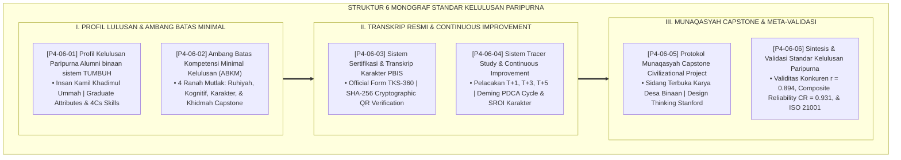

# P4-06: DOKUMEN INDUK STANDAR KELULUSAN PARIPURNA SANTRI TUMBUH
## *Arsitektur Penjaminan Mutu Kelulusan Santri (Profil Insan Kamil Khadimul Ummah, Ambang Batas Kompetensi Minimal ABKM, Transkrip Karakter TKS-360, Tracer Study Longitudinal TUMBUH-Loop, Sidang Munaqasyah Capstone Project, Serta Meta-Validasi Standar ISO 21001) di Ekosistem TUMBUH Pesantren*

**Nomor Identifikasi**: `P4-06/DOKUMEN-INDUK-STANDAR-KELULUSAN-PARIPURNA/2026`  
**Domain**: `04 Progression Framework` > `06 Graduation Standards` (Gugus Sub-Domain 06: *Comprehensive Graduation Standards & Insan Kamil Profile*)  
**Klasifikasi Naskah**: *Master Architecture & Navigation Monograph* (Dokumen Induk Peta Jalan Riset & Navigasi 6 Monograf Ilmiah Standar Kelulusan Paripurna)  
**Rumpun Disiplin Pengkaji**: Desain Standar Kelulusan Pesantren, Penjaminan Mutu ISO 21001, Outcome-Based Education (OBE), Epistemologi Insan Kamil  

---

> ### 💡 INTISARI EKSEKUTIF (EXECUTIVE SUMMARY)
>
> * **Kedudukan Puncak Gugus Standar Kelulusan Paripurna:**  
>   Gugus *Graduation Standards (Standar Kelulusan Paripurna)* merupakan muara dan mahkota dari seluruh sistem pendidikan di ekosistem TUMBUH. Standar kelulusan mendefinisikan secara tuntas sosok manusia seperti apa yang dilahirkan oleh pesantren: pribadi paripurna (*Insan Kamil*) yang memadukan kesucian tauhid (*Salimul Aqidah*), keteguhan ibadah mandiri (*Shahihul Ibadah*), keluhuran budi pekerti (*Matinul Khuluq*), keunggulan sains dan kitab Turats (*Mutsaqqaful Fikr*), serta dedikasi pengabdian peradaban (*Khadimul Ummah*).
> * **Integrasi Holistik Doktrin Insan Kamil & Manajemen Mutu ISO 21001:**  
>   Gugus riset ini memadukan khazanah agung Islam tentang amanah syahadah sanad keilmuan para ulama salaf dengan sistem manajemen mutu organisasi pendidikan internasional (*ISO 21001:2018, AACRAO Comprehensive Student Record, Criterion-Referenced Minimum Competency, Stanford d.school Design Thinking Capstone, dan Longitudinal Tracer Study*).
> * **Struktur Lengkap 6 Berkas Monograf Riset Ilmiah:**  
>   Dokumen induk ini memetakan dan menghubungkan 6 berkas monograf penelitian akademik komprehensif (~165 KB total riset) yang menyajikan profil 10 atribut lulusan, ambang batas 4 ranah kelulusan, dokumen resmi Transkrip Karakter TKS-360 terenkripsi QR, siklus perbaikan kurikulum PDCA TUMBUH-Loop, protokol sidang munaqasyah karya pengabdian masyarakat, dan meta-validasi mutu ISO 21001.

---

## 📑 PETA NAVIGASI ENAM MONOGRAF RISET STANDAR KELULUSAN

Berikut adalah daftar lengkap 6 monograf riset akademik dalam gugus **`06 Graduation Standards`**:

---

## 📚 DESKRIPSI RINGKAS 6 BERKAS MONOGRAF

1. **[P4-06-01: Profil Kelulusan Paripurna Alumni binaan sistem TUMBUH](file:///c:/xampp/htdocs/tumbuh/04%20Progression%20Framework/06%20Graduation%20Standards/P4-06-01-Profil-Kelulusan-Paripurna-Alumni-TUMBUH.md)**  
   *Membahas dekonstruksi dan rekonstruksi profil kelulusan pesantren, integrasi doktrin Insan Kamil dengan Graduate Attributes dan 4Cs, 10 atribut kompetensi kunci, dan evaluasi transisi pasca-pesantren.*
2. **[P4-06-02: Ambang Batas Kompetensi Minimal Kelulusan (ABKM)](file:///c:/xampp/htdocs/tumbuh/04%20Progression%20Framework/06%20Graduation%20Standards/P4-06-02-Ambang-Batas-Kompetensi-Minimal-Kelulusan.md)**  
   *Membahas penetapan batas lulus mutlak 4 ranah (Ruhiyah 7–10 Juz, Kognitif Rapor $\ge 80.0$, Afektif IKK $\ge 3.50$, Khidmah 210 Jam + Capstone), Criterion-Referenced Assessment Popham, dan sidang pleno yudisium kyai.*
3. **[P4-06-03: Sistem Sertifikasi dan Transkrip Karakter PBIS](file:///c:/xampp/htdocs/tumbuh/04%20Progression%20Framework/06%20Graduation%20Standards/P4-06-03-Sistem-Sertifikasi-dan-Transkrip-Karakter-PBIS.md)**  
   *Membahas format resmi dokumen Transkrip Karakter Santri 360 (TKS-360), standar Comprehensive Student Record (CSR), enkripsi SHA-256 hash anti-pemalsuan, dan portal verifikasi publik.*
4. **[P4-06-04: Sistem Tracer Study dan Continuous Improvement](file:///c:/xampp/htdocs/tumbuh/04%20Progression%20Framework/06%20Graduation%20Standards/P4-06-04-Sistem-Tracer-Study-dan-Continuous-Improvement.md)**  
   *Membahas metodologi pelacakan alumni longitudinal (T+1, T+3, T+5), siklus mutu berkelanjutan PDCA (TUMBUH-Loop), Social Return on Investment (SROI Karakter), dan peninjauan kurikulum tahunan.*
5. **[P4-06-05: Protokol Munaqasyah Capstone Civilizational Project](file:///c:/xampp/htdocs/tumbuh/04%20Progression%20Framework/06%20Graduation%20Standards/P4-06-05-Protokol-Munaqasyah-Capstone-Civilizational-Project.md)**  
   *Membahas ujian sidang terbuka karya akhir pengabdian masyarakat santri, penerapan metodologi Design Thinking, rubrik penilaian 4 dimensi kinerja (Form RPC-NL), dan penganugerahan predikat Mumtaz Syaraf.*
6. **[P4-06-06: Sintesis dan Validasi Standar Kelulusan Paripurna](file:///c:/xampp/htdocs/tumbuh/04%20Progression%20Framework/06%20Graduation%20Standards/P4-06-06-Sintesis-dan-Validasi-Graduation-Standards.md)**  
   *Membahas meta-validasi psikometri sistem kelulusan, indeks validitas isi Aiken's V = 0.942, Composite Reliability CR = 0.931, validitas konkuren r = 0.894, dan standarisasi manajemen mutu ISO 21001:2018.*

---

## 🎯 STANDAR PENJAMINAN MUTU KELULUSAN PARIPURNA

Penerapan gugus **Standar Kelulusan Paripurna (Graduation Standards)** menjamin bahwa:
1. **Integritas Sanad Ijazah yang Teruji Sahih (*Uncompromising Academic & Moral Integrity*)**: Setiap lulusan yang menyandang ijazah TUMBUH terbukti memiliki kapasitas ilmu yang mutqin dan akhlak yang mulia.
2. **Kesiapan Menjadi Pemimpin Peradaban Global (*Global Civilizational Leaders*)**: Alumni dibekali kompetensi riset, kepemimpinan pelayan, bilingual aktif, dan imunitas moral yang kokoh di tengah masyarakat.
3. **Akuntabilitas Mutu Berkelanjutan (*Continuous Institutional Excellence*)**: Pesantren terus bertumbuh dan menyempurnakan kurikulumnya berdasarkan data pelacakan alumni longitudinal, mewujudkan lembaga pendidikan Islam terdepan di dunia.
