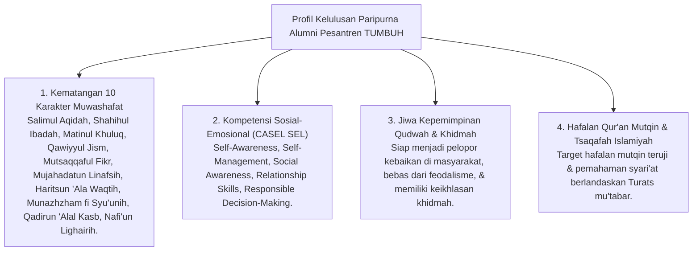

# P4-06: Standar Kelulusan Paripurna Santri TUMBUH

## Status Dokumen
* **Status**: 🌟 **A+ (Tervalidasi & Siap Diimplementasikan)**
* **Sub-Domain**: `04 Progression Framework / 06 Graduation Standards`
* **Penanggung Jawab Keilmuan**: Dewan Keilmuan TUMBUH (*Pakar Desain Kurikulum Adab & Pakar Metodologi Riset*)

---

## 1. Arsitektur Profil Lulusan Paripurna Santri TUMBUH

---

## 2. Matriks Capaian Minimal Kelulusan (Minimum Competency Threshold)

| Dimensi Kelulusan | Ambang Capaian Minimum (T4 Level) | Instrumen Verifikasi Kelulusan |
| :--- | :--- | :--- |
| **Ibadah & Aqidah** | Aqidah salimah bebas syirik/khurafat; ibadah wajib & sunnah rutin atas kesadaran diri. | Ujian Praktik Ibadah & Asesmen Portofolio Mutabaah. |
| **Hafalan Al-Qur'an** | Capaian target hafalan teruji mutqin (minimal 5/10/30 juz sesuai jenjang program). | Ujian Tasmi' Al-Qur'an Sekali Duduk di Hadapan Penguji. |
| **Adab & Character** | Mencapai Level T4 (Kemandirian & Qudwah Hasanah) pada seluruh rubrik PBIS. | Rekam Portofolio Logbook Musyrif 360-Derajat. |
| **Sosial & Khidmah** | Menyelesaikan minimal 1 Proyek Pengabdian Masyarakat (*Khidmah Keumatan*) mandiri. | Laporan & Presentasi Proyek Khidmah Keumatan. |
| **Kemandirian (Kasb)** | Memiliki keterampilan vokasional dasar, kewirausahaan Islami, & literasi finansial. | Portofolio Proyek Kemandirian *Qadirun 'Alal Kasb*. |

---

## 3. Sertifikasi & Portofolio Kelulusan Santri

Alumni pesantren ekosistem **TUMBUH** menerima dua jenis dokumen kelulusan resmi:
1. **Ijazah Formal & Syahadah Hafalan**: Menandakan kelulusan akademik dan hafalan Al-Qur'an/Kitab.
2. **Sertifikat Transkrip Karakter & Portofolio Adab TUMBUH**: Transkrip berbasis data PBIS yang memuat rekam jejak pertumbuhan adab, regulasi diri, dan proyek kepemimpinan *Qudwah* dari tangga T1 hingga T4.

---

## 4. Evaluasi & Continuous Improvement Post-Alumni

- **Tracer Study Alumni**: Lembaga melakukan pemantauan berkala (*longitudinal follow-up*) terhadap kiprah alumni di perguruan tinggi dan masyarakat.
- **Umpan Balik Sistem**: Data keberhasilan alumni digunakan untuk menyempurnakan kurikulum dan progresi pembinaan di pesantren secara berkesinambungan (*Continuous Quality Improvement*).
