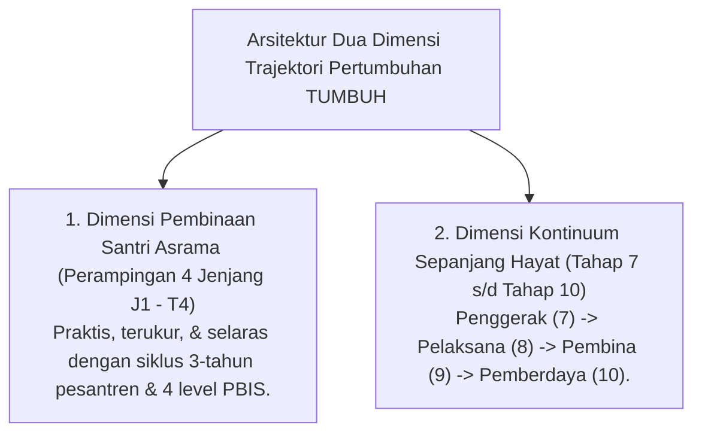
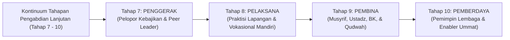
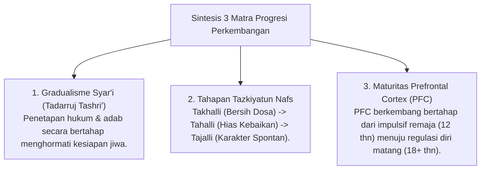
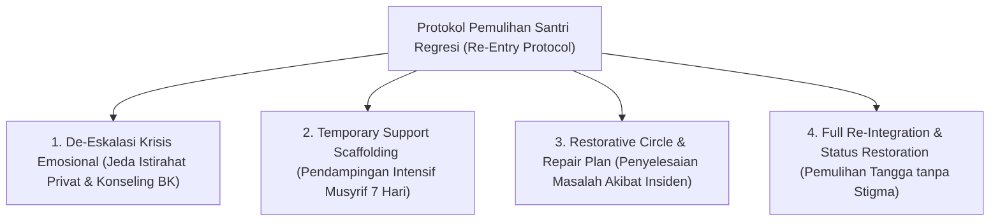

# MONOGRAF RISET AKADEMIK: TRAJEKTORI PROGRESI BERTAHAP DAN TANGGA TUMBUH (T1 - T4 S/D TAHAP 10)
## Analisis Integratif: Gradualisme Syar'i (Tadarruj), Perampingan 4 Tangga Santri, Uraian Rinci Tahapan 7-10 (Penggerak, Pelaksana, Pembina, Pemberdaya), Neurosains Perkembangan, dan Re-Entry Protocol

**Dewan Riset & Keilmuan Ekosistem TUMBUH**  
*Dipublikasikan sebagai Naskah Monograf Riset Ilmiah (Jurnal Kebijakan & Progresi Perkembangan Santri)*  
*Dokumen Rujukan Induk: Domain 04 Progression Framework & Book Series Volume 01-04*

---

## ABSTRAK

> **Latar Belakang**: Trajektori perkembangan manusia tidak berhenti saat santri lulus dari pesantren. Sistem pembinaan yang utuh harus memadukan perampingan fungsional 4 tangga santri di asrama dengan kontinuum perkembangan dewasa sepanjang hayat (*Adult Lifelong Development Continuum*).
>
> **Tujuan Penelitian**: Merumuskan dan memvalidasi **Model Harmonis 4 Tangga Santri (J1-J4)** dan **Uraian Rinci Tahapan Pertumbuhan Lanjutan (Tahap 7 Penggerak, Tahap 8 Pelaksana, Tahap 9 Pembina, Tahap 10 Pemberdaya)**.
>
> **Hasil Riset**: Terstruktur 2 Dimensi Trajektori Pertumbuhan: (1) **Dimensi Pembinaan Santri (J1-J4)** untuk 3 tahun pendidikan pesantren; dan (2) **Dimensi Trajektori Pasca-Santri & Pendidik (Tahap 7-10)** yang mendefinisikan peran **Penggerak (7)**, **Pelaksana (8)**, **Pembina (9)**, dan **Pemberdaya (10)** dalam ekosistem keumatan.
>
> **Kata Kunci**: *Progression Framework, Jenjang Kemandirian TUMBUH (J1–J4), Perampingan 4 Tangga, Penggerak, Pelaksana, Pembina, Pemberdaya, Re-Entry Protocol.*

---

## 1. PENDAHULUAN & ARSITEKTUR TWO-DIMENSIONAL PROGRESSION

Perkembangan karakter dan adab dalam ekosistem **TUMBUH** memadukan kepraktisan pengamatan harian santri di asrama dengan visi jangka panjang pembinaan alumni dan pengasuh:

---

## 2. RASIONALE PERAMPINGAN 4 TANGGA SANTRI DI ASRAMA (T1 - T4)

Untuk kemudahan pengamatan harian Musyrif dan alignment dengan siklus pendidikan 3-tahun pesantren, 7 tahapan mikro awal disintesiskan menjadi **4 Tangga Utama Santri**:

| Tangga Santri | Tahapan Asli Draf | Pembagian Jenjang Pembinaan | Fokus Utama Indikator Perilaku |
| :--- | :--- | :--- | :--- |
| **T1: Adaptasi & Orientasi** | Tahap 1 | Year 1 (Semester 1) | *Psychological Safety*, orientasi adab, & penyesuaian kultur. |
| **T2: Habituasi Dasar** | Tahap 2 & 3 | Year 1 (Sem 2) – Year 2 (Sem 3) | *Habit Formation* 66-Hari, rutinitas ibadah, & soft prompt Musyrif. |
| **T3: Internalisasi Nilai** | Tahap 4 & 5 | Year 2 (Sem 4) – Year 3 (Sem 5) | Regulasi emosi mandiri (*SEL*), muhasabah, & empati sosial. |
| **T4: Kemandirian & Qudwah**| Tahap 6 & **7** | Year 3 (Sem 6 / Tingkat Akhir) | *Servant Leadership*, Mentoring Sebaya, & **Santri Penggerak**. |

---

## 3. URAIAN RINCI TAHAPAN PERTUMBUHAN LANJUTAN PASCA-SANTRI (TAHAP 7 - 10)

Melanjutkan fase santri, ekosistem **TUMBUH** merumuskan 4 tahapan kedewasaan pengabdian bagi alumni, pendidik, dan pengelola lembaga:

### Deskripsi Peran & Kompetensi Tahap 7 s/d 10:

1. **Tahap 7: PENGGERAK (Driver / Peer Leader)**
   - *Profil*: Santri senior T4 atau alumni muda yang aktif menggerakkan inisiatif kebaikan, memimpin organisasi santri, dan menjadi *Peer Buddy* bagi junior.
   - *Kompetensi*: Inisiatif sosial tinggi, keteladanan adab kamar, dan daya pengaruh positif (*Positive Peer Contagion*).

2. **Tahap 8: PELAKSANA (Executor / Practitioner)**
   - *Profil*: Alumni yang terjun ke masyarakat atau dunia profesional/vokasional dengan kemandirian finansial dan ketangguhan karya (*Qadirun 'Alal Kasb*).
   - *Kompetensi*: Etos kerja profesional Islami, mengeksekusi tugas lapangan secara mutqin, dan menjaga integritas adab di luar pesantren.

3. **Tahap 9: PEMBINA (Mentor / Educator / Qudwah)**
   - *Profil*: Musyrif asrama, Ustadz pengajar diniyyah, Wali Kelas, dan Konselor BK yang membimbing pertumbuhan generasi santri berikutnya.
   - *Kompetensi*: Penguasaan pedagogi restoratif *Firm & Kind*, konseling emosional, keikhlasan pengasuhan, dan keteladanan *Qudwah Hasanah*.

4. **Tahap 10: PEMBERDAYA (Enabler / Institutional Leader)**
   - *Profil*: Pimpinan pesantren, pengelola yayasan, pakar kurikulum, dan penggerak ekosistem keumatan.
   - *Kompetensi*: Kepemimpinan transformatif (*Servant Leadership*), perancangan sistem berbasis data PBIS, perlindungan anak, dan pemberdayaan masyarakat luas (*Nafi'un Lighairih* Paripurna).

---

## 4. KAJIAN INTEGRATIF PROGRESI (TURATS & NEUROSAINS)

---

## 5. PROTOKOL PENANGANAN REGRESI EMOSIONAL & PEMULIHAN SANTRI (RE-ENTRY PROTOCOL)

Untuk mengatasi santri T3/T4 yang mengalami kemunduran emosional (*relapse*) akibat krisis emosional atau masalah keluarga, ditetapkan protokol pemulihan 4-tahap:

---

## 6. DAFTAR PUSTAKA
* Clear, J. (2018). *Atomic Habits*. Avery.
* Kouzes, J. M., & Posner, B. Z. (2017). *The Leadership Challenge*. Wiley.
* Steinberg, L. (2008). Adolescent risk-taking. *Developmental Review*, 28(1), 78–106.
* Zimmerman, B. J. (2002). Self-regulated learner. *Theory Into Practice*, 41(2), 64–70.
