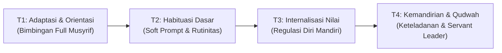
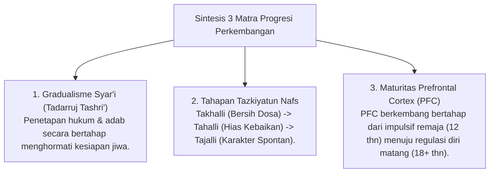

# MONOGRAF RISET AKADEMIK: TRAJEKTORI PROGRESI BERTAHAP DAN TANGGA TUMBUH (T1 - T4)
## Analisis Integratif: Gradualisme Syar'i (Tadarruj), Takhalli-Tahalli-Tajalli, dan Neurosains Perkembangan Remaja

**Dewan Riset & Keilmuan Ekosistem TUMBUH**  
*Dipublikasikan sebagai Naskah Monograf Riset Ilmiah (Jurnal Kebijakan & Progresi Perkembangan Santri)*  
*Dokumen Rujukan Induk: Domain 04 Progression Framework & Book Series Volume 01-04*

---

## ABSTRAK

> **Latar Belakang**: Kegagalan pembinaan karakter sering terjadi karena ekspektasi instan (*unrealistic expectation*) yang memaksakan tingkat kemandirian tinggi pada santri pemula tanpa memedulikan fase adaptasi dan maturitas neurobiologis.
>
> **Tujuan Penelitian**: Merumuskan dan menguji trajektori progresi perkembangan bertahap (**Tangga TUMBUH T1–T4**) yang menyelaraskan doktrin gradualisme Syar'i (*Tadarruj*), tahapan *Tazkiyatun Nafs*, dan tingkat kematangan otak remaja (*Prefrontal Cortex*).
>
> **Hasil Riset**: Terstruktur 4 Tangga Perkembangan Santri TUMBUH: (1) **T1 (Adaptasi & Orientasi)** - Berfokus pada rasa aman emosional (*Psychological Safety*) & penyesuaian kultur; (2) **T2 (Habituasi Dasar)** - Berfokus pada pembentukan rutinitas adab harian (*Habit Formation*); (3) **T3 (Internalisasi Nilai)** - Berfokus pada regulasi emosi mandiri (*SEL Mastery*); dan (4) **T4 (Kemandirian & Keteladanan / Qudwah)** - Berfokus pada kepemimpinan pelayanan (*Servant Leadership*) & khidmah keumatan.
>
> **Kata Kunci**: *Progression Framework, Tangga TUMBUH, Tadarruj, Takhalli-Tahalli-Tajalli, Qudwah.*

---

## 1. PENDAHULUAN & DIALEKTIKA PROGRESI

Progresi perkembangan karakter santri adalah hukum sunnatullah bertahap (*Sunnatut Tadarruj*). Pemaksaan aturan tanpa tahap pembiasaan melahirkan resistensi emosional dan pembangkangan tersembunyi.

---

## 2. KAJIAN INTEGRATIF PROGRESI (TURATS & NEUROSAINS)

---

## 3. IMPLIKASI KEBIJAKAN PENENTUAN LEVEL TANTANGAN
- **Scaffolding Bimbingan**: Santri T1 memperoleh pendampingan privat hangat Musyrif & Peer Buddy T4; Santri T4 diberikan amanah kepemimpinan dan khidmah desa.

---

## 4. DAFTAR PUSTAKA
* Clear, J. (2018). *Atomic Habits*. Avery.
* Steinberg, L. (2008). A social neuroscience perspective on adolescent risk-taking. *Developmental Review*, 28(1), 78–106.
* Zimmerman, B. J. (2002). Becoming a self-regulated learner. *Theory Into Practice*, 41(2), 64–70.
