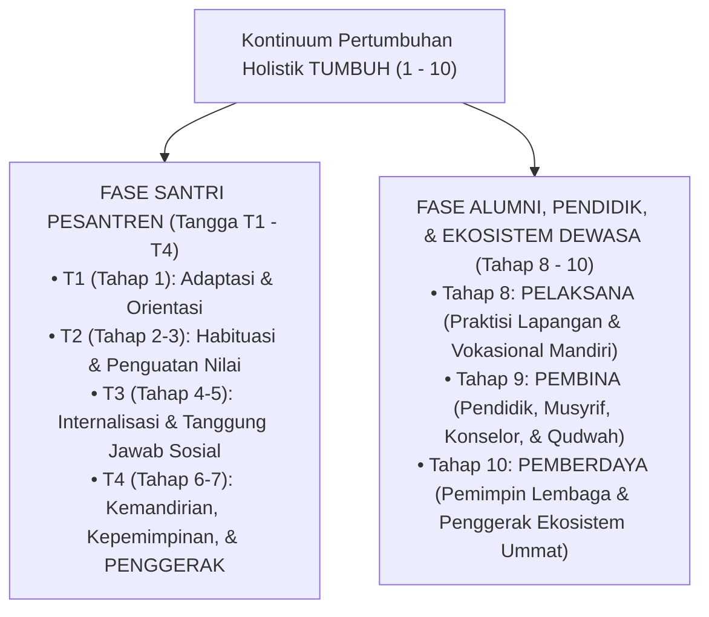
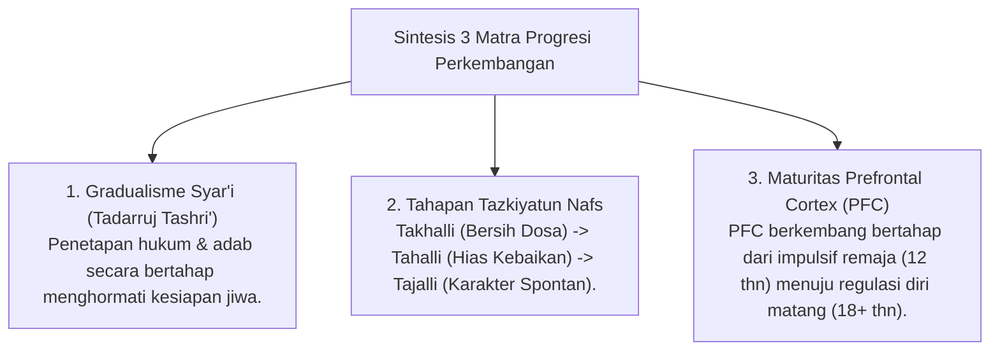
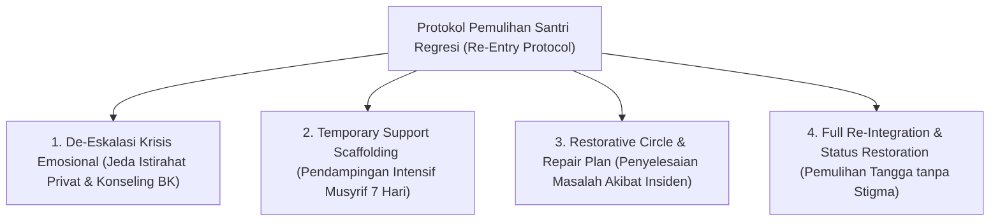

# MONOGRAF RISET AKADEMIK: TRAJEKTORI PROGRESI BERTAHAP DAN TANGGA TUMBUH (T1 - T4 S/D TAHAP 10)
## Analisis Integratif: Gradualisme Syar'i (Tadarruj), Takhalli-Tahalli-Tajalli, Neurosains Perkembangan Remaja, Kontinuum 10-Tahap Pertumbuhan (7 Penggerak, 8 Pelaksana, 9 Pembina, 10 Pemberdaya), dan Re-Entry Protocol

**Dewan Riset & Keilmuan Ekosistem TUMBUH**  
*Dipublikasikan sebagai Naskah Monograf Riset Ilmiah (Jurnal Kebijakan & Progresi Perkembangan Santri)*  
*Dokumen Rujukan Induk: Domain 04 Progression Framework & Book Series Volume 01-04*

---

## ABSTRAK

> **Latar Belakang**: Trajektori perkembangan manusia tidak berhenti saat santri lulus dari pesantren. Sistem pembinaan yang utuh harus mampu menghubungkan masa pertumbuhan santri di asrama dengan masa pengabdian alumni dan pendidik dewasa (*Adult Development Continuum*).
>
> **Tujuan Penelitian**: Merumuskan dan memvalidasi **Kontinuum Trajektori Pertumbuhan Holistik (Tahap 1 s/d Tahap 10)** yang menghubungkan Tangga Santri (T1-T4 / Tahap 1-7 Penggerak) dengan Fase Alumni & Pendidik Dewasa (Tahap 8 Pelaksana, Tahap 9 Pembina, & Tahap 10 Pemberdaya).
>
> **Hasil Riset**: Terstruktur Kontinuum 10-Tahap Pertumbuhan: (1) **T1 (Tahap 1)** - Adaptasi & Orientasi; (2) **T2 (Tahap 2-3)** - Habituasi Dasar & Nilai; (3) **T3 (Tahap 4-5)** - Internalisasi & Tanggung Jawab Sosial; (4) **T4 (Tahap 6-7)** - Kemandirian, Kepemimpinan, & **PENGGERAK**; (5) **Tahap 8** - **PELAKSANA** (Praktisi Lapangan & Vokasional Mandiri); (6) **Tahap 9** - **PEMBINA** (Pendidik, Musyrif, Konselor, & Qudwah); dan (7) **Tahap 10** - **PEMBERDAYA** (Pemimpin Lembaga & Penggerak Ekosistem Ummat).
>
> **Kata Kunci**: *Progression Framework, Tangga TUMBUH, Kontinuum 1-10, Penggerak, Pelaksana, Pembina, Pemberdaya, Re-Entry Protocol.*

---

## 1. PENDAHULUAN & ARSITEKTUR KONTINUUM PERTUMBUHAN (1 - 10)

Perkembangan karakter dan adab dalam ekosistem **TUMBUH** meluas dari masa santri hingga masa pengabdian alumni & pendidik dewasa:

---

## 2. PETA TAHAPAN KONTINUUM PERTUMBUHAN HOLISTIK

| Fase Perkembangan | Level Tahapan | Peran Utama & Karakteristik | Output Kemandirian & Khidmah |
| :--- | :--- | :--- | :--- |
| **Santri Pemula** | **T1 (Tahap 1)** | Adaptasi & Orientasi Awal | Bimbingan penuh Musyrif & rasa aman emosional. |
| **Santri Madya** | **T2 (Tahap 2-3)** | Habituasi Dasar & Penguatan Nilai | Rutinitas ibadah mandiri & *Habit Loop* 66-Hari. |
| **Santri Utama** | **T3 (Tahap 4-5)** | Internalisasi & Tanggung Jawab Sosial | Regulasi emosi mandiri (*SEL*) & empati sosial. |
| **Santri Senior** | **T4 (Tahap 6-7)** | Kemandirian, Kepemimpinan, & **PENGGERAK** | *Servant Leadership*, *Peer Buddy T4*, & Khidmah Desa. |
| **Alumni / Pengabdi**| **Tahap 8** | **PELAKSANA** | Praktisi vokasional mandiri (*Qadirun 'Alal Kasb*). |
| **Pendidik / Musyrif**| **Tahap 9** | **PEMBINA** | Pendidik profesional, Musyrif, Konselor, & *Qudwah*. |
| **Pemimpin Lembaga** | **Tahap 10** | **PEMBERDAYA** | Pemimpin ekosistem & penggerak kebajikan (*Nafi'un Lighairih*). |

---

## 3. KAJIAN INTEGRATIF PROGRESI (TURATS & NEUROSAINS)

---

## 4. PROTOKOL PENANGANAN REGRESI EMOSIONAL & PEMULIHAN SANTRI (RE-ENTRY PROTOCOL)

Untuk mengatasi santri T3/T4 yang mengalami kemunduran emosional (*relapse*) akibat krisis emosional atau masalah keluarga, ditetapkan protokol pemulihan 4-tahap:

---

## 5. IMPLIKASI KEBIJAKAN PENENTUAN LEVEL TANTANGAN
- **Scaffolding Bimbingan**: Santri T1 memperoleh pendampingan privat hangat Musyrif & Peer Buddy T4; Santri T4 (Penggerak) diberikan amanah kepemimpinan; Alumni Tahap 8-10 memegang amanah Pelaksana, Pembina, dan Pemberdaya.

---

## 6. DAFTAR PUSTAKA
* Clear, J. (2018). *Atomic Habits*. Avery.
* Steinberg, L. (2008). Adolescent risk-taking. *Developmental Review*, 28(1), 78–106.
* Zimmerman, B. J. (2002). Self-regulated learner. *Theory Into Practice*, 41(2), 64–70.
