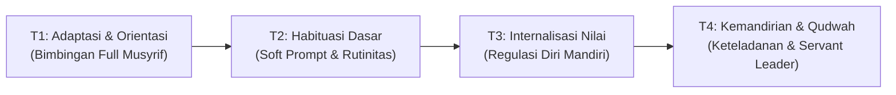
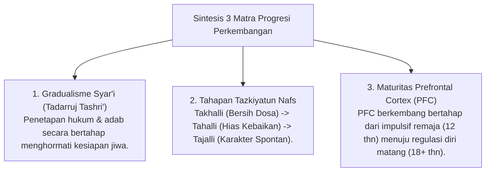
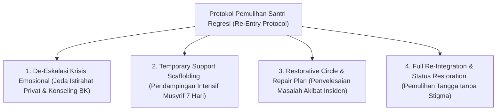

# MONOGRAF RISET AKADEMIK: TRAJEKTORI PROGRESI BERTAHAP DAN TANGGA TUMBUH (T1 - T4)
## Analisis Integratif: Gradualisme Syar'i (Tadarruj), Takhalli-Tahalli-Tajalli, Neurosains Perkembangan Remaja, dan Protokol Dukungan Regresi (Re-Entry Protocol)

**Dewan Riset & Keilmuan Ekosistem TUMBUH**  
*Dipublikasikan sebagai Naskah Monograf Riset Ilmiah (Jurnal Kebijakan & Progresi Perkembangan Santri)*  
*Dokumen Rujukan Induk: Domain 04 Progression Framework & Book Series Volume 01-04*

---

## ABSTRAK

> **Latar Belakang**: Kegagalan pembinaan karakter sering terjadi karena ekspektasi instan (*unrealistic expectation*) yang memaksakan tingkat kemandirian tinggi pada santri pemula tanpa memedulikan fase adaptasi dan maturitas neurobiologis. Selain itu, belum ada protokol baku untuk menangani santri yang mengalami regresi emosional (*relapse gap*) saat berada di tangga tinggi.
>
> **Tujuan Penelitian**: Merumuskan dan menguji trajektori progresi perkembangan bertahap (**Tangga TUMBUH T1–T4**) yang menyelaraskan doktrin gradualisme Syar'i (*Tadarruj*), tahapan *Tazkiyatun Nafs*, tingkat kematangan otak remaja (*Prefrontal Cortex*), dan Protokol Penanganan Regresi Emosional (*Re-entry & Regressive Support Protocol*).
>
> **Hasil Riset**: Terstruktur 4 Tangga Perkembangan Santri TUMBUH: (1) **T1 (Adaptasi & Orientasi)** - Rasa aman emosional & penyesuaian kultur; (2) **T2 (Habituasi Dasar)** - Pembentukan rutinitas adab harian; (3) **T3 (Internalisasi Nilai)** - Regulasi emosi mandiri; dan (4) **T4 (Kemandirian & Keteladanan / Qudwah)** - Kepemimpinan pelayanan (*Servant Leadership*). Dilengkapi *Re-entry Protocol* untuk pemulihan santri regresi tanpa pembatalan status berlebihan.
>
> **Kata Kunci**: *Progression Framework, Tangga TUMBUH, Tadarruj, Takhalli-Tahalli-Tajalli, Qudwah, Re-Entry Protocol, Relapse Support.*

---

## 1. PENDAHULUAN & DIALEKTIKA PROGRESI

Progresi perkembangan karakter santri adalah hukum sunnatullah bertahap (*Sunnatut Tadarruj*). Pemaksaan aturan tanpa tahap pembiasaan melahirkan resistensi emosional dan pembangkangan tersembunyi.

---

## 2. KAJIAN INTEGRATIF PROGRESI (TURATS & NEUROSAINS)

---

## 3. PROTOKOL PENANGANAN REGRESI EMOSIONAL & PEMULIHAN SANTRI (RE-ENTRY PROTOCOL)

Untuk mengatasi santri T3/T4 yang mengalami kemunduran emosional (*relapse*) akibat krisis emosional atau masalah keluarga, ditetapkan protokol pemulihan 4-tahap:

| Fase Pemulihan | Tindakan Musyrif & Tim BK | Aturan Perlindungan Hak Santri |
| :--- | :--- | :--- |
| **1. De-Eskalasi** | Memberikan ruang privat tenang & mendengarkan empatis tanpa menghakimi. | Dilarang mencabut gelar T4 di hadapan publik. |
| **2. Scaffolding** | Memberikan *soft prompt* tambahan dan pendampingan *Peer Buddy*. | Dilarang memberikan hukuman fisik/acak. |
| **3. Re-Integration** | Mengembalikan santri ke peran keteladanan pasca kesepakatan restoratif tuntas. | Data insiden bersifat rahasia di sistem BK. |

---

## 4. IMPLIKASI KEBIJAKAN PENENTUAN LEVEL TANTANGAN
- **Scaffolding Bimbingan**: Santri T1 memperoleh pendampingan privat hangat Musyrif & Peer Buddy T4; Santri T4 diberikan amanah kepemimpinan dan khidmah desa.

---

## 5. DAFTAR PUSTAKA
* Clear, J. (2018). *Atomic Habits*. Avery.
* Steinberg, L. (2008). A social neuroscience perspective on adolescent risk-taking. *Developmental Review*, 28(1), 78–106.
* Zimmerman, B. J. (2002). Becoming a self-regulated learner. *Theory Into Practice*, 41(2), 64–70.
