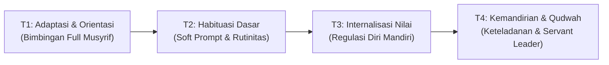
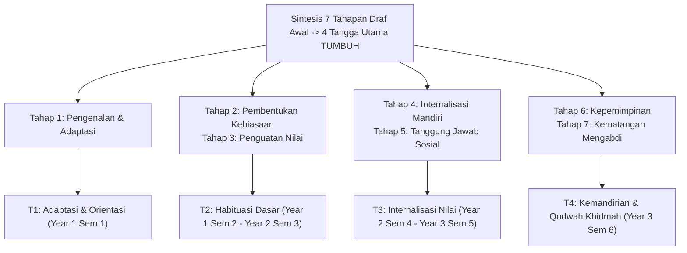
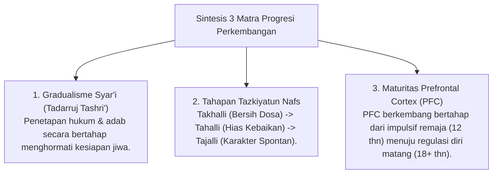
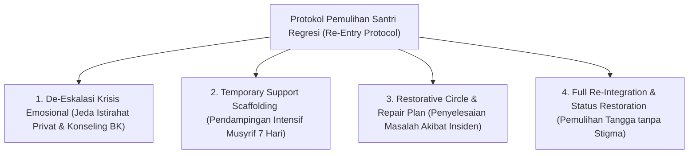

# MONOGRAF RISET AKADEMIK: TRAJEKTORI PROGRESI BERTAHAP DAN TANGGA TUMBUH (T1 - T4)
## Analisis Integratif: Gradualisme Syar'i (Tadarruj), Takhalli-Tahalli-Tajalli, Neurosains Perkembangan Remaja, Rasionale Sintesis 7-ke-4 Tangga, dan Protokol Dukungan Regresi (Re-Entry Protocol)

**Dewan Riset & Keilmuan Ekosistem TUMBUH**  
*Dipublikasikan sebagai Naskah Monograf Riset Ilmiah (Jurnal Kebijakan & Progresi Perkembangan Santri)*  
*Dokumen Rujukan Induk: Domain 04 Progression Framework & Book Series Volume 01-04*

---

## ABSTRAK

> **Latar Belakang**: Kegagalan pembinaan karakter sering terjadi karena ekspektasi instan (*unrealistic expectation*) yang memaksakan tingkat kemandirian tinggi pada santri pemula tanpa memedulikan fase adaptasi dan maturitas neurobiologis. Di samping itu, draf awal sistem pembinaan yang mencantumkan 7 tahapan mikro disintesiskan dan dirampingkan menjadi 4 Tangga Utama agar selaras dengan siklus pendidikan 3-tahun pesantren dan 4 level rubrik PBIS.
>
> **Tujuan Penelitian**: Merumuskan dan memvalidasi rasionale akademis penyelarasan 7 tahapan konvensional menjadi **4 Tangga Utama TUMBUH (T1–T4)**, menyelaraskan doktrin gradualisme Syar'i (*Tadarruj*), tahapan *Tazkiyatun Nafs*, tingkat kematangan otak remaja (*Prefrontal Cortex*), dan Protokol Penanganan Regresi Emosional (*Re-entry Protocol*).
>
> **Hasil Riset**: Terstruktur 4 Tangga Perkembangan Santri TUMBUH: (1) **T1 (Adaptasi & Orientasi)** - Menyerap Tahap 1 Draf Awal (Year 1 Sem 1); (2) **T2 (Habituasi Dasar)** - Menyerap Tahap 2 & 3 Draf Awal (Year 1 Sem 2 - Year 2 Sem 3); (3) **T3 (Internalisasi Nilai)** - Menyerap Tahap 4 & 5 Draf Awal (Year 2 Sem 4 - Year 3 Sem 5); dan (4) **T4 (Kemandirian & Keteladanan / Qudwah)** - Menyerap Tahap 6 & 7 Draf Awal (Year 3 Sem 6 / Tingkat Akhir).
>
> **Kata Kunci**: *Progression Framework, Tangga TUMBUH, Tadarruj, 7-to-4 Stages Rationale, Takhalli-Tahalli-Tajalli, Qudwah, Re-Entry Protocol.*

---

## 1. PENDAHULUAN & DIALEKTIKA PROGRESI

Progresi perkembangan karakter santri adalah hukum sunnatullah bertahap (*Sunnatut Tadarruj*). Pemaksaan aturan tanpa tahap pembiasaan melahirkan resistensi emosional dan pembangkangan tersembunyi.

---

## 2. RASIONALE AKADEMIS SINTESIS 7 TAHAPAN MENJADI 4 TANGGA UTAMA TUMBUH

Dalam dokumen draf awal (`Sistem-Pembinaan-Pesantren-2026.md`), pencapaian perkembangan santri sempat dipetakan ke dalam 7 tahapan mikro. Melalui analisis psikometri dan efisiensi observasi lapangan, 7 tahapan tersebut disintesiskan dan dirampingkan secara presisi menjadi **4 Tangga Utama TUMBUH (T1–T4)**:

### Matriks Penyelarasan Akademis:

| Tahapan Draf Awal (7 Tahap) | Tangga TUMBUH Terkonsolidasi (4 Tangga) | Pembagian Jenjang Pembinaan | Rasionale Penyelarasan Akademis |
| :--- | :--- | :--- | :--- |
| **T1**: Pengenalan & Adaptasi Awal | **T1: Adaptasi & Orientasi** | Year 1 (Semester 1) | Fokus pada *Psychological Safety* & penyesuaian budaya asrama. |
| **T2**: Pembentukan Kebiasaan Dasar **T3**: Penguatan Pemahaman Nilai | **T2: Habituasi Dasar** | Year 1 (Semester 2) – Year 2 (Semester 3) | Fokus pada *Habit Formation* 66-Hari, rutinitas ibadah, & soft prompt Musyrif. |
| **T4**: Internalisasi Karakter Mandiri **T5**: Tanggung Jawab Sosial | **T3: Internalisasi Nilai** | Year 2 (Semester 4) – Year 3 (Semester 5) | Fokus pada *Self-Regulation*, regulasi emosi ghadhab, & kepedulian sosial. |
| **T6**: Kepemimpinan **T7**: Kematangan & Kesiapan Mengabdi | **T4: Kemandirian & Qudwah (Khidmah)** | Year 3 (Semester 6 / Tingkat Akhir) | Fokus pada *Servant Leadership*, Mentoring Sebaya (*Peer Buddy*), & Khidmah Keumatan. |

---

## 3. KAJIAN INTEGRATIF PROGRESI (TURATS & NEUROSAINS)

---

## 4. PROTOKOL PENANGANAN REGRESI EMOSIONAL & PEMULIHAN SANTRI (RE-ENTRY PROTOCOL)

Untuk mengatasi santri T3/T4 yang mengalami kemunduran emosional (*relapse*) akibat krisis emosional atau masalah keluarga, ditetapkan protokol pemulihan 4-tahap:

---

## 5. IMPLIKASI KEBIJAKAN PENENTUAN LEVEL TANTANGAN
- **Scaffolding Bimbingan**: Santri T1 memperoleh pendampingan privat hangat Musyrif & Peer Buddy T4; Santri T4 diberikan amanah kepemimpinan dan khidmah desa.

---

## 6. DAFTAR PUSTAKA
* Clear, J. (2018). *Atomic Habits*. Avery.
* Steinberg, L. (2008). A social neuroscience perspective on adolescent risk-taking. *Developmental Review*, 28(1), 78–106.
* Zimmerman, B. J. (2002). Becoming a self-regulated learner. *Theory Into Practice*, 41(2), 64–70.
