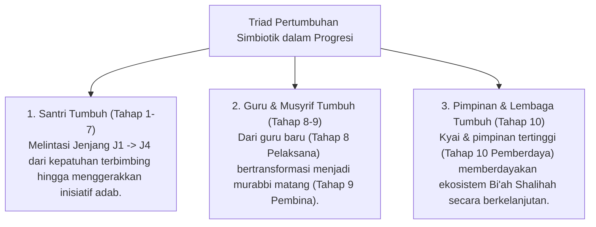
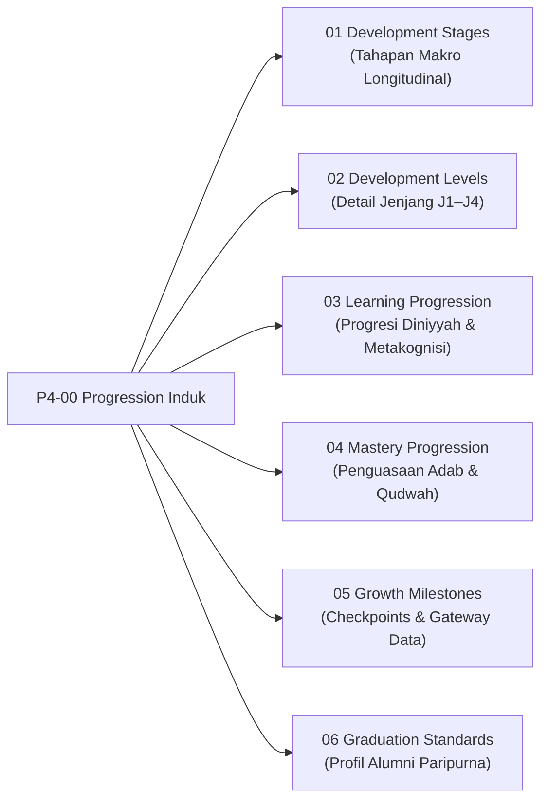

# P4-00: Progression Framework Induk (Kerangka Progresi Perkembangan Santri Ekosistem TUMBUH)

## Status Dokumen
* **Status**: 🌟 **A+ (Tervalidasi & Induk Baku)**
* **Domain**: Project 4 — `04 Progression Framework`
* **Penanggung Jawab Keilmuan**: Dewan Keilmuan TUMBUH (*Pakar Desain Kurikulum Adab, Pakar Neurosains Perkembangan, Pakar Bimbingan Konseling, & Pakar Filosofi TUMBUH*)

---

## 1. Pendahuluan & Falsafah Progresi

Perkembangan karakter dan adab santri dalam ekosistem **TUMBUH** tidak dipahami sebagai proses linier seragam yang terjadi secara spontan, melainkan sebagai proses bertahap (*Tadarruj*) berbasis penyucian jiwa (*Tazkiyatun Nafs*) yang sejalan dengan perkembangan neurobiologis Prefrontal Cortex (PFC) remaja. 

**Progression Framework** dirancang untuk memastikan bahwa setiap santri dipahami, dibimbing, dan dievaluasi sesuai tingkat kematangan fitrahnya, bebas dari intimidasi, hukuman fisik, atau feodalisme senioritas.

---

## 2. Model Triad Pertumbuhan Simbiotik: Pembentukan Karakter Sepanjang Hayat

> **Prinsip Utama: Pembentukan Karakter Tidak Berhenti di Santri, Melainkan Berlanjut Hingga Guru & Pimpinan Lembaga**  
> Di ekosistem TUMBUH, guru dan musyrif bukan "produk jadi yang statis", melainkan pembelajar adab yang sedang berproses pada tahapan kepemimpinan yang lebih tinggi. Pembinaan karakter menyambung tanpa putus melintasi 10 Tahapan:
> * **Santri di Pesantren**: Bertumbuh dari **Tahap 1 (Tahu) $\rightarrow$ Tahap 7 (Menggerakkan)** (Jenjang J1–J4).
> * **Alumni & Guru Baru**: Bertumbuh pada **Tahap 8 (Pelaksana)** (Eksekutor KBM & Operasional Asrama).
> * **Guru Senior (S1/Senior)**: Bertumbuh pada **Tahap 9 (Pembina)** (Murabbi, Supervisor, & Pengasuh).
> * **Pimpinan Lembaga / Kyai**: Bertumbuh pada **Tahap 10 (Pemberdaya)** (Penggerak Visi & Pemberdaya Sistem Umat).

---

## 3. Empat Kaidah Baku Progresi Jenjang Kemandirian TUMBUH (J1–J4)

1. **Kaidah Anti-Uniformitas (*Anti-Uniformity Rule*)**:
   - Dilarang keras menuntut tingkat kemandirian yang sama antara santri baru (T1) dan santri senior (T3/T4). Setiap santri dinilai dengan indikator yang sesuai dengan jenjang tangganya.
2. **Kaidah Perampingan Bantuan Gradual (*Scaffolding Decay Rule*)**:
   - Tingkat intervensi musyrif berkurang secara terukur seiring naiknya tangga santri:
     - **T1**: 80% Bimbingan & Instruksi Langsung.
     - **T2**: 50% Pembiasaan Rutin & Penguatan Positif (*Reinforcement*).
     - **T3**: 20% Umpan Balik Formatif & Coaching Emosional.
     - **T4**: Kolaboratif (Kemitraan, Mentoring Sebaya, & Kepemimpinan).
3. **Kaidah Transisi Berbasis Bukti (*Evidence-Based Gateway Rule*)**:
   - Kenaikan tangga santri wajib didasarkan pada triangulasi data (Portofolio Adab PBIS, Observasi Kamar Musyrif, dan Jurnal Refleksi Diri Santri), bukan pergantian tahun ajaran secara otomatis atau subjektivitas pendidik.
4. **Kaidah Pendampingan Pemulihan (*Restorative Catch-Up Rule*)**:
   - Santri yang mengalami hambatan regulasi diri atau *homesickness* kronis tidak diberi stigma atau hukuman, melainkan mendapatkan dukungan intervensi khusus (*Tier 2 PBIS*) hingga mencapai kesiapan transisi.

---

## 4. Peta Hubungan Sub-Domain

---

## 5. Rujukan Keilmuan Multidisiplin

1. **Turats Islam**: Kitab *Adabul 'Alim wal Muta'allim* (Imam An-Nawawi), *Tazkiyatun Nafs* (Imam Al-Ghazali - *Ihya 'Ulumuddin*), *Madarijus Salikin* (Ibnul Qayyim Al-Jauziyyah).
2. **Sains Kontemporer**: *Adolescent Brain Development* (Laurence Steinberg), *Social-Emotional Learning* (CASEL Framework), *Self-Determination Theory* (Deci & Ryan), *School-Wide PBIS Multi-Tiered System of Supports* (Sugai & Horner).
