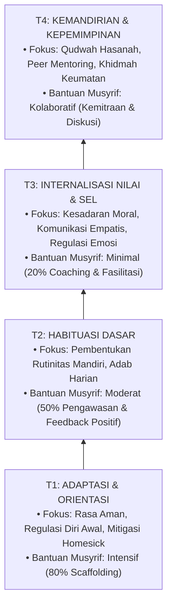

# 04 Progression Framework (Kerangka Progresi Perkembangan & Tangga TUMBUH T1–T4)

Domain ini memuat arsitektur progresi perkembangan membujur (*longitudinal progression*) santri melintasi **Tangga TUMBUH (T1, T2, T3, T4)**. Kerangka ini mengawinkan hukum *Tazkiyatun Nafs* (*Takhalli-Tahalli-Tajalli*) dengan neurosains perkembangan remaja, CASEL *Social-Emotional Learning* (SEL), *Self-Determination Theory* (SDT), dan *Positive Behavioral Interventions and Supports* (PBIS).

---

## Arsitektur Tangga TUMBUH

---

## Indeks Dokumen Induk & 6 Sub-Domain Modul

* 📄 **[P4-00-Progression-Framework-Induk.md](./P4-00-Progression-Framework-Induk.md)**: Dokumen Maha-Induk Kerangka Progresi Perkembangan Santri, Prinsip *Anti-Uniformity*, dan *Evidence-Based Gateways*.

### Sub-Domain 01: Development Stages (Tahapan Makro)
* 📁 **[01 Development Stages](./01%20Development%20Stages/)**:
  * 📄 [P4-01-Tahapan-Perkembangan-Makro-TUMBUH.md](./01%20Development%20Stages/P4-01-Tahapan-Perkembangan-Makro-TUMBUH.md)
  * 📄 [P4-01-01-Fase-Orientasi-dan-Inisiasi-Awal.md](./01%20Development%20Stages/P4-01-01-Fase-Orientasi-dan-Inisiasi-Awal.md)
  * 📄 [P4-01-02-Fase-Habituasi-dan-Pembentukan-Karakter.md](./01%20Development%20Stages/P4-01-02-Fase-Habituasi-dan-Pembentukan-Karakter.md)
  * 📄 [P4-01-03-Fase-Kematangan-Sosial-Emosional.md](./01%20Development%20Stages/P4-01-03-Fase-Kematangan-Sosial-Emosional.md)
  * 📄 [P4-01-04-Fase-Leadership-dan-Transisi-Post-Pesantren.md](./01%20Development%20Stages/P4-01-04-Fase-Leadership-dan-Transisi-Post-Pesantren.md)
  * 📄 [P4-01-05-Sintesis-Trajektori-Biososial-Spiritual.md](./01%20Development%20Stages/P4-01-05-Sintesis-Trajektori-Biososial-Spiritual.md)

### Sub-Domain 02: Development Levels (Detail Tangga T1–T4)
* 📁 **[02 Development Levels](./02%20Development%20Levels/)**:
  * 📄 [P4-02-Detail-4-Tangga-Perkembangan-T1-T4.md](./02%20Development%20Levels/P4-02-Detail-4-Tangga-Perkembangan-T1-T4.md)
  * 📄 [P4-02-01-Tangga-T1-Adaptasi-dan-Orientasi.md](./02%20Development%20Levels/P4-02-01-Tangga-T1-Adaptasi-dan-Orientasi.md)
  * 📄 [P4-02-02-Tangga-T2-Habituasi-Dasar.md](./02%20Development%20Levels/P4-02-02-Tangga-T2-Habituasi-Dasar.md)
  * 📄 [P4-02-03-Tangga-T3-Internalisasi-Nilai-dan-SEL.md](./02%20Development%20Levels/P4-02-03-Tangga-T3-Internalisasi-Nilai-dan-SEL.md)
  * 📄 [P4-02-04-Tangga-T4-Kemandirian-dan-Kepemimpinan-Qudwah.md](./02%20Development%20Levels/P4-02-04-Tangga-T4-Kemandirian-dan-Kepemimpinan-Qudwah.md)
  * 📄 [P4-02-05-Protokol-Penanganan-Transisi-Terhambat-Catch-Up.md](./02%20Development%20Levels/P4-02-05-Protokol-Penanganan-Transisi-Terhambat-Catch-Up.md)

### Sub-Domain 03: Learning Progression (Progresi Kognitif & Hafalan)
* 📁 **[03 Learning Progression](./03%20Learning%20Progression/)**:
  * 📄 [P4-03-Progresi-Belajar-Diniyyah-dan-Metakognisi.md](./03%20Learning%20Progression/P4-03-Progresi-Belajar-Diniyyah-dan-Metakognisi.md)
  * 📄 [P4-03-01-Progresi-Kognitif-dan-Taksonomi-Belajar.md](./03%20Learning%20Progression/P4-03-01-Progresi-Kognitif-dan-Taksonomi-Belajar.md)
  * 📄 [P4-03-02-Metodologi-Retensi-Hafalan-Mutqin-Al-Quran.md](./03%20Learning%20Progression/P4-03-02-Metodologi-Retensi-Hafalan-Mutqin-Al-Quran.md)
  * 📄 [P4-03-03-Metodologi-Pembelajaran-Kitab-Turats.md](./03%20Learning%20Progression/P4-03-03-Metodologi-Pembelajaran-Kitab-Turats.md)
  * 📄 [P4-03-04-Perkembangan-Metakognisi-dan-Self-Regulated-Learning.md](./03%20Learning%20Progression/P4-03-04-Perkembangan-Metakognisi-dan-Self-Regulated-Learning.md)

### Sub-Domain 04: Mastery Progression (Penguasaan Adab & Qudwah)
* 📁 **[04 Mastery Progression](./04%20Mastery%20Progression/)**:
  * 📄 [P4-04-Peta-Penguasaan-Adab-dan-Kepemimpinan-Qudwah.md](./04%20Mastery%20Progression/P4-04-Peta-Penguasaan-Adab-dan-Kepemimpinan-Qudwah.md)
  * 📄 [P4-04-01-Kontinuum-Penguasaan-Adab-Thalabul-Ilmi.md](./04%20Mastery%20Progression/P4-04-01-Kontinuum-Penguasaan-Adab-Thalabul-Ilmi.md)
  * 📄 [P4-04-02-Tangga-Kepemimpinan-Santri-Servant-Leadership.md](./04%20Mastery%20Progression/P4-04-02-Tangga-Kepemimpinan-Santri-Servant-Leadership.md)
  * 📄 [P4-04-03-Matriks-Internalisasi-10-Karakter-Muwashafat.md](./04%20Mastery%20Progression/P4-04-03-Matriks-Internalisasi-10-Karakter-Muwashafat.md)
  * 📄 [P4-04-04-Sistem-Keteladanan-Qudwah-dan-Anti-Feodalisme.md](./04%20Mastery%20Progression/P4-04-04-Sistem-Keteladanan-Qudwah-dan-Anti-Feodalisme.md)

### Sub-Domain 05: Growth Milestones (Checkpoints & Gateways)
* 📁 **[05 Growth Milestones](./05%20Growth%20Milestones/)**:
  * 📄 [P4-05-Indikator-Milestone-dan-Gateway-Kenaikan-Tangga.md](./05%20Growth%20Milestones/P4-05-Indikator-Milestone-dan-Gateway-Kenaikan-Tangga.md)
  * 📄 [P4-05-01-Indikator-Milestone-Berkala-T1-T4.md](./05%20Growth%20Milestones/P4-05-01-Indikator-Milestone-Berkala-T1-T4.md)
  * 📄 [P4-05-02-Arsitektur-Evidence-Based-Gateway-Transisi.md](./05%20Growth%20Milestones/P4-05-02-Arsitektur-Evidence-Based-Gateway-Transisi.md)
  * 📄 [P4-05-03-Rubrik-Triangulasi-Asesmen-Musyrif-Guru-Santri.md](./05%20Growth%20Milestones/P4-05-03-Rubrik-Triangulasi-Asesmen-Musyrif-Guru-Santri.md)
  * 📄 [P4-05-04-Protokol-Intervensi-Tier-2-PBIS-Santri-Tertinggal.md](./05%20Growth%20Milestones/P4-05-04-Protokol-Intervensi-Tier-2-PBIS-Santri-Tertinggal.md)

### Sub-Domain 06: Graduation Standards (Standar Kelulusan Alumni)
* 📁 **[06 Graduation Standards](./06%20Graduation%20Standards/)**:
  * 📄 [P4-06-Standar-Kelulusan-Paripurna-Santri-TUMBUH.md](./06%20Graduation%20Standards/P4-06-Standar-Kelulusan-Paripurna-Santri-TUMBUH.md)
  * 📄 [P4-06-01-Profil-Kelulusan-Paripurna-Alumni-TUMBUH.md](./06%20Graduation%20Standards/P4-06-01-Profil-Kelulusan-Paripurna-Alumni-TUMBUH.md)
  * 📄 [P4-06-02-Ambang-Batas-Kompetensi-Minimal-Kelulusan.md](./06%20Graduation%20Standards/P4-06-02-Ambang-Batas-Kompetensi-Minimal-Kelulusan.md)
  * 📄 [P4-06-03-Sistem-Sertifikasi-dan-Transkrip-Karakter-PBIS.md](./06%20Graduation%20Standards/P4-06-03-Sistem-Sertifikasi-dan-Transkrip-Karakter-PBIS.md)
  * 📄 [P4-06-04-Sistem-Tracer-Study-dan-Continuous-Improvement.md](./06%20Graduation%20Standards/P4-06-04-Sistem-Tracer-Study-dan-Continuous-Improvement.md)
