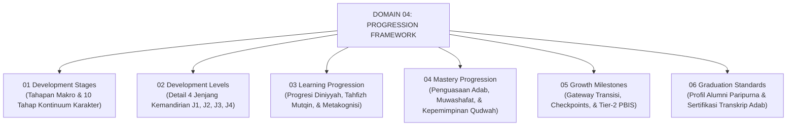

# DOMAIN 04: PROGRESSION FRAMEWORK (TRAJEKTORI 4 JENJANG & 10 TAHAPAN PERKEMBANGAN)
## *Sitemap Induk Kerangka Progresi Kemandirian (Jenjang J1–J4) dan 10 Tahapan Metamorfosis Karakter Santri Ekosistem Pesantren Berbasis TUMBUH*

**Nomor Identifikasi**: `P4/INDEX-MASTER/2026`  
**Domain**: `04 Progression Framework`  
**Klasifikasi**: Master Indeks Progresi Perkembangan Santri, Jenjang Kemandirian J1–J4, & Kontinuum 10 Tahapan Pembentukan Karakter

---

## 🏛️ STRUKTUR SUB-DOMAIN PROGRESI PERKEMBANGAN

Domain `04 Progression Framework` membedakan secara tegas antara **4 Jenjang Kemandirian Santri (J1–J4)** di lingkungan asrama dengan **10 Tahapan Pembentukan Karakter Karakter (Tahap 1–10)**:

---

## 📑 DOKUMEN INDUK & JURNAL MONOGRAF RISET

* 📄 **[Jurnal-Monograf-Riset-Progresi-Jenjang-dan-Tahapan-TUMBUH.md](./Jurnal-Monograf-Riset-Progresi-Jenjang-dan-Tahapan-TUMBUH.md)**: Monograf Riset Ilmiah Terkonsolidasi (Mencakup Teori Tadarruj, Integrasi 4 Jenjang J1–J4 dengan 10 Tahapan Pembentukan Karakter, dan Sistem Gateway PBIS).
* 📄 **[P4-00-Progression-Framework-Induk.md](./P4-00-Progression-Framework-Induk.md)**: Dokumen Induk Kerangka Progresi Perkembangan Santri.

---

## 📁 DIREKTORI 6 SUB-DOMAIN PROGRESI

1. 📁 **[01 Development Stages](./01%20Development%20Stages/README.md)**: Tahapan Perkembangan Makro Santri & 10 Tahapan Pembentukan Karakter (*Tahu, Paham, Sadar, Membiasakan, Kuat/Konsisten, Memberi Teladan, Menggerakkan, Pelaksana, Pembina, Pemberdaya*).
2. 📁 **[02 Development Levels](./02%20Development%20Levels/README.md)**: Rincian 4 Jenjang Kemandirian Santri (*Jenjang J1, J2, J3, dan J4*) serta Matriks Perampingan Bimbingan Musyrif (*Scaffolding Decay*).
3. 📁 **[03 Learning Progression](./03%20Learning%20Progression/README.md)**: Progresi Belajar Diniyyah, Hafalan Qur'an Mutqin, dan Metakognisi (*Self-Regulated Learning*).
4. 📁 **[04 Mastery Progression](./04%20Mastery%20Progression/README.md)**: Peta Penguasaan Adab Thalabul 'Ilmi dan Kepemimpinan Pelayan (*Servant Leadership*).
5. 📁 **[05 Growth Milestones](./05%20Growth%20Milestones/README.md)**: Indikator Milestone Berkala dan Arsitektur Gateway Transisi Berbasis Bukti PBIS.
6. 📁 **[06 Graduation Standards](./06%20Graduation%20Standards/README.md)**: Standar Kelulusan Paripurna, Ambang Batas Kompetensi, dan Transkrip Karakter.
