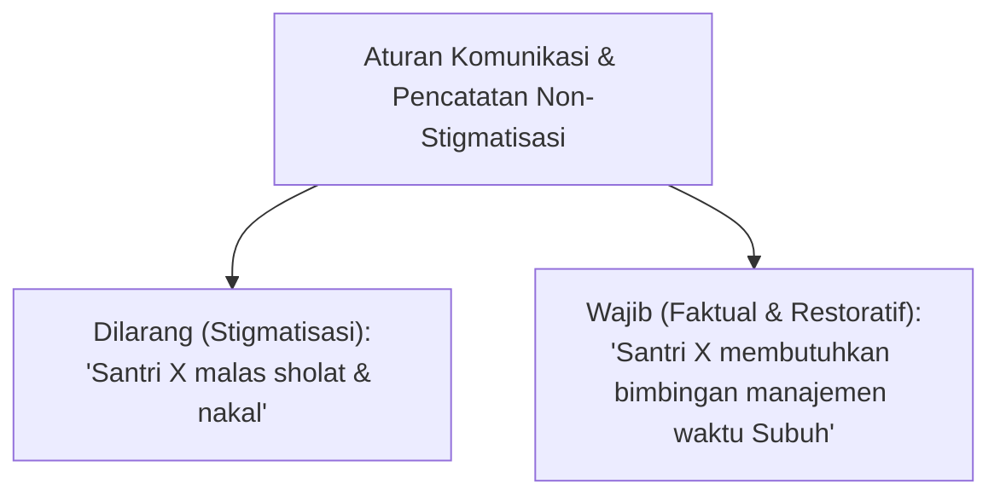

# P5-01-01: Prinsip Penilaian Non-Stigmatisasi dan Restoratif

## Status Dokumen
* **Status**: 🌟 **A+ (Tervalidasi & Siap Diimplementasikan)**
* **Sub-Domain**: `05 Assessment Framework / 01 Assessment Philosophy`
* **Penanggung Jawab Keilmuan**: Dewan Keilmuan TUMBUH (*Pakar Arsitektur PBIS Restoratif & Pakar Bimbingan Konseling*)

---

## 1. Operasionalisasi Penilaian Non-Stigmatisasi

Penilaian non-stigmatisasi menegaskan bahwa **perilaku buruk bukanlah identitas permanen santri**. Setiap catatan evaluasi wajib memisahkan antara *karakter diri santri* dan *tindakan spesifik yang teramati*.

---

## 2. Etika Restoratif dalam Umpan Balik Evaluasi

1. **Focus on Repair, Not Punishment**: Evaluasi tidak bertujuan mencari pembenaran denda/hukuman, melainkan memfasilitasi pemulihan hubungan & kebiasaan.
2. **Private Feedback**: Umpan balik korektif diberikan secara pribadi dalam sesi bimbingan individu, bukan pengumuman publik.
3. **Re-Integration Protocol**: Santri yang telah menyelesaikan proses pemulihan restoratif berhak pembersihan rekam jejak negatif dari logbook aktif (*Clean Slate Policy*).
