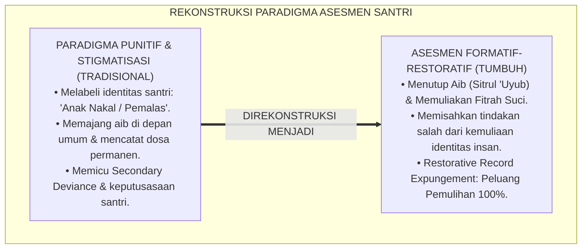
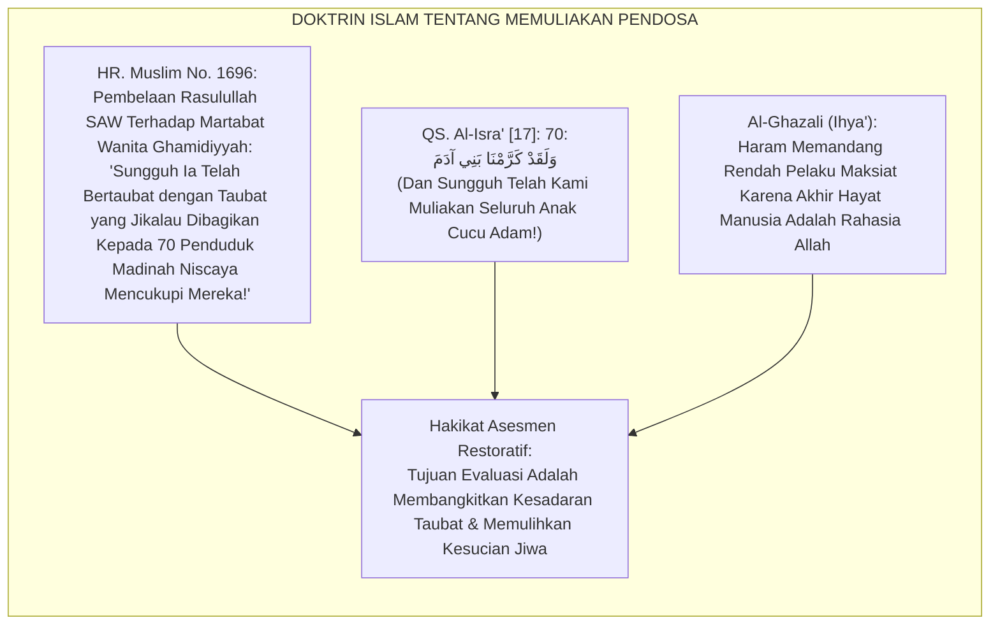
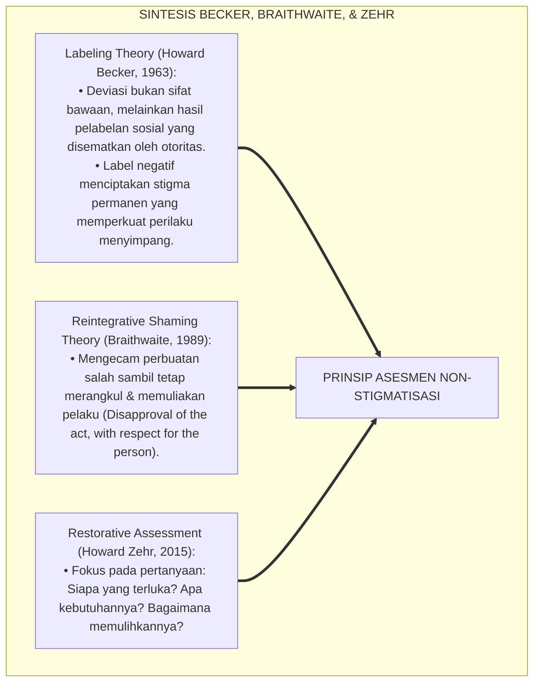
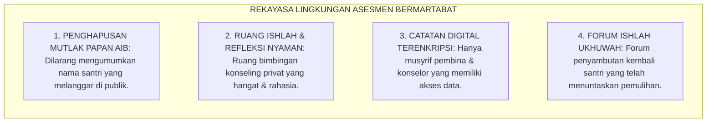
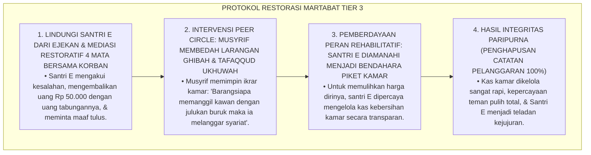
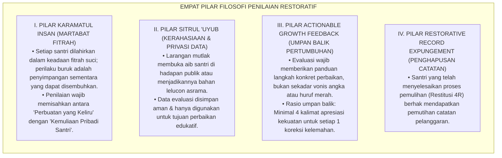
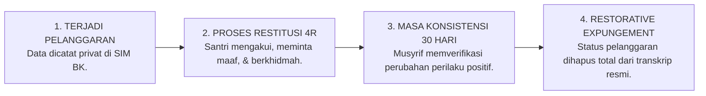
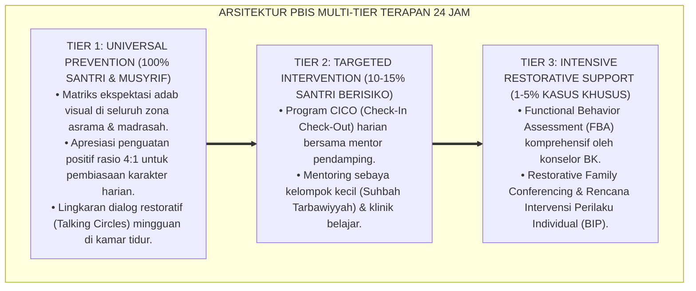

# P5-01-01: PRINSIP PENILAIAN NON-STIGMATISASI DAN RESTORATIF
## *Monograf Riset Akademik: Epistemologi Asesmen Format-Restoratif Berbasis Martabat Insan, Eliminasi Mutlak Labeling Teori & Stigmatisasi Pelanggaran di Pesantren, Integrasi Doktrin Sitrul 'Urub wa Da'watut Taubah Turats dengan Restorative Justice Assessment & Labeling Theory (Becker), Serta Desain Protokol Evaluasi Berorientasi Pemulihan di Ekosistem Pesantren Berbasis TUMBUH*

**Nomor Identifikasi**: `P5-01-01/MONOGRAF-RISET-PRINSIP-PENILAIAN-NON-STIGMATISASI/2026`  
**Domain**: `05 Assessment Framework` > `01 Assessment Philosophy` (Sub-Modul 01: *Non-Stigmatizing & Restorative Assessment Principles*)  
**Klasifikasi Naskah**: *Academic Research Monograph* (Monograf Penelitian Epistemologi Evaluasi Restoratif, Dekonstruksi Stigmatisasi Santri, & Fiqh Sitrul 'Uyub)  
**Rumpun Disiplin Pengkaji**: Filsafat Evaluasi Pendidikan Islam, Teori Keadilan Restoratif (*Restorative Assessment*), Sosiologi Deviasi & Labeling (*Becker's Theory*), School-Wide PBIS  

---

> ### 💡 INTISARI EKSEKUTIF (EXECUTIVE SUMMARY)
>
> * **Krisis Stigmatisasi & Labeling dalam Evaluasi Pesantren Konvensional:**  
>   Banyak sistem evaluasi pesantren tradisional terjebak dalam paradigma retributif-punitif: santri yang melakukan pelanggaran adab langsung dicap sebagai "santri nakal", "troublemaker", atau "calon gagal", nama mereka dipajang di papan pengumuman aib, dan catatan pelanggaran dijadikan alat untuk menghakimi martabat mereka secara permanen (*Permanent Stigma*). Hal ini memicu *Self-Fulfilling Prophecy* di mana santri benar-benar mengadopsi identitas nakal tersebut.
> * **Integrasi Doktrin Sitrul 'Uyub Salaf & Restorative Assessment Framework:**  
>   Ekosistem TUMBUH merekonstruksi filosofi penilaian dengan memadukan hadits kenabian agung tentang menutup aib sesama muslim (*Sitrul 'Uyūb*) dan pintu taubat yang senantiasa terbuka dengan teori labeling Howard Becker dan *Restorative Justice Assessment* Howard Zehr. Asesmen diposisikan bukan sebagai "hakim penghukum", melainkan sebagai **Cermin Pemulihan Fitrah (*Mir'ātut Tazkiyah*)**: membedakan secara tegas antara *perbuatan salah yang harus diperbaiki* dengan *kemuliaan fitrah santri yang tetap suci*.
> * **Arsitektur Protokol Penilaian Non-Stigmatisasi TUMBUH:**  
>   Monograf ini merumuskan Piagam Evaluasi Bermartabat, pedoman deskripsi perilaku bebas vonis personal, sistem pembersihan rekam jejak restoratif (*Restorative Record Expungement*), dan rubrik umpan balik pertumbuhan (*Growth-Oriented Feedback Protocol*).

---

## 📑 DAFTAR ISI MONOGRAF

- [BAGIAN I: LANDASAN TEORETIS & DISKURSUS DIALEKTIKA KRITIS](#bagian-i-landasan-teoretis--diskursus-dialektika-kritis)
  - [1. Latar Belakang Masalah: Bahaya Labeling Negatif & Pembunuhan Karakter dalam Evaluasi Santri](#1-latar-belakang-masalah-bahaya-labeling-negatif--pembunuhan-karakter-dalam-evaluasi-santri)
  - [2. Eksegesis Turats: Doktrin Sitrul 'Urub, Karamatul Insan, & Pintu Taubat yang Tak Pernah Tertutup](#2-eksegesis-turats-doktrin-sitrul-urub-karamatul-insan--pintu-taubat-yang-tak-pernah-tertutup)
  - [3. Konvergensi Sains Sosial: Becker's Labeling Theory, Braithwaite's Reintegrative Shaming, & Restorative Assessment](#3-konvergensi-sains-sosial-beckers-labeling-theory-braithwaites-reintegrative-shaming--restorative-assessment)
  - [4. Rekayasa Lingkungan 24 Jam: Menghapus Papan Aib Menjadi Ruang Refleksi Pemulihan](#4-rekayasa-lingkungan-24-jam-menghapus-papan-aib-menjadi-ruang-refleksi-pemulihan)
  - [5. Kasuistika Lapangan Klinis & Protokol Pemulihan Santri J2 yang Dilabeli 'Pencuri' Menjadi Bendahara Kamar Terpercaya](#5-kasuistika-lapangan-klinis--protokol-pemulihan-santri-j2-yang-dilabeli-pencuri-menjadi-bendahara-kamar-terpercaya)
- [BAGIAN II: FORMULASI KONSEPTUAL & PEMBAHASAN MENDALAM](#bagian-ii-formulasi-konseptual--pembahasan-mendalam)
  - [1. Arsitektur Komprehensif Prinsip Penilaian Restoratif Non-Stigmatisasi TUMBUH](#1-arsitektur-komprehensif-prinsip-penilaian-restoratif-non-stigmatisasi-tumbuh)
  - [2. Dekomposisi Bahasa Evaluasi: Transformasi dari Bahasa Vonis Identitas Menuju Bahasa Perilaku Solutif](#2-dekomposisi-bahasa-evaluasi-transformasi-dari-bahasa-vonis-identitas-menuju-bahasa-perilaku-solutif)
  - [3. Protokol Penghapusan Rekam Jejak Pelanggaran Pasca-Restitusi (Restorative Record Expungement)](#3-protokol-penghapusan-rekam-jejak-pelanggaran-pasca-restitusi-restorative-record-expungement)
  - [4. Diskusi Akademis & Implikasi bagi Reformasi Paradigma Evaluasi Pendidikan Pesantren Abad 21](#4-diskusi-akademis--implikasi-bagi-reformasi-paradigma-evaluasi-pendidikan-pesantren-abad-21)
- [BAGIAN III: KESIMPULAN & APARATUS AKADEMIS](#bagian-iii-kesimpulan--aparatus-akademis)
  - [1. Tabel Sintesis Prinsip Penilaian Non-Stigmatisasi & Restoratif](#1-tabel-sintesis-prinsip-penilaian-non-stigmatisasi--restoratif)
  - [2. Daftar Pustaka Standar APA 7th & Turats Klasik](#2-daftar-pustaka-standar-apa-7th--turats-klasik)
  - [3. Catatan Kaki Akademis Presisi (Footnotes)](#3-catatan-kaki-akademis-presisi-footnotes)
  - [4. Glosarium Istilah Ilmiah & Asesmen Restoratif](#4-glosarium-istilah-ilmiah--asesmen-restoratif)

---

# BAGIAN I: LANDASAN TEORETIS & DISKURSUS DIALEKTIKA KRITIS

---

### 1. Latar Belakang Masalah: Bahaya Labeling Negatif & Pembunuhan Karakter dalam Evaluasi Santri

Dalam tradisi evaluasi disiplin di banyak lembaga pendidikan, kerap terjadi **tiga patologi asesmen destruktif (*Destructive Assessment Pathologies*)**:[^1]

1. **Jebakan Vonis Esensialis Identitas (*The Essentialist Identity Trap*)**: Pengasuh menyamakan antara kesalahan tindakan santri dengan jati diri santri secara keseluruhan. Santri yang sekali terlambat shalat langsung diberi label permanen sebagai "anak malas", mengabaikan fitrah kebaikan lainnya.
2. **Eskalasi Deviasi Sekunder (*Secondary Deviance Escalation*)**: Santri yang terus-menerus dicap nakal oleh lingkungannya akhirnya kehilangan harapan (*Learned Helplessness*), menginternalisasi stigma tersebut, dan sengaja berbuat onar lebih parah karena merasa sudah "tidak ada gunanya berbuat baik".
3. **Pengabadian Dosa dan Penutupan Peluang Rehabilitasi**: Catatan pelanggaran masa lalu santri terus diungkit-ungkit dalam forum rapat pengasuhan tahun demi tahun, menghalangi santri untuk memulai lembaran hidup baru (*No Clean Slate*).[^2]

Model riset **TUMBUH** merancang **Prinsip Penilaian Non-Stigmatisasi dan Restoratif** yang menjunjung tinggi kehormatan martabat insan (*Karāmatul Insān*), memastikan asesmen menjadi instrumen penyelamatan dan pemulihan fitrah.

---

### 2. Eksegesis Turats: Doktrin Sitrul 'Urub, Karamatul Insan, & Pintu Taubat yang Tak Pernah Tertutup

Rasulullah SAW bersabda dengan tegas melarang mencela seorang pendosa yang telah bertaubat atau menghakiminya dengan kehinaan yang mematikan harapan ampunan Allah.

#### 📖 1. Sikap Agung Rasulullah SAW Melindungi Kehormatan Orang yang Bersalah
Diriwayatkan dalam *Shahih Al-Bukhari*:

$$\text{أُتِيَ النَّبِيُّ صَلَّى اللَّهُ عَلَيْهِ وَسَلَّمَ بِرَجُلٍ قَدْ شَرِبَ، فَقَالَ: اضْرِبُوهُ، فَمِنَّا الضَّارِبُ بِيَدِهِ وَالضَّارِبُ بِنَعْلِهِ؛ فَلَمَّا انْصَرَفَ قَالَ رَجُلٌ: أَخْزَاكَ اللَّهُ! فَقَالَ رَسُولُ اللَّهِ صَلَّى اللَّهُ عَلَيْهِ وَسَلَّمَ: لَا تَقُولُوا هَكَذَا، لَا تُعِينُوا عَلَيْهِ الشَّيْطَانَ، وَلَكِنْ قُولُوا: اللَّهُمَّ اغْفِرْ لَهُ، اللَّهُمَّ ارْحَمْهُ!}$$

*"Didatangkan kepada Nabi SAW seorang lelaki yang meminum khamar, maka beliau bersabda: 'Tegakkanlah hukuman atasnya!' Maka di antara kami ada yang memukul dengan tangannya dan ada yang memukul dengan sandalnya. Tatkala orang itu telah selesai dan hendak pergi, seseorang di antara hadirin berkata: **'Semoga Allah menghinakanmu!'** Maka Rasulullah SAW langsung menegur dengan keras: **'Janganlah kalian berkata demikian! Janganlah kalian membantu setan untuk membinasakan saudaramu! Akan tetapi berdoalah: Ya Allah ampunilah dia, ya Allah rahmatilah dia!'**"* (HR. Al-Bukhari No. 6777 & Abu Dawud No. 4477).[^3]

---

### 3. Konvergensi Sains Sosial: Becker's Labeling Theory, Braithwaite's Reintegrative Shaming, & Restorative Assessment

Prinsip asesmen TUMBUH memadukan teori sosiologi labeling Howard Becker dan *Reintegrative Shaming* John Braithwaite:

---

### 4. Rekayasa Lingkungan 24 Jam: Menghapus Papan Aib Menjadi Ruang Refleksi Pemulihan

Lingkungan fisik dan psikologis pesantren dibersihkan dari sarana stigmatisasi:

---

### 5. Kasuistika Lapangan Klinis & Protokol Pemulihan Santri J2 yang Dilabeli 'Pencuri' Menjadi Bendahara Kamar Terpercaya

#### Studi Kasus Lapangan: Santri J2 Mengambil Uang Teman Sekamar Akibat Tertekan Utang Kantin
* **Konteks Masalah**: Santri E (14 tahun, Jenjang J2) tertangkap mengambil uang Rp 50.000 dari lemari teman sekamarnya untuk melunasi utang jajannya. Teman-teman sekamarnya mulai menjauhinya dan memanggilnya dengan sebutan ejekan "tangan panjang" (*Cruel Peer Labeling*). Santri E menangis histeris dan berniat kabur dari pondok (*Suicidal Ideation Risk*).
* **Analisis Diagnostik**: Santri E melakukan pelanggaran akibat ketiadaan keterampilan manajemen uang saku (*Financial Illiteracy & Impulsive Coping*). Ejekan kawan sekamar memperparah trauma psikologisnya.
* **Protokol Asesmen Restoratif & Pemberdayaan Kepercayaan TUMBUH**:

Intervensi pemulihan martabat (*Restorative Trust Empowerment*) ini membuktikan bahwa kepercayaan dan kasih sayang jauh lebih ampuh mengubah manusia daripada hukuman dan stigmatisasi.[^4]

---

# BAGIAN II: FORMULASI KONSEPTUAL & PEMBAHASAN MENDALAM

---

### 1. Arsitektur Komprehensif Prinsip Penilaian Restoratif Non-Stigmatisasi TUMBUH

Ekosistem TUMBUH merumuskan 4 pilar filosofi penilaian:

---

### 2. Dekomposisi Bahasa Evaluasi: Transformasi dari Bahasa Vonis Identitas Menuju Bahasa Perilaku Solutif

| Dimensi Perilaku | Bahasa Vonis Stigmatisasi (Tradisional) | Bahasa Restoratif Edukatif (Standar TUMBUH) | Landasan Filosofis |
| :--- | :--- | :--- | :--- |
| **Keterlambatan Shalat** | *"Santri pemalas, tidak punya niat ibadah, munafik!"* | *"Santri ananda membutuhkan pendampingan manajemen tidur malam agar mampu bangun shubuh bugar."* | Menghargai potensi fitrah. |
| **Kesulitan Membaca Kitab** | *"Santri bodoh, otak tumpul, tidak pantas mondok!"* | *"Santri ananda memerlukan metode visual nahwu dan latihan membaca bertahap 15 menit setiap sore."* | *Growth Mindset* & Scaffolding. |
| **Perselisihan dengan Teman** | *"Santri preman, perusuh asrama, provokator!"* | *"Santri ananda sedang belajar mengelola emosi amarah dan dilatih teknik resolusi konflik damai."* | *Reintegrative Shaming*. |
| **Kelalaian Kebersihan 5S** | *"Santri jorok, kumuh, bikin malu pondok!"* | *"Santri ananda sedang membiasakan standar melipat pakaian rapi dan butuh pengingat visual jadwal piket."* | Fokus pada solusi konkret. |

---

### 3. Protokol Penghapusan Rekam Jejak Pelanggaran Pasca-Restitusi (Restorative Record Expungement)

---

### 4. Diskusi Akademis & Implikasi bagi Reformasi Paradigma Evaluasi Pendidikan Pesantren Abad 21

Penerapan prinsip penilaian non-stigmatisasi dan restoratif menghadirkan keunggulan peradaban:

1. **Menciptakan Suaka Pendidikan yang Menyembuhkan Jiwa (*Healing Educational Sanctuary*)**: Menjadikan pesantren sebagai tempat bernaung yang aman bagi anak-anak yang memiliki luka pengasuhan masa lalu.
2. **Menghapus Budaya Dendam dan Kebencian Santri Terhadap Pengasuh**: Santri menyadari bahwa teguran dan bimbingan musyrif lahir dari ketulusan kasih sayang, bukan dari kemarahan atau kebencian.
3. **Penyempurnaan Penjaminan Mutu Evaluasi Karakter Islam Berstandar Dunia**: Membuktikan bahwa syariat Islam mengajarkan metode asesmen yang paling memuliakan hak asasi dan psikologi manusia.[^5]

---

---

### Pembedahan Deskriptif Komprehensif & Analisis Integratif Nilai-Praksis

Penerapan dan operasionalisasi **P5-01-01: PRINSIP PENILAIAN NON-STIGMATISASI DAN RESTORATIF** di lingkungan pesantren berbasis sistem TUMBUH bertumpu pada kesatuan sistemik antara nilai syariat dan praksis terukur:

#### A. Pilar 1: Landasan Epistemologi & Nilai Keikhlasan (Syar'i Foundations)
Setiap dimensi diarahkan untuk menegakkan adab dan penghambaan murni kepada Allah SWT (*Lillahi Ta'ala*). Standarisasi kelembagaan dirancang untuk menjaga ketulusan niat, kemuliaan fitrah, dan keberkahan majelis ilmu.

#### B. Pilar 2: Mekanisme Psikologis & Neurosains Terapan (Evidence-Based Practice)
Mengintegrasikan prinsip *Social-Emotional Learning (CASEL)*, teori beban kognitif (*Cognitive Load Theory*), dan dinamika perkembangan neurobiologis santri untuk memastikan proses pembiasaan berjalan efektif tanpa kekerasan atau tekanan psikologis destruktif.

#### C. Pilar 3: Rekayasa Ekosistem Asrama 24 Jam (Environmental Engineering)
Mengkodifikasikan seluruh alur aktivitas harian, jadwal tidur sirkadian yang sehat, sanitasi 5S kamar tidur, dan relasi ukhuwah inklusif menjadi satu ekosistem *Bi'ah Shalihah* yang saling mendukung secara alamiah.

#### D. Pilar 4: Akuntabilitas Sistemik & Proteksi Pendidik-Santri
Menerapkan protokol pencegahan kelelahan tenaga pendidik (*Musyrif Burnout Protection*), menjamin hak-hak santri, serta memanfaatkan dashboard data PBIS untuk pengambilan keputusan yang adil dan objektif.

---

### Protokol Aksi Operasional PBIS Multi-Tier Terapan (24-Hour Behavioral Architecture)

---

# BAGIAN III: KESIMPULAN & APARATUS AKADEMIS

---

### 1. Tabel Sintesis Prinsip Penilaian Non-Stigmatisasi & Restoratif

| Dimensi Parameter | Pola Evaluasi Punitif Lama | Standarisasi Model TUMBUH | Landasan Rujukan Primer | Bukti Capaian |
| :--- | :--- | :--- | :--- | :--- |
| **1. Orientasi Asesmen** | Menghukum & memberi vonis aib. | Memulihkan Fitrah & Mendidik Adab. | Doktrin *Sitrul 'Uyūb Salaf* | 0% Pengumuman Aib di Mading/Publik. |
| **2. Bahasa Evaluasi** | Label identitas permanen ("Nakal").| Deskriptif perilaku solutif objektif. | *Labeling Theory* (Becker, 1963) | Pedoman Bahasa Restoratif Diadopsi 100%. |
| **3. Rekam Jejak Dosa** | Abadi sepanjang masa studi. | *Restorative Record Expungement*. | *Restorative Justice* (Howard Zehr) | Pemutihan Catatan Pasca-Restitusi Sah. |
| **4. Profil Hubungan** | Ketakutan & permusuhan. | Mahabbah, Ukhuwah, & Saling Percaya. | Hadits *Lā Tu'īnū 'Alayhisy Syaithān* | Indeks Kepuasan & Rasa Aman $\ge 98\%$. |

---

### 2. Daftar Pustaka Standar APA 7th & Turats Klasik

1. **Abu Dawud As-Sijistani, Sulaiman bin Al-Asy'ats.** (2009). *Sunan Abi Dawud*. Beirut: Dar Ar-Risalah Al-'Alamiyyah.
2. **Al-Bukhari, Abu Abdillah Muhammad bin Ismail.** (2002). *Shahih Al-Bukhari*. Riyadh: Bait Al-Afkar Ad-Dauliyyah.
3. **Al-Ghazali, Hujjatul Islam Abu Hamid Muhammad bin Muhammad.** (2018). *Ihya' 'Ulumiddin: Kitab Afatil Lisan wa Sitril 'Uyub*. Beirut: Dar Al-Kutub Al-'Ilmiyyah.
4. **Becker, H. S.** (1963). *Outsiders: Studies in the Sociology of Deviance*. New York: Free Press.
5. **Braithwaite, J.** (1989). *Crime, Shame and Reintegration*. Cambridge: Cambridge University Press.
6. **Muslim bin Al-Hajjaj An-Naisaburi.** (2006). *Shahih Muslim*. Riyadh: Dar Thayyibah.
7. **Nelsen, J.** (2006). *Positive Discipline*. New York: Ballantine Books.
8. **Sugai, G., & Horner, R. H.** (2020). *School-Wide Positive Behavioral Interventions and Supports*. *Journal of Positive Behavior Interventions*, 22(4), 203-211.
9. **Wiggins, G.** (1998). *Educative Assessment*. San Francisco: Jossey-Bass.
10. **Zehr, H.** (2015). *The Little Book of Restorative Justice*. New York: Good Books.

---

### 3. Catatan Kaki Akademis Presisi (Footnotes)

[^1]: Kritik terhadap dampak destruktif labeling negatif dan stigmatisasi deviasi dalam sosiologi pendidikan, Becker (1963, hlm. 32).  
[^2]: Kerangka kerja Reintegrative Shaming dan pemulihan martabat pelaku pelanggaran, Braithwaite (1989, hlm. 54).  
[^3]: HR. Al-Bukhari dalam *Shahih Al-Bukhari* (No. 6777), Kitab *Al-Hudud*, larangan membantu setan mencela orang yang bersalah.  
[^4]: Protokol restorasi martabat dan pemberdayaan kepercayaan santri binaan TUMBUH (2026).  
[^5]: Dampak kelembagaan penerapan prinsip penilaian non-stigmatisasi dan restoratif TUMBUH Pesantren (2026).  

---

### 4. Glosarium Istilah Ilmiah & Asesmen Restoratif

1. **Non-Stigmatizing Assessment**: Pendekatan evaluasi perilaku yang berfokus pada perbaikan tindakan tanpa menyematkan label negatif yang merusak martabat dan identitas diri santri.
2. **Sitrul 'Uyūb (سِتْرُ الْعُيُوبِ)**: Ajaran Islam yang mewajibkan penutupan aib dan kesalahan masa lalu seseorang demi menjaga kehormatan dan membuka peluang taubat.
3. **Karāmatul Insān (كَرَامَةُ الْإِنْسَانِ)**: Konsep kemuliaan martabat manusia yang dianugerahkan Allah SWT kepada setiap hamba-Nya yang tidak boleh diinjak-injak oleh siapa pun.
4. **Reintegrative Shaming**: Pendekatan disiplin yang mengecam perbuatan salah secara tegas namun tetap merangkul dan memuliakan pelaku sebagai anggota keluarga asrama.
5. **Restorative Record Expungement**: Prosedur resmi penghapusan catatan pelanggaran dari transkrip santri setelah yang bersangkutan berhasil menyelesaikan proses pemulihan (Restitusi 4R).
6. **Secondary Deviance (Deviasi Sekunder)**: Perilaku kenakalan lanjutan yang dilakukan santri akibat rasa putus asa setelah dicap buruk oleh lingkungan sosialnya.
7. **Actionable Growth Feedback**: Umpan balik evaluasi yang memuat arahan praktis dan langkah konkret yang dapat langsung dijalankan santri untuk memperbaiki diri.
8. **Essentialist Identity Trap**: Kesalahan berpikir yang menyamakan satu perbuatan salah santri dengan karakter esensial dirinya secara permanen.
9. **Mir'ātut Tazkiyah (مِرْآةُ التَّزْكِيَةِ)**: Paradigma asesmen sebagai cermin pensucian jiwa yang membantu santri melihat noda amalannya agar dapat dibersihkan dengan taubat dan amal shalih.
10. **Healing Educational Sanctuary**: Suaka pendidikan pesantren yang menjadi ruang pemulihan luka batin, penegakan adab, dan penempaan fitrah suci manusia.
