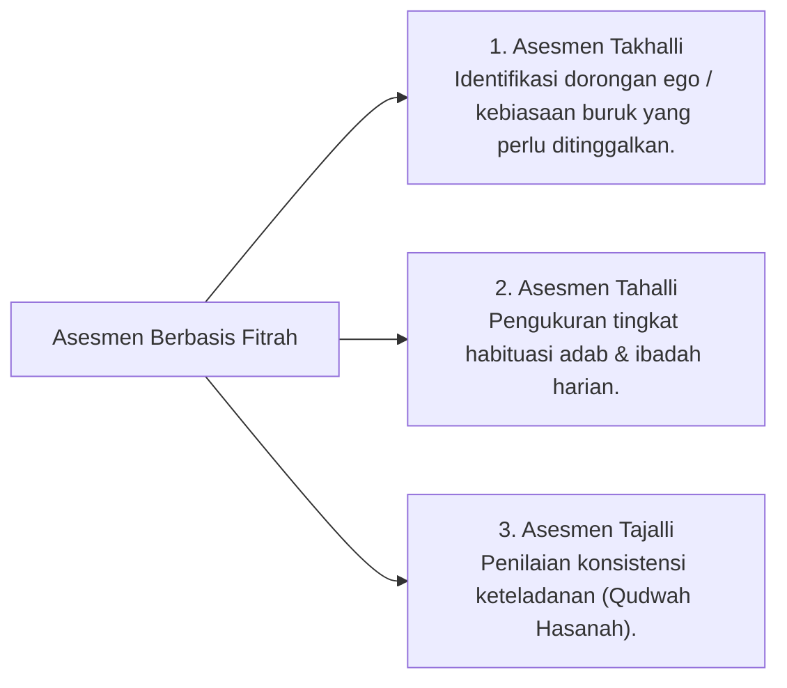

# P5-01-02: Integrasi Tazkiyatun Nafs dan Asesmen Fitrah Santri

## Status Dokumen
* **Status**: 🌟 **A+ (Tervalidasi & Siap Diimplementasikan)**
* **Sub-Domain**: `05 Assessment Framework / 01 Assessment Philosophy`
* **Penanggung Jawab Keilmuan**: Dewan Keilmuan TUMBUH (*Pakar Epistemologi Turats & Pakar Filosofi TUMBUH*)

---

## 1. Asesmen sebagai Cermin Penyucian Jiwa (*Tazkiyah*)

Dalam pandangan Turats Islam, asesmen adalah proses **Cermin Diri (*Mir'at an-Nafs*)** di mana santri dibantu melihat sejauh mana jiwanya telah melalui tahapan *Takhalli* (membersihkan keburukan), *Tahalli* (menghiasi dengan adab), dan *Tajalli* (konsistensi istiqamah).

---

## 2. Penghormatan Atas Fitrah Unik Santri

- **Keragaman Bakat & Karakter**: Setiap santri memiliki gaya fitrah yang berbeda (sebagian kuat di hafalan, sebagian di kepemimpinan khidmah, sebagian di ketelitian fisik). Asesmen tidak memaksakan satu tolok ukur tunggal.
- **Motivasi Mahabbah**: Penilaian diarahkan untuk menumbuhkan rasa cinta (*Mahabbah*) kepada Allah dan Rasul-Nya, bukan rasa takut pada sanksi pengasuh.
