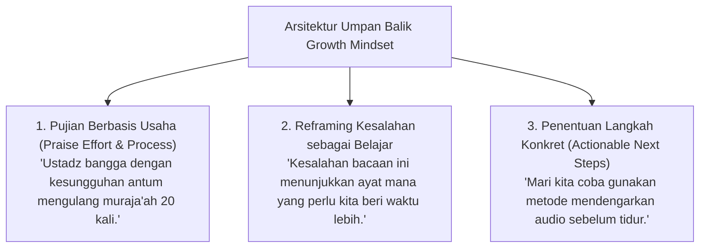

# P5-01-03: Penerapan Growth Mindset dalam Umpan Balik Asesmen

## Status Dokumen
* **Status**: 🌟 **A+ (Tervalidasi & Siap Diimplementasikan)**
* **Sub-Domain**: `05 Assessment Framework / 01 Assessment Philosophy`
* **Penanggung Jawab Keilmuan**: Dewan Keilmuan TUMBUH (*Pakar Psikologi Belajar & Pakar Pedagogi Master Guru*)

---

## 1. Konseptualisasi Growth Mindset (Carol Dweck)

Sistem evaluasi **TUMBUH** menolak anggapan *Fixed Mindset* bahwa adab atau inteligensi santri bersifat takdir permanen. Umpan balik yang diberikan musyrif dan ustadz selalu menekankan **kemampuan berkembang melalui usaha (*effort*), kesabaran (*mujahadah*), dan strategi yang tepat**.

---

## 2. Formulir Kata Kunci Umpan Balik Pengasuh

- **Dilarang**: *"Antum memang tidak berbakat menghafal"* atau *"Kamar antum dari dulu selalu kotor"*.
- **Diwajibkan**: *"Dengan latihan konsisten 15 menit setiap Subuh, hafalan antum pasti akan semakin mutqin"* atau *"Mari kita atur kembali jadwal piket kamar agar lebih efisien"*.
