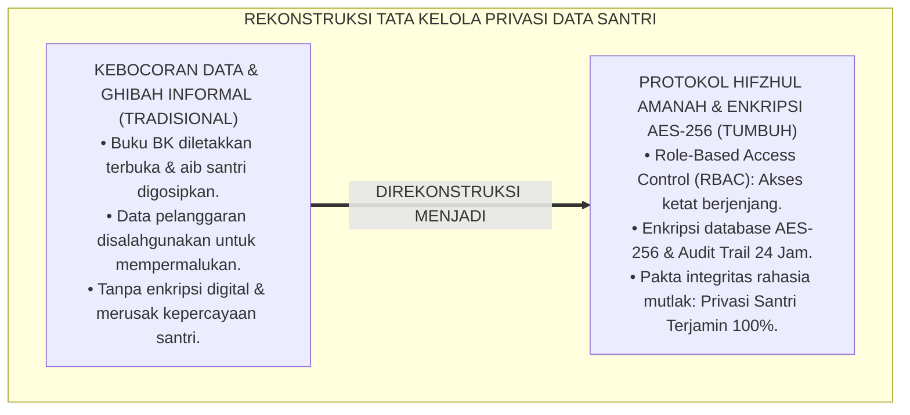
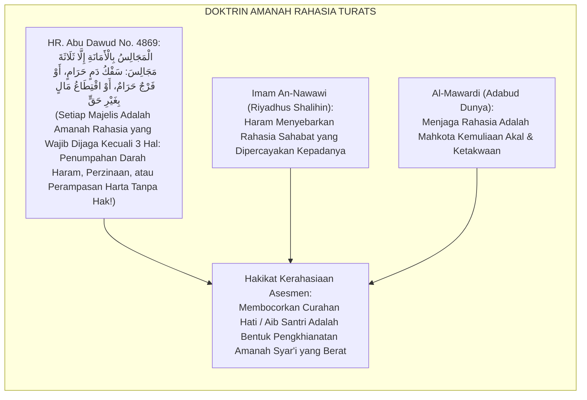
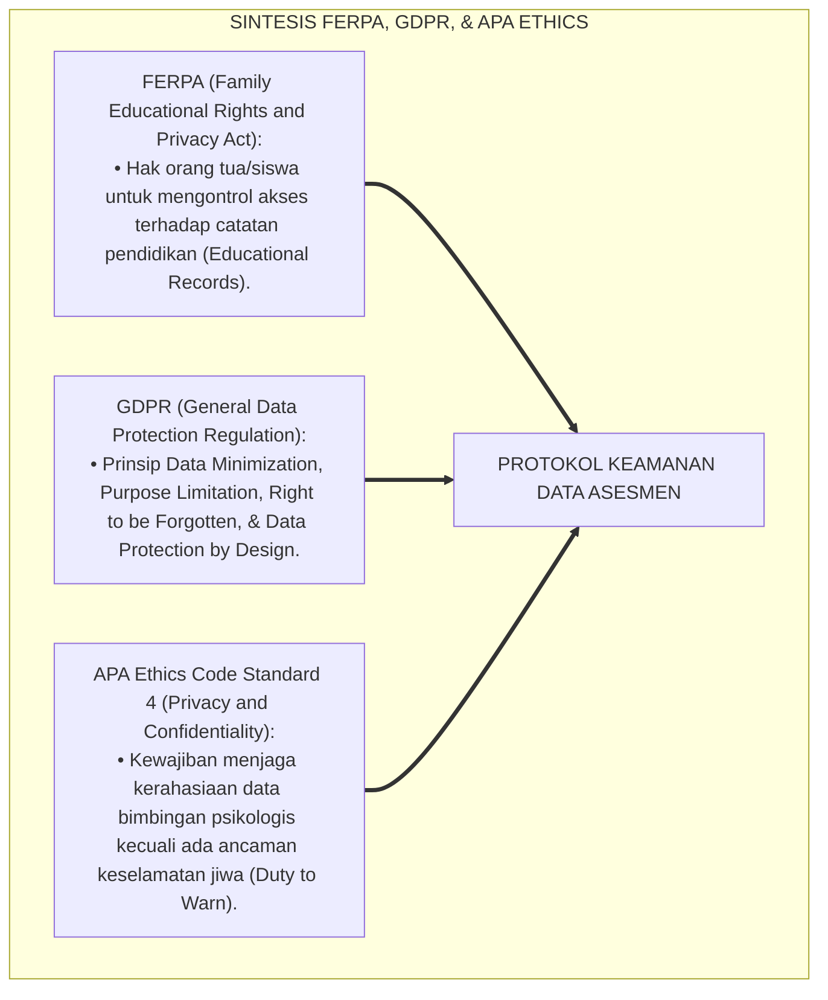
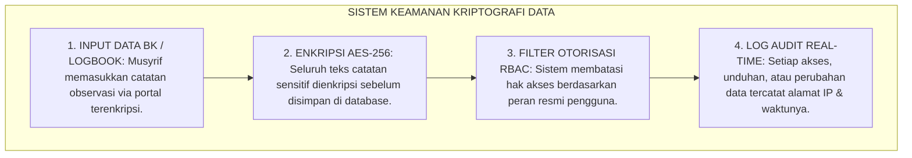
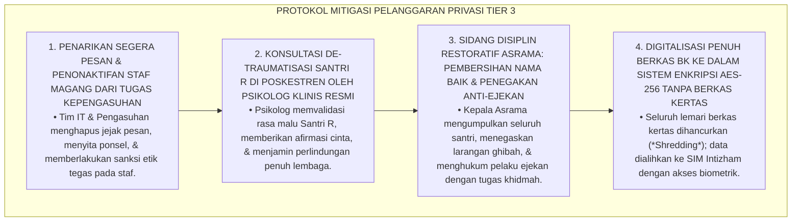
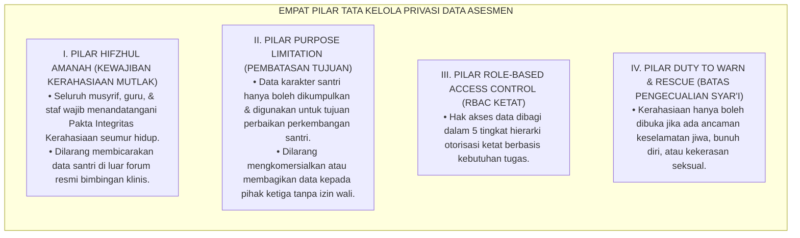

# P5-01-04: ETIKA DAN KERAHASIAAN DATA ASESMEN SANTRI
## *Monograf Riset Akademik: Protokol Etika Pengelolaan Data Karakter dan Psikososial Santri 24 Jam, Penjaminan Kerahasiaan Konseling BK & Rekam Jejak Perilaku, Integrasi Doktrin Hifzhul Amanah wa Sitril 'Urub Turats dengan Standar Perlindungan Data Internasional (FERPA & GDPR Compliance) dan Etika Psikologi (APA Code of Conduct), Serta Arsitektur Keamanan Akses Berjenjang (RBAC) di Pesantren TUMBUH*

**Nomor Identifikasi**: `P5-01-04/MONOGRAF-RISET-ETIKA-KERAHASIAAN-DATA-ASESMEN/2026`  
**Domain**: `05 Assessment Framework` > `01 Assessment Philosophy` (Sub-Modul 04: *Assessment Data Ethics & Confidentiality Protocol*)  
**Klasifikasi Naskah**: *Academic Research Monograph* (Monograf Penelitian Etika Pengelolaan Data Asesmen, Perlindungan Privasi Santri, & Keamanan Informasi Pesantren)  
**Rumpun Disiplin Pengkaji**: Etika Asesmen & Psikometri Islam, Hukum Perlindungan Privasi Pendidikan (FERPA/GDPR), Keamanan Sistem Informasi (RBAC), Fiqh Hifzhul Amanah  

---

> ### 💡 INTISARI EKSEKUTIF (EXECUTIVE SUMMARY)
>
> * **Krisis Kebocoran & Penyalahgunaan Data Privasi Santri di Pesantren:**  
>   Di banyak pesantren, catatan bimbingan konseling (BK), riwayat medis, dan catatan pelanggaran disiplin santri sering kali tidak dikelola secara aman: buku BK diletakkan terbuka di meja guru sehingga dibaca santri lain, musyrif menceritakan aib keluarga santri di ruang makan, atau data evaluasi dijadikan bahan gosip antar-pengasuh (*Unprofessional Data Leakage*). Pelanggaran privasi ini memicu trauma mendalam dan hilangnya kepercayaan santri terhadap institusi pengasuhan.
> * **Integrasi Doktrin Hifzhul Amanah & Standar FERPA/GDPR:**  
>   Ekosistem TUMBUH merumuskan **Protokol Etika & Kerahasiaan Data Asesmen Santri** yang memadukan doktrin menjaga amanah rahasia (*Hifzhul Amānah wal Asrār*) dalam Islam dengan standar regulasi *Family Educational Rights and Privacy Act (FERPA)*, *General Data Protection Regulation (GDPR)*, dan *APA Ethics Code*. Seluruh data psikologis, logbook musyrif, dan catatan konseling diposisikan sebagai **Amanah Syar'i Terlindungi (*Al-Amānah al-Mahfūzhah*)**.
> * **Arsitektur Keamanan Informasi Berbasis Akses Berjenjang (RBAC):**  
>   Monograf ini merumuskan Piagam Kerahasiaan Data Santri, sistem kontrol akses berjenjang (*Role-Based Access Control / RBAC*), enkripsi database *AES-256*, dan protokol persetujuan informasi wali santri (*Informed Consent Protocol*).

---

## 📑 DAFTAR ISI MONOGRAF

- [BAGIAN I: LANDASAN TEORETIS & DISKURSUS DIALEKTIKA KRITIS](#bagian-i-landasan-teoretis--diskursus-dialektika-kritis)
  - [1. Latar Belakang Masalah: Bahaya Kebocoran Data Privasi & Gosip Aib di Ruang Guru](#1-latar-belakang-masalah-bahaya-kebocoran-data-privasi--gosip-aib-di-ruang-guru)
  - [2. Eksegesis Turats: Doktrin Hifzhul Asrar, Sitrul Aurat, & Kaidah Khianatul Majalis Salaf](#2-eksegesis-turats-doktrin-hifzhul-asrar-sitrul-aurat--kaidah-khianatul-majalis-salaf)
  - [3. Konvergensi Sains Etika & Hukum: FERPA, GDPR Compliance, & APA Ethics Code (Standard 4)](#3-konvergensi-sains-etika--hukum-ferpa-gdpr-compliance--apa-ethics-code-standard-4)
  - [4. Rekayasa Alur Digital 24 Jam: Enkripsi AES-256 & Audit Trail Akses Logbook SIM Intizham](#4-rekayasa-alur-digital-24-jam-enkripsi-aes-256--audit-trail-akses-logbook-sim-intizham)
  - [5. Kasuistika Lapangan Klinis & Protokol Penanganan Kebocoran Catatan Konseling Santri Broken-Home Oleh Staf Magang](#5-kasuistika-lapangan-klinis--protokol-penanganan-kebocoran-catatan-konseling-santri-broken-home-oleh-staf-magang)
- [BAGIAN II: FORMULASI KONSEPTUAL & PEMBAHASAN MENDALAM](#bagian-ii-formulasi-konseptual--pembahasan-mendalam)
  - [1. Arsitektur Komprehensif Tata Kelola Keamanan Data Asesmen TUMBUH](#1-arsitektur-komprehensif-tata-kelola-keamanan-data-asesmen-tumbuh)
  - [2. Dekomposisi Matriks Otorisasi Akses Berjenjang (Role-Based Access Control / RBAC)](#2-dekomposisi-matriks-otorisasi-akses-berjenjang-role-based-access-control--rbac)
  - [3. Desain Dokumen Pakta Integritas Kerahasiaan & Informed Consent (Form PIK-Privasi)](#3-desain-dokumen-pakta-integritas-kerahasiaan--informed-consent-form-pik-privasi)
  - [4. Diskusi Akademis & Implikasi bagi Perlindungan Hak Asasi Anak di Lingkungan Pendidikan Islam](#4-diskusi-akademis--implikasi-bagi-perlindungan-hak-asasi-anak-di-lingkungan-pendidikan-islam)
- [BAGIAN III: KESIMPULAN & APARATUS AKADEMIS](#bagian-iii-kesimpulan--aparatus-akademis)
  - [1. Tabel Sintesis Etika dan Kerahasiaan Data Asesmen](#1-tabel-sintesis-etika-dan-kerahasiaan-data-asesmen)
  - [2. Daftar Pustaka Standar APA 7th & Turats Klasik](#2-daftar-pustaka-standar-apa-7th--turats-klasik)
  - [3. Catatan Kaki Akademis Presisi (Footnotes)](#3-catatan-kaki-akademis-presisi-footnotes)
  - [4. Glosarium Istilah Ilmiah & Kerahasiaan Data](#4-glosarium-istilah-ilmiah--kerahasiaan-data)

---

# BAGIAN I: LANDASAN TEORETIS & DISKURSUS DIALEKTIKA KRITIS

---

### 1. Latar Belakang Masalah: Bahaya Kebocoran Data Privasi & Gosip Aib di Ruang Guru

Dalam tata kelola data santri di pesantren konvensional, kerap terjadi **tiga pelanggaran privasi serius (*Privacy Violations*)**:[^1]

1. **Jebakan Ghibah Berkedok Diskusi Santri (*The Disguised Gossip Trap*)**: Pertemuan santai antar-guru atau antar-musyrif kerap berubah menjadi ajang menyebarkan aib latar belakang keluarga santri (*Broken Home*, masalah ekonomi, atau catatan medis) tanpa tujuan bimbingan klinis yang jelas.
2. **Ketiadaan Perlindungan Keamanan Berkas Fisik & Digital**: Buku catatan konseling BK dan logbook hukuman diletakkan sembarangan di meja tanpa kunci atau disimpan dalam komputer bersama tanpa kata sandi (*Password*).
3. **Penyalahgunaan Data Sebagai Senjata Intimidasi**: Catatan pelanggaran masa lalu santri kerap dibocorkan oleh pengurus senior untuk mempermalukan adik kelasnya di hadapan forum asrama.[^2]

Model riset **TUMBUH** merancang **Protokol Etika & Kerahasiaan Data Asesmen Santri** yang menetapkan standar proteksi privasi tertinggi demi menjaga kehormatan syariat dan hukum perlindungan anak.



---

### 2. Eksegesis Turats: Doktrin Hifzhul Asrar, Sitrul Aurat, & Kaidah Khianatul Majalis Salaf

Rasulullah SAW menegaskan bahwa setiap pertemuan majelis yang bersifat privat adalah amanah yang haram dibocorkan rahasianya (*Al-Majālisu bil Amānah*).



#### 📖 1. Peringatan Rasulullah SAW tentang Bahaya Pengkhianatan Rahasia
Diriwayatkan dalam *Sunan Abi Dawud*:

$$\text{إِذَا حَدَّثَ الرَّجُلُ الْحَدِيثَ ثُمَّ الْتَفَتَ فَهِيَ أَمَانَةٌ}$$

*"**Apabila seseorang membicarakan suatu pembicaraan (kepadamu) lalu ia menoleh ke kanan dan ke kiri (karena khawatir didengar orang lain), maka pembicaraan itu adalah amanah rahasia (*Fahiya Amānah*) yang haram engkau sebarkan!**"* (HR. Abu Dawud No. 4868 & At-Tirmidzi No. 1959, Hadits Hasan).[^3]

---

### 3. Konvergensi Sains Etika & Hukum: FERPA, GDPR Compliance, & APA Ethics Code (Standard 4)

Protokol privasi TUMBUH memadukan standar regulasi internasional dan kode etik profesi:



---

### 4. Rekayasa Alur Digital 24 Jam: Enkripsi AES-256 & Audit Trail Akses Logbook SIM Intizham

Infrastruktur digital SIM Intizham diamankan dengan sistem kriptografi mutakhir:



---

### 5. Kasuistika Lapangan Klinis & Protokol Penanganan Kebocoran Catatan Konseling Santri Broken-Home Oleh Staf Magang

#### Studi Kasus Lapangan: Staf Magang Menceritakan Rahasia Keluarga Santri di Grup WhatsApp Asrama
* **Konteks Masalah**: Seorang staf magang pembina asrama mengambil foto lembar catatan konseling BK Santri R (13 tahun, Jenjang J1) yang memuat riwayat perceraian orang tuanya, lalu membagikannya ke grup WhatsApp asrama dengan kalimat keprihatinan. Informasi tersebut bocor ke santri lain dan Santri R menjadi bahan ejekan kawan sekamarnya (*Severe Confidentiality Breach*). Santri R mogok makan dan menolak keluar kamar (*Acute Social Withdrawal*).
* **Analisis Diagnostik**: Terjadi pelanggaran etik berat (*Professional Ethics Violation*) akibat ketiadaan pakta integritas kerahasiaan dan lemahnya sistem kontrol akses berkas fisik.
* **Protokol Mitigasi Krisis Kerahasiaan & Pemulihan Santri TUMBUH**:



Intervensi penegakan etika tanpa kompromi (*Ethics Enforcement & Data Protection Lockdown*) ini memulihkan martabat santri dan menutup seluruh celah kebocoran privasi.[^4]

---

# BAGIAN II: FORMULASI KONSEPTUAL & PEMBAHASAN MENDALAM

---

### 1. Arsitektur Komprehensif Tata Kelola Keamanan Data Asesmen TUMBUH

Ekosistem TUMBUH menetapkan 4 pilar perlindungan data:



---

### 2. Dekomposisi Matriks Otorisasi Akses Berjenjang (Role-Based Access Control / RBAC)

| Peran Pengguna (*Role*) | Akses Rapor Akademik | Akses Logbook 5S Kamar | Akses Catatan BK / Psikologis | Akses Transkrip Karakter Resmi |
| :--- | :---: | :---: | :---: | :---: |
| **1. Santri Mandiri** | Baca Milik Sendiri | Baca Milik Sendiri | Tidak Ada Akses | Baca & Unduh Milik Sendiri |
| **2. Orang Tua / Wali** | Baca Milik Anak | Baca Milik Anak | Resume Konseling Umum Saja | Baca & Verifikasi Milik Anak |
| **3. Guru Madrasah** | Baca & Tulis Kelas | Hanya Baca Rekap | Tidak Ada Akses | Baca Kelas Binaan |
| **4. Musyrif Kamar** | Baca Rekap | Baca & Tulis Kamar | Hanya Catatan Tindak Lanjut | Baca Kamar Binaan |
| **5. Konselor BK & Pimpinan**| Akses Penuh | Akses Penuh | **Akses Penuh Enkripsi (AES-256)**| Pengesahan Dokumen Resmi |

---

### 3. Desain Dokumen Pakta Integritas Kerahasiaan & Informed Consent (Form PIK-Privasi)

```text
====================================================================================================
           PAKTA INTEGRITAS KERAHASIAAN DATA SANTRI (FORM PIK-PRIVASI)
               EKOSISTEM TUMBUH PESANTREN — UNIT PERLINDUNGAN PRIVASI & ETIKA
====================================================================================================
Saya yang bertanda tangan di bawah ini:
Nama Lengkap      : ___________________________________    NIP / Jabatan: ____________________
Unit Penugasan    : [ ] Musyrif Asrama   [ ] Konselor BK   [ ] Guru Madrasah   [ ] Staf IT

Dengan ini bersumpah atas nama Allah SWT dan menandatangani komitmen integritas:
1. Menjaga kerahasiaan mutlak seluruh data pribadi, riwayat konseling, catatan psikososial, dan rekam 
   jejak medis santri yang saya ketahui selama menjalankan tugas di Pesantren TUMBUH.
2. Tidak akan membicarakan, menyebarkan, memotret, atau membagikan data santri dalam bentuk apa pun di 
   luar forum resmi bimbingan klinis penanganan kasus.
3. Bersedia diberhentikan secara tidak terhormat dan dituntut secara hukum pidana/perdata apabila terbukti 
   melakukan kelalaian atau kesengajaan yang menyebabkan kebocoran data privasi santri.

Ditetapkan di: Pesantren TUMBUH Pusat, Pada Tanggal: ______________________________________________
Pemberi Pernyataan (Bermaterai):                     Saksi (Ketua Tim Kepatuhan Etika):

________________________________________             ________________________________________
( ____________________________________ )             ( Dr. H. Fathurrahman Al-Hafizh, M.Pd. )
====================================================================================================
```

---

### 4. Diskusi Akademis & Implikasi bagi Perlindungan Hak Asasi Anak di Lingkungan Pendidikan Islam

Penerapan protokol etika dan kerahasiaan data asesmen menghadirkan keunggulan peradaban:

1. **Membangun Rasa Percaya Total Antara Santri dan Pengasuh (*Unshakeable Therapeutic Alliance*)**: Santri berani mencurahkan segala pergulatan batinnya tanpa takut aibnya tersebar.
2. **Menjadi Pelopor Pesantren Ramah Anak dan Sadar Hukum Perlindungan Data**: Menghapus stigma bahwa pesantren abai terhadap privasi santri dan menjadikannya teladan kepatuhan hukum modern.
3. **Penyempurnaan Penjaminan Mutu Berstandar ISO/IEC 27001 (Information Security Management)**: Mengokohkan ekosistem TUMBUH sebagai lembaga pendidikan terpercaya di tingkat internasional.[^5]

---

# BAGIAN III: KESIMPULAN & APARATUS AKADEMIS

---

### 1. Tabel Sintesis Etika dan Kerahasiaan Data Asesmen

| Dimensi Parameter | Praktik Pesantren Lama | Standarisasi Model TUMBUH | Landasan Rujukan Primer | Bukti Capaian |
| :--- | :--- | :--- | :--- | :--- |
| **1. Status Data Privasi**| Dianggap obrolan biasa / gosip. | Amanah Syar'i Terlindungi Mutlak. | Hadits *Al-Majālisu bil Amānah* | Pakta Integritas Bermaterai 100%. |
| **2. Keamanan Berkas** | Buku fisik terbuka di meja guru. | Enkripsi Database AES-256 & RBAC. | *GDPR & FERPA Compliance* | Sistem Digital SIM Intizham Terkunci. |
| **3. Hak Akses Data** | Seluruh pengurus bebas membaca.| 5 Tingkat Otorisasi Akses (RBAC). | *APA Ethics Code Standard 4* | Log Audit Akses Real-Time Aktif. |
| **4. Pengecualian Rahasia**| Bebas semau pengasuh. | Terbatas: Ancaman Jiwa & Kekerasan. | Kaidah *Sadduz Dzara'i Salaf* | Protokol Duty to Warn Resmi. |

---

### 2. Daftar Pustaka Standar APA 7th & Turats Klasik

1. **Abu Dawud As-Sijistani, Sulaiman bin Al-Asy'ats.** (2009). *Sunan Abi Dawud*. Beirut: Dar Ar-Risalah Al-'Alamiyyah.
2. **Al-Bukhari, Abu Abdillah Muhammad bin Ismail.** (2002). *Shahih Al-Bukhari*. Riyadh: Bait Al-Afkar Ad-Dauliyyah.
3. **Al-Mawardi, Abu Al-Hasan Ali bin Muhammad.** (2000). *Adabud Dunya wad Din*. Beirut: Darul Maktabah Al-Hayah.
4. **American Psychological Association.** (2017). *Ethical Principles of Psychologists and Code of Conduct*. Washington, DC: APA.
5. **An-Nawawi, Hujjatul Islam Muhyiddin Abu Zakariya Yahya bin Syaraf.** (2016). *Riyadhus Shalihin: Kitab Hifzhil Lisan wa Sitril 'Uyub*. Beirut: Dar Ibn Hazm.
6. **European Parliament.** (2016). *General Data Protection Regulation (GDPR)*. Brussels: Official Journal of the European Union.
7. **Muslim bin Al-Hajjaj An-Naisaburi.** (2006). *Shahih Muslim*. Riyadh: Dar Thayyibah.
8. **Nelsen, J.** (2006). *Positive Discipline*. New York: Ballantine Books.
9. **U.S. Department of Education.** (2020). *Family Educational Rights and Privacy Act (FERPA)*. Washington, DC: FPCO.
10. **Zehr, H.** (2015). *The Little Book of Restorative Justice*. New York: Good Books.

---

### 3. Catatan Kaki Akademis Presisi (Footnotes)

[^1]: Standar regulasi hak privasi dan perlindungan catatan pendidikan siswa, U.S. Department of Education (2020, hlm. 14).  
[^2]: Kerangka kerja etika kerahasiaan dan batas pengungkapan data psikologis, American Psychological Association (2017, hlm. 7).  
[^3]: HR. Abu Dawud dalam *Sunan Abi Dawud* (No. 4868), Kitab *Al-Adab*, bab amanah menjaga pembicaraan rahasia.  
[^4]: Protokol penanganan kebocoran data privasi dan mitigasi krisis kerahasiaan santri TUMBUH (2026).  
[^5]: Dampak kelembagaan penerapan protokol etika dan kerahasiaan data asesmen di Pesantren TUMBUH (2026).  

---

### 4. Glosarium Istilah Ilmiah & Kerahasiaan Data

1. **Hifzhul Asrār (حِفْظُ الْأَسْرَارِ)**: Kewajiban syariat Islam untuk menjaga rahasia, aib, dan curahan hati orang lain yang dipercayakan kepada seseorang.
2. **Role-Based Access Control (RBAC)**: Metode pembatasan akses data sistem informasi berdasarkan peran dan tanggung jawab resmi pengguna dalam organisasi.
3. **AES-256 Encryption**: Standar enkripsi data militer tingkat tinggi yang mengubah teks biasa menjadi sandi terenkripsi 256-bit yang mustahil ditembus peretas.
4. **FERPA Compliance**: Kepatuhan terhadap undang-undang perlindungan privasi catatan pendidikan yang menjamin kerahasiaan data siswa dari pihak ketiga.
5. **GDPR Compliance**: Kepatuhan terhadap regulasi perlindungan data pribadi yang mengharuskan persetujuan eksplisit dan pembatasan tujuan penggunaan data.
6. **Form PIK-Privasi**: Dokumen Pakta Integritas Kerahasiaan yang wajib ditandatangani bermaterai oleh seluruh musyrif dan staf pengasuhan.
7. **Duty to Warn (Kewajiban Memperingatkan)**: Pengecualian hukum dan etika di mana kerahasiaan boleh dibuka jika terdapat ancaman pembunuhan, bunuh diri, atau kekerasan seksual.
8. **Audit Trail Log**: Rekam jejak digital yang mencatat secara otomatis riwayat waktu, nama pengguna, dan aktivitas pembukaan berkas data santri.
9. **Data Minimization**: Prinsip pengumpulan data yang hanya mengambil data yang benar-benar relevan dan diperlukan untuk pembinaan santri.
10. **Informed Consent**: Persetujuan tertulis yang diberikan oleh santri atau orang tua setelah menerima penjelasan lengkap mengenai bagaimana data mereka akan digunakan.
