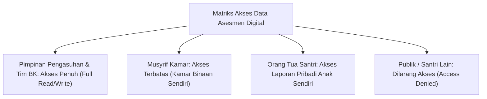

# P5-01-04: Etika dan Kerahasiaan Data Asesmen Santri

## Status Dokumen
* **Status**: 🌟 **A+ (Tervalidasi & Siap Diimplementasikan)**
* **Sub-Domain**: `05 Assessment Framework / 01 Assessment Philosophy`
* **Penanggung Jawab Keilmuan**: Dewan Keilmuan TUMBUH (*Pakar Arsitektur Digital Pesantren & Pakar Bimbingan Konseling*)

---

## 1. Perlindungan Kehormatan Santri (*Hifzhul 'Irdh*)

Sesuai prinsip Syar'i **Hifzhul 'Irdh** (menjaga kehormatan diri), rekam data perilaku, kesalahan adab, dan catatan konseling santri merupakan **Amanah Rahasia** yang tidak boleh dibuka kepada publik, santri lain, maupun pihak luar yang tidak berwenang.

---

## 2. Larangan Pengumuman Pelanggaran di Depan Umum

- Dilarang membuat papan daftar santri pembangkang/pelanggar di area umum asrama atau masjid.
- Pelanggaran yang dicatat dalam logbook PBIS bersifat privat dan hanya digunakan oleh pengasuh untuk merumuskan langkah bimbingan restoratif.
