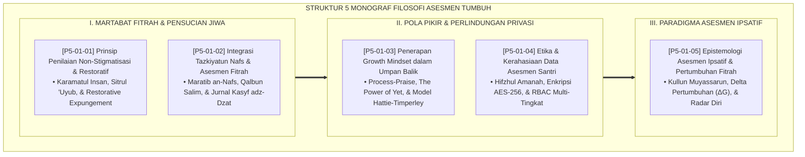

# P5-01: DOKUMEN INDUK FILOSOFI ASESMEN FORMATIF-IPSATIF-RESTORATIF
## *Arsitektur Paradigma dan Epistemologi Evaluasi Pertumbuhan Santri (Prinsip Non-Stigmatisasi, Integrasi Tazkiyatun Nafs, Growth Mindset Feedback, Etika Kerahasiaan Data Hifzhul Amanah, Serta Asesmen Ipsatif Fitrah) di Ekosistem TUMBUH Pesantren*

**Nomor Identifikasi**: `P5-01/DOKUMEN-INDUK-FILOSOFI-ASESMEN-RESTORATIF/2026`  
**Domain**: `05 Assessment Framework` > `01 Assessment Philosophy` (Gugus Sub-Domain 01: *Restorative & Ipsative Assessment Philosophy*)  
**Klasifikasi Naskah**: *Master Architecture & Navigation Monograph* (Dokumen Induk Peta Jalan Riset & Navigasi 5 Monograf Ilmiah Filosofi Asesmen)  
**Rumpun Disiplin Pengkaji**: Filsafat Evaluasi Pendidikan Islam, Epistemologi Tazkiyatun Nafs & Fitrah, Teori Keadilan Restoratif, Etika Psikometri Pendidikan  

---

> ### 💡 INTISARI EKSEKUTIF (EXECUTIVE SUMMARY)
>
> * **Kedudukan Fondasional Gugus Filosofi Asesmen:**  
>   Gugus *Assessment Philosophy (Filosofi Asesmen Formatif-Ipsatif-Restoratif)* merupakan jangkar epistemologis bagi seluruh sistem evaluasi di Domain 05. Evaluasi di pesantren TUMBUH tidak diposisikan sebagai "vonis penghakiman retributif" yang melabeli, mempermalukan (*Public Shaming*), atau meranking santri secara destruktif, melainkan sebagai **Cermin Pensucian Jiwa (*Mir'ātut Tazkiyah*)** yang memuliakan martabat fitrah insan (*Karāmatul Insān*) dan menuntun langkah perbaikan amal.
> * **Integrasi Holistik Turats & Konsensus Sains Evaluasi Modern:**  
>   Gugus riset ini memadukan khazanah agung Islam tentang amanah menutup aib (*Sitrul 'Uyūb*), tingkatan jiwa (*Marātib an-Nafs*), dan kesungguhan ikhtiar (*Al-Mujāhadah*) dengan konsensus sains mutakhir (*Howard Zehr's Restorative Justice, Carol Dweck's Growth Mindset, Gwyneth Hughes' Ipsative Assessment, FERPA/GDPR Privacy Standards, dan Hattie-Timperley's Feedback Model*).
> * **Struktur Lengkap 5 Berkas Monograf Riset Ilmiah:**  
>   Dokumen induk ini memetakan dan menghubungkan 5 berkas monograf penelitian akademik komprehensif (~140 KB total riset) yang menyajikan prinsip non-stigmatisasi, jurnal pensucian batin Kasyf adz-Dzat, bahasa umpan balik bertumbuh, perlindungan kerahasiaan enkripsi AES-256, dan rapor trajektori radar diri ipsatif.

---

## 📑 PETA NAVIGASI LIMA MONOGRAF RISET FILOSOFI ASESMEN

Berikut adalah daftar lengkap 5 monograf riset akademik dalam gugus **`01 Assessment Philosophy`**:

---

## 📚 DESKRIPSI RINGKAS 5 BERKAS MONOGRAF

1. **[P5-01-01: Prinsip Penilaian Non-Stigmatisasi dan Restoratif](file:///c:/xampp/htdocs/tumbuh/05%20Assessment%20Framework/01%20Assessment%20Philosophy/P5-01-01-Prinsip-Penilaian-Non-Stigmatisasi-dan-Restoratif.md)**  
   *Membahas eliminasi mutlak labeling teori dan stigmatisasi santri, doktrin menutup aib (Sitrul 'Uyub), pemisahan tindakan salah dari martabat pribadi insan, dan pemutihan catatan pelanggaran (Restorative Expungement).*
2. **[P5-01-02: Integrasi Tazkiyatun Nafs dan Asesmen Fitrah](file:///c:/xampp/htdocs/tumbuh/05%20Assessment%20Framework/01%20Assessment%20Philosophy/P5-01-02-Integrasi-Tazkiyatun-Nafs-dan-Asesmen-Fitrah.md)**  
   *Membahas evaluasi kalbu menembus motif niat terdalam, tingkatan jiwa (Ammarah, Lawwamah, Muthma'innah), diagnostik penyakit hati (riya', 'ujub, hasad), dan jurnal refleksi Kasyf adz-Dzat.*
3. **[P5-01-03: Penerapan Growth Mindset dalam Umpan Balik Asesmen](file:///c:/xampp/htdocs/tumbuh/05%20Assessment%20Framework/01%20Assessment%20Philosophy/P5-01-03-Penerapan-Growth-Mindset-dalam-Umpan-Balik.md)**  
   *Membahas transformasi dari pujian bakat statis (Person-Praise) menuju apresiasi proses dan ikhtiar (Process-Praise), doktrin mujahadah Islam, The Power of Yet, dan 4 lapis umpan balik Hattie-Timperley.*
4. **[P5-01-04: Etika dan Kerahasiaan Data Asesmen Santri](file:///c:/xampp/htdocs/tumbuh/05%20Assessment%20Framework/01%20Assessment%20Philosophy/P5-01-04-Etika-dan-Kerahasiaan-Data-Asesmen-Santri.md)**  
   *Membahas protokol privasi data santri 24 jam, doktrin amanah majelis, standar FERPA/GDPR dan APA Ethics, enkripsi AES-256, kontrol otorisasi RBAC, dan pencegahan ghibah di ruang pengasuhan.*
5. **[P5-01-05: Epistemologi Asesmen Ipsatif dan Pertumbuhan Fitrah](file:///c:/xampp/htdocs/tumbuh/05%20Assessment%20Framework/01%20Assessment%20Philosophy/P5-01-05-Epistemologi-Asesmen-Ipsatif-Perkembangan.md)**  
   *Membahas dekonstruksi perankingan kelas normatif kurva lonceng, hadits Kullu Muyassarun, pengukuran Delta Pertumbuhan Ipsatif ($\Delta G$), dan penerbitan Rapor Trajektori Radar Diri (Form RTI-Personal).*

---

## 🎯 STANDAR PENJAMINAN MUTU FILOSOFI ASESMEN

Penerapan gugus **Filosofi Asesmen Formatif-Ipsatif-Restoratif (Assessment Philosophy)** menjamin bahwa:
1. **Evaluasi Memanusiakan Manusia (*Dignified Humanizing Evaluation*)**: Setiap proses penilaian memperlakukan santri sebagai makhluk mulia ciptaan Allah yang senantiasa memiliki ruang untuk bertumbuh dan bertaubat.
2. **Kesehatan Mental dan Spiritual Terlindungi 100% (*Optimal Spiritual & Psychological Safety*)**: Lingkungan pesantren steril dari budaya ejekan, vonis aib publik, dan rivalitas toksik perankingan.
3. **Pemberdayaan Kemandirian Belajar Sepanjang Hayat (*Lifelong Autonomous Learner*)**: Santri terlatih melakukan muhasabah mandiri, mencintai proses perjuangan belajar, dan memiliki ketangguhan mental (*Grit*) yang kokoh di tengah peradaban dunia.
