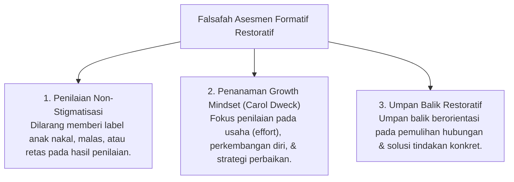

# P5-01: Filosofi Asesmen Formatif Restoratif dan Growth Mindset

## Status Dokumen
* **Status**: 🌟 **A+ (Tervalidasi & Siap Diimplementasikan)**
* **Sub-Domain**: `05 Assessment Framework / 01 Assessment Philosophy`
* **Penanggung Jawab Keilmuan**: Dewan Keilmuan TUMBUH (*Pakar Metodologi Riset & Pakar Filosofi TUMBUH*)

---

## 1. Konseptualisasi Asesmen Formatif Restoratif

Asesmen dalam ekosistem **TUMBUH** berlandaskan pada pandangan bahwa **setiap santri dilahirkan di atas fitrah yang suci** (QS. Ar-Rum: 30). Oleh karena itu, kesalahan atau pelanggaran adab bukanlah kecacatan permanen pada kepribadian santri, melainkan indikasi perlunya dukungan bimbingan (*Scaffolding Gap*).

---

## 2. Perbandingan Asesmen Tradisional vs Asesmen TUMBUH

| Parameter Asesmen | Asesmen Tradisional / Konvensional | Asesmen Ekosistem TUMBUH |
| :--- | :--- | :--- |
| **Fokus Utama** | Mengukur pencapaian akhir (*Summative ONLY*) & perangkingan. | Membimbing pertumbuhan berkelanjutan (*Formative & Ipsative Growth*). |
| **Penyikapan Pelanggaran** | Hukuman fisik/verbal, pengurangan nilai ekstrem, & denda. | Analisis Fungsional Perilaku (FBA) & Rencana Pemulihan Restoratif. |
| **Sumber Penilaian** | Subjektivitas 1 pengajar / pengasuh. | Triangulasi Data 360-Derajat (Musyrif 40%, Guru 30%, Santri 30%). |
| **Dampak Psikologis** | Kecemasan nilai, perbandingan unfaedah, & keputusasaan. | Kesadaran diri (*Self-Awareness*), motivasi intrinsik, & *Growth Mindset*. |

---

## 3. Matriks Prinsip Etika Asesmen Pesantren

1. **Prinsip Kerahasiaan (*Confidentiality*)**: Rekam data adab dan konseling santri tersimpan aman dalam sistem terenkripsi digital.
2. **Prinsip Kejujuran Reflektif (*Honest Reflection*)**: Santri diajar menilai dirinya secara jujur tanpa takut dihukum apabila mengutarakan kekurangan belajarnya.
3. **Prinsip Keadilan Kontekstual (*Contextual Fairness*)**: Penilaian memperhitungkan tingkat perkembangan tangga santri (T1, T2, T3, T4).
