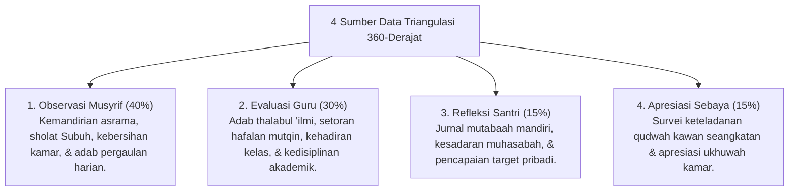

# P5-02-01: Model Triangulasi Data 360-Derajat

## Status Dokumen
* **Status**: 🌟 **A+ (Tervalidasi & Siap Diimplementasikan)**
* **Sub-Domain**: `05 Assessment Framework / 02 Assessment Architecture`
* **Penanggung Jawab Keilmuan**: Dewan Keilmuan TUMBUH (*Pakar Metodologi Riset & Pakar Arsitektur Digital Pesantren*)

---

## 1. Operasionalisasi Model Triangulasi 360-Derajat

Model Triangulasi Data 360-Derajat menggabungkan pengamatan dari empat sudut pandang independen untuk menghasilkan **Indeks Pertumbuhan Karakter Utuh**:

---

## 2. Penghapusan Bias Subjektif tunggal

Melalui metode triangulasi, bias emosional individual pengasuh atau kesalahan penilaian sesaat dapat diredam secara objektif oleh silang data dari sumber lainnya.
