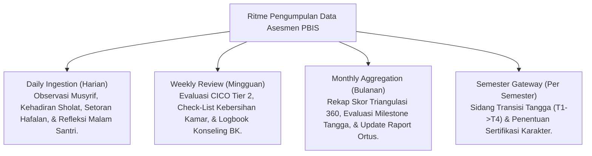

# P5-02-03: Jadwal dan Frekuensi Pengumpulan Data PBIS

## Status Dokumen
* **Status**: 🌟 **A+ (Tervalidasi & Siap Diimplementasikan)**
* **Sub-Domain**: `05 Assessment Framework / 02 Assessment Architecture`
* **Penanggung Jawab Keilmuan**: Dewan Keilmuan TUMBUH (*Pakar Pengasuhan Asrama & Pakar Arsitektur PBIS Restoratif*)

---

## 1. Matriks Ritme Pengumpulan Data (Data Collection Cadence)

---

## 2. SOP Pengumpulan Data Harian

1. **Jam Subuh (04.30–05.30)**: Musyrif mencatat kehadiran sholat Subuh dan inisiatif awal santri.
2. **Jam Diniyyah (07.30–12.00)**: Guru mencatat adab thalabul 'ilmi dan capaian hafalan Al-Qur'an.
3. **Jam Tidur Malam (21.30–22.00)**: Santri mengisi jurnal mutabaah reflektif mandiri dan musyrif melakukan rekap pencatatan harian.
