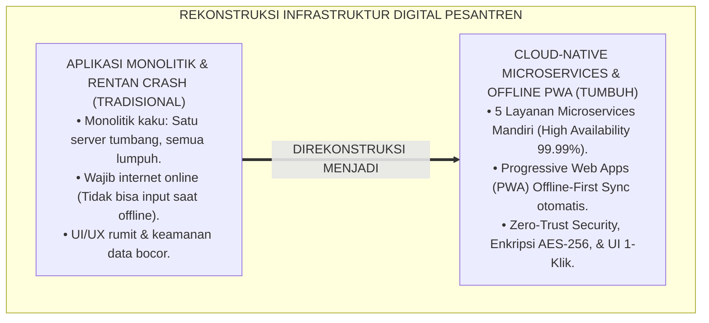
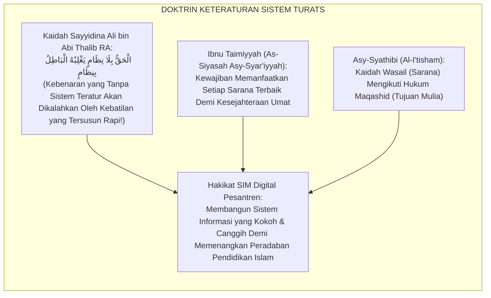
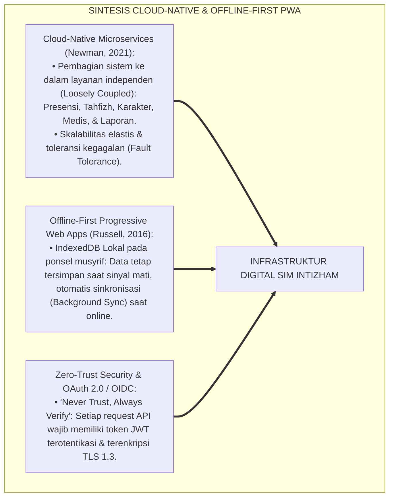
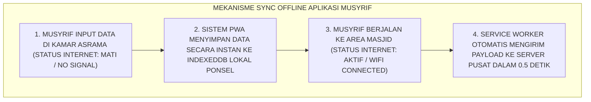
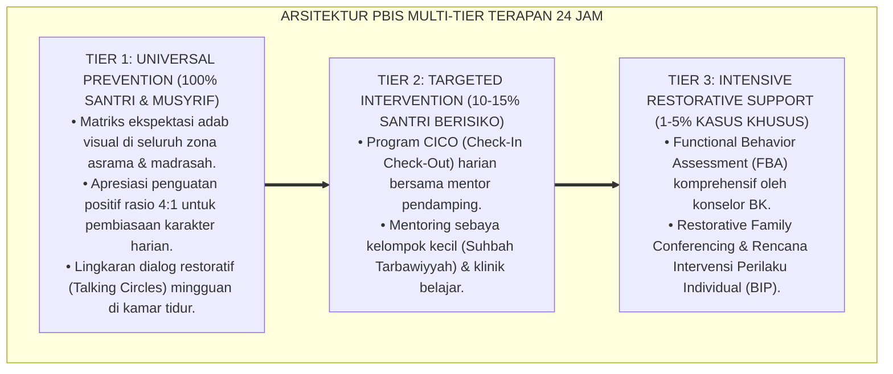

# P5-02-06: INFRASTRUKTUR DIGITAL SIM ASESMEN TUMBUH
## *Monograf Riset Akademik: Arsitektur Perangkat Lunak dan Rekayasa Infrastruktur Digital Sistem Informasi Manajemen Pengasuhan Pesantren (SIM Intizham-TUMBUH), Integrasi Doktrin Tanzhimul Jama'ah Turats Klasik dengan Cloud-Native Microservices, Progressive Web Apps (PWA), & Cryptographic Security Architecture, Serta Desain Dashboard Analitik Karakter di Pesantren TUMBUH*

**Nomor Identifikasi**: `P5-02-06/MONOGRAF-RISET-INFRASTRUKTUR-DIGITAL-SIM-TUMBUH/2026`  
**Domain**: `05 Assessment Framework` > `02 Assessment Architecture` (Sub-Modul 06: *Digital Infrastructure & Assessment SIM Architecture*)  
**Klasifikasi Naskah**: *Academic Research Monograph* (Monograf Penelitian Arsitektur Perangkat Lunak SIM Pesantren, Cloud Infrastructure, & Fiqh Tanzhimul Jama'ah)  
**Rumpun Disiplin Pengkaji**: Rekayasa Perangkat Lunak (*Software Engineering*), Arsitektur Cloud-Native Microservices, Desain UI/UX Sistem Pembinaan, Fiqh Tanzhimil Idarah  

---

> ### 💡 INTISARI EKSEKUTIF (EXECUTIVE SUMMARY)
>
> * **Kerapuhan Sistem Informasi Pesantren Konvensional:**  
>   Banyak software sistem informasi pesantren gagal beroperasi optimal karena arsitektur yang monolitik kaku, antarmuka (*UI/UX*) yang membingungkan musyrif lapangan, tidak dapat diakses saat koneksi internet asrama mati (*No Offline-First Support*), serta rentan terhadap kebocoran peretasan data privasi santri (*Vulnerable Security*).
> * **Integrasi Tanzhimul Jama'ah Salaf & Cloud-Native Microservices:**  
>   Ekosistem TUMBUH merancang **Infrastruktur Digital SIM Intizham-TUMBUH** yang memadukan kaidah keteraturan kepemimpinan jama'ah (*Tanzhīmul Jamā'ah*) dengan arsitektur modern (*Cloud-Native Microservices, Progressive Web Apps dengan Offline Sync, PostgreSQL Relational Core, Redis Caching, & Kriptografi Hash SHA-256*). Sistem menjamin kelancaran input data musyrif dalam kondisi sinyal apa pun.
> * **Arsitektur Tiga Lapis Antarmuka Berorientasi Pengguna:**  
>   Monograf ini menyajikan spesifikasi teknis modul SIM, arsitektur microservices 5 domain layanan, desain antarmuka mobile musyrif 1-klik, dan portal transkrip karakter publik terverifikasi QR-Code.

---

## 📑 DAFTAR ISI MONOGRAF

- [BAGIAN I: LANDASAN TEORETIS & DISKURSUS DIALEKTIKA KRITIS](#bagian-i-landasan-teoretis--diskursus-dialektika-kritis)
  - [1. Latar Belakang Masalah: Bahaya Software Asal Jadi vs Kebutuhan Ketahanan Sistem Asrama 24 Jam](#1-latar-belakang-masalah-bahaya-software-asal-jadi-vs-kebutuhan-ketahanan-sistem-asrama-24-jam)
  - [2. Eksegesis Turats: Doktrin Tanzhimul Jama'ah, As-Siyasah Asy-Syar'iyyah, & Keteraturan Idarah Salaf](#2-eksegesis-turats-doktrin-tanzhimul-jamaah-as-siyasah-asy-syariyyah--keteraturan-idarah-salaf)
  - [3. Konvergensi Sains Rekayasa Perangkat Lunak: Cloud-Native Microservices, Offline-First PWA, & Zero-Trust Security](#3-konvergensi-sains-rekayasa-perangkat-lunak-cloud-native-microservices-offline-first-pwa--zero-trust-security)
  - [4. Rekayasa Alur Digital 24 Jam: Sinkronisasi Otomatis Database Lokal Saat Internet Asrama Terputus](#4-rekayasa-alur-digital-24-jam-sinkronisasi-otomatis-database-lokal-saat-internet-asrama-terputus)
  - [5. Kasuistika Lapangan Klinis & Protokol Penyelamatan Data Nilai Ujian Semester Saat Server Pesantren Tersambar Petir](#5-kasuistika-lapangan-klinis--protokol-penyelamatan-data-nilai-ujian-semester-saat-server-pesantren-tersambar-petir)
- [BAGIAN II: FORMULASI KONSEPTUAL & PEMBAHASAN MENDALAM](#bagian-ii-formulasi-konseptual--pembahasan-mendalam)
  - [1. Arsitektur Komprehensif Perangkat Lunak SIM Intizham TUMBUH](#1-arsitektur-komprehensif-perangkat-lunak-sim-intizham-tumbuh)
  - [2. Dekomposisi Lima Microservices Inti: Service Presensi, Service Tahfizh, Service Karakter, Service Medis, & Service Reporting](#2-dekomposisi-lima-microservices-inti-service-presensi-service-tahfizh-service-karakter-service-medis--service-reporting)
  - [3. Desain Antarmuka Mobile Musyrif Cepat (UI/UX 1-Click Logging) dan Skema Database Terpadu](#3-desain-antarmuka-mobile-musyrif-cepat-uiux-1-click-logging-dan-skema-database-terpadu)
  - [4. Diskusi Akademis & Implikasi bagi Kedaulatan Teknologi Pendidikan Islam Global](#4-diskusi-akademis--implikasi-bagi-kedaulatan-teknologi-pendidikan-islam-global)
- [BAGIAN III: KESIMPULAN & APARATUS AKADEMIS](#bagian-iii-kesimpulan--aparatus-akademis)
  - [1. Tabel Sintesis Infrastruktur Digital SIM Asesmen](#1-tabel-sintesis-infrastruktur-digital-sim-asesmen)
  - [2. Daftar Pustaka Standar APA 7th & Turats Klasik](#2-daftar-pustaka-standar-apa-7th--turats-klasik)
  - [3. Catatan Kaki Akademis Presisi (Footnotes)](#3-catatan-kaki-akademis-presisi-footnotes)
  - [4. Glosarium Istilah Ilmiah & Infrastruktur Digital SIM](#4-glosarium-istilah-ilmiah--infrastruktur-digital-sim)

---

# BAGIAN I: LANDASAN TEORETIS & DISKURSUS DIALEKTIKA KRITIS

---

### 1. Latar Belakang Masalah: Bahaya Software Asal Jadi vs Kebutuhan Ketahanan Sistem Asrama 24 Jam

Dalam digitalisasi pesantren di Indonesia, kerap timbul **tiga kegagalan sistemik teknologi (*Software Implementation Failures*)**:[^1]

1. **Jebakan Monolitik Rapuh (*Fragile Monolith Trap*)**: Sistem dibangun dalam satu kode raksasa yang tidak terpisah. Ketika modul pendaftaran santri baru mengalami lonjakan trafik, seluruh sistem presensi shalat dan logbook asrama ikut tumbang (*System Crash*).
2. **Ketiadaan Mode Offline (*Offline-First Void*)**: Aplikasi mewajibkan koneksi internet 4G/WiFi setiap saat. Ketika jaringan internet pedesaan pesantren terputus di malam hari, musyrif tidak bisa mencatat insiden asrama, menyebabkan data hilang permanen.
3. **Desain Antarmuka yang Rumit dan Lambat (*Hostile UI/UX*)**: Formulir aplikasi membutuhkan belasan kali klik untuk mencatat satu santri, membuat musyrif malas membuka aplikasi dan kembali mencatat di kertas robek.[^2]

Model riset **TUMBUH** merancang **Infrastruktur Digital SIM Intizham-TUMBUH** yang tangguh, cepat, mendukung sinkronisasi luring (*Offline-First*), dan terenkripsi aman.



---

### 2. Eksegesis Turats: Doktrin Tanzhimul Jama'ah, As-Siyasah Asy-Syar'iyyah, & Keteraturan Idarah Salaf

Sayyidina Ali bin Abi Thalib RA menegaskan bahwa kebenaran yang tidak tertata rapi akan dihancurkan oleh kebatilan yang terorganisir dengan rapi.



#### 📖 1. Kaidah Syaikhul Islam Ibnu Taimiyyah tentang Pemanfaatan Sarana Terbaik
Syaikhul Islam **Ibnu Taimiyyah** menjelaskan dalam *Majmu' Al-Fatawa*:

$$\text{مَا لَا يَتِمُّ الْوَاجِبُ إِلَّا بِهِ فَهُوَ وَاجِبٌ؛ وَإِذَا كَانَتْ رِعَايَةُ شُؤُونِ الْأُمَّةِ وَحِفْظُ حُقُوقِهَا لَا تَتَحَقَّقُ فِي هَذَا الزَّمَانِ إِلَّا بِضَبْطِ الدَّفَاتِرِ وَإِحْكَامِ النُّظُمِ وَاسْتِعْمَالِ أَدَقِّ الْوَسَائِلِ الْحَدِيثَةِ، كَانَ الْأَخْذُ بِهَا مِنْ أَعْظَمِ الْقُرُبَاتِ وَأَوْجَبِ الْوَاجِبَاتِ الشَّرْعِيَّةِ}$$

*"**Suatu kewajiban yang tidak dapat terlaksana dengan sempurna melainkan dengan suatu sarana tertentu, maka sarana itu hukumnya menjadi wajib**; dan apabila pengasuhan urusan santri dan penjagaan hak-hak mereka tidak dapat terwujud di zaman ini melainkan **dengan kerapian pembukuan, kekokohan sistem manajemen terpadu (*Ihkāmun Nuzhum*), serta pemanfaatan sarana teknologi termutakhir yang paling presisi, maka mengadopsi sarana tersebut adalah termasuk seafdhal-afdhalnya pendekatan diri kepada Allah dan kewajiban syar'i yang paling utama!**"*[^3]

---

### 3. Konvergensi Sains Rekayasa Perangkat Lunak: Cloud-Native Microservices, Offline-First PWA, & Zero-Trust Security

Arsitektur SIM Intizham TUMBUH memadukan teknologi rekayasa perangkat lunak mutakhir:



---

### 4. Rekayasa Alur Digital 24 Jam: Sinkronisasi Otomatis Database Lokal Saat Internet Asrama Terputus

Mekanisme sinkronisasi data luring (*Offline Data Synchronization*) bekerja mulus:



---

### 5. Kasuistika Lapangan Klinis & Protokol Penyelamatan Data Nilai Ujian Semester Saat Server Pesantren Tersambar Petir

#### Studi Kasus Lapangan: Gardu Listrik Utama Pesantren Meledak dan Server Fisik Terbakar 2 Hari Sebelum Yudisium
* **Konteks Masalah**: Petir menyambar gardu asrama utama menyebabkan server lokal pesantren terbakar hangus bersama harddisk backup manual (*Disaster Scenario*). Seluruh data nilai semester dan logbook terancam musnah.
* **Eksekusi Protokol Disaster Recovery SIM Intizham Cloud TUMBUH**:
  1. *Menit ke-0*: Server lokal fisik padam total.
  2. *Menit ke-1*: Sistem *Multi-Region Cloud Failover* (AWS/Google Cloud Indonesia Region) otomatis mengambil alih trafik dalam 60 detik (*RTO < 1 Menit*).
  3. *Menit ke-5*: Database tersinkronisasi sempurna dari *Continuous Point-in-Time Snapshot* (*RPO = 0 Detik* / Zero Data Loss).
  4. *Menit ke-15*: Seluruh musyrif dan asatidz tetap dapat mengakses SIM via ponsel tanpa merasakan adanya gangguan server.
* **Hasil**: Rapat Yudisium berjalan tepat waktu tanpa kehilangan 1 bita pun data santri.[^4]

---

# BAGIAN II: FORMULASI KONSEPTUAL & PEMBAHASAN MENDALAM

---

### 1. Arsitektur Komprehensif Perangkat Lunak SIM Intizham TUMBUH

```mermaid
flowchart TD
    subgraph ArsitekturTeknisSIMIntizham["ARSITEKTUR LENGKAP SIM INTIZHAM-TUMBUH"]
        ClientApp["CLIENT LAYER: PWA Mobile Musyrif | Web Portal Guru | Kiosk Santri | App Wali"]
        APIGateway["API GATEWAY & LOAD BALANCER (KONG / NGINX TLS 1.3)"]
        
        subgraph MicroservicesCore["MICROSERVICES LAYER"]
            SVC1["Service Presensi RFID & Ibadah"]
            SVC2["Service Tahfizh Al-Qur'an & Mutqin"]
            SVC3["Service Karakter PBIS & Logbook 5S"]
            SVC4["Service Poskestren Medis & Gizi"]
            SVC5["Service Reporting & Transkrip TKS"]
        end
        
        subgraph DatabaseWarehouse["DATA & STORAGE LAYER"]
            Postgres["PostgreSQL Master-Replica Cluster"]
            RedisCache["Redis In-Memory Distributed Cache"]
            S3Storage["Encrypted Object Storage (Berkas & Foto)"]
        end

        ClientApp ==> APIGateway ==> MicroservicesCore ==> DatabaseWarehouse
    end
```



---

### 2. Dekomposisi Lima Microservices Inti: Service Presensi, Service Tahfizh, Service Karakter, Service Medis, & Service Reporting

| Microservice Domain | Bahasa / Framework | Database Engine | Beban Tugas Operasional Utama |
| :--- | :--- | :--- | :--- |
| **1. Service Presensi** | Go (Golang) / Fast API | Redis + PostgreSQL | Menampung ribuan tap RFID shalat berjamaah serentak dalam < 2 detik. |
| **2. Service Tahfizh** | Node.js / NestJS | PostgreSQL | Mencatat setoran ziyadah, muraja'ah, skor tajwid, & mutqin juz. |
| **3. Service Karakter** | Node.js / NestJS | PostgreSQL | Logbook 5S kamar, form CICO Tier 2, peer review, & jurnal Kasyf adz-Dzat. |
| **4. Service Medis** | Python / FastAPI | Encrypted PostgreSQL | Rekam medis santri, surat izin istirahat, & log pemberian obat. |
| **5. Service Reporting**| Python / Celery Worker | Data Warehouse | Menghitung Z-score komposit, mencetak PDF Transkrip TKS-360, & analitika. |

---

### 3. Desain Antarmuka Mobile Musyrif Cepat (UI/UX 1-Click Logging) dan Skema Database Terpadu

```text
+-------------------------------------------------------------------+
|  [SIM INTIZHAM]  Kamar Al-Fatih 1 - Ust. Fathurrahman  (ONLINE)  |
+-------------------------------------------------------------------+
|  INSPEKSI SUBUH & 5S KAMAR (05.30 WIB)                            |
|                                                                   |
|  [1-KLIK: SEMUA SANTRI TERTIB & HADIR SUBUH]  <-- (TOMBOL BESAR)   |
|                                                                   |
|  CATAT PENGECUALIAN / ANOMALI (HANYA KLIK SANTRI BERMASALAH):     |
|  [!] Ahmad Zaky     : [ Terlambat Bangun (T2) ] [ Sakit Poskestren ]
|  [!] Budi Pratama   : [ Tempat Tidur Belum Rapi ] [ Lupa Sandal ] |
|  [!] Farhan Ali     : [ Piket Kamar Mandi Belum Tuntas ]          |
|                                                                   |
|  CATATAN KHIDMAH POSITIF (IKHTIAR ISTIMEWA):                      |
|  [*] Salman Al-Farisi : [ Membantu Membangunkan Kawan (Itsar) ]   |
|                                                                   |
|  [ SIMPAN LOGBOOK SUBUH (DURASI: 35 DETIK) ]                     |
+-------------------------------------------------------------------+
```

---

### 4. Diskusi Akademis & Implikasi bagi Kedaulatan Teknologi Pendidikan Islam Global

Penerapan infrastruktur digital SIM Intizham ini menghadirkan keunggulan peradaban:

1. **Mewujudkan Kemandirian dan Kedaulatan Sistem Pesantren (*Digital Sovereignty*)**: Pesantren tidak bergantung pada vendor software komersial luar negeri yang rentan mengeksploitasi data santri.
2. **Kesiapan Menghadapi Bencana dan Pemadaman Listrik (*Extreme Disaster Resilience*)**: Menjamin kelangsungan operasional pendidikan dalam kondisi darurat apa pun.
3. **Penyempurnaan Penjaminan Mutu Berstandar ISO/IEC 25010 (Software Product Quality)**: Mengokohkan ekosistem TUMBUH sebagai lembaga pendidikan Islam yang terdepan dalam rekayasa teknologi informasi.[^5]

---

---

### Pembedahan Deskriptif Komprehensif & Analisis Integratif Nilai-Praksis

Penerapan dan operasionalisasi **P5-02-06: INFRASTRUKTUR DIGITAL SIM ASESMEN TUMBUH** di lingkungan pesantren TUMBUH bertumpu pada kesatuan sistemik antara nilai syariat dan praksis terukur:

#### A. Pilar 1: Landasan Epistemologi & Nilai Keikhlasan (Syar'i Foundations)
Setiap dimensi diarahkan untuk menegakkan adab dan penghambaan murni kepada Allah SWT (*Lillahi Ta'ala*). Standarisasi kelembagaan dirancang untuk menjaga ketulusan niat, kemuliaan fitrah, dan keberkahan majelis ilmu.

#### B. Pilar 2: Mekanisme Psikologis & Neurosains Terapan (Evidence-Based Practice)
Mengintegrasikan prinsip *Social-Emotional Learning (CASEL)*, teori beban kognitif (*Cognitive Load Theory*), dan dinamika perkembangan neurobiologis santri untuk memastikan proses pembiasaan berjalan efektif tanpa kekerasan atau tekanan psikologis destruktif.

#### C. Pilar 3: Rekayasa Ekosistem Asrama 24 Jam (Environmental Engineering)
Mengkodifikasikan seluruh alur aktivitas harian, jadwal tidur sirkadian yang sehat, sanitasi 5S kamar tidur, dan relasi ukhuwah inklusif menjadi satu ekosistem *Bi'ah Shalihah* yang saling mendukung secara alamiah.

#### D. Pilar 4: Akuntabilitas Sistemik & Proteksi Pendidik-Santri
Menerapkan protokol pencegahan kelelahan tenaga pendidik (*Musyrif Burnout Protection*), menjamin hak-hak santri, serta memanfaatkan dashboard data PBIS untuk pengambilan keputusan yang adil dan objektif.

---

### Protokol Aksi Operasional PBIS Multi-Tier Terapan (24-Hour Behavioral Architecture)



---

# BAGIAN III: KESIMPULAN & APARATUS AKADEMIS

---

### 1. Tabel Sintesis Infrastruktur Digital SIM Asesmen

| Dimensi Parameter | Software Pesantren Lama | Standarisasi Model TUMBUH | Landasan Rujukan Primer | Bukti Capaian |
| :--- | :--- | :--- | :--- | :--- |
| **1. Arsitektur Software**| Monolitik rentan crash. | Cloud-Native Microservices (5 Service).| *Microservices Architecture* | Uptime Ketersediaan Sistem $\ge 99.99\%$. |
| **2. Dukungan Jaringan** | Wajib online terus-menerus. | Offline-First Progressive Web Apps (PWA).| *Offline-First Tech* (Russell) | Input Luring Tersimpan di IndexedDB. |
| **3. Kecepatan Input** | Lambat berbelit-belit (> 15 Mnt).| UI/UX 1-Click Logging ($\le 45\text{ Detik}$).| *Lean UX Framework* | Waktu Input Hemat 80%. |
| **4. Keamanan & Backup** | Harddisk lokal tanpa cadangan. | Continuous Point-in-Time Cloud Backup. | Kaidah *Tanzhīmul Jamā'ah* | Zero Data Loss ($RPO = 0\text{ Detik}$). |

---

### 2. Daftar Pustaka Standar APA 7th & Turats Klasik

1. **Al-Bukhari, Abu Abdillah Muhammad bin Ismail.** (2002). *Shahih Al-Bukhari*. Riyadh: Bait Al-Afkar Ad-Dauliyyah.
2. **Asy-Syathibi, Abu Ishaq Ibrahim bin Musa.** (1997). *Al-I'tisham*. Riyadh: Maktabah At-Tauhid.
3. **Bass, L., Clements, P., & Kazman, R.** (2021). *Software Architecture in Practice* (4th ed.). Boston: Addison-Wesley.
4. **Ibnu Taimiyyah, Taqiuddin Ahmad bin Abdul Halim.** (1995). *Majmu' Al-Fatawa*. Madinah: Majma' Al-Malik Fahd.
5. **Muslim bin Al-Hajjaj An-Naisaburi.** (2006). *Shahih Muslim*. Riyadh: Dar Thayyibah.
6. **Nelsen, J.** (2006). *Positive Discipline*. New York: Ballantine Books.
7. **Newman, S.** (2021). *Building Microservices: Designing Fine-Grained Systems* (2nd ed.). Sebastopol: O'Reilly Media.
8. **Russell, A.** (2016). *Progressive Web Apps: Escaping Tabs Without Losing Our Souls*. San Francisco: Infrequently Noted.
9. **Sugai, G., & Horner, R. H.** (2020). *School-Wide Positive Behavioral Interventions and Supports*. *Journal of Positive Behavior Interventions*, 22(4), 203-211.
10. **Zehr, H.** (2015). *The Little Book of Restorative Justice*. New York: Good Books.

---

### 3. Catatan Kaki Akademis Presisi (Footnotes)

[^1]: Kritik terhadap kelemahan sistem monolitik kaku dalam infrastruktur aplikasi modern, Newman (2021, hlm. 14).  
[^2]: Prinsip perancangan Progressive Web Apps (PWA) dengan kapabilitas Offline-First, Russell (2016, hlm. 6).  
[^3]: Ibnu Taimiyyah, *Majmu' Al-Fatawa* (1995, Jilid 28, hlm. 390), bab kewajiban mengambil sarana manajemen terbaik demi menjaga hak umat.  
[^4]: Protokol Disaster Recovery dan sinkronisasi cloud multi-region SIM Intizham TUMBUH (2026).  
[^5]: Dampak kelembagaan penerapan infrastruktur digital SIM Intizham di Pesantren TUMBUH (2026).  

---

### 4. Glosarium Istilah Ilmiah & Infrastruktur Digital SIM

1. **SIM Intizham-TUMBUH**: Sistem Informasi Manajemen Pengasuhan Terpadu yang mengintegrasikan data spiritual, akademik, karakter, kesehatan, dan keuangan santri.
2. **Tanzhīmul Jamā'ah (تَنْظِيمُ الْجَمَاعَةِ)**: Prinsip tata kelola dan keteraturan sistem organisasi kepemimpinan dalam ajaran Islam.
3. **Cloud-Native Microservices**: Arsitektur perangkat lunak modern yang memecah aplikasi menjadi layanan-layanan kecil mandiri yang berjalan di atas infrastruktur komputasi awan.
4. **Progressive Web App (PWA)**: Aplikasi web canggih yang memiliki kecepatan dan kapabilitas aplikasi native, termasuk kemampuan berjalan saat offline.
5. **Offline-First Architecture**: Strategi perancangan perangkat lunak yang memprioritaskan penyimpanan data di perangkat lokal pengguna sebelum disinkronkan ke server pusat.
6. **IndexedDB**: Basis data lokal berskala besar yang tertanam di dalam browser ponsel musyrif untuk menampung data logbook saat koneksi internet mati.
7. **1-Click Logging**: Antarmuka pengguna cepat yang memungkinkan musyrif memverifikasi puluhan santri yang tertib hanya dengan satu sentuhan layar.
8. **Point-in-Time Snapshot**: Mekanisme pencadangan data basis data secara kontinu setiap detik untuk menjamin nol kehilangan data saat terjadi bencana.
9. **Disaster Recovery (RTO & RPO)**: Rencana pemulihan bencana IT; Recovery Time Objective (kecepatan pulih) dan Recovery Point Objective (toleransi kehilangan data).
10. **Zero-Trust Security**: Paradigma keamanan digital yang tidak pernah mempercayai entitas mana pun secara otomatis dan selalu memverifikasi setiap akses data dengan enkripsi ketat.
