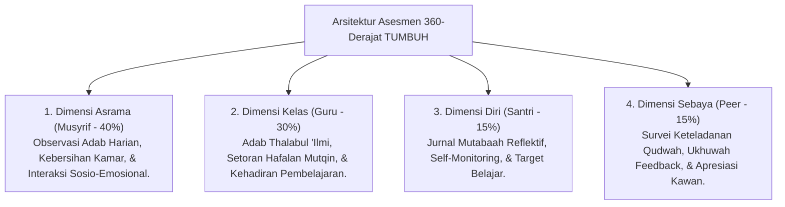
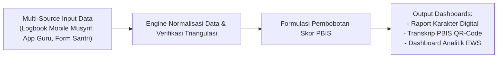

# P5-02: Arsitektur Sistem Asesmen 360-Derajat dan Triangulasi Data

## Status Dokumen
* **Status**: 🌟 **A+ (Tervalidasi & Siap Diimplementasikan)**
* **Sub-Domain**: `05 Assessment Framework / 02 Assessment Architecture`
* **Penanggung Jawab Keilmuan**: Dewan Keilmuan TUMBUH (*Pakar Arsitektur Digital Pesantren & Pakar Metodologi Riset*)

---

## 1. Konseptualisasi Arsitektur 360-Derajat

Arsitektur Asesmen 360-Derajat adalah kerangka kerja pengumpulan data perkembangan santri yang menggabungkan empat perspektif independen: **Musyrif Asrama**, **Guru Kelas**, **Diri Santri (Self-Assessment)**, dan **Sebaya (Peer Assessment)**.

---

## 2. Pipeline Alur Data Asesmen (Data Processing Pipeline)

---

## 3. Matriks Frekuensi Pengumpulan Data (Data Ingestion Schedule)

| Sumber Data | Instrumen Pengumpulan | Frekuensi Entry Data | Penanggung Jawab |
| :--- | :--- | :--- | :--- |
| **Musyrif Asrama** | Logbook Digital PBIS (Mobile App). | Real-time / Harian (Setiap Malam). | Musyrif Kamar. |
| **Guru Kelas** | Jurnal Pembelajaran & Setoran Hafalan. | Setiap Sesi Kelas / Harian. | Guru Pengajar / Ustadz. |
| **Diri Santri** | Form Refleksi Mutabaah Mandiri. | Harian (Sebelum Tidur). | Santri Individu. |
| **Sebaya (Peer)** | Survei Keteladanan Qudwah & Feedback. | Bulanan / Akhir Semester. | Pengurus Santri T4 / Peer. |
