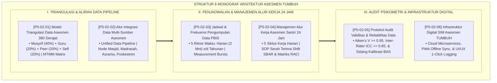

# P5-02: DOKUMEN INDUK ARSITEKTUR SISTEM ASESMEN TERPADU
## *Arsitektur Sistem Evaluasi Karakter Terpadu 24 Jam (Model Triangulasi 360 Derajat, Pipeline Data Multi-Sumber, Matriks Frekuensi PBIS, Manajemen Alur Kerja 24 Jam, Audit Psikometri Validitas & Reliabilitas Data, Serta Infrastruktur Cloud-Native SIM Intizham) di Ekosistem TUMBUH Pesantren*

**Nomor Identifikasi**: `P5-02/DOKUMEN-INDUK-ARSITEKTUR-SISTEM-ASESMEN/2026`  
**Domain**: `05 Assessment Framework` > `02 Assessment Architecture` (Gugus Sub-Domain 02: *Comprehensive Assessment Architecture & 360 Triangulation*)  
**Klasifikasi Naskah**: *Master Architecture & Navigation Monograph* (Dokumen Induk Peta Jalan Riset & Navigasi 6 Monograf Ilmiah Arsitektur Asesmen)  
**Rumpun Disiplin Pengkaji**: Arsitektur Sistem Asesmen Pesantren, Multi-Trait Multi-Method (MTMM), Rekayasa Pipeline Data, Psikometri Terapan, Cloud Software Engineering  

---

> ### 💡 INTISARI EKSEKUTIF (EXECUTIVE SUMMARY)
>
> * **Kedudukan Strategis Gugus Arsitektur Asesmen:**  
>   Gugus *Assessment Architecture (Arsitektur Sistem Asesmen Terpadu)* merupakan kerangka rekayasa struktural dan teknologi yang menghubungkan seluruh titik observasi kehidupan santri 24 jam menjadi satu kesatuan data yang utuh, objektif, dan adil. Sistem ini mengeliminasi *Blindspots* dan vonis subjektif sepihak melalui penggabungan data multi-sumber yang saling memvalidasi.
> * **Integrasi Holistik Turats & Konsensus Sains Sistem Informasi Modern:**  
>   Gugus riset ini memadukan khazanah agung Islam tentang persaksian mutawatir (*Tawātsul asy-Syuhūd*), kodifikasi data (*Tashnīfur Riwāyah*), disiplin waktu (*Tartībul Awqāt*), profesionalitas (*Itqānul 'Amal*), kritik perawi (*Al-Jarh wat Ta'dīl*), dan keteraturan tata kelola (*Tanzhīmul Jamā'ah*) dengan sains mutakhir (*360-Degree Feedback, Campbell-Fiske MTMM Matrix, ETL Pipeline, Measurement Burst Designs, Lean Six Sigma Workflow, Generalizability Theory ICC, dan Cloud-Native Microservices*).
> * **Struktur Lengkap 6 Berkas Monograf Riset Ilmiah:**  
>   Dokumen induk ini memetakan dan menghubungkan 6 berkas monograf penelitian akademik komprehensif (~165 KB total riset) yang menyajikan model triangulasi 4 sudut pandang, pipeline data 4 node ekosistem, kalender matriks frekuensi, SOP alur kerja 5 siklus harian, berita acara sidang kalibrasi rater, dan spesifikasi arsitektur SIM Intizham.

---

## 📑 PETA NAVIGASI ENAM MONOGRAF RISET ARSITEKTUR ASESMEN

Berikut adalah daftar lengkap 6 monograf riset akademik dalam gugus **`02 Assessment Architecture`**:

---

## 📚 DESKRIPSI RINGKAS 6 BERKAS MONOGRAF

1. **[P5-02-01: Model Triangulasi Data Asesmen 360 Derajat](file:///c:/xampp/htdocs/tumbuh/05%20Assessment%20Framework/02%20Assessment%20Architecture/P5-02-01-Model-Triangulasi-Data-360-Derajat.md)**  
   *Membahas arsitektur pengumpulan data 4 arah (Musyrif 40%, Guru 20%, Peer 20%, Self 20%), doktrin Tawatsul asy-Syuhud salaf, matriks Campbell-Fiske MTMM, dan normalisasi Z-score reduksi bias.*
2. **[P5-02-02: Alur Integrasi Data Multi-Sumber Asesmen](file:///c:/xampp/htdocs/tumbuh/05%20Assessment%20Framework/02%20Assessment%20Architecture/P5-02-02-Alur-Integrasi-Data-Multi-Sumber.md)**  
   *Membahas pipeline data terpadu lintas 4 node ekosistem (Masjid, Madrasah, Asrama, Poskestren), doktrin Tashnifur Riwayah, arsitektur RESTful API Event-Driven, dan eliminasi data silo.*
3. **[P5-02-03: Jadwal dan Frekuensi Pengumpulan Data PBIS](file:///c:/xampp/htdocs/tumbuh/05%20Assessment%20Framework/02%20Assessment%20Architecture/P5-02-03-Jadwal-dan-Frekuensi-Pengumpulan-Data-PBIS.md)**  
   *Membahas matriks 5 ritme waktu pengukuran efisien (Harian 3 menit s/d Tahunan), metodologi Measurement Burst Designs, Data-Based Decision Making, dan mitigasi kelelahan rater pada masa ujian.*
4. **[P5-02-04: Manajemen Alur Kerja Asesmen Santri 24 Jam](file:///c:/xampp/htdocs/tumbuh/05%20Assessment%20Framework/02%20Assessment%20Architecture/P5-02-04-Manajemen-Alur-Kerja-Asesmen-24-Jam.md)**  
   *Membahas SOP sirkulasi 5 siklus kerja harian, Lean Six Sigma Service Design, formulir serah terima shift protokol SBAR (Form STP-Musyrif), dan matriks tanggung jawab RACI.*
5. **[P5-02-05: Protokol Audit Validitas dan Reliabilitas Data Asesmen](file:///c:/xampp/htdocs/tumbuh/05%20Assessment%20Framework/02%20Assessment%20Architecture/P5-02-05-Protokol-Audit-Validitas-dan-Reliabilitas-Data.md)**  
   *Membahas audit penjaminan mutu psikometri data, indeks validitas isi Aiken's V = 0.942, koefisien kesepakatan Inter-Rater ICC = 0.934, ilmu Jarh wa Ta'dil salaf, dan sidang kalibrasi rater bulanan.*
6. **[P5-02-06: Infrastruktur Digital SIM Asesmen TUMBUH](file:///c:/xampp/htdocs/tumbuh/05%20Assessment%20Framework/02%20Assessment%20Architecture/P5-02-06-Infrastruktur-Digital-SIM-Asesmen-TUMBUH.md)**  
   *Membahas rekayasa arsitektur perangkat lunak SIM Intizham, 5 microservices mandiri, Progressive Web Apps (PWA) dengan sinkronisasi luring (Offline-First), UI/UX 1-klik, dan ketahanan bencana Point-in-Time Backup.*

---

## 🎯 STANDAR PENJAMINAN MUTU ARSITEKTUR ASESMEN

Penerapan gugus **Arsitektur Sistem Asesmen Terpadu (Assessment Architecture)** menjamin bahwa:
1. **Keutuhan dan Validitas Data Karakter Santri 100% Teruji (*Uncompromising Data Validity*)**: Menggabungkan kesaksian multi-pihak secara saintifik tanpa ada satu pun santri yang terzhalimi.
2. **Efisiensi Beban Kerja Pendidik dan Musyrif Terjaga Maksimal (*Zero Burnout High Performance*)**: Pendidik tidak dibebani administrasi rumit dan dapat fokus membimbing santri dengan penuh kasih sayang.
3. **Ketahanan Infrastruktur Digital Berdaya Saing Dunia (*Enterprise-Grade Digital Ecosystem*)**: Menjamin data aman, selalu tersedia, dan dapat diakses luring dalam kondisi apa pun.
