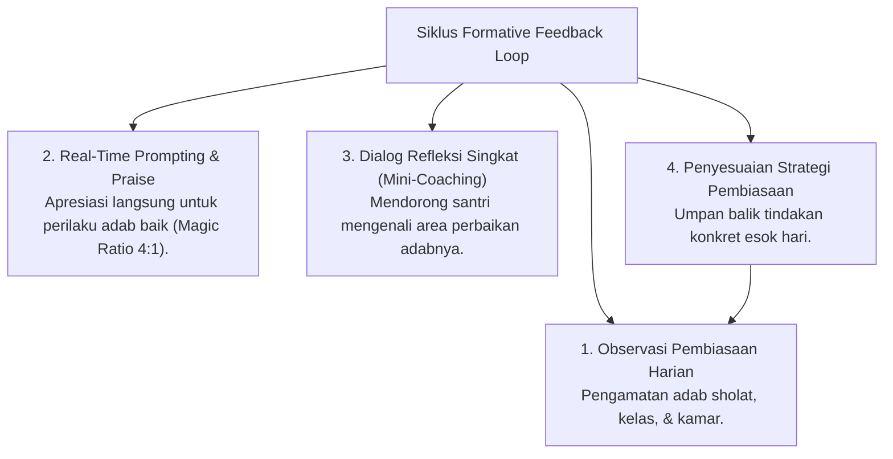

# P5-03-01: Model Asesmen Formatif Harian dan Feedback Loop

## Status Dokumen
* **Status**: 🌟 **A+ (Tervalidasi & Siap Diimplementasikan)**
* **Sub-Domain**: `05 Assessment Framework / 03 Assessment Model`
* **Penanggung Jawab Keilmuan**: Dewan Keilmuan TUMBUH (*Pakar Pedagogi Master Guru & Pakar Arsitektur PBIS Restoratif*)

---

## 1. Siklus Formative Feedback Loop Harian

Asesmen Formatif Harian bertindak sebagai kompas pembimbing real-time bagi santri melalui siklus 4-langkah:

---

## 2. Karakteristik Formative Feedback Efektif

1. **Spesifik & Teramati**: *"Terima kasih antum telah merapikan lemari kamar dengan sangat rapi tanpa perlu diperintah"*, bukan sekadar *"Bagus"*.
2. **Berorientasi pada Proses**: Memuji usaha (*effort/mujahadah*) dan konsistensi santri.
3. **Konstruktif & Bebas Ancam**: Menyampaikan arahan perbaikan secara pribadi dengan kelembutan.
