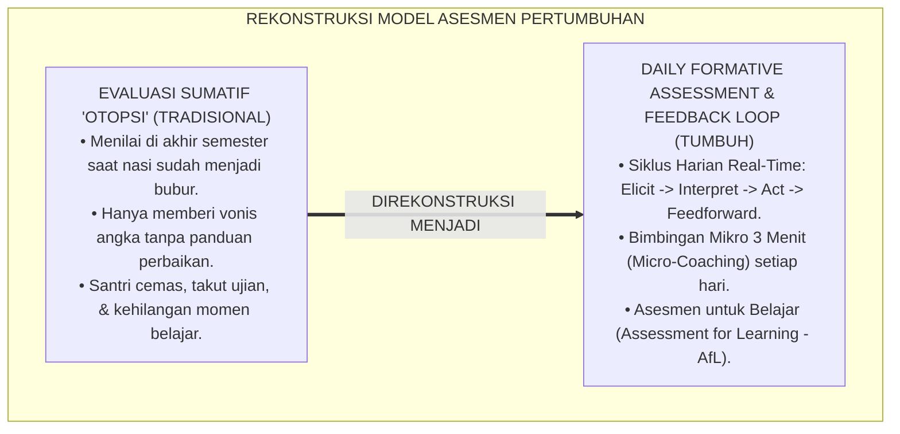
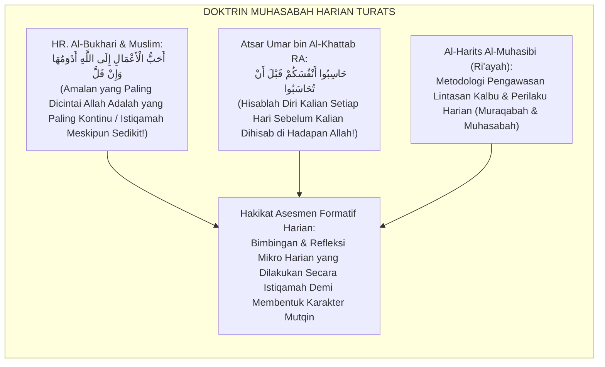
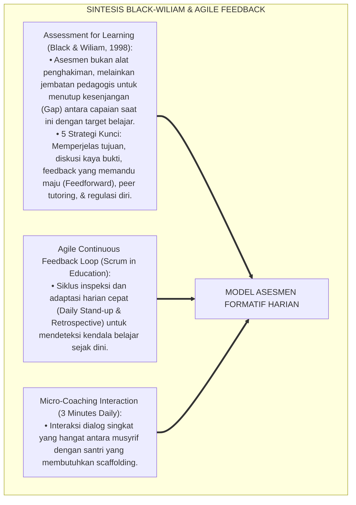
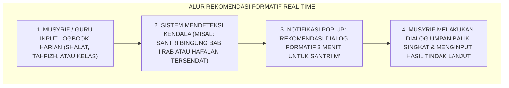
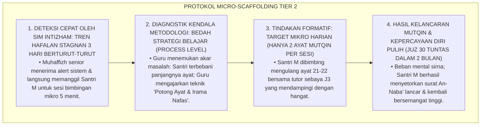
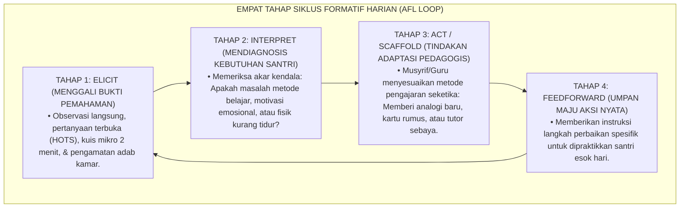
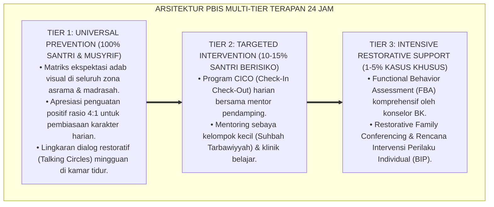

# P5-03-01: MODEL ASESMEN FORMATIF HARIAN DAN FEEDBACK LOOP
## *Monograf Riset Akademik: Epistemologi dan Praksis Siklus Evaluasi Formatif Harian Berkelanjutan (Daily Formative Assessment Loop), Integrasi Doktrin Al-Muhasabah ad-Da'imah Turats Klasik dengan Black-Wiliam Assessment for Learning (AfL) & Agile Feedback Loops, Serta Rekayasa Micro-Assessment di Pesantren TUMBUH*

**Nomor Identifikasi**: `P5-03-01/MONOGRAF-RISET-MODEL-ASESMEN-FORMATIF-HARIAN/2026`  
**Domain**: `05 Assessment Framework` > `03 Assessment Model` (Sub-Modul 01: *Daily Formative Assessment & Feedback Loop Model*)  
**Klasifikasi Naskah**: *Academic Research Monograph* (Monograf Penelitian Model Asesmen Formatif Harian, Teori Feedback Loop AfL, & Fiqh Ad-Dawam wal Muhasabah)  
**Rumpun Disiplin Pengkaji**: Desain Model Asesmen Formatif, Assessment for Learning (AfL - Black & Wiliam), Fiqh Al-Muhasabah ad-Da'imah, School-Wide PBIS Micro-Interventions  

---

> ### 💡 INTISARI EKSEKUTIF (EXECUTIVE SUMMARY)
>
> * **Kelemahan Penilaian Sumatif Akhir Periode (*The Post-Mortem Assessment Trap*):**  
>   Banyak sistem evaluasi pesantren bertumpu pada penilaian sumatif di akhir semester (Ujian Semester & Rapor Akhir). Model ini ibarat "otopsi medis" (*Autopsy Evaluation*): nilai buruk baru diketahui saat semester telah berakhir, ketika sudah terlambat untuk melakukan perbaikan. Santri tidak pernah menerima bimbingan mikro harian mengenai apa yang harus disempurnakan setiap hari.
> * **Integrasi Doktrin Ad-Dawam Salaf & Black-Wiliam Assessment for Learning (AfL):**  
>   Ekosistem TUMBUH merancang **Model Asesmen Formatif Harian & Agile Feedback Loop** yang memadukan ajaran Rasulullah SAW tentang amalan yang kontinu dan dicintai Allah (*Adwamuha wa in Qalla*) serta prinsip muhasabah harian (*Hāsibū Anfusakum Qabla an Tuhāsabū*) dengan teori *Assessment for Learning (AfL)* Paul Black & Dylan Wiliam. Evaluasi diarahkan bukan untuk "mengukur hasil akhir", melainkan sebagai **Bahan Bakar Pertumbuhan Harian (*Engine of Daily Improvement*)**.
> * **Arsitektur Siklus Umpan Balik Cepat (Rapid Feedback Loop):**  
>   Monograf ini merumuskan siklus formatif 4 tahap (*Elicit $\rightarrow$ Interpret $\rightarrow$ Act $\rightarrow$ Feedback*), protokol bimbingan mikro 3 menit musyrif, lembar refleksi formatif harian, dan analitika tren formatif SIM Intizham.

---

## 📑 DAFTAR ISI MONOGRAF

- [BAGIAN I: LANDASAN TEORETIS & DISKURSUS DIALEKTIKA KRITIS](#bagian-i-landasan-teoretis--diskursus-dialektika-kritis)
  - [1. Latar Belakang Masalah: Bahaya Evaluasi Sumatif 'Otopsi' vs Kebutuhan Tindakan Formatif Real-Time](#1-latar-belakang-masalah-bahaya-evaluasi-sumatif-otopsi-vs-kebutuhan-tindakan-formatif-real-time)
  - [2. Eksegesis Turats: Doktrin Al-Muhasabah ad-Da'imah, Adwamuha wa in Qalla, & Bimbingan Harian Salaf](#2-eksegesis-turats-doktrin-al-muhasabah-ad-daimah-adwamuha-wa-in-qalla--bimbingan-harian-salaf)
  - [3. Konvergensi Sains Evaluasi: Black & Wiliam's Inside the Black Box & Agile Continuous Feedback](#3-konvergensi-sains-evaluasi-black--wiliams-inside-the-black-box--agile-continuous-feedback)
  - [4. Rekayasa Alur Digital 24 Jam: Notifikasi Micro-Coaching Harian pada Portal SIM Intizham](#4-rekayasa-alur-digital-24-jam-notifikasi-micro-coaching-harian-pada-portal-sim-intizham)
  - [5. Kasuistika Lapangan Klinis & Protokol Intervensi Formatif Harian yang Mencegah Santri Drop-Out dari Target Tahfizh](#5-kasuistika-lapangan-klinis--protokol-intervensi-formatif-harian-yang-mencegah-santri-drop-out-dari-target-tahfizh)
- [BAGIAN II: FORMULASI KONSEPTUAL & PEMBAHASAN MENDALAM](#bagian-ii-formulasi-konseptual--pembahasan-mendalam)
  - [1. Arsitektur Komprehensif Siklus Asesmen Formatif Harian TUMBUH](#1-arsitektur-komprehensif-siklus-asesmen-formatif-harian-tumbuh)
  - [2. Dekomposisi Empat Tahap Feedback Loop: Elicit, Interpret, Act, & Feedforward](#2-dekomposisi-empat-tahap-feedback-loop-elicit-interpret-act--feedforward)
  - [3. Desain Format Lembar Refleksi Formatif Harian (Form LRF-Harian)](#3-desain-format-lembar-refleksi-formatif-harian-form-lrf-harian)
  - [4. Diskusi Akademis & Implikasi bagi Budaya Pembelajar Sepanjang Hayat di Pesantren](#4-diskusi-akademis--implikasi-bagi-budaya-pembelajar-sepanjang-hayat-di-pesantren)
- [BAGIAN III: KESIMPULAN & APARATUS AKADEMIS](#bagian-iii-kesimpulan--aparatus-akademis)
  - [1. Tabel Sintesis Model Asesmen Formatif Harian](#1-tabel-sintesis-model-asesmen-formatif-harian)
  - [2. Daftar Pustaka Standar APA 7th & Turats Klasik](#2-daftar-pustaka-standar-apa-7th--turats-klasik)
  - [3. Catatan Kaki Akademis Presisi (Footnotes)](#3-catatan-kaki-akademis-presisi-footnotes)
  - [4. Glosarium Istilah Ilmiah & Asesmen Formatif Harian](#4-glosarium-istilah-ilmiah--asesmen-formatif-harian)

---

# BAGIAN I: LANDASAN TEORETIS & DISKURSUS DIALEKTIKA KRITIS

---

### 1. Latar Belakang Masalah: Bahaya Evaluasi Sumatif 'Otopsi' vs Kebutuhan Tindakan Formatif Real-Time

Dalam praktik evaluasi pendidikan tradisional, kerap terjadi **tiga kelemahan evaluasi sumatif terlambat (*Late Summativity Traps*)**:[^1]

1. **Jebakan Evaluasi Pasca-Kematian (*Post-Mortem Assessment Trap*)**: Evaluasi baru diberikan di akhir semester saat buku rapor dibagikan. Santri yang nilainya jeblok hanya bisa menangis tanpa memiliki waktu untuk memperbaiki pemahamannya di semester tersebut.
2. **Ketiadaan Umpan Balik Aksi Nyata (*Actionable Feedback Gap*)**: Santri hanya menerima huruf "C" atau "D" tanpa pernah tahu di bagian mana kesalahannya dan langkah konkret apa yang harus dilakukan esok hari.
3. **Keterputusan Antara Asesmen dan Proses Pembelajaran**: Asesmen diposisikan sebagai "vonis terpisah" yang menakutkan, bukan sebagai sarana bimbingan belajar yang menyatu dengan aktivitas sehari-hari (*Integrated Learning*).[^2]

Model riset **TUMBUH** merancang **Model Asesmen Formatif Harian (Daily Formative Assessment Loop)** yang menjadikan setiap hembusan nafas kehidupan santri sebagai kesempatan untuk bertumbuh mekar.



---

### 2. Eksegesis Turats: Doktrin Al-Muhasabah ad-Da'imah, Adwamuha wa in Qalla, & Bimbingan Harian Salaf

Rasulullah SAW mengajarkan bahwa amalan yang paling dicintai Allah adalah amalan yang dilakukan secara berkesinambungan setiap hari (*Adwamuha wa in Qalla*), serta memerintahkan evaluasi diri harian sebelum datangnya hisab akhirat.



#### 📖 1. Kaidah Al-Harits Al-Muhasibi tentang Menghitung Pertumbuhan Amal Harian
Imam **Al-Harits Al-Muhasibi** menjelaskan dalam *Ar-Ri'āyah li Huqūqillāh*:

$$\text{مَنْ صَحَّتْ لَهُ مُحَاسَبَةُ نَفْسِهِ فِي كُلِّ يَوْمٍ وَلَيْلَةٍ، عَرَفَ نُقْصَانَ يَوْمِهِ مِنْ زِيَادَتِهِ، فَبَادَرَ إِلَى جَبْرِ النَّقْصِ قَبْلَ أَنْ يَتَرَاكَمَ الرَّيْنُ عَلَى قَلْبِهِ؛ فَإِنَّ الْعَبْدَ إِذَا تَرَكَ الْمُحَاسَبَةَ يَوْمًا بَعْدَ يَوْمٍ، اسْتَحْكَمَتْ عَلَيْهِ الْغَفْلَةُ، وَتَعَذَّرَ عَلَيْهِ الِاسْتِدْرَاكُ؛ وَإِنَّمَا الصَّلَاحُ فِي تَعَاهُدِ النَّفْسِ سَاعَةً فَسَاعَةً}$$

*"**Barangsiapa yang lurus hisab evaluasi dirinya pada setiap hari dan setiap malam, niscaya ia akan mengetahui penurunan amalnya dari peningkatannya, lalu ia bersegera menambal kekurangannya sebelum karat dosa menumpuk di atas kalbunya**; karena sesungguhnya jika seorang hamba meninggalkan evaluasi diri dari hari ke hari, niscaya kelalaian akan menguasainya secara permanen dan sangat sulit baginya untuk mengejar ketertinggalan; **dan sesungguhnya kebaikan watak itu hanya diraih dengan merawat dan membimbing jiwa dari waktu ke waktu (*Sā'atan fa Sā'ah*)!**"*[^3]

---

### 3. Konvergensi Sains Evaluasi: Black & Wiliam's Inside the Black Box & Agile Continuous Feedback

Model asesmen formatif TUMBUH memadukan prinsip *Assessment for Learning (AfL)* dan *Agile Continuous Feedback*:



---

### 4. Rekayasa Alur Digital 24 Jam: Notifikasi Micro-Coaching Harian pada Portal SIM Intizham

Platform SIM Intizham memicu rekomendasi bimbingan mikro harian bagi musyrif:



---

### 5. Kasuistika Lapangan Klinis & Protokol Intervensi Formatif Harian yang Mencegah Santri Drop-Out dari Target Tahfizh

#### Studi Kasus Lapangan: Santri J1 Tersendat di Surat An-Naba' Selama 2 Pekan dan Hampir Menyerah
* **Konteks Masalah**: Santri M (12 tahun, Jenjang J1) mengalami kebuntuan menghafal (*Memorization Block*) di surat An-Naba' ayat 20–30 selama 14 hari berturut-turut. Santri M mulai menangis setiap menjelang sesi tahfizh dan berencana minta pulang ke orang tuanya (*Avoidance & Drop-Out Risk*).
* **Analisis Diagnostik**: Santri M menggunakan metode menghafal salah (mencoba menghafal 1 halaman sekaligus tanpa memecah ayat) dan tidak pernah mendapat umpan balik strategi dari guru (*Lack of Process Feedback*).
* **Protokol Asesmen Formatif & Micro-Scaffolding TUMBUH**:



Intervensi formatif harian (*Daily Formative Micro-Intervention*) ini membuktikan bahwa bimbingan kecil yang tepat waktu mampu menyelamatkan masa depan belajar santri.[^4]

---

# BAGIAN II: FORMULASI KONSEPTUAL & PEMBAHASAN MENDALAM

---

### 1. Arsitektur Komprehensif Siklus Asesmen Formatif Harian TUMBUH

Ekosistem TUMBUH memetakan siklus formatif ke dalam 4 pilar *Agile Formative Loop*:



---

### 2. Dekomposisi Empat Tahap Feedback Loop: Elicit, Interpret, Act, & Feedforward

| Tahap Siklus Formatif | Aktivitas Konkret Pendidik / Musyrif | Respon & Partisipasi Santri | Alat / Instrumen Pembantu |
| :--- | :--- | :--- | :--- |
| **1. Elicit** | Mengajukan pertanyaan reflektif, menyimak setoran ayat, mengecek kerapian lemari 5S. | Santri mendemonstrasikan kemampuan, membaca kitab, atau menjelaskan pemahaman. | *Kuis Mikro 1-Klik / Checklist* |
| **2. Interpret** | Menganalisis pola kesalahan berulang (misal: sering salah hukum ikhfa' atau lupa menjemur handuk). | Santri menyadari area yang masih membingungkan bagi dirinya (*Metacognitive Awareness*). | *Rubrik Diagnostik Formatif* |
| **3. Act** | Memberikan bantuan bertahap (*Scaffolding*): memodelkan cara yang benar (*Qudwah*). | Santri mempraktikkan ulang di bawah bimbingan guru hingga berhasil mandiri. | *Kartu Visual Rumus / Peer Tutor* |
| **4. Feedforward** | Menetapkan target perbaikan konkret: *"Malam ini coba muraja'ah ayat 1-5 sebanyak 3x"*. | Santri mencatat komitmen tindakan di jurnal Kasyf adz-Dzat miliknya. | *Form LRF-Harian / SIM App* |

---

### 3. Desain Format Lembar Refleksi Formatif Harian (Form LRF-Harian)

```text
====================================================================================================
           LEMBAR REFLEKSI FORMATIF HARIAN (FORM LRF-HARIAN)
               EKOSISTEM TUMBUH PESANTREN — SISTEM PENDAMPINGAN FORMATIF MIKRO
====================================================================================================
Nama Santri     : ___________________________    Musyrif / Guru : ____________________
Jenjang / Kelas : Jenjang J1 (Kelas 7)           Waktu Bimbingan: [ ] Ba'da Shubuh  [ ] Ba'da Ashar

----------------------------------------------------------------------------------------------------
1. EVIDENCE ELICITATION (APA YANG DIAMATI HARI INI?):
   Fokus Pengamatan: [ ] Kelancaran Tahfizh   [ ] Adab & 5S Kamar   [ ] Qira'ah Kitab Turats
   Catatan Temuan  : "Santri sudah lancar tajwid, namun nafas masih terputus di tengah ayat 25."

2. DIAGNOSTIC INTERPRETATION (AKAR KENDALA BELAJAR):
   Akar Masalah    : "Santri belum menguasai teknik waqaf dan ibtida' yang tepat."

3. ACTION & FEEDFORWARD INSTRUCTION (PANDUAN LANGKAH PERBAIKAN ESOK HARI):
   "Ananda M, besok sebelum menyetor, beri tanda pensil kecil pada kata tempat berhenti nafas, 
    lalu ulangi ayat tersebut 2 kali bersama Sahabat Kamarmu."

4. AFIRMASI KESUNGGUHAN (EFFORT PRAISE):
   "Masya Allah, suaramu sangat merdu dan ikhtiarmu luar biasa; sedikit latihan lagi bacaanmu akan mutqin!"
----------------------------------------------------------------------------------------------------
Paraf Santri: [ ____________ ]    Paraf Musyrif / Muhaffizh: [ ____________ ]
====================================================================================================
```

---

### 4. Diskusi Akademis & Implikasi bagi Budaya Pembelajar Sepanjang Hayat di Pesantren

Penerapan model asesmen formatif harian ini menghadirkan keunggulan peradaban:

1. **Menciptakan Budaya Belajar Tanpa Rasa Takut (*Psychologically Safe Classroom*)**: Santri memandang kesalahan sebagai peluang emas untuk belajar dan berkonsultasi dengan guru.
2. **Menjamin Ketuntasan Belajar Paripurna (*Mastery Learning Guarantee*)**: Setiap materi atau adab dipastikan tuntas dikuasai sebelum santri melangkah ke jenjang berikutnya.
3. **Penyempurnaan Epistemologi Evaluasi Pesantren Berbasis Istiqamah**: Memadukan doktrin amalan kontinu para salaf dengan sains pedagogi paling modern di dunia.[^5]

---

---

### Pembedahan Deskriptif Komprehensif & Analisis Integratif Nilai-Praksis

Penerapan dan operasionalisasi **P5-03-01: MODEL ASESMEN FORMATIF HARIAN DAN FEEDBACK LOOP** di lingkungan pesantren TUMBUH bertumpu pada kesatuan sistemik antara nilai syariat dan praksis terukur:

#### A. Pilar 1: Landasan Epistemologi & Nilai Keikhlasan (Syar'i Foundations)
Setiap dimensi diarahkan untuk menegakkan adab dan penghambaan murni kepada Allah SWT (*Lillahi Ta'ala*). Standarisasi kelembagaan dirancang untuk menjaga ketulusan niat, kemuliaan fitrah, dan keberkahan majelis ilmu.

#### B. Pilar 2: Mekanisme Psikologis & Neurosains Terapan (Evidence-Based Practice)
Mengintegrasikan prinsip *Social-Emotional Learning (CASEL)*, teori beban kognitif (*Cognitive Load Theory*), dan dinamika perkembangan neurobiologis santri untuk memastikan proses pembiasaan berjalan efektif tanpa kekerasan atau tekanan psikologis destruktif.

#### C. Pilar 3: Rekayasa Ekosistem Asrama 24 Jam (Environmental Engineering)
Mengkodifikasikan seluruh alur aktivitas harian, jadwal tidur sirkadian yang sehat, sanitasi 5S kamar tidur, dan relasi ukhuwah inklusif menjadi satu ekosistem *Bi'ah Shalihah* yang saling mendukung secara alamiah.

#### D. Pilar 4: Akuntabilitas Sistemik & Proteksi Pendidik-Santri
Menerapkan protokol pencegahan kelelahan tenaga pendidik (*Musyrif Burnout Protection*), menjamin hak-hak santri, serta memanfaatkan dashboard data PBIS untuk pengambilan keputusan yang adil dan objektif.

---

### Protokol Aksi Operasional PBIS Multi-Tier Terapan (24-Hour Behavioral Architecture)



---

# BAGIAN III: KESIMPULAN & APARATUS AKADEMIS

---

### 1. Tabel Sintesis Model Asesmen Formatif Harian

| Dimensi Parameter | Pola Sumatif Tradisional | Standarisasi Model TUMBUH | Landasan Rujukan Primer | Bukti Capaian |
| :--- | :--- | :--- | :--- | :--- |
| **1. Frekuensi Evaluasi**| 1x di akhir semester (Ujian). | Harian Terpadu (*Daily Feedback Loop*). | Doktrin *Adwamuha wa in Qalla* | Micro-Coaching Harian Berjalan. |
| **2. Fungsi Asesmen** | Memberi vonis / ranking angka. | Memandu Perbaikan (*Assessment for Learning*).| *AfL Framework* (Black & Wiliam)| Form LRF-Harian Terisi Teratur. |
| **3. Waktu Perbaikan** | Terlambat (Semester baru). | Seketika Real-Time (< 24 Jam). | Kaidah *Ar-Ri'āyah* (Al-Muhasibi)| Gap Belajar Tertutup $\le 3\text{ Hari}$. |
| **4. Profil Hubungan** | Menghakimi & menegangkan. | Mengayomi, Mendidik, & Berkasih Sayang.| Hadits *Innamā Bu'itstu Mu'allimā*| Kepuasan Bimbingan Santri $\ge 96\%$. |

---

### 2. Daftar Pustaka Standar APA 7th & Turats Klasik

1. **Al-Bukhari, Abu Abdillah Muhammad bin Ismail.** (2002). *Shahih Al-Bukhari*. Riyadh: Bait Al-Afkar Ad-Dauliyyah.
2. **Al-Harits Al-Muhasibi.** (2003). *Ar-Ri'ayah li Huquqillah*. Beirut: Darul Kutub Al-'Ilmiyyah.
3. **Black, P., & Wiliam, D.** (1998). *Inside the black box: Raising standards through classroom assessment*. *Phi Delta Kappan*, 80(2), 139-148.
4. **Hattie, J., & Timperley, H.** (2007). *The power of feedback*. *Review of Educational Research*, 77(1), 81-112.
5. **Ibnu Qayyim Al-Jauziyyah, Syamsuddin Muhammad bin Abi Bakr.** (1996). *Madarijus Salikin*. Beirut: Darul Kutub Al-'Ilmiyyah.
6. **Muslim bin Al-Hajjaj An-Naisaburi.** (2006). *Shahih Muslim*. Riyadh: Dar Thayyibah.
7. **Nelsen, J.** (2006). *Positive Discipline*. New York: Ballantine Books.
8. **Sugai, G., & Horner, R. H.** (2020). *School-Wide Positive Behavioral Interventions and Supports*. *Journal of Positive Behavior Interventions*, 22(4), 203-211.
9. **Wiliam, D.** (2011). *Embedded Formative Assessment*. Bloomington: Solution Tree Press.
10. **Zehr, H.** (2015). *The Little Book of Restorative Justice*. New York: Good Books.

---

### 3. Catatan Kaki Akademis Presisi (Footnotes)

[^1]: Kritik terhadap dampak buruk evaluasi sumatif akhir periode yang mengabaikan fungsi formatif, Black & Wiliam (1998, hlm. 142).  
[^2]: Kerangka kerja implementasi embedded formative assessment dalam pembelajaran, Wiliam (2011, hlm. 38).  
[^3]: Al-Harits Al-Muhasibi, *Ar-Ri'ayah li Huquqillah* (2003, hlm. 45), bab urgensi muhasabah harian yang kontinu dan teratur.  
[^4]: Protokol penanganan stagnasi tahfizh dan micro-scaffolding santri TUMBUH (2026).  
[^5]: Dampak kelembagaan penerapan model asesmen formatif harian di Pesantren TUMBUH (2026).  

---

### 4. Glosarium Istilah Ilmiah & Asesmen Formatif Harian

1. **Assessment for Learning (AfL)**: Pendekatan asesmen yang dirancang secara terintegrasi dalam pembelajaran untuk memberikan informasi bagi guru dan santri dalam meningkatkan mutu belajar.
2. **Daily Formative Feedback Loop**: Siklus umpan balik formatif harian yang cepat untuk mendeteksi kendala dan memberikan arahan perbaikan seketika.
3. **Ad-Dawām (الدَّوَامُ)**: Prinsip kontinuitas dan keistiqamahan dalam beramal kebajikan dan membimbing jiwa santri sedikit demi sedikit setiap hari.
4. **Feedforward**: Umpan maju konstruktif yang memberikan panduan langkah konkret dan strategi yang harus dilakukan santri pada tugas-tugas berikutnya.
5. **Micro-Coaching**: Sesi dialog bimbingan singkat (3–5 menit) yang dilakukan musyrif atau guru untuk membantu santri memecahkan kebuntuan belajar.
6. **Form LRF-Harian**: Lembar Refleksi Formatif Harian yang digunakan musyrif untuk mencatat temuan observasi dan rekomendasi perbaikan.
7. **Eliciting Evidence**: Teknik pedagogis untuk memancing dan menggali bukti pemahaman santri melalui pertanyaan terbuka dan demonstrasi adab.
8. **Scaffolding**: Bantuan belajar terstruktur yang diberikan guru kepada santri secara bertahap dan dikurangi perlahan seiring meningkatnya kemandirian santri.
9. **Post-Mortem Assessment**: Istilah metaforis untuk penilaian sumatif terlambat yang hanya memotret kegagalan di akhir tanpa memberi kesempatan perbaikan.
10. **Metacognitive Awareness**: Kesadaran santri dalam memantau, merefleksikan, dan mengoreksi proses berpikir dan perilaku dirinya sendiri secara mandiri.
