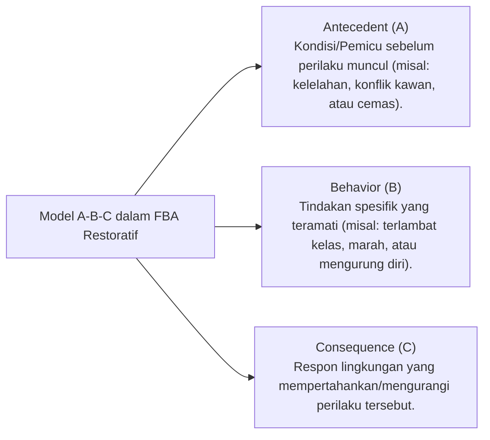

# P5-03-02: Protokol Functional Behavior Assessment (FBA) Restoratif

## Status Dokumen
* **Status**: 🌟 **A+ (Tervalidasi & Siap Diimplementasikan)**
* **Sub-Domain**: `05 Assessment Framework / 03 Assessment Model`
* **Penanggung Jawab Keilmuan**: Dewan Keilmuan TUMBUH (*Pakar Bimbingan Konseling & Pakar Arsitektur PBIS Restoratif*)

---

## 1. Konseptualisasi Functional Behavior Assessment (FBA)

Functional Behavior Assessment (FBA) adalah pendekatan diagnostik ilmiah untuk memahami **fungsi di balik perilaku bermasalah/pelanggaran berulang** santri, memastikan bahwa pembinaan menyelesaikan akar masalah, bukan sekadar menekan gejala luar dengan sanksi.

---

## 2. Empat Fungsi Utama Perilaku Bermasalah Santri

1. **Escape / Avoidance (Penghindaran)**: Perilaku muncul untuk menghindari tugas hafalan rumit atau interaksi emosional yang menekan.
2. **Attention-Seeking (Pencarian Perhatian)**: Perilaku muncul untuk mendapatkan perhatian dari musyrif atau penerimaan teman sebaya.
3. **Access to Tangibles / Privilege**: Perilaku muncul untuk mengakses kepemilikan atau hak istimewa tertentu.
4. **Sensory / Emotional Regulation**: Perilaku muncul sebagai mekanisme pelepasan penat atau kecemasan emosional yang tidak terekspresikan.

---

## 3. SOP Pelaksanaan FBA oleh Tim BK & Musyrif

1. **Wawancara Konseling Empati**: Menanyakan pengalaman emosional santri sebelum dan sesudah kejadian.
2. **Penyusunan Hipotesis Fungsional**: Merumuskan penyebab pemicu utama.
3. **Desain Perilaku Pengganti Positif (*Replacement Behavior Plan*)**: Mengajari santri cara alternatif yang sehat untuk memenuhi kebutuhan emosionalnya tanpa melanggar adab.
