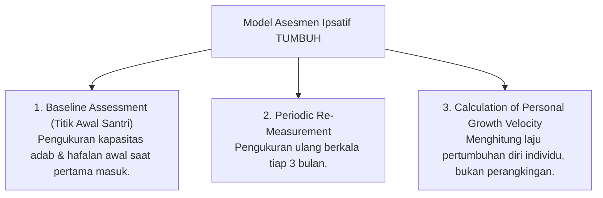

# P5-03-03: Metodologi Asesmen Ipsatif dan Laju Pertumbuhan Diri

## Status Dokumen
* **Status**: 🌟 **A+ (Tervalidasi & Siap Diimplementasikan)**
* **Sub-Domain**: `05 Assessment Framework / 03 Assessment Model`
* **Penanggung Jawab Keilmuan**: Dewan Keilmuan TUMBUH (*Pakar Metodologi Riset & Pakar Psikologi Belajar*)

---

## 1. Konseptualisasi Asesmen Ipsatif (Self-Referenced Evaluation)

Asesmen Ipsatif adalah metodologi evaluasi yang membandingkan pencapaian santri saat ini dengan **baseline performa dirinya sendiri di masa lalu** (*Self-Referenced Growth*), menghapus perangkingan dan perbandingan destruktif antar santri.

---

## 2. Keunggulan Asesmen Ipsatif bagi Motivasi Santri

- **Perlindungan dari Keputusasaan**: Santri yang masuk dengan baseline adab rendah tidak merasa "paling buruk", karena setiap kemajuan sekecil apa pun diakui sebagai prestasi pertumbuhan diri.
- **Pendorong Mujahadah Mandiri**: Menanamkan kesadaran bahwa pesaing sejati santri adalah dirinya sendiri hari kemarin (*Tazkiyatun Nafs*).
