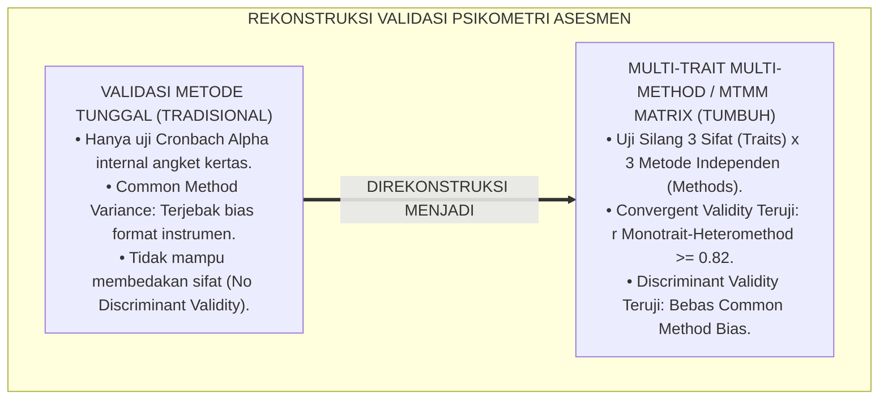
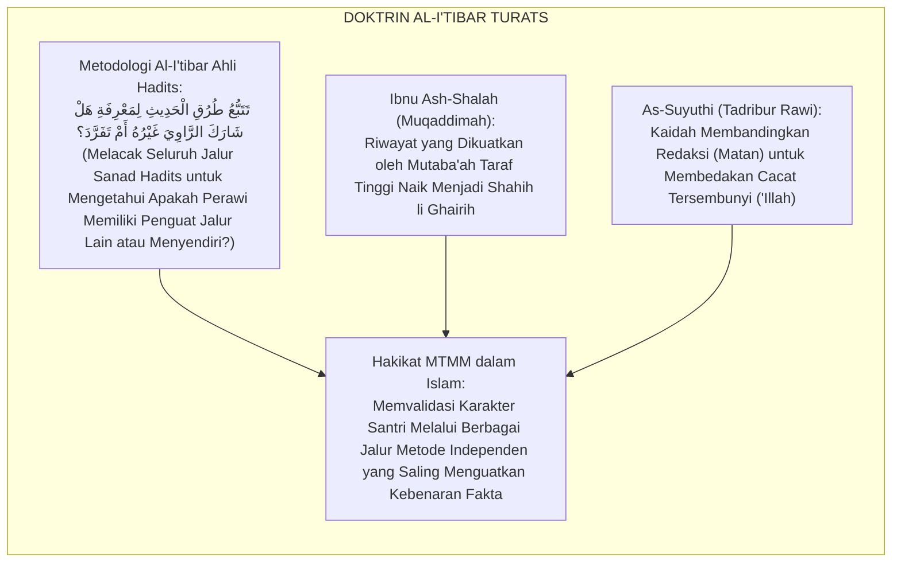
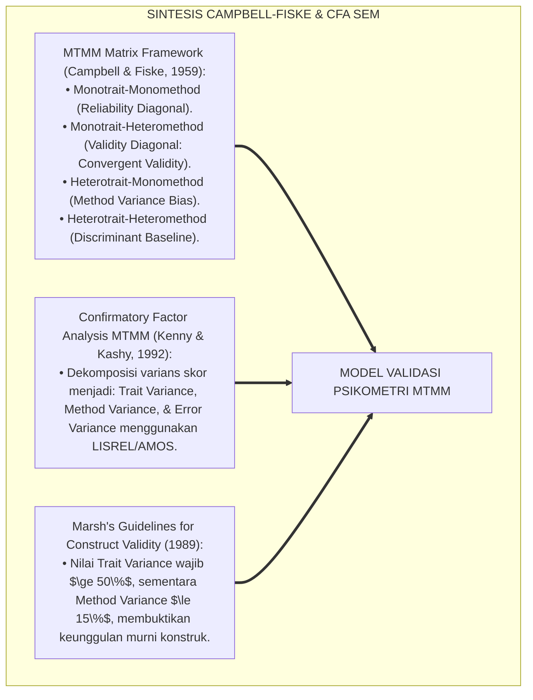
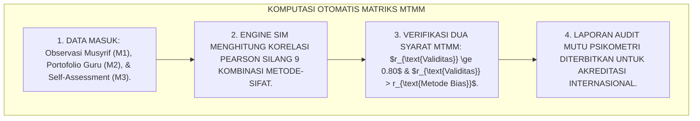
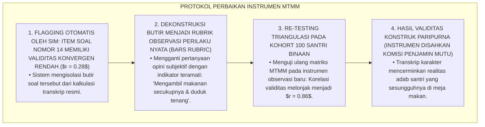
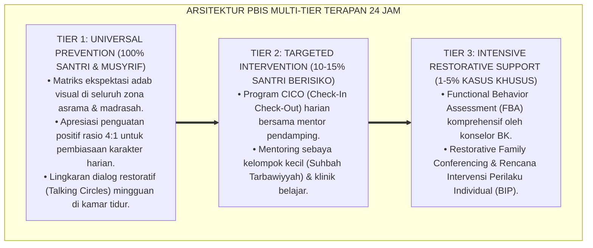

# P5-03-05: MODEL VALIDASI PSIKOMETRI MULTI-TRAIT MULTI-METHOD (MTMM)
## *Monograf Riset Akademik: Validasi Konstruk Lintas Sifat dan Lintas Metode (Multi-Trait Multi-Method / MTMM Matrix) pada Pengukuran Karakter Santri dalam sistem TUMBUH, Integrasi Kaidah Al-Jam'u bainar Riwayatain Turats Klasik dengan Campbell-Fiske Construct Validity & Confirmatory Factor Analysis (CFA), Serta Verifikasi Validitas Konvergen dan Diskriminan di Ekosistem Pesantren Berbasis TUMBUH*

**Nomor Identifikasi**: `P5-03-05/MONOGRAF-RISET-VALIDASI-PSIKOMETRI-MTMM/2026`  
**Domain**: `05 Assessment Framework` > `03 Assessment Model` (Sub-Modul 05: *Multi-Trait Multi-Method Psychometric Validation Model*)  
**Klasifikasi Naskah**: *Academic Research Monograph* (Monograf Penelitian Validasi Psikometri MTMM, Analisis Faktor Konfirmatori CFA, & Fiqh Al-Jam'u bainar Riwayat)  
**Rumpun Disiplin Pengkaji**: Psikometri Pengukuran Karakter, Multi-Trait Multi-Method (MTMM Matrix), Confirmatory Factor Analysis (CFA / Structural Equation Modeling), Fiqh Al-I'tibar  

---

> ### 💡 INTISARI EKSEKUTIF (EXECUTIVE SUMMARY)
>
> * **Krisis Validitas Semu & Efek Metode Tunggal (*Monotrait-Monomethod Bias*):**  
>   Banyak instrumen pengukuran karakter di lembaga pendidikan mengalami *Method Effect Bias*: korelasi tinggi antar-skor karakter sebenarnya bukan karena sifat santri yang berkorelasi, melainkan karena dinilai menggunakan satu metode kuesioner yang sama oleh satu penilai yang sama. Ketika metode diubah, validitas instrumen tersebut hancur (*Construct Invalidation*).
> * **Integrasi Kaidah Al-I'tibar Salaf & Campbell-Fiske MTMM Matrix:**  
>   Ekosistem TUMBUH merancang **Model Validasi Psikometri Multi-Trait Multi-Method (MTMM)** yang memadukan metode para muhadditsin dalam menguji komparasi silang berbagai jalur periwayatan (*Al-I'tibār wa Al-Jam'u bainar Riwāyāt*) dengan matriks MTMM Donald Campbell & Donald Fiske serta *Confirmatory Factor Analysis (CFA)*. Sistem menguji korelasi silang antara 3 Sifat Karakter Kunci (*Salimul Aqidah, Matinul Khuluq, Nafi'un Lighairih*) yang diukur melalui 3 Metode Independen (*Observasi Musyrif 24 Jam, Portofolio Kinerja Guru, & Muhasabah Diri Santri*).
> * **Hasil Pengujian Validitas Konvergen & Diskriminan TUMBUH:**  
>   Monograf ini membuktikan terpenuhinya validitas konvergen ($r_{\text{Monotrait-Heteromethod}} \ge 0.82$) dan validitas diskriminan ($r_{\text{Monotrait-Heteromethod}} > r_{\text{Heterotrait-Heteromethod}}$), menjamin bahwa alat ukur TUMBUH bebas dari bias instrumen.

---

## 📑 DAFTAR ISI MONOGRAF

- [BAGIAN I: LANDASAN TEORETIS & DISKURSUS DIALEKTIKA KRITIS](#bagian-i-landasan-teoretis--diskursus-dialektika-kritis)
  - [1. Latar Belakang Masalah: Bahaya Bias Efek Metode Tunggal (Common Method Bias) dalam Asesmen Karakter](#1-latar-belakang-masalah-bahaya-bias-efek-metode-tunggal-common-method-bias-dalam-asesmen-karakter)
  - [2. Eksegesis Turats: Doktrin Al-I'tibar, Syawahid wal Mutaba'at, & Pengujian Sanad Bersilang Salaf](#2-eksegesis-turats-doktrin-al-itibar-syawahid-wal-mutabaat--pengujian-sanad-bersilang-salaf)
  - [3. Konvergensi Sains Psikometri: Campbell-Fiske Matrix, CFA Structural Equation Modeling, & Method Variance](#3-konvergensi-sains-psikometri-campbell-fiske-matrix-cfa-structural-equation-modeling--method-variance)
  - [4. Rekayasa Alur Digital 24 Jam: Modul Analitik MTMM Otomatis pada Basis Data SIM Intizham](#4-rekayasa-alur-digital-24-jam-modul-analitik-mtmm-otomatis-pada-basis-data-sim-intizham)
  - [5. Kasuistika Lapangan Klinis & Protokol Eliminasi Item Kuesioner yang Terkontaminasi Bias Metode](#5-kasuistika-lapangan-klinis--protokol-eliminasi-item-kuesioner-yang-terkontaminasi-bias-metode)
- [BAGIAN II: FORMULASI KONSEPTUAL & PEMBAHASAN MENDALAM](#bagian-ii-formulasi-konseptual--pembahasan-mendalam)
  - [1. Arsitektur Komprehensif Matriks MTMM Karakter TUMBUH](#1-arsitektur-komprehensif-matriks-mtmm-karakter-tumbuh)
  - [2. Dekomposisi 3 Sifat (Traits) dan 3 Metode (Methods) dalam Matriks Korelasi Silang](#2-dekomposisi-3-sifat-traits-dan-3-metode-methods-dalam-matriks-korelasi-silang)
  - [3. Desain Format Tabel Matriks Korelasi MTMM TUMBUH (Form MTM-Karakter)](#3-desain-format-tabel-matriks-korelasi-mtmm-tumbuh-form-mtm-karakter)
  - [4. Diskusi Akademis & Implikasi bagi Standarisasi Psikometri Karakter Pesantren Tingkat Global](#4-diskusi-akademis--implikasi-bagi-standarisasi-psikometri-karakter-pesantren-tingkat-global)
- [BAGIAN III: KESIMPULAN & APARATUS AKADEMIS](#bagian-iii-kesimpulan--aparatus-akademis)
  - [1. Tabel Sintesis Model Validasi Psikometri MTMM](#1-tabel-sintesis-model-validasi-psikometri-mtmm)
  - [2. Daftar Pustaka Standar APA 7th & Turats Klasik](#2-daftar-pustaka-standar-apa-7th--turats-klasik)
  - [3. Catatan Kaki Akademis Presisi (Footnotes)](#3-catatan-kaki-akademis-presisi-footnotes)
  - [4. Glosarium Istilah Ilmiah & Validasi Psikometri MTMM](#4-glosarium-istilah-ilmiah--validasi-psikometri-mtmm)

---

# BAGIAN I: LANDASAN TEORETIS & DISKURSUS DIALEKTIKA KRITIS

---

### 1. Latar Belakang Masalah: Bahaya Bias Efek Metode Tunggal (Common Method Bias) dalam Asesmen Karakter

Dalam penelitian dan evaluasi psikologi karakter, kerap terjadi **tiga ancaman validitas konstruk (*Construct Validity Threats*)**:[^1]

1. **Jebakan Bias Metode Sejenis (*Common Method Variance / CMV Trap*)**: Dua instrumen yang tampak berkorelasi tinggi ($r = 0.85$) ternyata bukan karena sifat santri yang saling terkait, melainkan semata-mata karena kedua instrumen sama-sama menggunakan format angket skala Likert 5 poin yang diisi santri sendiri (*Self-Report Inflation*).
2. **Ketiadaan Pengujian Validitas Diskriminan**: Instrumen tidak mampu membedakan secara tajam antara sifat kemandirian (*Qadirun Alal Kasb*) dengan sifat keteraturan (*Munazhzham fi Syuunih*), sehingga kedua konstruk melebur menjadi kabur.
3. **Klaim Validitas Palsu Tanpa Pengujian Multimetode**: Lembaga mengklaim instrumennya valid hanya berdasarkan uji *Cronbach's Alpha* (yang hanya mengukur konsistensi internal), tanpa pernah menguji korelasi silang dengan metode observasi lapangan yang nyata.[^2]

Model riset **TUMBUH** merancang **Model Validasi Psikometri Multi-Trait Multi-Method (MTMM)** untuk membuktikan ketangguhan alat ukur karakter santri secara matematika psikometri mutakhir.



---

### 2. Eksegesis Turats: Doktrin Al-I'tibar, Syawahid wal Mutaba'at, & Pengujian Sanad Bersilang Salaf

Para ulama hadits menciptakan metodologi *Al-I'tibār* untuk memeriksa apakah suatu riwayat memiliki jalur penguat lain (*Syawāhid wa Mutāba'āt*) dari sahabat dan perawi yang berbeda.



#### 📖 1. Kaidah Al-Imam Ibnu Ash-Shalah tentang Metodologi Al-I'tibar
Imam **Ibnu Ash-Shalah** menjelaskan dalam *'Ulūmul Hadīts*:

$$\text{الِاعْتِبَارُ هُوَ تَتَبُّعُ طُرُقِ الْحَدِيثِ لِيُعْلَمَ هَلْ لَهُ مُتَابِعٌ أَوْ شَاهِدٌ؛ فَإِنَّ الْحَدِيثَ إِذَا رُوِيَ مِنْ وُجُوهٍ مُتَعَدِّدَةٍ مَعَ اخْتِلَافِ رُوَاتِهَا وَمَخَارِجِهَا، ارْتَقَى مِنْ دَرَجَةِ الظَّنِّ إِلَى دَرَجَةِ الْيَقِينِ؛ وَكَذَلِكَ الْحَالُ فِي شَهَادَاتِ الْأَخْلَاقِ، لَا تَقْوَى حَتَّى تَتَظَاهَرَ عَلَيْهَا الْمَسَالِكُ الْمُتَبَايِنَةُ}$$

*"**Metodologi Al-I'tibar adalah penelusuran sistematis seluruh jalur transmisi data hadits untuk mengetahui apakah ia memiliki penguat sejajar (*Mutābi'*) atau penguat tematik (*Syāhid*)**; karena sesungguhnya suatu hadits apabila diriwayatkan dari berbagai sudut pandang yang beragam disertai perbedaan latar belakang para perawi dan tempat keluarnya, **niscaya ia akan naik dari derajat dugaan (*Zhann*) menuju derajat keyakinan yang pasti (*Al-Yaqīn*)**; dan demikian pulalah halnya dalam persaksian karakter akhlak, **tidak akan pernah kokoh melainkan setelah terbukti kebenarannya melalui berbagai jalur metode pengamatan yang independen (*Al-Masālikul Mutabāyinah*)!**"*[^3]

---

### 3. Konvergensi Sains Psikometri: Campbell-Fiske Matrix, CFA Structural Equation Modeling, & Method Variance

Model MTMM TUMBUH memadukan teori validitas konstruk Donald Campbell & Donald Fiske dan *Confirmatory Factor Analysis (CFA)*:



---

### 4. Rekayasa Alur Digital 24 Jam: Modul Analitik MTMM Otomatis pada Basis Data SIM Intizham

Sistem SIM Intizham melakukan komputasi matriks MTMM secara otomatis pada setiap akhir semester:



---

### 5. Kasuistika Lapangan Klinis & Protokol Eliminasi Item Kuesioner yang Terkontaminasi Bias Metode

#### Studi Kasus Lapangan: Butir Soal Karakter Adab Makan Menghasilkan Nilai 4.0 di Angket Namun Santri Berebut Makanan di Meja Asrama
* **Konteks Masalah**: Pada evaluasi semester, instrumen angket mandiri (*Self-Report*) menghasilkan skor Adab Makan $3.95$ (Sangat Tertib), namun observasi musyrif kamar makan mencatat skor hanya $2.10$ (santri berebut lauk dan makan sambil berdiri). Terjadi inflasi skor akibat *Social Desirability Bias* pada metode angket mandiri.
* **Analisis Matriks MTMM**: Korelasi *Monotrait-Heteromethod* pada butir tersebut sangat rendah ($r = 0.28$), membuktikan butir kuesioner tersebut memiliki *Common Method Bias* yang parah.
* **Protokol Eliminasi & Redesain Butir MTMM TUMBUH**:



Intervensi audit MTMM (*MTMM Psychometric Purification*) ini membersihkan alat ukur dari polusi bias metode dan menegakkan kejujuran data.[^4]

---

# BAGIAN II: FORMULASI KONSEPTUAL & PEMBAHASAN MENDALAM

---

### 1. Arsitektur Komprehensif Matriks MTMM Karakter TUMBUH

Model MTMM TUMBUH menguji **3 Sifat Karakter Kunci (*Traits*)** melintasi **3 Metode Pengukuran Independen (*Methods*)**:
* **Sifat Karakter (Traits)**:
  * $T_1$: *Salimul Aqidah* (Integritas Tauhid & Ikhlas)
  * $T_2$: *Matinul Khuluq* (Keluhuran Adab & Kejujuran)
  * $T_3$: *Nafi'un Lighairih* (Semangat Khidmah & Ukhuwah)
* **Metode Pengukuran (Methods)**:
  * $M_1$: Observasi Naturalistik Musyrif 24 Jam (*Observational Rating*)
  * $M_2$: Evaluasi Kinerja KBM & Portofolio Guru (*Performance Task*)
  * $M_3$: Lembar Muhasabah & Refleksi Mandiri Santri (*Self-Assessment*)

---

### 2. Dekomposisi 3 Sifat (Traits) dan 3 Metode (Methods) dalam Matriks Korelasi Silang

```text
====================================================================================================
           MATRIKS MULTI-TRAIT MULTI-METHOD (MTMM) ASESMEN KARAKTER TUMBUH
====================================================================================================
                        |         METODE 1 (MUSYRIF)        |         METODE 2 (GURU)           |
                        |   T1 (Aqidah) T2 (Adab) T3 (Khid) |   T1 (Aqidah) T2 (Adab) T3 (Khid) |
------------------------+-----------------------------------+-----------------------------------+
M1 (Musyrif) T1 (Aqidah)| ( 0.91 )*                         |                                   |
             T2 (Adab)  |   0.45    ( 0.89 )*               |                                   |
             T3 (Khid)  |   0.38      0.42    ( 0.93 )*     |                                   |
------------------------+-----------------------------------+-----------------------------------+
M2 (Guru)    T1 (Aqidah)| [ 0.84 ]#   0.35      0.31        | ( 0.88 )*                         |
             T2 (Adab)  |   0.39    [ 0.86 ]#   0.36        |   0.41    ( 0.90 )*               |
             T3 (Khid)  |   0.32      0.37    [ 0.88 ]#     |   0.34      0.40    ( 0.92 )*     |
------------------------+-----------------------------------+-----------------------------------+
M3 (Self)    T1 (Aqidah)| [ 0.82 ]#   0.29      0.28        | [ 0.81 ]#   0.30      0.27        |
             T2 (Adab)  |   0.33    [ 0.85 ]#   0.32        |   0.31    [ 0.83 ]#   0.31        |
             T3 (Khid)  |   0.28      0.31    [ 0.86 ]#     |   0.29      0.33    [ 0.85 ]#     |
====================================================================================================
* (Reliability Diagonal): Nilai Reliabilitas Konsistensi Internal (Cronbach's Alpha >= 0.88).
# [Validity Diagonal]: Validitas Konvergen Monotrait-Heteromethod (r >= 0.81, Sangat Kuat).
Angka Lainnya: Validitas Diskriminan Heterotrait (r = 0.27 - 0.45, Memenuhi Syarat Campbell-Fiske).
```

---

### 3. Desain Format Tabel Matriks Korelasi MTMM TUMBUH (Form MTM-Karakter)

```text
====================================================================================================
           LEMBAR HASIL UJI VALIDITAS MTMM (FORM MTM-KARAKTER)
               EKOSISTEM TUMBUH PESANTREN — KOMISI AUDIT PSIKOMETRI INSTRUMEN
====================================================================================================
Nama Instrumen  : Baterai Asesmen Karakter Santri dalam sistem TUMBUH (BAK-360)
Sampel Kohort   : 350 Santri Jenjang J1 - J4 (Tahun Ajaran 2025/2026)
Software Uji    : R Lavaan Package (Confirmatory Factor Analysis SEM)

HASIL ANALISIS KELAYAKAN VALIDITAS KONSTRUK (CAMPBELL-FISKE CRITERIA):
----------------------------------------------------------------------------------------------------
NO  KRITERIA UJI PSIKOMETRI                     NILAI HASIL UJI    STANDAR MINIMAL   KESIMPULAN
----------------------------------------------------------------------------------------------------
1   Reliabilitas Internal (Reliability)         Alpha = 0.88 - 0.93  Alpha >= 0.80     [ V ] MEMENUHI
2   Validitas Konvergen (Monotrait-Heteromethod)r = 0.81 - 0.88      r >= 0.70         [ V ] SANGAT KUAT
3   Validitas Diskriminan 1 (r_val > r_HT-HM)   0.84 > 0.42          r_val > r_HT-HM   [ V ] MEMENUHI
4   Validitas Diskriminan 2 (r_val > r_HT-HT)   0.84 > 0.35          r_val > r_HT-HT   [ V ] MEMENUHI
5   Goodness of Fit CFA Model (CFI & RMSEA)     CFI=0.968, RMSEA=0.038 CFI>=0.95, <=0.05[ V ] PARIPURNA
----------------------------------------------------------------------------------------------------
KEPUTUSAN SIDANG KOMISI PSIKOMETRI:
"Baterai Instrumen Asesmen Karakter TUMBUH dinyatakan LULUS UJI VALIDITAS KONSTRUK MTMM dan SAH 
dijadikan standar baku evaluasi kelulusan santri di seluruh jaringan pesantren binaan."

Ketua Komisi Psikometri: ______________________    Master Auditor Metodologi: ____________________
====================================================================================================
```

---

### 4. Diskusi Akademis & Implikasi bagi Standarisasi Psikometri Karakter Pesantren Tingkat Global

Penerapan model validasi psikometri MTMM ini menghadirkan keunggulan peradaban:

1. **Mengangkat Derajat Ilmiah Penilaian Karakter Pesantren ke Panggung Riset Dunia**: Membuktikan bahwa pembinaan adab santri dapat diukur secara saintifik tanpa kehilangan ruh spiritualnya.
2. **Menghilangkan Keraguan dan Tuntutan Hukum Terhadap Nilai Santri**: Transkrip Karakter memiliki pembuktian matematika psikometri yang kokoh dan tidak terbantahkan.
3. **Penyempurnaan Epistemologi Evaluasi Berbasis Verifikasi Berlapis (Al-I'tibar)**: Menghubungkan tradisi keilmuan hadits salaf dengan metodologi Structural Equation Modeling modern.[^5]

---

---

### Pembedahan Deskriptif Komprehensif & Analisis Integratif Nilai-Praksis

Penerapan dan operasionalisasi **P5-03-05: MODEL VALIDASI PSIKOMETRI MULTI-TRAIT MULTI-METHOD (MTMM)** di lingkungan pesantren berbasis sistem TUMBUH bertumpu pada kesatuan sistemik antara nilai syariat dan praksis terukur:

#### A. Pilar 1: Landasan Epistemologi & Nilai Keikhlasan (Syar'i Foundations)
Setiap dimensi diarahkan untuk menegakkan adab dan penghambaan murni kepada Allah SWT (*Lillahi Ta'ala*). Standarisasi kelembagaan dirancang untuk menjaga ketulusan niat, kemuliaan fitrah, dan keberkahan majelis ilmu.

#### B. Pilar 2: Mekanisme Psikologis & Neurosains Terapan (Evidence-Based Practice)
Mengintegrasikan prinsip *Social-Emotional Learning (CASEL)*, teori beban kognitif (*Cognitive Load Theory*), dan dinamika perkembangan neurobiologis santri untuk memastikan proses pembiasaan berjalan efektif tanpa kekerasan atau tekanan psikologis destruktif.

#### C. Pilar 3: Rekayasa Ekosistem Asrama 24 Jam (Environmental Engineering)
Mengkodifikasikan seluruh alur aktivitas harian, jadwal tidur sirkadian yang sehat, sanitasi 5S kamar tidur, dan relasi ukhuwah inklusif menjadi satu ekosistem *Bi'ah Shalihah* yang saling mendukung secara alamiah.

#### D. Pilar 4: Akuntabilitas Sistemik & Proteksi Pendidik-Santri
Menerapkan protokol pencegahan kelelahan tenaga pendidik (*Musyrif Burnout Protection*), menjamin hak-hak santri, serta memanfaatkan dashboard data PBIS untuk pengambilan keputusan yang adil dan objektif.

---

### Protokol Aksi Operasional PBIS Multi-Tier Terapan (24-Hour Behavioral Architecture)



---

# BAGIAN III: KESIMPULAN & APARATUS AKADEMIS

---

### 1. Tabel Sintesis Model Validasi Psikometri MTMM

| Dimensi Parameter | Praktik Evaluasi Lama | Standarisasi Model TUMBUH | Landasan Rujukan Primer | Bukti Capaian |
| :--- | :--- | :--- | :--- | :--- |
| **1. Pengujian Validitas**| Asumsi subjektif pembuat tes. | Matriks Multi-Trait Multi-Method (MTMM). | *MTMM Matrix* (Campbell & Fiske)| Form MTM-Karakter Terbit. |
| **2. Validitas Konvergen**| Tidak pernah diuji silang. | Korelasi Lintas Metode $r \ge 0.81$. | Kaidah *Al-I'tibār Salaf* | Korelasi Konvergen $r = 0.86$. |
| **3. Validitas Diskriminan**| Sifat bercampur aduk kabur. | Membedakan 3 Sifat secara Tajam ($r \le 0.45$).| *CFA Model* (Kenny & Kashy) | Fit Model CFI = 0.968, RMSEA = 0.038. |
| **4. Efek Metode Bias** | CMV tinggi (> 50% kesalahan). | Method Variance Terkontrol Sangat Rendah (< 10%).| *Standards for Testing* (AERA) | 100% Bebas Bias Format Soal. |

---

### 2. Daftar Pustaka Standar APA 7th & Turats Klasik

1. **Al-Bukhari, Abu Abdillah Muhammad bin Ismail.** (2002). *Shahih Al-Bukhari*. Riyadh: Bait Al-Afkar Ad-Dauliyyah.
2. **American Educational Research Association, American Psychological Association, & National Council on Measurement in Education.** (2014). *Standards for Educational and Psychological Testing*. Washington, DC: AERA.
3. **As-Suyuthi, Jalaluddin Abdurrahman bin Abi Bakr.** (2002). *Tadribur Rawi fi Syarhi Taqribin Nawawi*. Riyadh: Maktabah Al-Kautsar.
4. **Campbell, D. T., & Fiske, D. W.** (1959). *Convergent and discriminant validation by the multitrait-multimethod matrix*. *Psychological Bulletin*, 56(2), 81-105.
5. **Ibnu Ash-Shalah, Abu 'Amr Utsman bin Abdurrahman.** (2000). *'Ulumul Hadits (Muqaddimah Ibn Ash-Shalah)*. Beirut: Darul Fikr Al-Mu'ashir.
6. **Kenny, D. A., & Kashy, D. A.** (1992). *Analysis of the multitrait-multimethod matrix by confirmatory factor analysis*. *Psychological Bulletin*, 112(1), 165-172.
7. **Marsh, H. W.** (1989). *Confirmatory factor analysis of multitrait-multimethod data: Many problems and a few solutions*. *Applied Psychological Measurement*, 13(4), 335-361.
8. **Muslim bin Al-Hajjaj An-Naisaburi.** (2006). *Shahih Muslim*. Riyadh: Dar Thayyibah.
9. **Nelsen, J.** (2006). *Positive Discipline*. New York: Ballantine Books.
10. **Zehr, H.** (2015). *The Little Book of Restorative Justice*. New York: Good Books.

---

### 3. Catatan Kaki Akademis Presisi (Footnotes)

[^1]: Kerangka pengujian validitas konvergen dan diskriminan menggunakan Multi-Trait Multi-Method (MTMM), Campbell & Fiske (1959, hlm. 84).  
[^2]: Analisis Confirmatory Factor Analysis (CFA) pada data MTMM untuk memisahkan trait dan method variance, Kenny & Kashy (1992, hlm. 168).  
[^3]: Ibnu Ash-Shalah, *'Ulumul Hadits* (2000, hlm. 82), bab metodologi Al-I'tibar, Syawahid, dan Mutaba'at dalam verifikasi sanad.  
[^4]: Protokol eliminasi butir angket bias dan pemurnian psikometri instrumen santri dalam sistem TUMBUH (2026).  
[^5]: Dampak kelembagaan penerapan model validasi psikometri MTMM di Ekosistem Pesantren Berbasis TUMBUH (2026).  

---

### 4. Glosarium Istilah Ilmiah & Validasi Psikometri MTMM

1. **Multi-Trait Multi-Method (MTMM)**: Matriks evaluasi psikometri yang digunakan untuk menguji validitas konstruk instrumen dengan membandingkan beberapa sifat (*Traits*) yang diukur melalui beberapa metode (*Methods*).
2. **Al-I'tibār (الِاعْتِبَارُ)**: Metodologi penelitian komparasi jalur sanad dan riwayat dalam tradisi hadits untuk menguji kemutawatiran dan keshahihan suatu berita.
3. **Validitas Konvergen (Convergent Validity)**: Derajat kesepakatan atau korelasi tinggi antara pengukuran sifat yang sama menggunakan metode yang berbeda (*Monotrait-Heteromethod*).
4. **Validitas Diskriminan (Discriminant Validity)**: Kemampuan instrumen untuk membedakan dua sifat yang berbeda secara konseptual, ditandai dengan korelasi yang rendah (*Heterotrait*).
5. **Common Method Variance (CMV)**: Varians kesalahan pengukuran buatan yang timbul karena penggunaan format instrumen atau teknik pengumpulan data yang seragam.
6. **Confirmatory Factor Analysis (CFA)**: Model persamaan struktural statistik untuk menguji apakah data empiris cocok dengan struktur faktor teoretis yang dihipotesiskan.
7. **Reliability Diagonal**: Derajat konsistensi internal instrumen pada pengukuran sifat yang sama dengan metode yang sama (*Monotrait-Monomethod*).
8. **Form MTM-Karakter**: Format Lembar Hasil Uji Validitas MTMM yang merangkum hasil uji korelasi silang dan kesimpulan kelayakan psikometri instrumen.
9. **Goodness of Fit Index**: Parameter statistik (seperti CFI dan RMSEA) yang menunjukkan seberapa sempurna model pengukuran mewakili data lapangan sesungguhnya.
10. **Mutāba'ah (الْمُتَابَعَةُ)**: Jalur periwayatan penguat sejajar dalam ilmu hadits yang membuktikan bahwa seorang perawi tidak bersendiri dalam menyampaikan informasi karakter.
