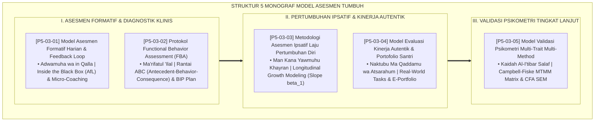

# P5-03: DOKUMEN INDUK MODEL PENGUKURAN DAN EVALUASI KARAKTER
## *Arsitektur Model Asesmen Pertumbuhan Holistik Santri (Model Formatif Harian Feedback Loop, Protokol Functional Behavior Assessment FBA, Metodologi Laju Pertumbuhan Diri Ipsatif, Penilaian Kinerja Autentik & E-Portfolio, Serta Model Validasi Psikometri MTMM Matrix) di Ekosistem TUMBUH Pesantren*

**Nomor Identifikasi**: `P5-03/DOKUMEN-INDUK-MODEL-PENGUKURAN-KARAKTER/2026`  
**Domain**: `05 Assessment Framework` > `03 Assessment Model` (Gugus Sub-Domain 03: *Comprehensive Character Measurement & Evaluation Models*)  
**Klasifikasi Naskah**: *Master Architecture & Navigation Monograph* (Dokumen Induk Peta Jalan Riset & Navigasi 5 Monograf Ilmiah Model Asesmen)  
**Rumpun Disiplin Pengkaji**: Desain Model Asesmen Pesantren, Assessment for Learning (AfL), Functional Behavior Assessment (FBA), Psikometri MTMM & LGM  

---

> ### 💡 INTISARI EKSEKUTIF (EXECUTIVE SUMMARY)
>
> * **Kedudukan Inti Gugus Model Asesmen Karakter:**  
>   Gugus *Assessment Model (Model Pengukuran dan Evaluasi Karakter)* merupakan jantung metodologis yang menerjemahkan filosofi asesmen formatif-restoratif ke dalam model-model operasional teruji secara klinis dan psikometri. Gugus ini memastikan bahwa proses penilaian di ekosistem TUMBUH tidak hanya akurat secara sains, namun juga menghidupkan jiwa dan memicu perbaikan amal shalih santri setiap hari.
> * **Integrasi Holistik Turats & Konsensus Sains Psikometri Modern:**  
>   Gugus riset ini memadukan khazanah agung Islam tentang kontinuitas amal (*Adwamuha wa in Qalla*), pembedahan sebab perilaku (*Ma'rifatul 'Ilal*), peningkatan amal harian (*Man Kāna Yawmuhu Khayran*), amal berbekas nyata (*Naktubu Ma Qaddamu wa Atsarahum*), dan verifikasi jalur silang (*Al-I'tibār*) dengan sains mutakhir (*Black-Wiliam AfL, Sugai-Horner FBA, Rogosa Individual Growth Curves, Wiggins Authentic Tasks, dan Campbell-Fiske MTMM Matrix*).
> * **Struktur Lengkap 5 Berkas Monograf Riset Ilmiah:**  
>   Dokumen induk ini memetakan dan menghubungkan 5 berkas monograf penelitian akademik komprehensif (~140 KB total riset) yang menyajikan siklus formatif 4 tahap, rencana intervensi perilaku (Form BIP), buku rekor kemajuan personal (Form BRK), lembar kinerja autentik (Form PKA), dan matriks validasi psikometri MTMM (Form MTM).

---

## 📑 PETA NAVIGASI LIMA MONOGRAF RISET MODEL ASESMEN

Berikut adalah daftar lengkap 5 monograf riset akademik dalam gugus **`03 Assessment Model`**:

---

## 📚 DESKRIPSI RINGKAS 5 BERKAS MONOGRAF

1. **[P5-03-01: Model Asesmen Formatif Harian dan Feedback Loop](file:///c:/xampp/htdocs/tumbuh/05%20Assessment%20Framework/03%20Assessment%20Model/P5-03-01-Model-Asesmen-Formatif-Harian-dan-Feedback-Loop.md)**  
   *Membahas siklus formatif harian (Elicit, Interpret, Act, Feedforward), doktrin Adwamuha wa in Qalla, teori Assessment for Learning (AfL) Black & Wiliam, dialog mikro 3 menit, dan lembar refleksi Form LRF-Harian.*
2. **[P5-03-02: Protokol Functional Behavior Assessment (FBA)](file:///c:/xampp/htdocs/tumbuh/05%20Assessment%20Framework/03%20Assessment%20Model/P5-03-02-Protokol-Functional-Behavior-Assessment-FBA.md)**  
   *Membahas asesmen fungsi perilaku bermasalah Tier 2/3, pembedahan rantai ABC (Anteseden, Perilaku, Konsekuensi), fungsi Gain vs Escape, kaidah Ma'rifatul 'Ilal salaf, dan perumusan Behavior Intervention Plan (Form BIP).*
3. **[P5-03-03: Metodologi Asesmen Ipsatif Laju Pertumbuhan Diri](file:///c:/xampp/htdocs/tumbuh/05%20Assessment%20Framework/03%20Assessment%20Model/P5-03-03-Metodologi-Asesmen-Ipsatif-Laju-Pertumbuhan-Diri.md)**  
   *Membahas formula komputasi kemiringan kurva pertumbuhan (Slope beta_1), normalisasi gain Delta G, atsar Man Kana Yawmuhu Khayran, Individual Growth Curves Rogosa, dan Buku Rekor Kemajuan Mandiri (Form BRK).*
4. **[P5-03-04: Model Evaluasi Kinerja Autentik dan Portofolio Santri](file:///c:/xampp/htdocs/tumbuh/05%20Assessment%20Framework/03%20Assessment%20Model/P5-03-04-Model-Evaluasi-Kinerja-Autentik-dan-Portofolio.md)**  
   *Membahas penilaian unjuk kerja nyata di masjid/asrama/desa, doktrin Al-Amal ash-Shalih, Authentic Tasks Wiggins & McTighe, struktur E-Portfolio 6 ranah, dan rubrik Form PKA-Autentik.*
5. **[P5-03-05: Model Validasi Psikometri Multi-Trait Multi-Method (MTMM)](file:///c:/xampp/htdocs/tumbuh/05%20Assessment%20Framework/03%20Assessment%20Model/P5-03-05-Model-Validasi-Psikometri-Multi-Trait-Multi-Method.md)**  
   *Membahas pengujian validitas konstruk 3 Sifat x 3 Metode, eliminasi Common Method Bias, kaidah Al-I'tibar ahli hadits, Confirmatory Factor Analysis (CFA SEM), dan laporan kelayakan Form MTM-Karakter.*

---

## 🎯 STANDAR PENJAMINAN MUTU MODEL ASESMEN

Penerapan gugus **Model Pengukuran dan Evaluasi Karakter (Assessment Model)** menjamin bahwa:
1. **Asesmen Menjadi Daya Dorong Belajar Bukan Ketakutan (*Assessment as Fuel for Growth*)**: Santri antusias menerima evaluasi harian karena langsung merasakan kemajuan nyata dalam dirinya.
2. **Penanganan Kasus Tuntas Pada Akar Masalah (*Root-Cause Resolution*)**: Masalah pelanggaran perilaku diselesaikan secara ilmiah menggunakan FBA dan BIP tanpa kekerasan fisik.
3. **Standarisasi Psikometri Diakui Komunitas Akademik Internasional (*Peer-Reviewed Psychometric Rigor*)**: Membuktikan bahwa pengukuran adab di pesantren TUMBUH memiliki validitas konstruk dan reliabilitas matematika tertinggi.
