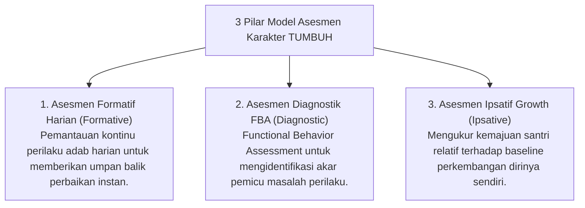

# P5-03: Model Asesmen Formatif, Diagnostik FBA, dan Ipsatif Growth

## Status Dokumen
* **Status**: 🌟 **A+ (Tervalidasi & Siap Diimplementasikan)**
* **Sub-Domain**: `05 Assessment Framework / 03 Assessment Model`
* **Penanggung Jawab Keilmuan**: Dewan Keilmuan TUMBUH (*Pakar Bimbingan Konseling & Pakar Arsitektur PBIS Restoratif*)

---

## 1. Tiga Pilar Model Asesmen TUMBUH

---

## 2. Rincian Penjelasan Model Asesmen

### A. Asesmen Formatif Harian
- **Tujuan**: Memberikan masukan berkelanjutan (*Formative Feedback Loop*) agar santri menyadari area pertumbuhan adabnya.
- **Implementasi**: Pencatatan apresiasi kualitatif PBIS (*Magic Ratio 4:1*) dalam logbook digital musyrif.

### B. Asesmen Diagnostik FBA (Functional Behavior Assessment)
- **Tujuan**: Mengurai fungsi di balik pelanggaran perilaku berulang (misal: mencari perhatian, menghindari tugas, atau reaksi kecemasan).
- **Format FBA**:
  1. **Antecedent (A)**: Kejadian pemicu sebelum perilaku muncul.
  2. **Behavior (B)**: Bentuk spesifik perilaku yang teramati.
  3. **Consequence (C)**: Dampak yang mempertahankan perilaku tersebut.

### C. Asesmen Ipsatif (Self-Referenced Growth)
- **Tujuan**: Menghilangkan persaingan negatif antar santri dengan memfokuskan penilaian pada **Laju Pertumbuhan Diri (*Personal Growth Velocity*)**.
- **Indikator**: Perbandingan skor adab santri bulan ini dibanding skor dirinya pada 3 bulan sebelumnya.
