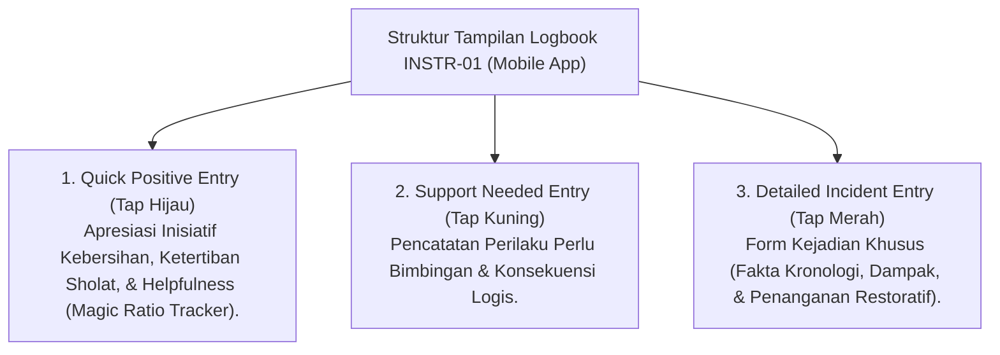

# P5-04-01: Instrumen Logbook Digital PBIS Musyrif (INSTR-01)

## Status Dokumen
* **Status**: 🌟 **A+ (Tervalidasi & Siap Diimplementasikan)**
* **Sub-Domain**: `05 Assessment Framework / 04 Assessment Instruments`
* **Penanggung Jawab Keilmuan**: Dewan Keilmuan TUMBUH (*Pakar Arsitektur Digital Pesantren & Pakar Arsitektur PBIS Restoratif*)

---

## 1. Spesifikasi Teknis & Antarmuka Logbook INSTR-01

Instrumen INSTR-01 dirancang untuk aplikasi mobile Musyrif asrama dengan fitur pencatatan cepat (*Quick-Tap Behavior Entry*) yang menjamin kemudahan penggunaan di lapangan.

---

## 2. Parameter Data Poin INSTR-01

- **Identitas Santri & Kamar**: Terhubung otomatis dengan sistem database relasional santri.
- **Waktu & Kategori Activity**: Terpilih otomatis berdasarkan jadwal harian (Subuh, Halaqah, Kamar, Malam).
- **Catatan Narasi Faktual**: Kolom teks terbatas (maks. 200 karakter) untuk mendeskripsikan tindakan spesifik yang teramati.
