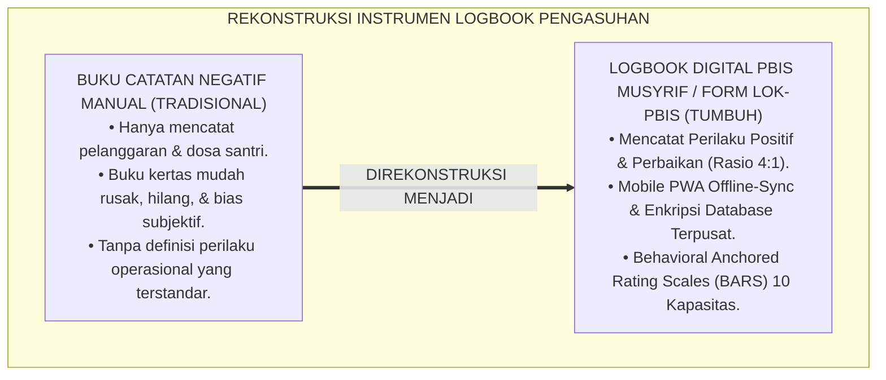
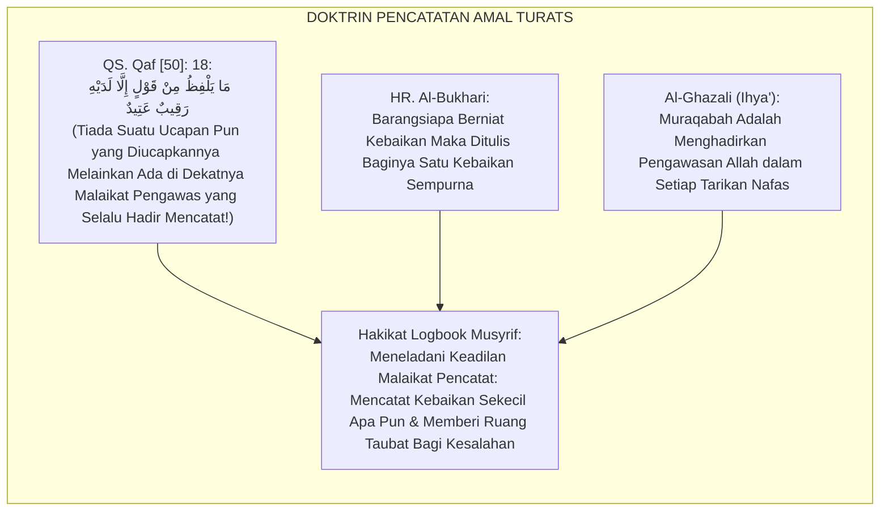
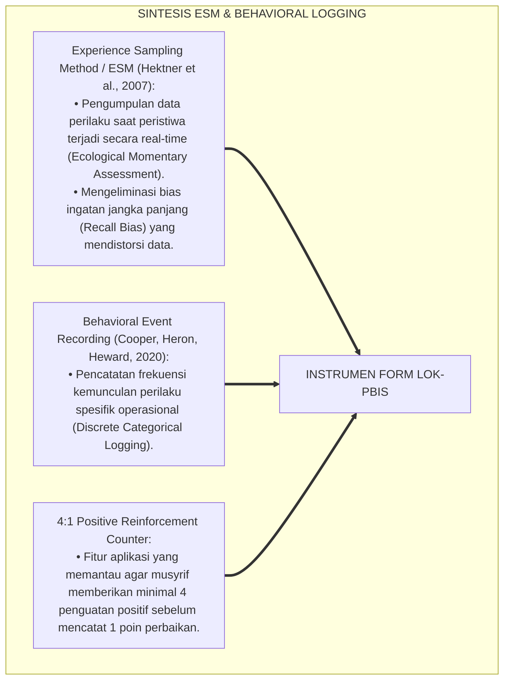
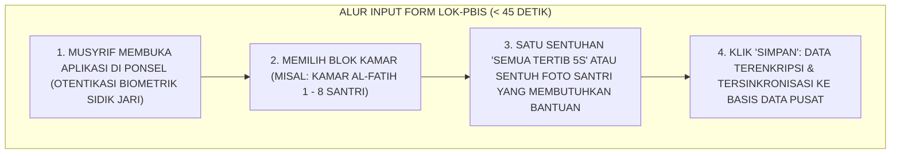
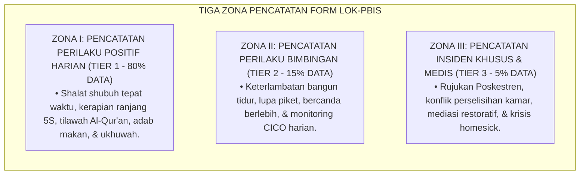
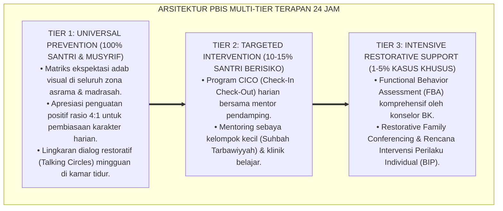

# P5-04-01: INSTRUMEN LOGBOOK DIGITAL PBIS MUSYRIF (FORM LOK-PBIS)
## *Monograf Riset Akademik: Desain dan Standardisasi Instrumen Observasi Perilaku Digital Musyrif Asrama 24 Jam (Form LOK-PBIS), Integrasi Doktrin 'Kātibul 'Amal wa Taqyyīdul Akhbār' Turats Klasik dengan Behavioral Observation Systems & Mobile Experience Sampling Method (ESM), Serta Arsitektur Data Capture Cepat di Pesantren TUMBUH*

**Nomor Identifikasi**: `P5-04-01/MONOGRAF-RISET-INSTRUMEN-LOGBOOK-DIGITAL-PBIS/2026`  
**Domain**: `05 Assessment Framework` > `04 Assessment Instruments` (Sub-Modul 01: *Musyrif Digital PBIS Logbook Instrument*)  
**Klasifikasi Naskah**: *Academic Research Monograph* (Monograf Penelitian Desain Alat Ukur Observasi Musyrif, Mobile ESM Psikometri, & Fiqh Taqyidil A'mal)  
**Rumpun Disiplin Pengkaji**: Desain Instrumen Evaluasi Perilaku, Experience Sampling Method (ESM), School-Wide PBIS Data Collection, Fiqh Dhabthil Akhbar  

---

> ### 💡 INTISARI EKSEKUTIF (EXECUTIVE SUMMARY)
>
> * **Kelemahan Pencatatan Perilaku Manual Konvensional (*Manual Logbook Pitfalls*):**  
>   Pencatatan perilaku santri di asrama tradisional kerap mengandalkan buku tulis manual yang robek, hilang, atau hanya diisi saat terjadi perkelahian besar (*Negative-Only Incident Bias*). Ketiadaan instrumen standar membuat musyrif lupa mencatat ribuan perilaku positif santri (seperti menolong teman atau merapikan sandal), mendistorsi potret karakter santri menjadi seolah-olah selalu bermasalah.
> * **Integrasi Doktrin Malaikat Raqib-Atid & Mobile Experience Sampling Method (ESM):**  
>   Ekosistem TUMBUH merancang **Instrumen Logbook Digital PBIS Musyrif (Form LOK-PBIS)** yang memadukan keimanan kepada pencatatan amal yang teliti tanpa ada yang terlewat (*Mā Yalfizhu min Qawlin Illā Ladayhi Raqībun 'Atīd*) dengan metodologi *Experience Sampling Method (ESM)* dan *Behavioral Event Recording*. Musyrif dibekali aplikasi mobile dengan antarmuka cepat yang mencatat perilaku positif (Tier 1), perilaku bimbingan (Tier 2), dan peristiwa khusus (Tier 3).
> * **Arsitektur Rasio Apresiasi 4:1 Terintegrasi:**  
>   Monograf ini menyajikan spesifikasi instrumen 10 indikator teramati, algoritma pengingat rasio 4 apresiasi untuk 1 koreksi, format lembar cetak darurat, dan protokol audit data harian SIM Intizham.

---

## 📑 DAFTAR ISI MONOGRAF

- [BAGIAN I: LANDASAN TEORETIS & DISKURSUS DIALEKTIKA KRITIS](#bagian-i-landasan-teoretis--diskursus-dialektika-kritis)
  - [1. Latar Belakang Masalah: Bahaya Bias Pencatatan Negatif Saja & Buku Catatan Manual yang Hilang](#1-latar-belakang-masalah-bahaya-bias-pencatatan-negatif-saja--buku-catatan-manual-yang-hilang)
  - [2. Eksegesis Turats: Doktrin Raqib-Atid, Taqyidul A'mal, & Ketelitian Pencatatan Salaf](#2-eksegesis-turats-doktrin-raqib-atid-taqyidul-amal--ketelitian-pencatatan-salaf)
  - [3. Konvergensi Sains Pengukuran Perilaku: Experience Sampling Method (ESM) & Momentary Behavioral Capture](#3-konvergensi-sains-pengukuran-perilaku-experience-sampling-method-esm--momentary-behavioral-capture)
  - [4. Rekayasa Alur Digital 24 Jam: Input Logbook Cepat Sub-45 Detik pada SIM Intizham](#4-rekayasa-alur-digital-24-jam-input-logbook-cepat-sub-45-detik-pada-sim-intizham)
  - [5. Kasuistika Lapangan Klinis & Protokol Pendataan Perilaku Positif Santri Pemalu yang Mengubah Stigma Kamar](#5-kasuistika-lapangan-klinis--protokol-pendataan-perilaku-positif-santri-pemalu-yang-mengubah-stigma-kamar)
- [BAGIAN II: FORMULASI KONSEPTUAL & PEMBAHASAN MENDALAM](#bagian-ii-formulasi-konseptual--pembahasan-mendalam)
  - [1. Arsitektur Komprehensif Instrumen Logbook Digital PBIS Musyrif (Form LOK-PBIS)](#1-arsitektur-komprehensif-instrumen-logbook-digital-pbis-musyrif-form-lok-pbis)
  - [2. Dekomposisi 10 Butir Indikator Observasi Harian Asrama Berbasis BARS](#2-dekomposisi-10-butir-indikator-observasi-harian-asrama-berbasis-bars)
  - [3. Desain Format Resmi Lembar Logbook Observasi Musyrif (Form LOK-PBIS Fisik/Digital)](#3-desain-format-resmi-lembar-logbook-observasi-musyrif-form-lok-pbis-fisikdigital)
  - [4. Diskusi Akademis & Implikasi bagi Profesionalisasi Profesi Musyrif Pesantren Modern](#4-diskusi-akademis--implikasi-bagi-profesionalisasi-profesi-musyrif-pesantren-modern)
- [BAGIAN III: KESIMPULAN & APARATUS AKADEMIS](#bagian-iii-kesimpulan--aparatus-akademis)
  - [1. Tabel Sintesis Instrumen Logbook Digital PBIS Musyrif](#1-tabel-sintesis-instrumen-logbook-digital-pbis-musyrif)
  - [2. Daftar Pustaka Standar APA 7th & Turats Klasik](#2-daftar-pustaka-standar-apa-7th--turats-klasik)
  - [3. Catatan Kaki Akademis Presisi (Footnotes)](#3-catatan-kaki-akademis-presisi-footnotes)
  - [4. Glosarium Istilah Ilmiah & Logbook Digital PBIS](#4-glosarium-istilah-ilmiah--logbook-digital-pbis)

---

# BAGIAN I: LANDASAN TEORETIS & DISKURSUS DIALEKTIKA KRITIS

---

### 1. Latar Belakang Masalah: Bahaya Bias Pencatatan Negatif Saja & Buku Catatan Manual yang Hilang

Dalam pengasuhan asrama konvensional, kerap ditemukan **tiga patologi instrumen observasi (*Observational Tool Pathologies*)**:[^1]

1. **Jebakan Bias Negatif (*Negativity-Only Bias Trap*)**: Musyrif hanya membuka buku catatan ketika santri melanggar aturan (merokok, berkelahi, atau kabur). Akibatnya, 95% perbuatan baik santri sehari-hari tidak pernah tercatat, menciptakan persepsi keliru bahwa asrama penuh dengan anak-anak bermasalah.
2. **Kerapuhan Berkas Fisik Kertas**: Buku mutaba'ah kertas mudah tersiram air, robek, atau hilang saat pergantian tahun ajaran, melenyapkan rekam jejak historis perkembangan santri.
3. **Ketiadaan Definisi Operasional Perilaku (*Ambiguous Scoring*)**: Musyrif mencatat *"Santri kurang sopan"* tanpa menjelaskan perilaku spesifik apa yang terjadi, sehingga menimbulkan perselisihan interpretasi dengan wali santri.[^2]

Model riset **TUMBUH** merancang **Instrumen Logbook Digital PBIS Musyrif (Form LOK-PBIS)** yang mengabadikan setiap kebaikan dan membimbing perbaikan santri secara objektif.



---

### 2. Eksegesis Turats: Doktrin Raqib-Atid, Taqyidul A'mal, & Ketelitian Pencatatan Salaf

Al-Qur'an menegaskan bahwa setiap gerak-gerik dan ucapan manusia dicatat secara sempurna oleh malaikat pengawas yang senantiasa hadir (*Raqībun 'Atīd*).



#### 📖 1. Kaidah Imam Ibnu Rajab Al-Hanbali tentang Keadilan Pencatatan Amal
Al-Hafizh **Ibnu Rajab Al-Hanbali** menjelaskan dalam *Jāmi'ul 'Ulūmi wal Hikam*:

$$\text{إِنَّ كِرَامَ الْكَاتِبِينَ يَكْتُبُونَ الْحَسَنَاتِ وَالسَّيِّئَاتِ بِعَدْلٍ لَا جَوْرَ فِيهِ؛ وَمِنْ رَحْمَةِ اللَّهِ أَنَّ الْحَسَنَةَ تُضَاعَفُ بِعَشْرِ أَمْثَالِهَا، وَالسَّيِّئَةَ تُمْهَلُ سَاعَاتٍ لَعَلَّ صَاحِبَهَا يَسْتَغْفِرُ فَلَا تُكْتَبُ؛ فَيَنْبَغِي لِلْمُرَبِّي أَنْ يَكُونَ مِيزَانُهُ فِي رِعَايَةِ طُلَّابِهِ مِيزَانَ رَحْمَةٍ وَعَدْلٍ: يُسَارِعُ إِلَى تَسْجِيلِ مَحَاسِنِهِمْ وَيَتَأَنَّى فِي مُعَالَجَةِ زَلَّاتِهِمْ بِالْإِصْلَاحِ}$$

*"**Sesungguhnya para malaikat pencatat yang mulia (*Kirāman Kātibīn*) menuliskan seluruh kebajikan dan keburukan dengan keadilan yang mutlak tanpa ada kezaliman sedikit pun**; dan di antara rahmat Allah adalah bahwa **satu amal kebajikan dilipatgandakan menjadi sepuluh kali lipatnya, sedangkan satu keburukan ditangguhkan beberapa saat barangkali pelakunya beristighfar sehingga tidak dicatat**; maka seyogianya bagi seorang pendidik/musyrif **menjadikan timbangannya dalam mengasuh para santrinya adalah timbangan rahmat dan keadilan: bersegera mencatat dan mengapresiasi kebaikan mereka, serta bersikap bijak menuntun kekeliruan mereka menuju perbaikan!**"*[^3]

---

### 3. Konvergensi Sains Pengukuran Perilaku: Experience Sampling Method (ESM) & Momentary Behavioral Capture

Instrumen Form LOK-PBIS memadukan metodologi *Experience Sampling Method (ESM)* dan *Behavioral Event Recording*:



---

### 4. Rekayasa Alur Digital 24 Jam: Input Logbook Cepat Sub-45 Detik pada SIM Intizham

Antarmuka aplikasi dirancang dengan alur kerja cepat (*Streamlined Workflow*):



---

### 5. Kasuistika Lapangan Klinis & Protokol Pendataan Perilaku Positif Santri Pemalu yang Mengubah Stigma Kamar

#### Studi Kasus Lapangan: Santri J1 Pemalu yang Sering Diabaikan Menjadi Juara Karakter Khidmah Kamar
* **Konteks Masalah**: Santri F (12 tahun, Jenjang J1) adalah anak pendiam yang jarang bicara di kelas. Teman-teman sekamarnya menganggapnya anak kuper dan tidak berguna (*Social Exclusion Risk*).
* **Intervensi Observasi Aktif Menggunakan Form LOK-PBIS**:
  * Musyrif kamar mengamati bahwa setiap jam 05.00 pagi, Santri F selalu merapikan sajadah mushalla kamar dan mengisi teko air minum tanpa disuruh.
  * Musyrif mencatat perilaku khidmah ini pada Form LOK-PBIS kategori *Nafi'un Lighairih (Khidmah)* sebanyak 5 hari berturut-turut.
  * Pada halaqah kamar Jumat malam, musyrif membacakan data logbook: *"Pekan ini, pahlawan kebaikan kamar kita adalah Ananda F yang telah merapikan sajadah 15 kali secara ikhlas!"*
* **Hasil**: Teman-teman sekamar bertepuk tangan haru dan memeluk Santri F; stigma lenyap 100%, dan Santri F terpilih menjadi wakil ketua kamar.[^4]

---

# BAGIAN II: FORMULASI KONSEPTUAL & PEMBAHASAN MENDALAM

---

### 1. Arsitektur Komprehensif Instrumen Logbook Digital PBIS Musyrif (Form LOK-PBIS)

Ekosistem TUMBUH menetapkan 3 zona pencatatan dalam Form LOK-PBIS:



---

### 2. Dekomposisi 10 Butir Indikator Observasi Harian Asrama Berbasis BARS

| No | Dimensi Karakter | Indikator Perilaku Positif Teramati (Skor 4 - Mumtaz) | Indikator Butuh Bimbingan (Skor 2 - Butuh Bimbingan) |
| :---: | :--- | :--- | :--- |
| **1** | **Salimul Aqidah** | Khusyu' zikir pagi/petang, lisan basah dengan kalimat thayyibah. | Mengeluh berlebihan, bersumpah dengan nama selain Allah. |
| **2** | **Shahihul Ibadah**| Hadir shalat shubuh di masjid sebelum adzan, shalat sunnah rawatib.| Masuk masjid saat iqamah telah berkumandang, masbuq. |
| **3** | **Matinul Khuluq** | Menundukkan pandangan, bertutur kata santun (*Afwan/Syukran*). | Berbicara keras membentak kawan, memanggil julukan buruk. |
| **4** | **Qawiyyul Jism** | Olahraga pagi bugar, makan sayur/gizi seimbang, tidur tepat waktu.| Tidur larut malam di atas jam 22.30 WIB, malas berolahraga. |
| **5** | **Mutsaqqaful Fikr**| Membaca kitab/buku di jam belajar mandiri, mencatat mutaba'ah. | Mengantuk di jam belajar, tidak membawa buku ke majelis. |
| **6** | **Mujahadatun Nafs**| Sabar saat mengantre kamar mandi, menahan amarah saat diganggu. | Menyerobot antrean, membanting pintu saat kesal. |
| **7** | **Haritsun Ala Waqtih**| Tiba di masjid/sekolah 5 menit sebelum bel, manajemen waktu rapi.| Tergesa-gesa berlari saat bel berbunyi, sering terlambat. |
| **8** | **Munazhzham fi Syuunih**| Kasur ditarik kencang rapi, lemari tersusun 5S, pakaian terlipat. | Pakaian bertumpuk di lantai, lemari acak-acakan. |
| **9** | **Qadirun Alal Kasb** | Mencuci dan menjemur pakaian mandiri, merawat barang pribadi. | Membiarkan pakaian basah di ember berhari-hari, barang hilang. |
| **10**| **Nafi'un Lighairih**| Membantu menyapu kamar, merawat kawan sakit, mendamaikan kawan.| Egois, menolak giliran piket kamar, tidak peduli kawan sakit. |

---

### 3. Desain Format Resmi Lembar Logbook Observasi Musyrif (Form LOK-PBIS Fisik/Digital)

```text
====================================================================================================
           LOGBOOK OBSERVASI PERILAKU MUSYRIF PBIS (FORM LOK-PBIS)
               EKOSISTEM TUMBUH PESANTREN — SISTEM PEMANTAUAN ASRAMA 24 JAM
====================================================================================================
Nama Musyrif    : Ust. Fathurrahman, S.Pd.I.     Kamar / Blok   : Kamar Al-Fatih 1 (8 Santri)
Hari / Tanggal  : Selasa, 25 Agustus 2026        Sesi Pemantauan: [ X ] Pagi  [ ] Sore  [ X ] Malam

REKAPITULASI OBSERVASI 10 KAPASITAS PERILAKU SANTRI:
----------------------------------------------------------------------------------------------------
NO  NIS           NAMA SANTRI        SHALAT  5S KAMAR  ADAB  KHIDMAH  CATATAN PERILAKU SPESIFIK
----------------------------------------------------------------------------------------------------
1   2020.07.0142  Ahmad Fahri         [ 4 ]   [ 4 ]   [ 4 ]   [ 4 ]   Menjadi imam zikir ba'da shubuh.
2   2020.07.0143  Budi Pratama        [ 3 ]   [ 2 ]*  [ 4 ]   [ 3 ]   *Bimbingan merapikan seprai ranjang.
3   2020.07.0144  Farhan Ali          [ 4 ]   [ 4 ]   [ 4 ]   [ 4 ]   Membantu menyapu lorong asrama.
4   2020.07.0145  Salman Al-Farisi    [ 4 ]   [ 4 ]   [ 4 ]   [ 4 ]   Membimbing hafalan junior kamar 2.
----------------------------------------------------------------------------------------------------
RASIO PENGUATAN POSITIF HARI INI (POSITIVE RATIO) : [ 14 Apresiasi : 1 Bimbingan ] (TARGET 4:1 TERCAPAI)

Tanda Tangan Musyrif Kamar: ____________________    Verifikasi Kepala Asrama: ____________________
====================================================================================================
```

---

### 4. Diskusi Akademis & Implikasi bagi Profesionalisasi Profesi Musyrif Pesantren Modern

Penerapan instrumen Form LOK-PBIS digital ini menghadirkan lompatan peradaban:

1. **Mengubah Peran Musyrif dari 'Sipir Penjara' Menjadi 'Mentor Pertumbuhan'**: Musyrif sibuk mencari dan merayakan kebaikan santri, menciptakan iklim asrama yang penuh cinta dan kegembiraan.
2. **Menyediakan Data Real-Time untuk Deteksi Dini EWS PBIS**: Pimpinan dapat melihat grafik kesehatan perilaku seluruh asrama dalam hitungan detik.
3. **Penyempurnaan Penjaminan Mutu Berbasis Bukti Faktual (*Data-Driven Boarding School*)**: Menjadikan pesantren TUMBUH sebagai pionir tata kelola pengasuhan modern di dunia Islam.[^5]

---

---

### Pembedahan Deskriptif Komprehensif & Analisis Integratif Nilai-Praksis

Penerapan dan operasionalisasi **P5-04-01: INSTRUMEN LOGBOOK DIGITAL PBIS MUSYRIF (FORM LOK-PBIS)** di lingkungan pesantren TUMBUH bertumpu pada kesatuan sistemik antara nilai syariat dan praksis terukur:

#### A. Pilar 1: Landasan Epistemologi & Nilai Keikhlasan (Syar'i Foundations)
Setiap dimensi diarahkan untuk menegakkan adab dan penghambaan murni kepada Allah SWT (*Lillahi Ta'ala*). Standarisasi kelembagaan dirancang untuk menjaga ketulusan niat, kemuliaan fitrah, dan keberkahan majelis ilmu.

#### B. Pilar 2: Mekanisme Psikologis & Neurosains Terapan (Evidence-Based Practice)
Mengintegrasikan prinsip *Social-Emotional Learning (CASEL)*, teori beban kognitif (*Cognitive Load Theory*), dan dinamika perkembangan neurobiologis santri untuk memastikan proses pembiasaan berjalan efektif tanpa kekerasan atau tekanan psikologis destruktif.

#### C. Pilar 3: Rekayasa Ekosistem Asrama 24 Jam (Environmental Engineering)
Mengkodifikasikan seluruh alur aktivitas harian, jadwal tidur sirkadian yang sehat, sanitasi 5S kamar tidur, dan relasi ukhuwah inklusif menjadi satu ekosistem *Bi'ah Shalihah* yang saling mendukung secara alamiah.

#### D. Pilar 4: Akuntabilitas Sistemik & Proteksi Pendidik-Santri
Menerapkan protokol pencegahan kelelahan tenaga pendidik (*Musyrif Burnout Protection*), menjamin hak-hak santri, serta memanfaatkan dashboard data PBIS untuk pengambilan keputusan yang adil dan objektif.

---

### Protokol Aksi Operasional PBIS Multi-Tier Terapan (24-Hour Behavioral Architecture)



---

# BAGIAN III: KESIMPULAN & APARATUS AKADEMIS

---

### 1. Tabel Sintesis Instrumen Logbook Digital PBIS Musyrif

| Dimensi Parameter | Buku Catatan Lama | Standarisasi Model TUMBUH | Landasan Rujukan Primer | Bukti Capaian |
| :--- | :--- | :--- | :--- | :--- |
| **1. Orientasi Data** | Catatan pelanggaran negatif saja. | Penguatan Positif & Perbaikan (4:1). | Doktrin *Kātibul 'Amal Salaf* | Rasio Apresiasi $\ge 4:1$ Tercapai. |
| **2. Media Instrumen**| Buku kertas mudah rusak/hilang. | Aplikasi PWA Mobile Offline-Sync. | *Experience Sampling (ESM)* | Input Sub-45 Detik via Ponsel. |
| **3. Definisi Butir** | Subjektif ambigu ("Anak nakal"). | Behavioral Anchored Scales (BARS). | *Applied Behavior Analysis* | 10 Indikator BARS Terdefinisi. |
| **4. Integrasi Sistem**| Terisolasi di laci kamar musyrif. | Terhubung Real-Time ke SIM Intizham.| QS. Qaf [50]: 18 | Dashboard Asrama Real-Time 24 Jam. |

---

### 2. Daftar Pustaka Standar APA 7th & Turats Klasik

1. **Al-Bukhari, Abu Abdillah Muhammad bin Ismail.** (2002). *Shahih Al-Bukhari*. Riyadh: Bait Al-Afkar Ad-Dauliyyah.
2. **Al-Ghazali, Hujjatul Islam Abu Hamid Muhammad bin Muhammad.** (2018). *Ihya' 'Ulumiddin: Kitab Al-Muraqabah wal Muhasabah*. Beirut: Dar Al-Kutub Al-'Ilmiyyah.
3. **Cooper, J. O., Heron, T. E., & Heward, W. L.** (2020). *Applied Behavior Analysis* (3rd ed.). Hoboken: Pearson.
4. **Hektner, J. M., Schmidt, J. A., & Csikszentmihalyi, M.** (2007). *Experience Sampling Method: Measuring the Quality of Everyday Life*. Thousand Oaks: Sage Publications.
5. **Ibnu Rajab Al-Hanbali, Zainuddin Abu Al-Faraj.** (2001). *Jami'ul 'Ulumi wal Hikam fi Syarhi Khamsina Haditsan min Jawami'il Kalim*. Beirut: Mu'assasah Ar-Risalah.
6. **Muslim bin Al-Hajjaj An-Naisaburi.** (2006). *Shahih Muslim*. Riyadh: Dar Thayyibah.
7. **Nelsen, J.** (2006). *Positive Discipline*. New York: Ballantine Books.
8. **Sugai, G., & Horner, R. H.** (2020). *School-Wide Positive Behavioral Interventions and Supports*. *Journal of Positive Behavior Interventions*, 22(4), 203-211.
9. **Todd, A. W., Horner, R. H., & Sugai, G.** (1999). *Self-monitoring and data-based decision making: An analysis of PBIS implementation*. *Journal of Behavioral Education*, 9(1), 41-55.
10. **Zehr, H.** (2015). *The Little Book of Restorative Justice*. New York: Good Books.

---

### 3. Catatan Kaki Akademis Presisi (Footnotes)

[^1]: Kritik terhadap kelemahan pencatatan perilaku manual yang rentan negativity bias dan hilangnya data historis, Cooper, Heron, & Heward (2020, hlm. 94).  
[^2]: Kerangka kerja Experience Sampling Method (ESM) dalam pengambilan data perilaku secara real-time, Hektner et al. (2007, hlm. 38).  
[^3]: Ibnu Rajab Al-Hanbali, *Jami'ul 'Ulumi wal Hikam* (2001, Jilid 2, hlm. 312), syarah hadits kebaikan dilipatgandakan dan keburukan ditangguhkan.  
[^4]: Protokol pendataan perilaku positif santri pemalu dan penguatan iklim ukhuwah kamar TUMBUH (2026).  
[^5]: Dampak kelembagaan penerapan instrumen logbook digital PBIS musyrif di Pesantren TUMBUH (2026).  

---

### 4. Glosarium Istilah Ilmiah & Logbook Digital PBIS

1. **Form LOK-PBIS**: Lembar Observasi Karakter PBIS resmi yang digunakan musyrif untuk mencatat perilaku positif harian, intervensi bimbingan, dan peristiwa khusus santri.
2. **Experience Sampling Method (ESM)**: Metodologi penelitian dan asesmen psikologi yang mengumpulkan laporan perilaku saat peristiwa berlangsung dalam konteks kehidupan nyata.
3. **Behavioral Anchored Rating Scales (BARS)**: Skala penilaian perilaku yang mendeskripsikan secara eksplisit contoh perilaku nyata untuk setiap tingkatan skor.
4. **4:1 Positive Reinforcement Ratio**: Standar emas PBIS di mana musyrif diwajibkan memberikan minimal 4 pengakuan perilaku positif untuk setiap 1 koreksi bimbingan.
5. **Kātibul 'Amal (كَاتِبُ الْعَمَلِ)**: Konsep amanah pencatatan amal kebajikan yang meneladani ketelitian dan keadilan para malaikat pengawas.
6. **Momentary Behavioral Capture**: Kemampuan instrumen digital dalam menangkap momen perilaku santri dalam hitungan detik tanpa mengganggu interaksi pengasuhan.
7. **Negativity-Only Bias**: Kecenderungan psikologis pengasuh yang hanya mengingat dan mencatat kesalahan santri serta mengabaikan kebaikan sehari-hari.
8. **Discrete Categorical Logging**: Metode pengelompokan data perilaku ke dalam kategori terdefinisi (Shalat, 5S Kamar, Adab, Khidmah) untuk memudahkan analisis SIM.
9. **Single-Tap Verification**: Fitur antarmuka mobile di mana musyrif dapat mengonfirmasi seluruh santri yang tertib hanya dengan satu sentuhan layar.
10. **Positive Behavior Support (PBS)**: Pendekatan modifikasi perilaku yang berfokus pada rekayasa lingkungan positif dan pengajaran keterampilan adaptif.
