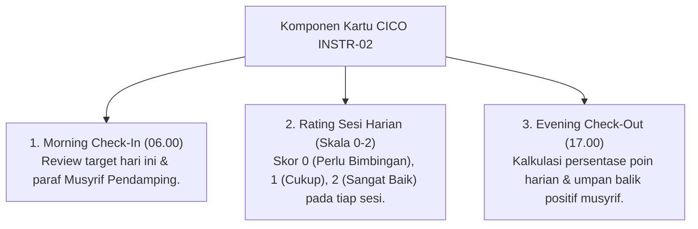

# P5-04-02: Instrumen Check-In / Check-Out (CICO) Tier 2 PBIS (INSTR-02)

## Status Dokumen
* **Status**: 🌟 **A+ (Tervalidasi & Siap Diimplementasikan)**
* **Sub-Domain**: `05 Assessment Framework / 04 Assessment Instruments`
* **Penanggung Jawab Keilmuan**: Dewan Keilmuan TUMBUH (*Pakar Arsitektur PBIS Restoratif & Pakar Bimbingan Konseling*)

---

## 1. Spesifikasi Kartu CICO (INSTR-02)

Kartu CICO adalah instrumen harian yang dibawa oleh santri peserta program pembinaan Tier 2 PBIS. Kartu ini digunakan untuk memantau 3 target perilaku spesifik yang disepakati bersama.

---

## 2. Target Pencapaian Kartu CICO

- **Target Kenaikan**: Santri dinyatakan berhasil apabila mencapai **skor harian $\ge$ 80%** selama 4 pekan berturut-turut.
- **Transisi Graduasi**: Santri yang lulus graduasi CICO secara resmi dikembalikan ke sistem pembinaan umum Tier 1 Universal.
