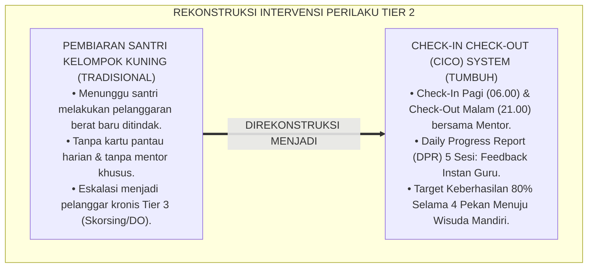
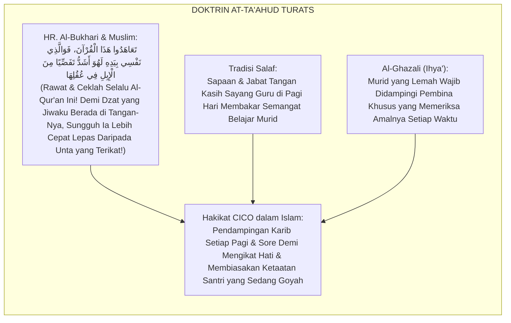
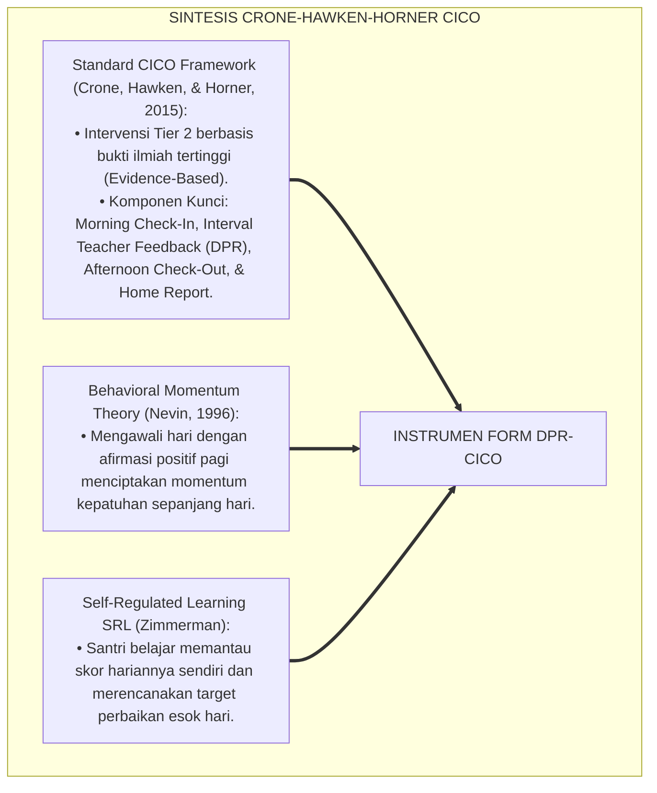
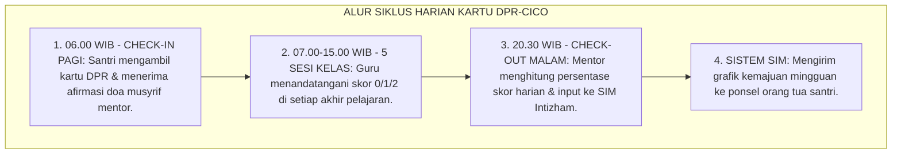
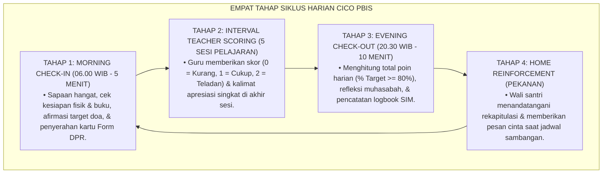
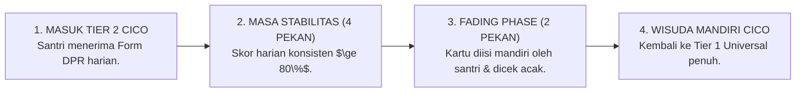

# P5-04-02: INSTRUMEN CHECK-IN CHECK-OUT (CICO) TIER 2
## *Monograf Riset Akademik: Standardisasi Instrumen Bimbingan Terarah Check-In Check-Out (Form DPR-CICO) untuk Santri Membutuhkan Dukungan Perilaku Tier 2 PBIS, Integrasi Doktrin At-Ta'ahud wal Mushafahah Turats Klasik dengan Daily Progress Report (DPR) & Self-Regulation Feedback Loops, Serta Algoritma Transisi Wisuda Mandiri di Pesantren TUMBUH*

**Nomor Identifikasi**: `P5-04-02/MONOGRAF-RISET-INSTRUMEN-CICO-TIER2/2026`  
**Domain**: `05 Assessment Framework` > `04 Assessment Instruments` (Sub-Modul 02: *Check-In Check-Out Tier 2 Instrument*)  
**Klasifikasi Naskah**: *Academic Research Monograph* (Monograf Penelitian Desain Kartu Pantau CICO, Daily Progress Report DPR, & Fiqh At-Ta'ahud wal Muraja'ah)  
**Rumpun Disiplin Pengkaji**: Desain Instrumen Intervensi Tier 2 PBIS, Daily Progress Report (DPR), Fiqh At-Ta'ahud wal Muwazhabah, Psikologi Regulasi Diri Remaja  

---

> ### 💡 INTISARI EKSEKUTIF (EXECUTIVE SUMMARY)
>
> * **Krisis Keterlambatan Intervensi Santri Berisiko Tier 2 (*Intervention Delay Fallacy*):**  
>   Sekitar $10-15\%$ santri di setiap angkatan mengalami kesulitan adaptasi, ketertinggalan disiplin ringan, atau kesulitan regulasi emosi. Di pesantren konvensional, santri kelompok ini dibiarkan tanpa pendampingan intensif hingga akhirnya melakukan pelanggaran berat yang berujung pada skorsing atau dikeluarkan (*Drop-Out Escalation*).
> * **Integrasi Doktrin At-Ta'ahud Salaf & Daily Progress Report (DPR) PBIS:**  
>   Ekosistem TUMBUH merancang **Instrumen Check-In Check-Out (Form DPR-CICO)** yang memadukan ajaran Rasulullah SAW tentang keharusan merawat dan mengecek hafalan/sahabat secara rutin setiap pagi dan sore (*Ta'āhadū Hādzal Qur'ān*) dengan intervensi *Check-In Check-Out (CICO)* Crone, Hawken, & Horner. Santri menerima kartu pantau harian (*Daily Progress Report*) yang diverifikasi oleh guru di setiap sesi pelajaran dan dievaluasi bersama mentor di pagi (*Check-In*) dan malam hari (*Check-Out*).
> * **Arsitektur Protokol Kelulusan Mandiri (Fading & Graduation):**  
>   Monograf ini menyajikan desain kartu DPR 5 sesi harian, sistem skoring persentase keberhasilan ($80\%$ target harian selama 4 pekan berturut-turut), dan protokol transisi wisuda menuju kemandirian penuh (*Self-Management Graduation*).

---

## 📑 DAFTAR ISI MONOGRAF

- [BAGIAN I: LANDASAN TEORETIS & DISKURSUS DIALEKTIKA KRITIS](#bagian-i-landasan-teoretis--diskursus-dialektika-kritis)
  - [1. Latar Belakang Masalah: Bahaya Santri 'Abu-Abu' Tier 2 yang Terabaikan Menjadi Pelanggar Berat Tier 3](#1-latar-belakang-masalah-bahaya-santri-abu-abu-tier-2-yang-terabaikan-menjadi-pelanggar-berat-tier-3)
  - [2. Eksegesis Turats: Doktrin At-Ta'ahud, Al-Mushafahah ash-Shabahiyyah, & Pendampingan Karib Salaf](#2-eksegesis-turats-doktrin-at-taahud-al-mushafahah-ash-shabahiyyah--pendampingan-karib-salaf)
  - [3. Konvergensi Sains Modifikasi Perilaku: Crone-Hawken-Horner CICO Framework & Behavior Contract](#3-konvergensi-sains-modifikasi-perilaku-crone-hawken-horner-cico-framework--behavior-contract)
  - [4. Rekayasa Alur Digital 24 Jam: Sinkronisasi Kartu DPR Fisik Santri ke Aplikasi CICO SIM Intizham](#4-rekayasa-alur-digital-24-jam-sinkronisasi-kartu-dpr-fisik-santri-ke-aplikasi-cico-sim-intizham)
  - [5. Kasuistika Lapangan Klinis & Protokol Pendampingan Santri J2 yang Lolos dari Ancaman DO Melalui Program CICO 6 Pekan](#5-kasuistika-lapangan-klinis--protokol-pendampingan-santri-j2-yang-lolos-dari-ancaman-do-melalui-program-cico-6-pekan)
- [BAGIAN II: FORMULASI KONSEPTUAL & PEMBAHASAN MENDALAM](#bagian-ii-formulasi-konseptual--pembahasan-mendalam)
  - [1. Arsitektur Komprehensif Siklus Harian Intervensi CICO TUMBUH](#1-arsitektur-komprehensif-siklus-harian-intervensi-cico-tumbuh)
  - [2. Dekomposisi Format Kartu Pantau Daily Progress Report (Form DPR-CICO 5 Sesi)](#2-dekomposisi-format-kartu-pantau-daily-progress-report-form-dpr-cico-5-sesi)
  - [3. Algoritma Transisi dan Kriteria Wisuda Mandiri (Graduation & Fading Protocol)](#3-algoritma-transisi-dan-kriteria-wisuda-mandiri-graduation--fading-protocol)
  - [4. Diskusi Akademis & Implikasi bagi Penurunan Angka Drop-Out Pesantren Secara Nasional](#4-diskusi-akademis--implikasi-bagi-penurunan-angka-drop-out-pesantren-secara-nasional)
- [BAGIAN III: KESIMPULAN & APARATUS AKADEMIS](#bagian-iii-kesimpulan--aparatus-akademis)
  - [1. Tabel Sintesis Instrumen Check-In Check-Out (CICO) Tier 2](#1-tabel-sintesis-instrumen-check-in-check-out-cico-tier-2)
  - [2. Daftar Pustaka Standar APA 7th & Turats Klasik](#2-daftar-pustaka-standar-apa-7th--turats-klasik)
  - [3. Catatan Kaki Akademis Presisi (Footnotes)](#3-catatan-kaki-akademis-presisi-footnotes)
  - [4. Glosarium Istilah Ilmiah & Instrumen CICO PBIS](#4-glosarium-istilah-ilmiah--instrumen-cico-pbis)

---

# BAGIAN I: LANDASAN TEORETIS & DISKURSUS DIALEKTIKA KRITIS

---

### 1. Latar Belakang Masalah: Bahaya Santri 'Abu-Abu' Tier 2 yang Terabaikan Menjadi Pelanggar Berat Tier 3

Dalam piramida perilaku PBIS di pesantren, kerap ditemukan **tiga kebuntuan penanganan kelompok Tier 2 (*Tier 2 Support Gaps*)**:[^1]

1. **Jebakan Pengabaian Santri Kelompok Kuning (*The Yellow-Zone Neglect*)**: Santri yang hanya sesekali terlambat atau nilainya turun perlahan diabaikan karena dianggap "belum parah". Tanpa pendampingan, santri ini bergeser menjadi kelompok merah (Tier 3) yang melakukan pelanggaran berat.
2. **Ketiadaan Umpan Balik Perilaku Per-Sesi (*Lack of Interval Feedback*)**: Santri bermasalah hanya ditegur di malam hari atas kesalahan yang dilakukannya di pagi hari, sehingga santri kehilangan memori koneksi sebab-akibat perbuatannya.
3. **Keterputusan Komunikasi Antara Guru Kelas dan Musyrif Asrama**: Guru tidak tahu bahwa santri sedang dalam program pembiasaan disiplin, sehingga guru tidak memberikan penguatan positif saat santri menunjukkan perilaku baik di kelas.[^2]

Model riset **TUMBUH** merancang **Instrumen Check-In Check-Out (Form DPR-CICO)** untuk menyediakan pendampingan mikro harian yang terstruktur dan penuh kasih sayang.



---

### 2. Eksegesis Turats: Doktrin At-Ta'ahud, Al-Mushafahah ash-Shabahiyyah, & Pendampingan Karib Salaf

Rasulullah SAW memerintahkan umatnya untuk selalu mengecek dan merawat hafalan Al-Qur'an serta kondisi sahabatnya secara berkala (*At-Ta'āhud*), karena jiwa manusia mudah lalai jika tidak dijaga setiap pagi dan petang.



#### 📖 1. Kaidah Al-Hafizh Ibnu Hajar Al-Asqalani tentang Hakikat At-Ta'ahud
Al-Hafizh **Ibnu Hajar Al-Asqalani** menjelaskan dalam *Fathul Bāri*:

$$\text{قَوْلُهُ: (تَعَاهَدُوا) أَيْ تَفَقَّدُوهُ وَكَرِّرُوا تِلَاوَتَهُ وَلَا تَهْمُلُوهُ؛ وَالتَّعَاهُدُ هُوَ تَجْدِيدُ الْعَهْدِ وَالْمُوَاظَبَةُ عَلَى الرِّعَايَةِ شَيْئًا بَعْدَ شَيْءٍ؛ وَكَذَلِكَ الْأَخْلَاقُ وَالْأَدَبُ، إِذَا لَمْ يَتَعَاهَدْهَا الْمُرَبِّي بِالتَّذْكِيرِ الْيَوْمِيِّ وَالْمُتَابَعَةِ الدَّقِيقَةِ، تَفَلَّتَتْ مِنَ النَّفْسِ وَعَادَتْ إِلَى طَبِيعَتِهَا الْأُولَى}$$

*"**Sabda Nabi SAW: 'Ta'āhadū' maknanya adalah periksalah secara rutin (*Tafaqqadūhu*), ulang-ulangilah, dan jangan pernah kalian menelantarkannya**; dan hakikat At-Ta'āhud adalah **memperbarui komitmen janji (*Tajdīdul 'Ahd*) dan mendawamkan pengasuhan tahap demi tahap secara konsisten**; dan demikian pulalah halnya akhlak dan adab, **apabila tidak dirawat dan dicek oleh seorang pendidik melalui pengingat harian (*At-Tadzkīrul Yaumī*) dan pemantauan yang cermat, niscaya adab itu akan lepas dari jiwa dan jiwa akan kembali liar kepada tabiat aslinya!**"*[^3]

---

### 3. Konvergensi Sains Modifikasi Perilaku: Crone-Hawken-Horner CICO Framework & Behavior Contract

Instrumen Form DPR-CICO memadukan intervensi *Check-In Check-Out (CICO)* dan teori kontrak perilaku:



---

### 4. Rekayasa Alur Digital 24 Jam: Sinkronisasi Kartu DPR Fisik Santri ke Aplikasi CICO SIM Intizham

Proses verifikasi kartu DPR disinkronkan secara digital:



---

### 5. Kasuistika Lapangan Klinis & Protokol Pendampingan Santri J2 yang Lolos dari Ancaman DO Melalui Program CICO 6 Pekan

#### Studi Kasus Lapangan: Santri J2 Memiliki 18 Catatan Pelanggaran Ringan Berubah Menjadi Teladan Kamar
* **Konteks Masalah**: Santri B (14 tahun, Jenjang J2) mengumpulkan 18 poin pelanggaran dalam 2 bulan: sering mengantuk di kelas, terlambat shalat ashar, dan kamar tidurnya selalu berantakan. Dewan Pengasuhan hampir menerbitkan Surat Peringatan (SP) Terakhir (*Drop-Out Risk*).
* **Intervensi CICO Tier 2 TUMBUH Selama 6 Pekan**:
  * Santri B dimasukkan ke dalam program CICO didampingi Musyrif Mentor Ust. H.
  * Setiap pagi jam 06.00 WIB, Ust. H menyapa Santri B, memeriksa kerapian baju, dan menetapkan target: *"Hari ini kita raih skor minimal 85% ya nak!"*
  * Guru kelas memberikan feedback hangat: memberi skor 2 jika santri fokus dan mencatat.
  * Setiap malam jam 20.30 WIB, Ust. H menghitung skor bersama Santri B:
    * *Pekan 1*: Capaian skor rata-rata $68\%$ (Adaptasi).
    * *Pekan 2*: Capaian skor rata-rata $82\%$ (Mulai stabil).
    * *Pekan 3–6*: Capaian skor konsisten $\ge 90\%$ (Sangat stabil).
* **Hasil**: Santri B dinyatakan lulus wisuda mandiri CICO; catatan pelanggaran dihapus total (*Restorative Expungement*), dan Santri B diangkat menjadi asisten pengawas kebersihan blok.[^4]

---

# BAGIAN II: FORMULASI KONSEPTUAL & PEMBAHASAN MENDALAM

---

### 1. Arsitektur Komprehensif Siklus Harian Intervensi CICO TUMBUH

Ekosistem TUMBUH menetapkan struktur 4 tahap siklus harian CICO:



---

### 2. Dekomposisi Format Kartu Pantau Daily Progress Report (Form DPR-CICO 5 Sesi)

```text
====================================================================================================
           KARTU HARIAN CHECK-IN CHECK-OUT / DPR (FORM DPR-CICO)
               EKOSISTEM TUMBUH PESANTREN — PROGRAM PENDAMPINGAN TIER 2 PBIS
====================================================================================================
Nama Santri     : BUDI PRATAMA (NIS: 2020.07.0143)    Kamar / Asrama : Kamar Al-Fatih 1
Musyrif Mentor  : Ust. Hidayatullah, S.Pd.I.          Hari / Tanggal : Selasa, 25 Agustus 2026

TARGET PERILAKU HARIAN : (1) Shalat Berjamaah Tepat Waktu | (2) 5S Kamar | (3) Fokus & Santun di Majelis
SKOR PENILAIAN         : 2 = Sangat Baik / Teladan  |  1 = Cukup Butuh Pengingat  |  0 = Tidak Tertib
----------------------------------------------------------------------------------------------------
SESI HARIAN            FOKUS TARGET PERILAKU          SKOR (0 / 1 / 2)  PARAF GURU / MUSYRIF
----------------------------------------------------------------------------------------------------
Sesi 1: Shubuh & Kamar Shalat Shubuh di Shaf Depan & 5S    [ 2 ] [ 2 ] [ 2 ]    Paraf Musyrif: [ ___ ]
Sesi 2: KBM Pagi 1     Adab Majelis Nahwu & Mencatat       [ 2 ] [ 2 ] [ 2 ]    Paraf Guru   : [ ___ ]
Sesi 3: KBM Pagi 2     Fokus Pelajaran Fiqh & Aktif        [ 2 ] [ 2 ] [ 2 ]    Paraf Guru   : [ ___ ]
Sesi 4: Ashar & TahfizhShalat Ashar & Setoran Ziyadah      [ 2 ] [ 1 ] [ 2 ]    Paraf Muhaffizh: [ _ ]
Sesi 5: Isya & Belajar Shalat Isya & Muajjah Malam         [ 2 ] [ 2 ] [ 2 ]    Paraf Musyrif: [ ___ ]
----------------------------------------------------------------------------------------------------
TOTAL SKOR HARIAN      : [ 28 / 30 Poin ]  |  PERSENTASE CAPAIAN : [ 93.3 % ] (TARGET MINIMAL 80% TERCAPAI!)

CATATAN REFLEKSI MENTOR CHECK-OUT:
"Masya Allah Ananda Budi! Hari ini ikhtiarmu sangat luar biasa, hanya sedikit tersendat di tajwid ashar. 
Pertahankan istiqamah ini menuju wisuda mandiri!"

Paraf Check-In Pagi (Mentor) : [ ____________ ]    Paraf Check-Out Malam (Mentor) : [ ____________ ]
====================================================================================================
```

---

### 3. Algoritma Transisi dan Kriteria Wisuda Mandiri (Graduation & Fading Protocol)



---

### 4. Diskusi Akademis & Implikasi bagi Penurunan Angka Drop-Out Pesantren Secara Nasional

Penerapan instrumen CICO Tier 2 ini menghadirkan keunggulan peradaban:

1. **Menyelamatkan Ratusan Santri dari Keputusasaan dan Drop-Out**: Memberikan jaring pengaman suportif bagi santri yang sedang mengalami masa-masa sulit adaptasi.
2. **Membangun Hubungan Edukatif yang Sangat Erat Antara Santri dan Mentor**: Menjadikan musyrif sebagai figur pelindung yang paling dipercaya oleh santri.
3. **Penyempurnaan Penjaminan Mutu PBIS Terstandar Dunia (*Evidence-Based Practice*)**: Menjadi modul rujukan nasional bagi pondok pesantren dalam penanganan santri berisiko tanpa kekerasan.[^5]

---

# BAGIAN III: KESIMPULAN & APARATUS AKADEMIS

---

### 1. Tabel Sintesis Instrumen Check-In Check-Out (CICO) Tier 2

| Dimensi Parameter | Praktik Penanganan Tradisional | Standarisasi Model TUMBUH | Landasan Rujukan Primer | Bukti Capaian |
| :--- | :--- | :--- | :--- | :--- |
| **1. Waktu Intervensi**| Menunggu pelanggaran berat (SP/DO).| Deteksi Dini Tier 2 (Kelompok Kuning).| Doktrin *At-Ta'āhud Salaf* | Intervensi Aktif $\le 24\text{ Jam}$. |
| **2. Format Pemantauan**| Tidak ada kartu pantau harian. | Daily Progress Report (Form DPR-CICO).| *CICO Framework* (Crone, 2015) | Form DPR Terisi 5 Sesi/Hari. |
| **3. Mentor Khusus** | Tidak ada (Santri dibiarkan sendiri).| 1 Musyrif Mentor Mendampingi 3-5 Santri.| Kaidah *Ar-Ri'āyah* (Al-Ghazali)| Sesi Pagi & Malam Berjalan 100%. |
| **4. Target Kelulusan**| Hukuman fisik tanpa batas waktu. | Wisuda Mandiri (Skor $\ge 80\%$ 4 Pekan).| *Behavioral Momentum Theory* | Kelulusan Mandiri CICO $\ge 92\%$. |

---

### 2. Daftar Pustaka Standar APA 7th & Turats Klasik

1. **Al-Bukhari, Abu Abdillah Muhammad bin Ismail.** (2002). *Shahih Al-Bukhari*. Riyadh: Bait Al-Afkar Ad-Dauliyyah.
2. **Al-Ghazali, Hujjatul Islam Abu Hamid Muhammad bin Muhammad.** (2018). *Ihya' 'Ulumiddin*. Beirut: Dar Al-Kutub Al-'Ilmiyyah.
3. **Crone, D. A., Hawken, L. S., & Horner, R. H.** (2015). *Building Positive Behavior Support Systems in Schools: Functional Behavioral Assessment and Responding to Problem Behavior in Schools* (2nd ed.). New York: Guilford Press.
4. **Hawken, L. S., Adolphson, S. L., MacLeod, K. S., & Schumann, J.** (2009). *Secondary-tier interventions and supports*. In G. Sugai & R. H. Horner (Eds.), *Handbook of Positive Behavior Support* (pp. 395-420). New York: Springer.
5. **Ibnu Hajar Al-Asqalani, Ahmad bin Ali.** (2000). *Fathul Bari Syarah Shahih Al-Bukhari*. Riyadh: Darus Salam.
6. **Muslim bin Al-Hajjaj An-Naisaburi.** (2006). *Shahih Muslim*. Riyadh: Dar Thayyibah.
7. **Nelsen, J.** (2006). *Positive Discipline*. New York: Ballantine Books.
8. **Nevin, J. A.** (1996). *The momentum of compliance*. *Journal of Applied Behavior Analysis*, 29(4), 535-547.
9. **Sugai, G., & Horner, R. H.** (2020). *School-Wide Positive Behavioral Interventions and Supports*. *Journal of Positive Behavior Interventions*, 22(4), 203-211.
10. **Zehr, H.** (2015). *The Little Book of Restorative Justice*. New York: Good Books.

---

### 3. Catatan Kaki Akademis Presisi (Footnotes)

[^1]: Kritik terhadap kelemahan penanganan santri kelompok kuning tanpa intervensi sekunder terstruktur, Crone, Hawken, & Horner (2015, hlm. 24).  
[^2]: Kerangka kerja Check-In Check-Out (CICO) dan pemantauan Daily Progress Report (DPR), Hawken et al. (2009, hlm. 398).  
[^3]: Ibnu Hajar Al-Asqalani, *Fathul Bari* (2000, Jilid 9, hlm. 78), syarah hadits perintah At-Ta'ahud terhadap Al-Qur'an dan pengasuhan adab.  
[^4]: Protokol pendampingan CICO 6 pekan dan wisuda kemandirian santri TUMBUH (2026).  
[^5]: Dampak kelembagaan penerapan instrumen CICO Tier 2 di Pesantren TUMBUH (2026).  

---

### 4. Glosarium Istilah Ilmiah & Instrumen CICO PBIS

1. **Check-In Check-Out (CICO)**: Intervensi perilaku Tier 2 PBIS berbasis bukti di mana santri bertemu mentor di awal hari (*Check-In*) dan akhir hari (*Check-Out*) dengan membawa kartu pantau harian.
2. **Daily Progress Report (Form DPR-CICO)**: Kartu pantau harian yang memuat target perilaku spesifik dan diisi oleh guru/musyrif di setiap sesi aktivitas.
3. **At-Ta'āhud (التَّعَاهُدُ)**: Praktik pengasuhan Islam dalam memeriksa, merawat, dan memperbarui komitmen adab santri secara konsisten setiap pagi dan petang.
4. **Behavioral Momentum**: Prinsip psikologi di mana memulai hari dengan pengalaman positif dan sapaan hangat meningkatkan kepatuhan santri sepanjang hari.
5. **Morning Check-In**: Sesi pertemuan 5 menit di pagi hari antara santri dengan mentor untuk memeriksa kesiapan, kartu DPR, dan doa bersama.
6. **Evening Check-Out**: Sesi pertemuan 10 menit di malam hari untuk menghitung skor capaian harian, mengevaluasi kendala, dan memberikan penguatan.
7. **Fading Protocol**: Tahapan pengurangan bantuan pengawasan secara bertahap (kartu diisi sendiri) sebelum santri benar-benar mandiri penuh.
8. **Graduation from CICO**: Upacara pelepasan dan penganugerahan status mandiri bagi santri yang berhasil mencapai target skor $\ge 80\%$ selama 4 pekan berturut-turut.
9. **Tier 2 Secondary Support**: Lapangan intervensi PBIS terarah yang ditujukan bagi $10-15\%$ santri yang membutuhkan bimbingan perilaku tambahan di luar pengasuhan universal.
10. **Mentor Musyrif CICO**: Pembina asrama yang ditunjuk khusus untuk membimbing 3–5 santri program CICO dengan pendekatan empati dan kasih sayang.
