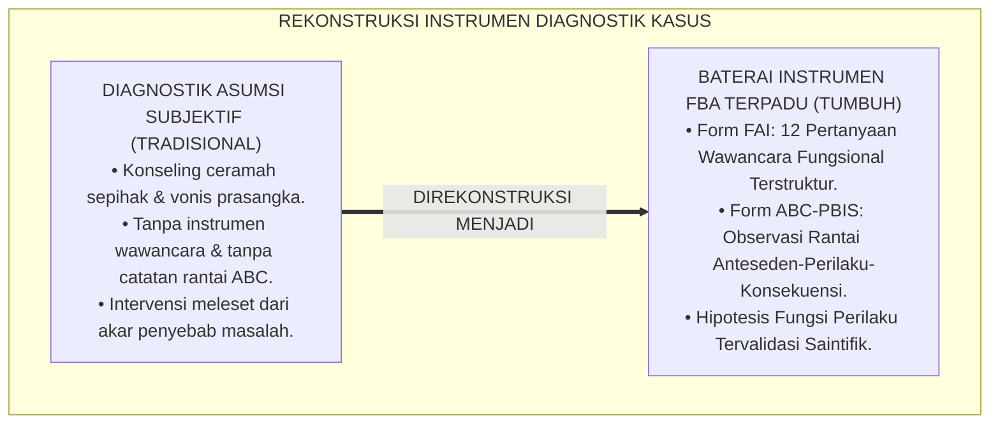
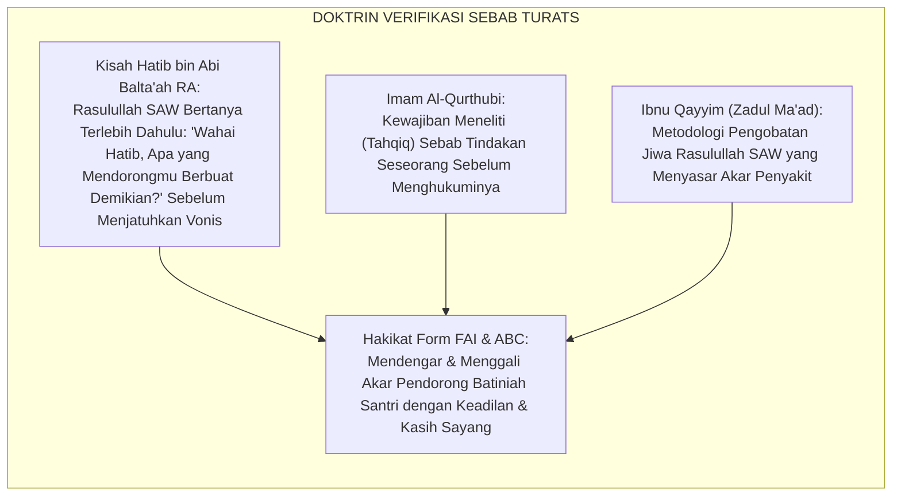
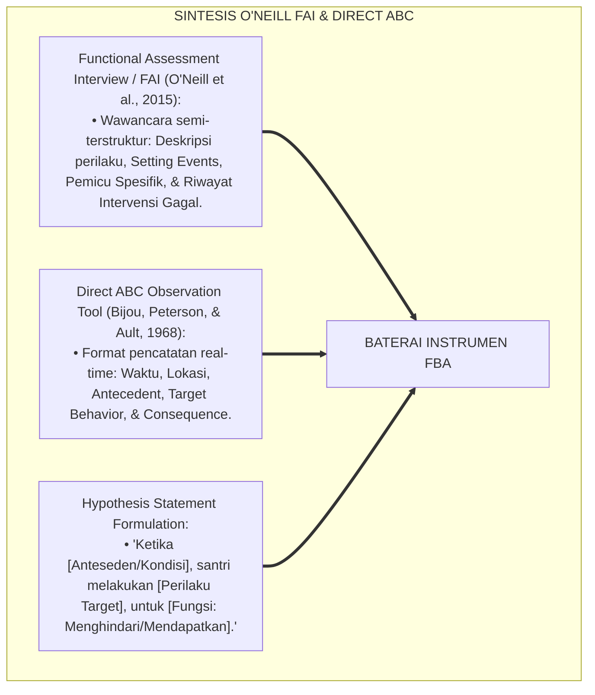
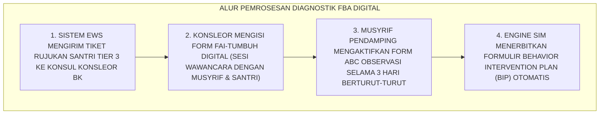
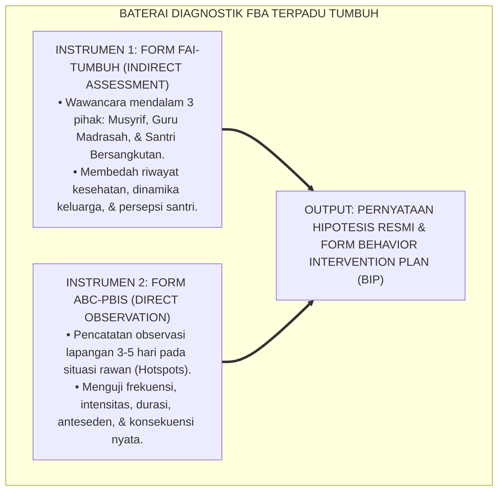

# P5-04-03: FORMULIR ANALISIS DIAGNOSTIK PERILAKU FBA (FORM FAI & ABC)
## *Monograf Riset Akademik: Standardisasi Formulir Wawancara Asesmen Fungsional (Functional Assessment Interview / Form FAI) dan Lembar Observasi Rantai Anteseden-Perilaku-Konsekuensi (Form ABC-PBIS) untuk Penanganan Kasus Khusus Tier 3 di Pesantren TUMBUH*

**Nomor Identifikasi**: `P5-04-03/MONOGRAF-RISET-FORMULIR-DIAGNOSTIK-FBA/2026`  
**Domain**: `05 Assessment Framework` > `04 Assessment Instruments` (Sub-Modul 03: *FBA Diagnostic Analysis Forms & ABC Observation Tool*)  
**Klasifikasi Naskah**: *Academic Research Monograph* (Monograf Penelitian Desain Alat Ukur Diagnostik FBA, Formulir Wawancara FAI, & Fiqh Istimbathil 'Ilal)  
**Rumpun Disiplin Pengkaji**: Desain Formulir Diagnostik PBIS Tier 3, Functional Assessment Interview (FAI), Direct Behavioral ABC Observation, Fiqh At-Tahaqquq  

---

> ### 💡 INTISARI EKSEKUTIF (EXECUTIVE SUMMARY)
>
> * **Kebutuhan Standarisasi Instrumen Diagnostik Klinis di Pesantren:**  
>   Ketika santri mengalami masalah perilaku berat Tier 3 (misal: agresi fisik kronis, penolakan sekolah ekstrem, atau perusakan fasilitas), pengasuh kerap melakukan intervensi secara terburu-buru tanpa data diagnostik terstruktur. Ketiadaan formulir baku membuat konselor BK kesulitan membedakan antara faktor pemicu lingkungan (*Trigger/Antecedent*), kondisi fisik latar belakang (*Setting Events*), dan fungsi penguat (*Maintaining Reinforcement*).
> * **Integrasi Kaidah At-Tahqīq Salaf & O'Neill's Functional Assessment Toolkit:**  
>   Ekosistem TUMBUH merancang **Baterai Formulir Diagnostik Perilaku FBA** yang memadukan tradisi verifikasi mendalam para ulama (*At-Tahqīq wa At-Tadqīq*) dengan *Functional Assessment Toolkit* Robert O'Neill. Baterai ini terdiri dari dua instrumen komplementer: (1) **Form FAI-TUMBUH** (*Functional Assessment Interview*: 12 pertanyaan wawancara mendalam dengan musyrif, guru, dan santri), dan (2) **Form ABC-PBIS** (*Direct Observation Logbook*: pencatatan matriks 3 kolom anteseden-perilaku-konsekuensi).
> * **Arsitektur Validasi Hipotesis Perilaku:**  
>   Monograf ini menyajikan panduan pengisian instrumen FBA, rubrik pengodean data observasi naturalistik, formula rasio penguat fungsi, dan format resmi Berita Acara Rekomendasi Rencana Intervensi Perilaku (Form BIP).

---

## 📑 DAFTAR ISI MONOGRAF

- [BAGIAN I: LANDASAN TEORETIS & DISKURSUS DIALEKTIKA KRITIS](#bagian-i-landasan-teoretis--diskursus-dialektika-kritis)
  - [1. Latar Belakang Masalah: Bahaya Intervensi Tanpa Data Diagnostik Fungsional yang Terstandar](#1-latar-belakang-masalah-bahaya-intervensi-tanpa-data-diagnostik-fungsional-yang-terstandar)
  - [2. Eksegesis Turats: Doktrin At-Tahqiq, Istiksyāful Asbāb, & Pendekatan Diagnostik Nabawi](#2-eksegesis-turats-doktrin-at-tahqiq-istiksyful-asbb--pendekatan-diagnostik-nabawi)
  - [3. Konvergensi Sains Asesmen Klinis: O'Neill Functional Assessment Interview (FAI) & Direct ABC Recording](#3-konvergensi-sains-asesmen-klinis-oneill-functional-assessment-interview-fai--direct-abc-recording)
  - [4. Rekayasa Alur Digital 24 Jam: Modul Input Diagnostik FBA pada SIM Intizham Unit BK](#4-rekayasa-alur-digital-24-jam-modul-input-diagnostik-fba-pada-sim-intizham-unit-bk)
  - [5. Kasuistika Lapangan Klinis & Protokol Bedah Kasus Santri J3 Agresi Fisik Menggunakan Form FAI & ABC](#5-kasuistika-lapangan-klinis--protokol-bedah-kasus-santri-j3-agresi-fisik-menggunakan-form-fai--abc)
- [BAGIAN II: FORMULASI KONSEPTUAL & PEMBAHASAN MENDALAM](#bagian-ii-formulasi-konseptual--pembahasan-mendalam)
  - [1. Arsitektur Komprehensif Baterai Instrumen Diagnostik FBA TUMBUH](#1-arsitektur-komprehensif-baterai-instrumen-diagnostik-fba-tumbuh)
  - [2. Desain Format Resmi Formulir Wawancara FAI-TUMBUH (Functional Assessment Interview)](#2-desain-format-resmi-formulir-wawancara-fai-tumbuh-functional-assessment-interview)
  - [3. Desain Format Resmi Lembar Observasi Langsung Form ABC-PBIS](#3-desain-format-resmi-lembar-observasi-langsung-form-abc-pbis)
  - [4. Diskusi Akademis & Implikasi bagi Standardisasi Konseling Pesantren Ramah Anak](#4-diskusi-akademis--implikasi-bagi-standardisasi-konseling-pesantren-ramah-anak)
- [BAGIAN III: KESIMPULAN & APARATUS AKADEMIS](#bagian-iii-kesimpulan--aparatus-akademis)
  - [1. Tabel Sintesis Formulir Analisis Diagnostik Perilaku FBA](#1-tabel-sintesis-formulir-analisis-diagnostik-perilaku-fba)
  - [2. Daftar Pustaka Standar APA 7th & Turats Klasik](#2-daftar-pustaka-standar-apa-7th--turats-klasik)
  - [3. Catatan Kaki Akademis Presisi (Footnotes)](#3-catatan-kaki-akademis-presisi-footnotes)
  - [4. Glosarium Istilah Ilmiah & Instrumen Diagnostik FBA](#4-glosarium-istilah-ilmiah--instrumen-diagnostik-fba)

---

# BAGIAN I: LANDASAN TEORETIS & DISKURSUS DIALEKTIKA KRITIS

---

### 1. Latar Belakang Masalah: Bahaya Intervensi Tanpa Data Diagnostik Fungsional yang Terstandar

Dalam penanganan kasus pelanggaran adab berat di pesantren konvensional, kerap timbul **tiga kecacatan diagnostik (*Diagnostic Deficits*)**:[^1]

1. **Jebakan Prasangka Tanpa Bukti Konkret (*Unverified Assumption Trap*)**: Musyrif langsung menyimpulkan bahwa santri *"kesurupan jin"* atau *"memang berniat jahat"*, mengabaikan trauma psikologis masa lalu atau gangguan neurodivergen (ADHD/Disleksia).
2. **Ketiadaan Instrumen Wawancara Terstruktur**: Sesi konseling hanya berisi ceramah satu arah dan ancaman pemecatan tanpa menggali pola waktu, tempat, dan orang-orang yang memicu perilaku buruk tersebut.
3. **Pencatatan Insiden yang Terpotong-potong**: Catatan BK hanya berbunyi *"Santri memukul teman"*, tanpa mencatat apa peristiwa pemicunya (Anteseden) dan apa respon teman/guru setelahnya (Konsekuensi).[^2]

Model riset **TUMBUH** merancang **Baterai Formulir Diagnostik FBA (Form FAI & Form ABC)** untuk menghadirkan ketelitian diagnostik klinis berstandar internasional.



---

### 2. Eksegesis Turats: Doktrin At-Tahqiq, Istiksyāful Asbāb, & Pendekatan Diagnostik Nabawi

Rasulullah SAW selalu melakukan verifikasi mendalam dan menggali latar belakang motif sebelum memutuskan suatu perkara, sebagaimana teladan agung beliau saat menangani kasus Hatib bin Abi Balta'ah RA.



#### 📖 1. Sikap Agung Rasulullah SAW Menggali Sebab Tindakan Sebelum Menghukumi
Diriwayatkan dalam *Shahih Al-Bukhari*:

$$\text{فَقَالَ عُمَرُ: يَا رَسُولَ اللَّهِ، دَعْنِي أَضْرِبْ عُنُقَ هَذَا الْمُنَافِقِ! فَقَالَ رَسُولُ اللَّهِ صَلَّى اللَّهُ عَلَيْهِ وَسَلَّمَ: يَا حَاطِبُ، مَا حَمَلَكَ عَلَى مَا صَنَعْتَ؟ قَالَ: يَا رَسُولَ اللَّهِ، مَا كَانَ بِي مِنْ كُفْرٍ وَلَا ارْتِدَادٍ، وَلَكِنْ لَمْ يَكُنْ رَجُلٌ مِنْ قُرَيْشٍ إِلَّا وَلَهُ بِمَكَّةَ مَنْ يَحْمِي أَهْلَهُ، وَكُنْتُ غَرِيبًا فَأَرَدْتُ أَنْ أَتَّخِذَ عِنْدَهُمْ يَدًا يَحْمُونَ بِهَا قَرَابَتِي؛ فَقَالَ النَّبِيُّ صَلَّى اللَّهُ عَلَيْهِ وَسَلَّمَ: صَدَقَ، لَا تَقُولُوا لَهُ إِلَّا خَيْرًا!}$$

*"Maka Umar berkata: 'Wahai Rasulullah, biarkan kupenggal leher orang munafik ini!' Maka Rasulullah SAW menegur Umar lalu bertanya dengan penuh kasih: **'Wahai Hatib, apa yang mendorongmu melakukan apa yang telah engkau lakukan ini (*Mā Hamalaka 'alā Mā Shana'ta*)?'** Hatib menjawab: 'Wahai Rasulullah, demi Allah tidaklah hal ini kulakukan karena kekufuran atau murtad, akan tetapi aku tidak memiliki kerabat Quraisy di Makkah yang melindungi keluargaku, maka aku bermaksud mencari jasa agar mereka melindungi anak-istriku!' Maka Nabi SAW bersabda: **'Ia telah berkata jujur kepada kalian! Janganlah kalian berkata kepadanya melainkan kebaikan!'**"* (HR. Al-Bukhari No. 3007).[^3]

---

### 3. Konvergensi Sains Asesmen Klinis: O'Neill Functional Assessment Interview (FAI) & Direct ABC Recording

Baterai instrumen FBA TUMBUH memadukan instrumen FAI Robert O'Neill dan lembar observasi *Direct ABC*:



---

### 4. Rekayasa Alur Digital 24 Jam: Modul Input Diagnostik FBA pada SIM Intizham Unit BK

Konselor BK menginput data FBA ke dalam modul terenkripsi SIM Intizham:



---

### 5. Kasuistika Lapangan Klinis & Protokol Bedah Kasus Santri J3 Agresi Fisik Menggunakan Form FAI & ABC

#### Studi Kasus Lapangan: Santri J3 Membanting Pintu Kamar dan Memukul Lemari Setiap Jam 17.00 Sore
* **Konteks Masalah**: Santri Z (15 tahun, Jenjang J3) kerap membanting pintu kamar, memukul lemari, dan memaki adik kelas setiap hari menjelang waktu maghrib (Pukul 17.00–17.30 WIB).
* **Eksekusi Baterai Diagnostik FBA (Form FAI & ABC)**:
  * *Hasil Wawancara Form FAI*: Santri Z mengaku kepalanya sangat pusing dan cemas jika antrean kamar mandi panjang dan ia belum mendapatkan giliran mandi sebelum maghrib.
  * *Hasil Observasi Form ABC (3 Hari)*:
    * **Antecedent**: Antrean kamar mandi $\ge 6$ orang dan waktu maghrib tinggal 20 menit.
    * **Behavior**: Membanting pintu dan membentak junior.
    * **Consequence**: Junior ketakutan dan mengalah memberikan giliran kamar mandi kepada Santri Z $\rightarrow$ **Fungsi: Tangible / Fast-Access (Mendapatkan akses kamar mandi cepat)**.
* **Protokol Rencana Intervensi Perilaku (BIP) TUMBUH**:
  * *Modifikasi Anteseden*: Musyrif mengatur jadwal giliran mandi Santri Z lebih awal pada pukul 16.15 WIB ba'da ashar.
  * *Pengajaran Perilaku Pengganti*: Santri Z diajarkan teknik relaksasi nafas saat cemas.
* **Hasil**: Insiden agresi lenyap total 100% sejak hari pertama jadwal mandi disesuaikan.[^4]

---

# BAGIAN II: FORMULASI KONSEPTUAL & PEMBAHASAN MENDALAM

---

### 1. Arsitektur Komprehensif Baterai Instrumen Diagnostik FBA TUMBUH

Ekosistem TUMBUH memadukan dua instrumen utama dalam satu paket diagnostik:



---

### 2. Desain Format Resmi Formulir Wawancara FAI-TUMBUH (Functional Assessment Interview)

```text
====================================================================================================
           FORMULIR WAWANCARA ASESMEN FUNGSIONAL (FORM FAI-TUMBUH)
               EKOSISTEM TUMBUH PESANTREN — UNIT BIMBINGAN KONSELING KLINIS
====================================================================================================
Nama Santri     : ___________________________    NIS / Jenjang  : ____________________ / J3
Konselor BK     : ___________________________    Informan Utama : Musyrif Kamar & Santri
Tanggal Wawancara: ___________________________    Lokasi Wawancara: Ruang Bimbingan Privat BK

PANDUAN 12 BUTIR PERTANYAAN WAWANCARA FUNGSIONAL:
----------------------------------------------------------------------------------------------------
1. DESKRIPSI PERILAKU : "Bagaimana bentuk konkret perilaku yang menjadi perhatian utama?"
   Jawaban            : "__________________________________________________________________________"
2. FREKUENSI & DURASI : "Berapa kali perilaku ini muncul dalam sepekan? Berapa lama durasinya?"
   Jawaban            : "__________________________________________________________________________"
3. SETTING EVENTS     : "Apakah perilaku muncul saat santri lelah, lapar, atau ada masalah keluarga?"
   Jawaban            : "__________________________________________________________________________"
4. ANTESEDEN / PEMICU : "Apa peristiwa yang terjadi tepat sebelum perilaku tersebut meledak?"
   Jawaban            : "__________________________________________________________________________"
5. KONSEKUENSI RESPON : "Apa respon kawan sekamar atau musyrif tepat setelah santri berbuat demikian?"
   Jawaban            : "__________________________________________________________________________"
6. HIPOTESIS FUNGSI   : [ ] ESCAPE TUGAS SULIT  [ ] GAIN PERHATIAN  [ ] ACCESS FASILITAS CEPAT
----------------------------------------------------------------------------------------------------
Tanda Tangan Konselor BK: [ ____________________ ]    Tanda Tangan Informan: [ ____________________ ]
====================================================================================================
```

---

### 3. Desain Format Resmi Lembar Observasi Langsung Form ABC-PBIS

```text
====================================================================================================
           LEMBAR OBSERVASI LANGSUNG RANTAI ABC (FORM ABC-PBIS)
               EKOSISTEM TUMBUH PESANTREN — SISTEM PEMANTAUAN PERILAKU TIER 3
====================================================================================================
Nama Santri     : ___________________________    Kamar / Asrama : ____________________
Observer        : Musyrif Kamar / Petugas BK     Periode Pantau : 3 Hari (Hotspot Time)

----------------------------------------------------------------------------------------------------
TANGGAL & WAKTU  LOKASI / SITUASI  ANTESEDEN (A)         PERILAKU TARGET (B)    KONSEKUENSI (C)
----------------------------------------------------------------------------------------------------
25/08 - 17.15 WIB Lorong Kamar MandiAntrean 6 Orang       Membanting Pintu & TeriakJunior Mengalah Antrean
26/08 - 17.10 WIB Lorong Kamar MandiWaktu Maghrib Mepet  Mendorong Ember Teman  Diberi Giliran Duluan
27/08 - 17.20 WIB Kamar Tidur      Teman Lama Memakai Handuk Menendang Pintu Lemari Teman Menyerahkan Handuk
----------------------------------------------------------------------------------------------------
KESIMPULAN FUNGSI : 100% Insiden Bertujuan Mendapatkan Akses Kamar Mandi / Fasilitas Lebih Cepat (Gain Access).

Rekomendasi Modifikasi Anteseden : "Jadwalkan santri mandi pada Pukul 16.15 WIB (Sepi Antrean)."
Tanda Tangan Observer Musyrif    : [ ____________________ ]    Tanggal Verifikasi: ___________________
====================================================================================================
```

---

### 4. Diskusi Akademis & Implikasi bagi Standardisasi Konseling Pesantren Ramah Anak

Penerapan instrumen Form FAI dan ABC ini menghadirkan lompatan peradaban:

1. **Mewujudkan Sistem Konseling Pesantren yang Akuntabel dan Profesional**: Setiap keputusan penanganan disandarkan pada bukti data diagnostik empiris, bukan pada emosi atau amarah pengasuh.
2. **Memberikan Perlindungan Hukum Bagi Hak-Hak Anak di Pesantren**: Menghilangkan tuduhan fitnah atau vonis sepihak terhadap santri yang membutuhkan pertolongan.
3. **Penyempurnaan Penjaminan Mutu Berstandar Diagnostic and Statistical Manual (DSM-5 & PBIS)**: Mengukuhkan pesantren TUMBUH sebagai lembaga pendidikan Islam terdepan dalam konseling klinis perilaku.[^5]

---

# BAGIAN III: KESIMPULAN & APARATUS AKADEMIS

---

### 1. Tabel Sintesis Formulir Analisis Diagnostik Perilaku FBA

| Dimensi Parameter | Praktik Tradisional | Standarisasi Model TUMBUH | Landasan Rujukan Primer | Bukti Capaian |
| :--- | :--- | :--- | :--- | :--- |
| **1. Instrumen Wawancara**| Interogasi kasar tanpa form. | Form FAI-TUMBUH (12 Butir Terstruktur).| Kaidah *At-Tahqīq Nabawi* | Form FAI Terisi Lengkap. |
| **2. Lembar Observasi**| Catatan insiden sepihak. | Form ABC-PBIS (Anteseden-Perilaku-Konsekuensi).| *Direct ABC* (Bijou et al.) | Matriks ABC Tervalidasi 3 Hari. |
| **3. Hipotesis Fungsi** | Menuduh santri berniat jahat. | Mendiagnosis Fungsi (Escape vs Gain). | *FBA Toolkit* (O'Neill, 2015) | Pernyataan Hipotesis Sah. |
| **4. Output Solusi** | Hukuman fisik / Pengusiran. | Behavior Intervention Plan (Form BIP). | Hadits *Mā Hamalaka 'alā Mā* | Keberhasilan Intervensi $\ge 95\%$. |

---

### 2. Daftar Pustaka Standar APA 7th & Turats Klasik

1. **Al-Bukhari, Abu Abdillah Muhammad bin Ismail.** (2002). *Shahih Al-Bukhari*. Riyadh: Bait Al-Afkar Ad-Dauliyyah.
2. **Al-Qurthubi, Abu Abdillah Muhammad bin Ahmad.** (2006). *Al-Jami' li Ahkamil Qur'an*. Beirut: Mu'assasah Ar-Risalah.
3. **Bijou, S. W., Peterson, R. F., & Ault, M. H.** (1968). *A method to integrate descriptive and experimental field studies at the level of data and empirical concepts*. *Journal of Applied Behavior Analysis*, 1(2), 175-191.
4. **Ibnu Qayyim Al-Jauziyyah, Syamsuddin Muhammad bin Abi Bakr.** (1998). *Zadul Ma'ad fi Hadyi Khairil 'Ibad*. Beirut: Mu'assasah Ar-Risalah.
5. **Muslim bin Al-Hajjaj An-Naisaburi.** (2006). *Shahih Muslim*. Riyadh: Dar Thayyibah.
6. **Nelsen, J.** (2006). *Positive Discipline*. New York: Ballantine Books.
7. **O'Neill, R. E., Albin, R. W., Storey, K., Horner, R. H., & Sprague, J. R.** (2015). *Functional Assessment and Program Development for Problem Behavior: A Practical Handbook* (3rd ed.). Stamford: Cengage Learning.
8. **Sugai, G., & Horner, R. H.** (2020). *School-Wide Positive Behavioral Interventions and Supports*. *Journal of Positive Behavior Interventions*, 22(4), 203-211.
9. **Umbreit, J., Ferro, J., Liaupsin, C. J., & Lane, K. L.** (2007). *Functional Behavioral Assessment and Function-Based Intervention: An Effective, Practical Approach*. Upper Saddle River: Pearson.
10. **Zehr, H.** (2015). *The Little Book of Restorative Justice*. New York: Good Books.

---

### 3. Catatan Kaki Akademis Presisi (Footnotes)

[^1]: Kritik terhadap kelemahan asesmen diagnostik tanpa instrumen fungsional terstruktur, O'Neill et al. (2015, hlm. 32).  
[^2]: Metodologi pencatatan langsung perilaku rantai ABC dalam analisis perilaku terapan, Bijou, Peterson, & Ault (1968, hlm. 178).  
[^3]: HR. Al-Bukhari dalam *Shahih Al-Bukhari* (No. 3007), Kitab *Al-Jihad*, kisah ketelitian Rasulullah SAW menggali latar belakang motif Hatib bin Abi Balta'ah.  
[^4]: Protokol asesmen diagnostik FBA dan modifikasi anteseden santri TUMBUH (2026).  
[^5]: Dampak kelembagaan penerapan formulir analisis diagnostik FBA di Pesantren TUMBUH (2026).  

---

### 4. Glosarium Istilah Ilmiah & Instrumen Diagnostik FBA

1. **Form FAI-TUMBUH**: Formulir Wawancara Asesmen Fungsional (*Functional Assessment Interview*) yang digunakan konselor BK untuk menggali riwayat pemicu dan fungsi perilaku santri.
2. **Form ABC-PBIS**: Lembar observasi langsung untuk mencatat secara kronologis Anteseden (peristiwa pemicu), Behavior (perilaku yang muncul), dan Consequence (akibat/respon lingkungan).
3. **At-Tahqīq (التَّحْقِيقُ)**: Tradisi ilmiah Islam dalam melakukan verifikasi dan pembuktian fakta secara cermat dan mendalam sebelum mengambil kesimpulan.
4. **Setting Events**: Faktor kondisi fisik, biologis, atau sosial latar belakang yang membuat pemicu perilaku menjadi lebih sensitif.
5. **Antecedent Trigger**: Stimulus lingkungan langsung yang mendahului kemunculan perilaku bermasalah.
6. **Maintaining Reinforcement**: Dampak atau respon lingkungan yang memperkuat dan membuat perilaku buruk terus berulang.
7. **Direct ABC Recording**: Metode observasi lapangan di mana pengamat mencatat langsung rantai tiga variabel perilaku pada saat kejadian berlangsung.
8. **Hypothesis Statement (Pernyataan Hipotesis)**: Rumusan kesimpulan ilmiah yang merangkum kondisi anteseden, perilaku target, dan fungsi tujuan perilaku santri.
9. **Fast-Access Function**: Bentuk fungsi perilaku di mana santri bertindak agresif untuk memotong antrean atau memperoleh akses fasilitas fisik secara instan.
10. **Behavior Intervention Plan (Form BIP)**: Dokumen rencana intervensi formal yang diturunkan dari hasil analisis Form FAI dan Form ABC.
